```mermaid
graph TD
    A[Player Cria Guild] --> B[Verificar Permissões]
    B --> C{Permitido?}
    C -->|Não| D[Rejeitar Criação]
    C -->|Sim| E[Criar Guild]
    E --> F[Definir Ranks]
    F --> G[Configurar Líder]
    G --> H[Salvar no Banco]
    H --> I[Notificar Criação]
```

# 🏰 OTCLIENT-017: Sistema de Guilds

## 🎯 **Visão Geral**

O **Sistema de Guilds** é um componente fundamental do OTClient, responsável por gerenciar todas as guilds, membros, ranks, guerras e funcionalidades relacionadas. Este sistema trabalha em conjunto com o servidor Canary para fornecer um sistema completo de guilds com hierarquia, comunicação e conflitos.

## 🏗️ **Arquitetura do Sistema**

### **📁 Estrutura de Arquivos**

```
📁 src/creatures/players/grouping/
├── guild.hpp              # Definições de Guild
├── guild.cpp              # Implementação de Guild
└── guild_war.hpp          # Definições de Guild War

📁 src/client/
├── protocolgameparse.cpp  # Parsing de protocolo
├── protocolgamesend.cpp   # Envio de protocolo
└── game.cpp               # Processamento de guilds

📁 src/lua/functions/creatures/player/
├── guild_functions.hpp    # Funções Lua para Guild
└── guild_functions.cpp    # Implementação das funções

📁 src/io/
├── ioguild.cpp            # I/O de guilds
└── ioguild.hpp            # Definições de I/O
```

### **🔗 Dependências Principais**

- **Player System**: Sistema base de jogadores
- **Bank System**: Sistema bancário de guilds
- **Network Protocol**: Comunicação com servidor
- **Lua Scripting**: Scripts de guild
- **Database System**: Persistência de dados

## 🏰 **Componentes Principais**

### **1. Classe Guild**

```cpp
class Guild final : public Bankable {
    -- Classe: Guild
public:
    Guild(uint32_t initId, std::string initName);
    
    // Gerenciamento de membros
    void addMember(const std::shared_ptr<Player> &player);
    void removeMember(const std::shared_ptr<Player> &player);
    std::list<std::shared_ptr<Player>> getMembersOnline() const;
    uint32_t getMemberCountOnline() const;
    uint32_t getMemberCount() const;
    void setMemberCount(uint32_t count);
    
    // Propriedades da guild
    uint32_t getId() const;
    const std::string &getName() const;
    bool isGuild() override;
    void setOnline(bool value) override;
    bool isOnline() const override;
    
    // Sistema bancário
    uint64_t getBankBalance() const override;
    void setBankBalance(uint64_t balance) override;
    
    // Sistema de ranks
    const std::vector<GuildRank_ptr> &getRanks() const;
    GuildRank_ptr getRankById(uint32_t id) const;
    GuildRank_ptr getRankByName(const std::string &name) const;
    GuildRank_ptr getRankByLevel(uint8_t level) const;
    void addRank(uint32_t id, const std::string &name, uint8_t level);
    
    // Sistema de mensagens
    const std::string &getMotd() const;
    void setMotd(const std::string &newMotd);
    
private:
    std::list<std::shared_ptr<Player>> membersOnline;
    std::vector<GuildRank_ptr> ranks;
    std::string name;
    uint64_t bankBalance = 0;
    std::string motd;
    uint32_t id;
    uint32_t memberCount = 0;
    bool online = true;
};
```

### **2. Estrutura GuildRank**

#### Nível Basic
```cpp
struct GuildRank {
    uint32_t id;
    std::string name;
    uint8_t level;
    
    GuildRank(uint32_t initId, std::string initName, uint8_t initLevel) :
        id(initId), name(std::move(initName)), level(initLevel) {}
};

using GuildRank_ptr = std::shared_ptr<GuildRank>;
```

#### Nível Intermediate
```cpp
struct GuildRank {
    uint32_t id;
    std::string name;
    uint8_t level;
    
    GuildRank(uint32_t initId, std::string initName, uint8_t initLevel) :
        id(initId), name(std::move(initName)), level(initLevel) {}
};

using GuildRank_ptr = std::shared_ptr<GuildRank>;
-- Adicionar tratamento de erros
local success, result = pcall(function()
    -- Código original aqui
end)
if not success then
    print('Erro:', result)
end
```

#### Nível Advanced
```cpp
struct GuildRank {
    uint32_t id;
    std::string name;
    uint8_t level;
    
    GuildRank(uint32_t initId, std::string initName, uint8_t initLevel) :
        id(initId), name(std::move(initName)), level(initLevel) {}
};

using GuildRank_ptr = std::shared_ptr<GuildRank>;
-- Adicionar metatable para funcionalidade avançada
local mt = {
    __index = function(t, k)
        return rawget(t, k) or 'Valor não encontrado'
    end
    __call = function(t, ...)
        print('Objeto chamado com:', ...)
    end
}
setmetatable(meuObjeto, mt)
```

### **3. Sistema de Guild War**

#### Nível Basic
```cpp
struct GuildWar {
    uint32_t guildId;
    uint32_t enemyGuildId;
    std::string guildName;
    std::string enemyGuildName;
    time_t startTime;
    time_t endTime;
    uint32_t kills;
    uint32_t deaths;
    bool active;
    
    GuildWar(uint32_t gId, uint32_t eId, const std::string &gName, const std::string &eName) :
        guildId(gId), enemyGuildId(eId), guildName(gName), enemyGuildName(eName),
        startTime(time(nullptr)), endTime(0), kills(0), deaths(0), active(true) {}
};

using GuildWarVector = std::vector<GuildWar>;
```

#### Nível Intermediate
```cpp
struct GuildWar {
    uint32_t guildId;
    uint32_t enemyGuildId;
    std::string guildName;
    std::string enemyGuildName;
    time_t startTime;
    time_t endTime;
    uint32_t kills;
    uint32_t deaths;
    bool active;
    
    GuildWar(uint32_t gId, uint32_t eId, const std::string &gName, const std::string &eName) :
        guildId(gId), enemyGuildId(eId), guildName(gName), enemyGuildName(eName),
        startTime(time(nullptr)), endTime(0), kills(0), deaths(0), active(true) {}
};

using GuildWarVector = std::vector<GuildWar>;
-- Adicionar tratamento de erros
local success, result = pcall(function()
    -- Código original aqui
end)
if not success then
    print('Erro:', result)
end
```

#### Nível Advanced
```cpp
struct GuildWar {
    uint32_t guildId;
    uint32_t enemyGuildId;
    std::string guildName;
    std::string enemyGuildName;
    time_t startTime;
    time_t endTime;
    uint32_t kills;
    uint32_t deaths;
    bool active;
    
    GuildWar(uint32_t gId, uint32_t eId, const std::string &gName, const std::string &eName) :
        guildId(gId), enemyGuildId(eId), guildName(gName), enemyGuildName(eName),
        startTime(time(nullptr)), endTime(0), kills(0), deaths(0), active(true) {}
};

using GuildWarVector = std::vector<GuildWar>;
-- Adicionar metatable para funcionalidade avançada
local mt = {
    __index = function(t, k)
        return rawget(t, k) or 'Valor não encontrado'
    end
    __call = function(t, ...)
        print('Objeto chamado com:', ...)
    end
}
setmetatable(meuObjeto, mt)
```

### **4. Sistema de I/O**

```cpp
class IOGuild {
    -- Classe: IOGuild
public:
    static std::shared_ptr<Guild> loadGuild(uint32_t guildId);
    static bool saveGuild(const std::shared_ptr<Guild> &guild);
    static bool deleteGuild(uint32_t guildId);
    static void getWarList(uint32_t guildId, GuildWarVector &guildWarVector);
    static bool saveGuildWar(uint32_t guildId, const GuildWar &guildWar);
    static bool deleteGuildWar(uint32_t guildId, uint32_t enemyGuildId);
    
private:
    static bool loadGuildRanks(const std::shared_ptr<Guild> &guild);
    static bool loadGuildMembers(const std::shared_ptr<Guild> &guild);
};
```

## ⚙️ **Mecânicas do Sistema**

### **1. Criação de Guild**

#### Nível Basic
```cpp
std::shared_ptr<Guild> Guild::create(uint32_t id, const std::string &name) {
    auto guild = std::make_shared<Guild>(id, name);
    
    // Adicionar ranks padrão
    guild->addRank(1, "Leader", 3);
    guild->addRank(2, "Vice Leader", 2);
    guild->addRank(3, "Member", 1);
    
    return guild;
}
```

#### Nível Intermediate
```cpp
std::shared_ptr<Guild> Guild::create(uint32_t id, const std::string &name) {
    auto guild = std::make_shared<Guild>(id, name);
    
    // Adicionar ranks padrão
    guild->addRank(1, "Leader", 3);
    guild->addRank(2, "Vice Leader", 2);
    guild->addRank(3, "Member", 1);
    
    return guild;
}
-- Adicionar tratamento de erros
local success, result = pcall(function()
    -- Código original aqui
end)
if not success then
    print('Erro:', result)
end
```

#### Nível Advanced
```cpp
std::shared_ptr<Guild> Guild::create(uint32_t id, const std::string &name) {
    auto guild = std::make_shared<Guild>(id, name);
    
    // Adicionar ranks padrão
    guild->addRank(1, "Leader", 3);
    guild->addRank(2, "Vice Leader", 2);
    guild->addRank(3, "Member", 1);
    
    return guild;
}
-- Adicionar metatable para funcionalidade avançada
local mt = {
    __index = function(t, k)
        return rawget(t, k) or 'Valor não encontrado'
    end
    __call = function(t, ...)
        print('Objeto chamado com:', ...)
    end
}
setmetatable(meuObjeto, mt)
```

### **2. Sistema de Membros**

#### Inicialização e Configuração
```cpp
void Guild::addMember(const std::shared_ptr<Player> &player) {
    if (!player) {
        return;
    }
    
    // Verificar se já é membro
    auto it = std::find(membersOnline.begin(), membersOnline.end(), player);
    if (it != membersOnline.end()) {
        return;
    }
    
    // Adicionar à lista de membros online
    membersOnline.emplace_back(player);
    
    // Atualizar helpers para todos os membros
    for (const auto &member : getMembersOnline()) {
        g_game().updatePlayerHelpers(member);
    }
    
    // Notificar outros membros
    std::ostringstream ss;
    ss << player->getName() << " has joined the guild.";
    broadcastGuildMessage(MESSAGE_GUILD, ss.str());
}
```

#### Funcionalidade 1
```cpp

void Guild::removeMember(const std::shared_ptr<Player> &player) {
    if (!player) {
        return;
    }
    
    // Remover da lista de membros online
    membersOnline.remove(player);
    
    // Atualizar helpers para membros restantes
    for (const auto &member : membersOnline) {
        g_game().updatePlayerHelpers(member);
    }
    
    // Atualizar helpers do jogador removido
    g_game().updatePlayerHelpers(player);
    
    // Notificar outros membros
    std::ostringstream ss;
    ss << player->getName() << " has left the guild.";
    broadcastGuildMessage(MESSAGE_GUILD, ss.str());
    
    // Remover guild se não houver membros
    if (membersOnline.empty()) {
        g_game().removeGuild(id);
    }
```

#### Finalização
```cpp
}
```

### **3. Sistema de Ranks**

#### Nível Basic
```cpp
        if (rank->id == rankId) {
        if (rank->name == rankName) {
        if (rank->level == level) {
```

#### Nível Intermediate
```cpp
GuildRank_ptr Guild::getRankById(uint32_t rankId) const {
    for (const auto &rank : ranks) {
        if (rank->id == rankId) {
            return rank;
        }
    }
    return nullptr;
}

GuildRank_ptr Guild::getRankByName(const std::string &rankName) const {
    for (const auto &rank : ranks) {
        if (rank->name == rankName) {
            return rank;
        }
    }
    return nullptr;
}

GuildRank_ptr Guild::getRankByLevel(uint8_t level) const {
    for (const auto &rank : ranks) {
        if (rank->level == level) {
            return rank;
        }
    }
    return nullptr;
}

void Guild::addRank(uint32_t rankId, const std::string &rankName, uint8_t level) {
    ranks.emplace_back(std::make_shared<GuildRank>(rankId, rankName, level));
}
```

#### Nível Advanced
```cpp
GuildRank_ptr Guild::getRankById(uint32_t rankId) const {
    for (const auto &rank : ranks) {
        if (rank->id == rankId) {
            return rank;
        }
    }
    return nullptr;
}

GuildRank_ptr Guild::getRankByName(const std::string &rankName) const {
    for (const auto &rank : ranks) {
        if (rank->name == rankName) {
            return rank;
        }
    }
    return nullptr;
}

GuildRank_ptr Guild::getRankByLevel(uint8_t level) const {
    for (const auto &rank : ranks) {
        if (rank->level == level) {
            return rank;
        }
    }
    return nullptr;
}

void Guild::addRank(uint32_t rankId, const std::string &rankName, uint8_t level) {
    ranks.emplace_back(std::make_shared<GuildRank>(rankId, rankName, level));
}
-- Adicionar metatable para funcionalidade avançada
local mt = {
    __index = function(t, k)
        return rawget(t, k) or 'Valor não encontrado'
    end
    __call = function(t, ...)
        print('Objeto chamado com:', ...)
    end
}
setmetatable(meuObjeto, mt)
```

### **4. Sistema Bancário**

#### Nível Basic
```cpp
uint64_t Guild::getBankBalance() const {
    return bankBalance;
}

void Guild::setBankBalance(uint64_t balance) {
    bankBalance = balance;
}

bool Guild::withdrawMoney(uint64_t amount) {
    if (bankBalance < amount) {
        return false;
    }
    
    bankBalance -= amount;
    return true;
}

void Guild::depositMoney(uint64_t amount) {
    bankBalance += amount;
}
```

#### Nível Intermediate
```cpp
uint64_t Guild::getBankBalance() const {
    return bankBalance;
}

void Guild::setBankBalance(uint64_t balance) {
    bankBalance = balance;
}

bool Guild::withdrawMoney(uint64_t amount) {
    if (bankBalance < amount) {
        return false;
    }
    
    bankBalance -= amount;
    return true;
}

void Guild::depositMoney(uint64_t amount) {
    bankBalance += amount;
}
-- Adicionar tratamento de erros
local success, result = pcall(function()
    -- Código original aqui
end)
if not success then
    print('Erro:', result)
end
```

#### Nível Advanced
```cpp
uint64_t Guild::getBankBalance() const {
    return bankBalance;
}

void Guild::setBankBalance(uint64_t balance) {
    bankBalance = balance;
}

bool Guild::withdrawMoney(uint64_t amount) {
    if (bankBalance < amount) {
        return false;
    }
    
    bankBalance -= amount;
    return true;
}

void Guild::depositMoney(uint64_t amount) {
    bankBalance += amount;
}
-- Adicionar metatable para funcionalidade avançada
local mt = {
    __index = function(t, k)
        return rawget(t, k) or 'Valor não encontrado'
    end
    __call = function(t, ...)
        print('Objeto chamado com:', ...)
    end
}
setmetatable(meuObjeto, mt)
```

### **5. Sistema de Mensagens**

#### Nível Basic
```cpp
    // Notificar todos os membros online
        if (member && member->isOnline()) {
            member->sendTextMessage(msgClass, msg);
```

#### Nível Intermediate
```cpp
const std::string &Guild::getMotd() const {
    return motd;
}

void Guild::setMotd(const std::string &newMotd) {
    this->motd = newMotd;
    
    // Notificar todos os membros online
    std::ostringstream ss;
    ss << "Guild MOTD has been updated: " << newMotd;
    broadcastGuildMessage(MESSAGE_GUILD, ss.str());
}

void Guild::broadcastGuildMessage(MessageClasses msgClass, const std::string &msg) {
    for (const auto &member : membersOnline) {
        if (member && member->isOnline()) {
            member->sendTextMessage(msgClass, msg);
        }
    }
}
```

#### Nível Advanced
```cpp
const std::string &Guild::getMotd() const {
    return motd;
}

void Guild::setMotd(const std::string &newMotd) {
    this->motd = newMotd;
    
    // Notificar todos os membros online
    std::ostringstream ss;
    ss << "Guild MOTD has been updated: " << newMotd;
    broadcastGuildMessage(MESSAGE_GUILD, ss.str());
}

void Guild::broadcastGuildMessage(MessageClasses msgClass, const std::string &msg) {
    for (const auto &member : membersOnline) {
        if (member && member->isOnline()) {
            member->sendTextMessage(msgClass, msg);
        }
    }
}
-- Adicionar metatable para funcionalidade avançada
local mt = {
    __index = function(t, k)
        return rawget(t, k) or 'Valor não encontrado'
    end
    __call = function(t, ...)
        print('Objeto chamado com:', ...)
    end
}
setmetatable(meuObjeto, mt)
```

## 🎮 **Fluxo de Guilds**

### **1. Criação de Guild**



### **2. Sistema de Membros**



```mermaid
graph TD
    A[Convite para Guild] --> B[Verificar Permissões]
    B --> C{Jogador Aceita?}
    C -->|Não| D[Rejeitar Convite]
    C -->|Sim| E[Adicionar Membro]
    E --> F[Atribuir Rank]
    F --> G[Atualizar Interface]
    G --> H[Notificar Membros]
```

### **3. Sistema de Guerra**

#### Inicialização e Configuração
```cpp
class GuildWarManager {
private:
    std::map<uint32_t, GuildWarVector> guildWars;
    
public:
    void declareWar(uint32_t guildId, uint32_t enemyGuildId, const std::string &guildName, const std::string &enemyName) {
        GuildWar war(guildId, enemyGuildId, guildName, enemyName);
        
        guildWars[guildId].push_back(war);
        guildWars[enemyGuildId].push_back(war);
        
        // Salvar no banco de dados
        IOGuild::saveGuildWar(guildId, war);
        
        // Notificar guilds
        notifyGuildWarDeclared(guildId, enemyGuildId);
    }
    
    void endWar(uint32_t guildId, uint32_t enemyGuildId) {
        auto it = guildWars.find(guildId);
        if (it != guildWars.end()) {
            for (auto &war : it->second) {
                if (war.enemyGuildId == enemyGuildId) {
                    war.active = false;
                    war.endTime = time(nullptr);
                    break;
                }
```

#### Funcionalidade 1
```cpp
            }
        }
        
        // Remover do banco de dados
        IOGuild::deleteGuildWar(guildId, enemyGuildId);
        
        // Notificar guilds
        notifyGuildWarEnded(guildId, enemyGuildId);
    }
    
    void addKill(uint32_t guildId, uint32_t enemyGuildId) {
        auto it = guildWars.find(guildId);
        if (it != guildWars.end()) {
            for (auto &war : it->second) {
                if (war.enemyGuildId == enemyGuildId && war.active) {
                    war.kills++;
                    break;
                }
            }
        }
    }
```

#### Funcionalidade 2
```cpp
    
    void addDeath(uint32_t guildId, uint32_t enemyGuildId) {
        auto it = guildWars.find(guildId);
        if (it != guildWars.end()) {
            for (auto &war : it->second) {
                if (war.enemyGuildId == enemyGuildId && war.active) {
                    war.deaths++;
                    break;
                }
            }
        }
    }
    
    GuildWarVector getActiveWars(uint32_t guildId) const {
        auto it = guildWars.find(guildId);
        if (it != guildWars.end()) {
            GuildWarVector activeWars;
            for (const auto &war : it->second) {
                if (war.active) {
                    activeWars.push_back(war);
                }
```

#### Funcionalidade 3
```cpp
            }
            return activeWars;
        }
        return GuildWarVector();
    }
    
private:
    void notifyGuildWarDeclared(uint32_t guildId, uint32_t enemyGuildId) {
        auto guild = g_game().getGuild(guildId);
        auto enemyGuild = g_game().getGuild(enemyGuildId);
        
        if (guild) {
            std::ostringstream ss;
            ss << "War has been declared against " << enemyGuild->getName() << "!";
            guild->broadcastGuildMessage(MESSAGE_GUILD, ss.str());
        }
        
        if (enemyGuild) {
            std::ostringstream ss;
            ss << "War has been declared by " << guild->getName() << "!";
            enemyGuild->broadcastGuildMessage(MESSAGE_GUILD, ss.str());
        }
```

#### Finalização
```cpp
    }
    
    void notifyGuildWarEnded(uint32_t guildId, uint32_t enemyGuildId) {
        auto guild = g_game().getGuild(guildId);
        auto enemyGuild = g_game().getGuild(enemyGuildId);
        
        if (guild) {
            std::ostringstream ss;
            ss << "War against " << enemyGuild->getName() << " has ended.";
            guild->broadcastGuildMessage(MESSAGE_GUILD, ss.str());
        }
        
        if (enemyGuild) {
            std::ostringstream ss;
            ss << "War against " << guild->getName() << " has ended.";
            enemyGuild->broadcastGuildMessage(MESSAGE_GUILD, ss.str());
        }
    }
};
```

## 🎨 **Interface do Cliente**

### **1. Protocolo de Guild**

#### Inicialização e Configuração
```cpp
// Envio de criação de guild
void ProtocolGame::sendCreateGuild(const std::string &name) {
    NetworkMessage msg;
    msg.addByte(0x81);
    msg.addString(name);
    sendNetworkMessage(msg);
}

// Envio de convite para guild
void ProtocolGame::sendGuildInvite(const std::string &playerName) {
    NetworkMessage msg;
    msg.addByte(0x82);
    msg.addString(playerName);
    sendNetworkMessage(msg);
}

// Envio de aceite de convite
void ProtocolGame::sendGuildJoin(uint32_t guildId) {
    NetworkMessage msg;
    msg.addByte(0x83);
    msg.add<uint32_t>(guildId);
    sendNetworkMessage(msg);
}
```

#### Funcionalidade 1
```cpp

// Envio de saída de guild
void ProtocolGame::sendGuildLeave() {
    NetworkMessage msg;
    msg.addByte(0x84);
    sendNetworkMessage(msg);
}

// Envio de mudança de rank
void ProtocolGame::sendGuildChangeRank(uint32_t playerId, uint32_t rankId) {
    NetworkMessage msg;
    msg.addByte(0x85);
    msg.add<uint32_t>(playerId);
    msg.add<uint32_t>(rankId);
    sendNetworkMessage(msg);
}

// Envio de declaração de guerra
void ProtocolGame::sendGuildDeclareWar(uint32_t enemyGuildId) {
    NetworkMessage msg;
    msg.addByte(0x86);
    msg.add<uint32_t>(enemyGuildId);
    sendNetworkMessage(msg);
}
```

#### Finalização
```cpp

// Envio de fim de guerra
void ProtocolGame::sendGuildEndWar(uint32_t enemyGuildId) {
    NetworkMessage msg;
    msg.addByte(0x87);
    msg.add<uint32_t>(enemyGuildId);
    sendNetworkMessage(msg);
}
```

### **2. Parsing de Guild**

#### Nível Basic
```cpp
// Parsing de criação de guild
void ProtocolGame::parseCreateGuild(const InputMessagePtr& msg) {
    std::string name = msg->getString();
    g_game.processCreateGuild(name);
}

// Parsing de convite para guild
void ProtocolGame::parseGuildInvite(const InputMessagePtr& msg) {
    std::string playerName = msg->getString();
    g_game.processGuildInvite(playerName);
}

// Parsing de aceite de convite
void ProtocolGame::parseGuildJoin(const InputMessagePtr& msg) {
    uint32_t guildId = msg->getU32();
    g_game.processGuildJoin(guildId);
}

// Parsing de saída de guild
void ProtocolGame::parseGuildLeave(const InputMessagePtr& msg) {
    g_game.processGuildLeave();
}

// Parsing de mudança de rank
void ProtocolGame::parseGuildChangeRank(const InputMessagePtr& msg) {
    uint32_t playerId = msg->getU32();
    uint32_t rankId = msg->getU32();
    g_game.processGuildChangeRank(playerId, rankId);
}

// Parsing de declaração de guerra
void ProtocolGame::parseGuildDeclareWar(const InputMessagePtr& msg) {
    uint32_t enemyGuildId = msg->getU32();
    g_game.processGuildDeclareWar(enemyGuildId);
}

// Parsing de fim de guerra
void ProtocolGame::parseGuildEndWar(const InputMessagePtr& msg) {
    uint32_t enemyGuildId = msg->getU32();
    g_game.processGuildEndWar(enemyGuildId);
}
```

#### Nível Intermediate
```cpp
// Parsing de criação de guild
void ProtocolGame::parseCreateGuild(const InputMessagePtr& msg) {
    std::string name = msg->getString();
    g_game.processCreateGuild(name);
}

// Parsing de convite para guild
void ProtocolGame::parseGuildInvite(const InputMessagePtr& msg) {
    std::string playerName = msg->getString();
    g_game.processGuildInvite(playerName);
}

// Parsing de aceite de convite
void ProtocolGame::parseGuildJoin(const InputMessagePtr& msg) {
    uint32_t guildId = msg->getU32();
    g_game.processGuildJoin(guildId);
}

// Parsing de saída de guild
void ProtocolGame::parseGuildLeave(const InputMessagePtr& msg) {
    g_game.processGuildLeave();
}

// Parsing de mudança de rank
void ProtocolGame::parseGuildChangeRank(const InputMessagePtr& msg) {
    uint32_t playerId = msg->getU32();
    uint32_t rankId = msg->getU32();
    g_game.processGuildChangeRank(playerId, rankId);
}

// Parsing de declaração de guerra
void ProtocolGame::parseGuildDeclareWar(const InputMessagePtr& msg) {
    uint32_t enemyGuildId = msg->getU32();
    g_game.processGuildDeclareWar(enemyGuildId);
}

// Parsing de fim de guerra
void ProtocolGame::parseGuildEndWar(const InputMessagePtr& msg) {
    uint32_t enemyGuildId = msg->getU32();
    g_game.processGuildEndWar(enemyGuildId);
}
-- Adicionar tratamento de erros
local success, result = pcall(function()
    -- Código original aqui
end)
if not success then
    print('Erro:', result)
end
```

#### Nível Advanced
```cpp
// Parsing de criação de guild
void ProtocolGame::parseCreateGuild(const InputMessagePtr& msg) {
    std::string name = msg->getString();
    g_game.processCreateGuild(name);
}

// Parsing de convite para guild
void ProtocolGame::parseGuildInvite(const InputMessagePtr& msg) {
    std::string playerName = msg->getString();
    g_game.processGuildInvite(playerName);
}

// Parsing de aceite de convite
void ProtocolGame::parseGuildJoin(const InputMessagePtr& msg) {
    uint32_t guildId = msg->getU32();
    g_game.processGuildJoin(guildId);
}

// Parsing de saída de guild
void ProtocolGame::parseGuildLeave(const InputMessagePtr& msg) {
    g_game.processGuildLeave();
}

// Parsing de mudança de rank
void ProtocolGame::parseGuildChangeRank(const InputMessagePtr& msg) {
    uint32_t playerId = msg->getU32();
    uint32_t rankId = msg->getU32();
    g_game.processGuildChangeRank(playerId, rankId);
}

// Parsing de declaração de guerra
void ProtocolGame::parseGuildDeclareWar(const InputMessagePtr& msg) {
    uint32_t enemyGuildId = msg->getU32();
    g_game.processGuildDeclareWar(enemyGuildId);
}

// Parsing de fim de guerra
void ProtocolGame::parseGuildEndWar(const InputMessagePtr& msg) {
    uint32_t enemyGuildId = msg->getU32();
    g_game.processGuildEndWar(enemyGuildId);
}
-- Adicionar metatable para funcionalidade avançada
local mt = {
    __index = function(t, k)
        return rawget(t, k) or 'Valor não encontrado'
    end
    __call = function(t, ...)
        print('Objeto chamado com:', ...)
    end
}
setmetatable(meuObjeto, mt)
```

### **3. Processamento de Guild**

#### Inicialização e Configuração
```cpp
// Processamento de criação de guild
void Game::processCreateGuild(const std::string &name) {
    const auto &player = getLocalPlayer();
    if (!player) {
        return;
    }
    
    // Verificar se já está em uma guild
    if (player->getGuild()) {
        player->sendTextMessage(MESSAGE_GUILD, "You are already in a guild.");
        return;
    }
    
    // Verificar se tem dinheiro suficiente
    if (player->getBankBalance() < 100000) { // 100k para criar guild
        player->sendTextMessage(MESSAGE_GUILD, "You need 100,000 gold to create a guild.");
        return;
    }
    
    // Criar guild
    auto guild = std::make_shared<Guild>(generateGuildId(), name);
    guild->addMember(player);
    player->setGuild(guild);
    player->setGuildRank(guild->getRankByLevel(3)); // Leader rank
    
    // Cobrar taxa
    player->setBankBalance(player->getBankBalance() - 100000);
    
    // Salvar no banco de dados
    IOGuild::saveGuild(guild);
    
    player->sendTextMessage(MESSAGE_GUILD, "Guild created successfully!");
}
```

#### Funcionalidade 1
```cpp

// Processamento de convite para guild
void Game::processGuildInvite(const std::string &playerName) {
    const auto &player = getLocalPlayer();
    if (!player || !player->getGuild()) {
        return;
    }
    
    // Verificar permissões
    if (player->getGuildRank()->level < 2) {
        player->sendTextMessage(MESSAGE_GUILD, "You don't have permission to invite players.");
        return;
    }
    
    const auto &targetPlayer = getPlayerByName(playerName);
    if (!targetPlayer) {
        player->sendTextMessage(MESSAGE_GUILD, "Player not found.");
        return;
    }
    
    if (targetPlayer->getGuild()) {
        player->sendTextMessage(MESSAGE_GUILD, "Player is already in a guild.");
        return;
    }
```

#### Finalização
```cpp
    
    // Enviar convite
    targetPlayer->sendTextMessage(MESSAGE_GUILD, player->getName() + " has invited you to join " + player->getGuild()->getName() + ".");
    player->sendTextMessage(MESSAGE_GUILD, "Invitation sent to " + playerName + ".");
}
```

## 🔧 **Sistema de Eventos**

### **1. Eventos de Guild**

```cpp
enum GuildEventType {
    GUILD_EVENT_CREATE,
    GUILD_EVENT_JOIN,
    GUILD_EVENT_LEAVE,
    GUILD_EVENT_RANK_CHANGE,
    GUILD_EVENT_WAR_DECLARE,
    GUILD_EVENT_WAR_END,
    GUILD_EVENT_MOTD_CHANGE
};

class GuildEventHandler {
    -- Classe: GuildEventHandler
public:
    virtual void onGuildCreate(const std::shared_ptr<Guild> &guild) = 0;
    virtual void onGuildJoin(const std::shared_ptr<Guild> &guild, const std::shared_ptr<Player> &player) = 0;
    virtual void onGuildLeave(const std::shared_ptr<Guild> &guild, const std::shared_ptr<Player> &player) = 0;
    virtual void onGuildRankChange(const std::shared_ptr<Guild> &guild, const std::shared_ptr<Player> &player, GuildRank_ptr newRank) = 0;
    virtual void onGuildWarDeclare(const std::shared_ptr<Guild> &guild, const std::shared_ptr<Guild> &enemyGuild) = 0;
    virtual void onGuildWarEnd(const std::shared_ptr<Guild> &guild, const std::shared_ptr<Guild> &enemyGuild) = 0;
    virtual void onGuildMotdChange(const std::shared_ptr<Guild> &guild, const std::string &newMotd) = 0;
};
```

### **2. Sistema de Notificações**

```cpp
class GuildNotification {
    -- Classe: GuildNotification
public:
    void showGuildCreated(const std::string &guildName) {
        std::string message = "Guild '" + guildName + "' has been created!";
        g_lua.callGlobalField("g_ui", "displayStatusMessage", message);
    }
    
    void showGuildJoined(const std::string &guildName) {
        std::string message = "You have joined guild '" + guildName + "'!";
        g_lua.callGlobalField("g_ui", "displayStatusMessage", message);
    }
    
    void showGuildLeft(const std::string &guildName) {
        std::string message = "You have left guild '" + guildName + "'.";
        g_lua.callGlobalField("g_ui", "displayStatusMessage", message);
    }
    
    void showGuildWarDeclared(const std::string &enemyGuildName) {
        std::string message = "War has been declared against guild '" + enemyGuildName + "'!";
        g_lua.callGlobalField("g_ui", "displayStatusMessage", message);
    }
    
    void showGuildWarEnded(const std::string &enemyGuildName) {
        std::string message = "War against guild '" + enemyGuildName + "' has ended.";
        g_lua.callGlobalField("g_ui", "displayStatusMessage", message);
    }
};
```

## 📊 **Sistema de Gerenciamento**

### **1. Cache de Guilds**

```cpp
class GuildCache {
    -- Classe: GuildCache
private:
    std::map<uint32_t, std::shared_ptr<Guild>> guildCache;
    std::mutex cacheMutex;
    
public:
    void cacheGuild(uint32_t guildId, std::shared_ptr<Guild> guild) {
        std::lock_guard<std::mutex> lock(cacheMutex);
        guildCache[guildId] = guild;
    }
    
    std::shared_ptr<Guild> getGuild(uint32_t guildId) {
        std::lock_guard<std::mutex> lock(cacheMutex);
        auto it = guildCache.find(guildId);
        return it != guildCache.end() ? it->second : nullptr;
    }
    
    void removeGuild(uint32_t guildId) {
        std::lock_guard<std::mutex> lock(cacheMutex);
        guildCache.erase(guildId);
    }
    
    void clear() {
        std::lock_guard<std::mutex> lock(cacheMutex);
        guildCache.clear();
    }
    
    std::vector<std::shared_ptr<Guild>> getAllGuilds() {
        std::lock_guard<std::mutex> lock(cacheMutex);
        std::vector<std::shared_ptr<Guild>> guilds;
        for (const auto &pair : guildCache) {
            guilds.push_back(pair.second);
        }
        return guilds;
    }
};
```

### **2. Sistema de Persistência**

```cpp
class GuildPersistence {
    -- Classe: GuildPersistence
private:
    std::string saveFile;
    
public:
    GuildPersistence(const std::string &filename) : saveFile(filename) {}
    
    void saveGuildData(const std::shared_ptr<Guild> &guild) {
        // Salvar dados da guild em arquivo local
        std::ofstream file(saveFile);
        if (file.is_open()) {
            // Implementar serialização
            file.close();
        }
    }
    
    void loadGuildData(std::shared_ptr<Guild> &guild) {
        // Carregar dados da guild do arquivo local
        std::ifstream file(saveFile);
        if (file.is_open()) {
            // Implementar deserialização
            file.close();
        }
    }
    
    void saveGuildWars(const GuildWarVector &wars) {
        // Salvar guerras de guild
        for (const auto &war : wars) {
            IOGuild::saveGuildWar(war.guildId, war);
        }
    }
    
    void loadGuildWars(uint32_t guildId, GuildWarVector &wars) {
        // Carregar guerras de guild
        IOGuild::getWarList(guildId, wars);
    }
};
```

## 🛡️ **Sistema de Segurança**

### **1. Validações de Guild**

#### Inicialização e Configuração
```cpp
class GuildValidator {
public:
    bool isValidGuildName(const std::string &name) const {
        if (name.length() < 3 || name.length() > 20) {
            return false;
        }
        
        // Verificar caracteres válidos
        for (char c : name) {
            if (!isalnum(c) && c != ' ' && c != '-') {
                return false;
            }
        }
        
        return true;
    }
    
    bool canCreateGuild(const std::shared_ptr<Player> &player) const {
        if (!player) {
            return false;
        }
```

#### Funcionalidade 1
```cpp
        
        if (player->getGuild()) {
            return false; // Já está em uma guild
        }
        
        if (player->getLevel() < 8) {
            return false; // Nível mínimo
        }
        
        if (player->getBankBalance() < 100000) {
            return false; // Dinheiro insuficiente
        }
        
        return true;
    }
    
    bool canInvitePlayer(const std::shared_ptr<Player> &leader, const std::shared_ptr<Player> &player) const {
        if (!leader || !player) {
            return false;
        }
        
        if (!leader->getGuild()) {
            return false;
        }
```

#### Funcionalidade 2
```cpp
        
        if (leader->getGuildRank()->level < 2) {
            return false; // Rank insuficiente
        }
        
        if (player->getGuild()) {
            return false; // Jogador já está em uma guild
        }
        
        return true;
    }
    
    bool canChangeRank(const std::shared_ptr<Player> &leader, const std::shared_ptr<Player> &member, uint8_t newRank) const {
        if (!leader || !member) {
            return false;
        }
        
        if (!leader->getGuild() || leader->getGuild() != member->getGuild()) {
            return false;
        }
        
        if (leader->getGuildRank()->level < 3) {
            return false; // Apenas líder pode mudar ranks
        }
```

#### Finalização
```cpp
        
        if (newRank >= leader->getGuildRank()->level) {
            return false; // Não pode dar rank igual ou superior
        }
        
        return true;
    }
};
```

### **2. Verificações de Integridade**

#### Inicialização e Configuração
```cpp
class GuildIntegrityChecker {
public:
    bool validateGuildStructure(const std::shared_ptr<Guild> &guild) {
        if (!guild) {
            return false;
        }
        
        if (guild->getName().empty()) {
            return false;
        }
        
        if (guild->getRanks().empty()) {
            return false;
        }
        
        // Verificar se há pelo menos um líder
        bool hasLeader = false;
        for (const auto &member : guild->getMembersOnline()) {
            if (member->getGuildRank()->level == 3) {
                hasLeader = true;
                break;
            }
```

#### Funcionalidade 1
```cpp
        }
        
        return hasLeader;
    }
    
    bool validateMemberRanks(const std::shared_ptr<Guild> &guild) {
        if (!guild) {
            return false;
        }
        
        for (const auto &member : guild->getMembersOnline()) {
            if (!member->getGuildRank()) {
                return false;
            }
            
            // Verificar se o rank existe na guild
            bool rankExists = false;
            for (const auto &rank : guild->getRanks()) {
                if (rank->id == member->getGuildRank()->id) {
                    rankExists = true;
                    break;
                }
```

#### Funcionalidade 2
```cpp
            }
            
            if (!rankExists) {
                return false;
            }
        }
        
        return true;
    }
    
    bool validateGuildWars(const GuildWarVector &wars) {
        for (const auto &war : wars) {
            if (war.guildId == war.enemyGuildId) {
                return false; // Guild não pode guerrear consigo mesma
            }
            
            if (war.startTime > time(nullptr)) {
                return false; // Data de início no futuro
            }
            
            if (war.endTime > 0 && war.endTime < war.startTime) {
                return false; // Data de fim antes do início
            }
```

#### Finalização
```cpp
        }
        
        return true;
    }
};
```

## 📈 **Otimizações de Performance**

### **1. Cache de Membros**

```cpp
class GuildMemberCache {
    -- Classe: GuildMemberCache
private:
    std::map<uint32_t, std::shared_ptr<Player>> memberCache;
    std::map<uint32_t, GuildRank_ptr> rankCache;
    std::mutex cacheMutex;
    
public:
    void cacheMember(uint32_t playerId, std::shared_ptr<Player> player, GuildRank_ptr rank) {
        std::lock_guard<std::mutex> lock(cacheMutex);
        memberCache[playerId] = player;
        rankCache[playerId] = rank;
    }
    
    std::shared_ptr<Player> getMember(uint32_t playerId) {
        std::lock_guard<std::mutex> lock(cacheMutex);
        auto it = memberCache.find(playerId);
        return it != memberCache.end() ? it->second : nullptr;
    }
    
    GuildRank_ptr getMemberRank(uint32_t playerId) {
        std::lock_guard<std::mutex> lock(cacheMutex);
        auto it = rankCache.find(playerId);
        return it != rankCache.end() ? it->second : nullptr;
    }
    
    void removeMember(uint32_t playerId) {
        std::lock_guard<std::mutex> lock(cacheMutex);
        memberCache.erase(playerId);
        rankCache.erase(playerId);
    }
    
    void clear() {
        std::lock_guard<std::mutex> lock(cacheMutex);
        memberCache.clear();
        rankCache.clear();
    }
};
```

### **2. Lazy Loading de Dados**

```cpp
class LazyGuildData {
    -- Classe: LazyGuildData
private:
    std::map<uint32_t, bool> loadedGuilds;
    std::map<uint32_t, bool> loadedWars;
    std::mutex dataMutex;
    
public:
    bool isGuildLoaded(uint32_t guildId) const {
        std::lock_guard<std::mutex> lock(dataMutex);
        return loadedGuilds.find(guildId) != loadedGuilds.end();
    }
    
    bool isWarsLoaded(uint32_t guildId) const {
        std::lock_guard<std::mutex> lock(dataMutex);
        return loadedWars.find(guildId) != loadedWars.end();
    }
    
    void markGuildLoaded(uint32_t guildId) {
        std::lock_guard<std::mutex> lock(dataMutex);
        loadedGuilds[guildId] = true;
    }
    
    void markWarsLoaded(uint32_t guildId) {
        std::lock_guard<std::mutex> lock(dataMutex);
        loadedWars[guildId] = true;
    }
    
    void unloadGuild(uint32_t guildId) {
        std::lock_guard<std::mutex> lock(dataMutex);
        loadedGuilds.erase(guildId);
        loadedWars.erase(guildId);
    }
    
    void clear() {
        std::lock_guard<std::mutex> lock(dataMutex);
        loadedGuilds.clear();
        loadedWars.clear();
    }
};
```

## 🎯 **Casos de Uso Específicos**

### **1. Sistema de Guild Hall**

```cpp
class GuildHall {
    -- Classe: GuildHall
private:
    uint32_t guildId;
    uint32_t houseId;
    std::string name;
    Position position;
    uint32_t rent;
    time_t rentDue;
    
public:
    GuildHall(uint32_t gId, uint32_t hId, const std::string &hallName, const Position &pos, uint32_t rentCost) :
        guildId(gId), houseId(hId), name(hallName), position(pos), rent(rentCost), rentDue(time(nullptr) + 86400 * 30) {}
    
    bool canAffordRent(const std::shared_ptr<Guild> &guild) const {
        return guild->getBankBalance() >= rent;
    }
    
    void payRent(const std::shared_ptr<Guild> &guild) {
        if (canAffordRent(guild)) {
            guild->withdrawMoney(rent);
            rentDue = time(nullptr) + 86400 * 30; // 30 dias
            
            // Notificar membros
            std::ostringstream ss;
            ss << "Guild hall rent has been paid. Next payment due in 30 days.";
            guild->broadcastGuildMessage(MESSAGE_GUILD, ss.str());
        }
    }
    
    bool isRentOverdue() const {
        return time(nullptr) > rentDue;
    }
    
    uint32_t getDaysUntilRent() const {
        time_t now = time(nullptr);
        if (now >= rentDue) {
            return 0;
        }
        return static_cast<uint32_t>((rentDue - now) / 86400);
    }
};
```

### **2. Sistema de Guild Events**

```cpp
class GuildEvent {
    -- Classe: GuildEvent
private:
    uint32_t guildId;
    std::string name;
    std::string description;
    time_t startTime;
    time_t endTime;
    std::vector<uint32_t> participants;
    
public:
    GuildEvent(uint32_t gId, const std::string &eventName, const std::string &desc, time_t start, time_t duration) :
        guildId(gId), name(eventName), description(desc), startTime(start), endTime(start + duration) {}
    
    bool isActive() const {
        time_t now = time(nullptr);
        return now >= startTime && now <= endTime;
    }
    
    bool isUpcoming() const {
        time_t now = time(nullptr);
        return now < startTime;
    }
    
    void addParticipant(uint32_t playerId) {
        if (std::find(participants.begin(), participants.end(), playerId) == participants.end()) {
            participants.push_back(playerId);
        }
    }
    
    void removeParticipant(uint32_t playerId) {
        participants.erase(std::remove(participants.begin(), participants.end(), playerId), participants.end());
    }
    
    size_t getParticipantCount() const {
        return participants.size();
    }
    
    void notifyMembers(const std::shared_ptr<Guild> &guild) {
        std::ostringstream ss;
        ss << "Guild event '" << name << "' is starting!";
        guild->broadcastGuildMessage(MESSAGE_GUILD, ss.str());
    }
};
```

### **3. Sistema de Guild Achievements**

```cpp
class GuildAchievement {
    -- Classe: GuildAchievement
private:
    uint32_t id;
    std::string name;
    std::string description;
    uint32_t requirement;
    uint32_t current;
    bool completed;
    
public:
    GuildAchievement(uint32_t achievementId, const std::string &achievementName, const std::string &desc, uint32_t req) :
        id(achievementId), name(achievementName), description(desc), requirement(req), current(0), completed(false) {}
    
    void addProgress(uint32_t amount) {
        if (!completed) {
            current += amount;
            if (current >= requirement) {
                completed = true;
                current = requirement;
            }
        }
    }
    
    float getProgress() const {
        return requirement > 0 ? static_cast<float>(current) / requirement : 0.0f;
    }
    
    bool isCompleted() const {
        return completed;
    }
    
    uint32_t getRemaining() const {
        return current >= requirement ? 0 : requirement - current;
    }
    
    void notifyCompletion(const std::shared_ptr<Guild> &guild) {
        if (completed) {
            std::ostringstream ss;
            ss << "Guild achievement '" << name << "' has been completed!";
            guild->broadcastGuildMessage(MESSAGE_GUILD, ss.str());
        }
    }
};
```

## 🔮 **Futuras Melhorias**

### **1. Sistema de Guild Avançado**

- **Guild Alliances**: Sistema de alianças entre guilds
- **Guild Territories**: Territórios controlados por guilds
- **Guild Skills**: Skills específicas de guild

### **2. Sistema de Guild Economy**

- **Guild Shops**: Lojas específicas de guild
- **Guild Crafting**: Sistema de crafting de guild
- **Guild Trading**: Sistema de trading entre guilds

### **3. Sistema de Guild Analytics**

- **Guild Statistics**: Estatísticas detalhadas de guild
- **Member Performance**: Performance individual de membros
- **Guild Rankings**: Rankings de guilds

## 📚 **Referências Técnicas**

### **1. Arquivos Principais**

- `canary/src/creatures/players/grouping/guild.hpp`: Definições de Guild
- `canary/src/creatures/players/grouping/guild.cpp`: Implementação de Guild
- `canary/src/io/ioguild.cpp`: I/O de guilds
- `canary/src/lua/functions/creatures/player/guild_functions.hpp`: Funções Lua

### **2. Documentação Relacionada**

- [OTCLIENT-016: Sistema de Grupos](../OTCLIENT-016-Sistema-de-Grupos.md)
- [OTCLIENT-018: Sistema de Chat](../OTCLIENT-018-Sistema-de-Chat.md)
- [OTCLIENT-019: Sistema de Chat](../OTCLIENT-019-Sistema-de-Chat.md)

### **3. APIs e Interfaces**

- **Guild API**: Interface principal de guilds
- **Member API**: Interface do sistema de membros
- **Rank API**: Interface do sistema de ranks
- **War API**: Interface do sistema de guerras

---

**Documentação Criada**: 2025-01-27 17:00:00  
**Responsável**: Habdel Research Agent  
**Status**: ✅ **COMPLETA**  
**Próximo**: 📚 **OTCLIENT-018: Sistema de Chat** 
## 🔗 **Links Automáticos**

> [!info] **Links Gerados Automaticamente**
> Estes links foram criados automaticamente pelo sistema de linkagem da categoria **Legacy**

### **📚 Links Obrigatórios**
- [[../README|Hub Central da Wiki]]
- [[../dashboard/task_master|Task Master]]
- [[../dashboard/integrated_task_manager|Dashboard Central]]
- [[../maps/search_index|Busca em Arquivos Legados]]
- [[../legacy_docs/README|Documentação Legada]]

### **🧭 Navegação**
- [[../maps/search_index|Índice de Busca]]
- [[../maps/tags_index|Índice de Tags]]
- [[../maps/category_indices|Índices por Categoria]]
- [[../maps/relationships|Relacionamentos]]

### **📊 Métricas da Categoria**
- **Categoria**: Legacy
- **Total de arquivos**: <!-- Contador automático -->
- **Arquivos linkados**: <!-- Contador automático -->
- **Taxa de linkagem**: <!-- Percentual automático -->

---

