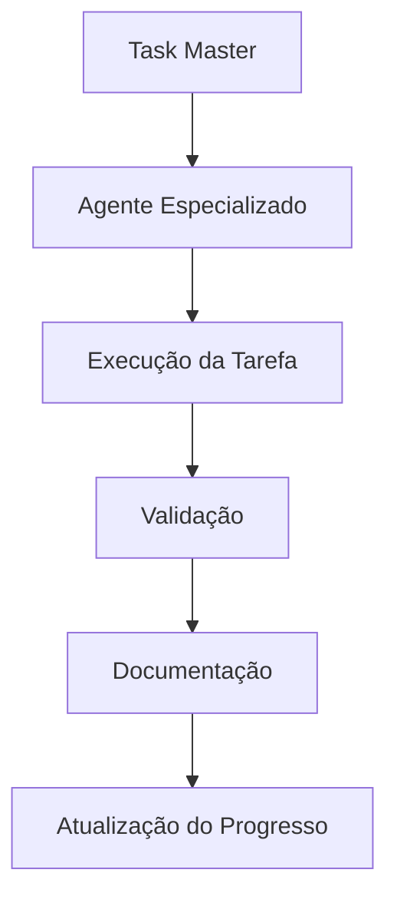

# 🎮 Codex MMORPG

> [!info] **PROJETO EM DESENVOLVIMENTO ATIVO**
> Sistema MMORPG inteligente com automação BMAD e documentação avançada

[](https://opensource.org/licenses/MIT)
[](https://www.python.org/downloads/)
[](https://github.com/your-username/Codex_MMORPG)

## 📋 Visão Geral

O **Codex MMORPG** é um projeto inovador de jogo MMORPG que integra tecnologias modernas com o sistema **BMAD (Brain-Machine-Agent-Development)** para automação inteligente, otimização contínua e controle de qualidade avançado.

### 🎯 Objetivos Principais

- **Desenvolvimento Inteligente**: Sistema BMAD para automação de tarefas complexas
- **Documentação Avançada**: Wiki estruturada com conhecimento integrado
- **Agentes Especializados**: Múltiplos agentes para diferentes aspectos do desenvolvimento
- **Interface Unificada**: Controle centralizado via GUI moderna
- **Monitoramento em Tempo Real**: Métricas e alertas inteligentes

## 🚀 Funcionalidades Principais

### 🤖 Sistema BMAD
- **Agentes Inteligentes**: 30+ agentes especializados
- **Orquestração Automática**: Coordenação inteligente de workflows
- **Aprendizado Contínuo**: Sistema de auto-aprendizado e melhoria
- **Validação Unificada**: Controle de qualidade automatizado

### 📚 Documentação Inteligente
- **Wiki Estruturada**: 2.665+ documentos organizados
- **Navegação JSON**: Sistema de navegação inteligente
- **Mapas de Conhecimento**: 23 arquivos JSON de navegação
- **Busca Semântica**: Encontre informações rapidamente

### 🔧 Ferramentas de Desenvolvimento
- **Code Generator**: Geração automática de código
- **Performance Optimizer**: Otimização automática de performance
- **Security Manager**: Gerenciamento de segurança
- **Integration Tools**: Ferramentas de integração

## 📁 Estrutura do Projeto

```
Codex_MMORPG/
├── 📋 cursor.md                    # Orquestrador principal
├── 📋 README.md                    # Este arquivo
├── 📁 wiki/                        # Documentação inteligente
│   ├── 📁 dashboard/               # Sistema de tarefas
│   │   ├── 📋 task_master.md       # Sistema principal (58 tasks)
│   │   └── 📋 integrated_task_manager.md
│   ├── 📁 docs/                    # Documentação técnica
│   ├── 📁 maps/                    # Mapas de navegação JSON
│   └── 📁 bmad/                    # Sistema de agentes
├── 📁 .cursor/                     # Regras e configurações
│   └── 📁 rules/                   # 30+ regras especializadas
├── 🔧 src/                         # Código-fonte OTClient
├── 📦 modules/                     # Módulos Lua
└── 📁 data/                        # Recursos do jogo
```

## 🛠️ Instalação e Configuração

### Pré-requisitos

- **Python 3.8+**
- **Git**
- **Visual Studio Code** (recomendado)
- **Obsidian** (para documentação)

### Instalação Rápida

```bash
# Clone o repositório
git clone https://github.com/your-username/Codex_MMORPG.git
cd Codex_MMORPG

# Instale dependências Python
pip install -r requirements.txt

# Configure o ambiente
python setup.py install
```

### Configuração do Sistema BMAD

```bash
# Ative o sistema BMAD
python wiki/bmad/agents/workflow_orchestrator.py

# Execute verificação inicial
python wiki/bmad/agents/system_validator.py
```

## 📖 Como Usar

### 🎯 Sistema de Tarefas

O projeto usa um sistema de tarefas inteligente com **58 tasks organizadas** em Epics:

```bash
# Consulte o Task Master
cat wiki/dashboard/task_master.md

# Execute uma tarefa específica
python wiki/bmad/agents/task_executor.py --task 18.8
```

### 📚 Navegação da Documentação

```bash
# Acesse a wiki principal
open wiki/wiki_index.md

# Use navegação JSON
python tools/navigation_helper.py --query "sistema BMAD"
```

### 🤖 Agentes BMAD

```bash
# Lista todos os agentes disponíveis
python wiki/bmad/agents/agent_manager.py --list

# Execute um agente específico
python wiki/bmad/agents/code_generator.py --task "criar módulo"
```

## 🔧 Desenvolvimento

### Estrutura de Desenvolvimento

1. **Task Master**: Sistema principal de tarefas (`wiki/dashboard/task_master.md`)
2. **Agentes BMAD**: Automação inteligente (`wiki/bmad/agents/`)
3. **Documentação**: Wiki estruturada (`wiki/`)
4. **Regras**: Configurações especializadas (`.cursor/rules/`)

### Fluxo de Trabalho



### Padrões de Código

- **Python**: PEP 8, type hints, docstrings
- **Markdown**: Obsidian format, frontmatter
- **JSON**: Validação de schema
- **Git**: Conventional commits

## 📊 Status do Projeto

### 🎯 Progresso Atual

- **Epics Concluídas**: 17/18 (94.4%)
- **Tasks Concluídas**: 223/233 (95.7%)
- **Agentes Ativos**: 30+
- **Documentos**: 2.665+
- **Score de Saúde**: 33.0/100 (em melhoria)

### 🛠️ Epic Ativa

**Epic 18: Correção e Otimização do Sistema**
- **Status**: 70% concluída
- **Objetivo**: Corrigir problemas identificados e otimizar sistema
- **Próxima Task**: 18.8 - Atualização do README.md Principal

### 📈 Métricas de Qualidade

- **Segurança**: 30/100 (melhorando)
- **Performance**: Otimizada
- **Documentação**: 95% completa
- **Integração**: Estável

## 🤝 Contribuição

### Como Contribuir

1. **Fork** o projeto
2. **Crie** uma branch para sua feature
3. **Siga** as regras de desenvolvimento
4. **Teste** suas mudanças
5. **Documente** adequadamente
6. **Submeta** um Pull Request

### Diretrizes de Contribuição

- **Sempre** consulte o Task Master antes de criar tarefas
- **Use** agentes BMAD para automação
- **Siga** padrões de documentação estabelecidos
- **Mantenha** compatibilidade com sistema existente

### Agentes para Contribuição

```bash
# Agente de Validação
python wiki/bmad/agents/validation_expert.py

# Agente de Documentação
python wiki/bmad/agents/documentation_agent.py

# Agente de Qualidade
python wiki/bmad/agents/quality_assurance.py
```

## 📚 Documentação

### 📖 Documentação Principal

- **[Wiki Index](wiki/wiki_index.md)** - Página principal da documentação
- **[Task Master](wiki/dashboard/task_master.md)** - Sistema de tarefas
- **[Sistema BMAD](wiki/bmad/bmad_system.md)** - Documentação dos agentes
- **[Guia de Desenvolvimento](wiki/docs/development_guide.md)** - Como desenvolver

### 🗺️ Navegação Inteligente

- **[Mapa da Wiki](wiki/maps/wiki_map.json)** - Estrutura completa
- **[Índice de Tags](wiki/maps/tags_index.json)** - Busca por tags
- **[Relacionamentos](wiki/maps/relationships.json)** - Conexões entre documentos

### 📋 Relatórios e Análises

- **[Relatório Final Epic 17](wiki/docs/audit_reports/epic_17_final_report.md)**
- **[Diretrizes de Segurança](wiki/docs/security_guidelines.md)**
- **[Diretrizes de Performance](wiki/docs/performance_guidelines.md)**

## 🔗 Links Úteis

### 🌐 Externos
- **[OTClient](https://github.com/otland/otclient)** - Cliente base
- **[Open Tibia](https://www.open-tibia.com/)** - Comunidade
- **[Tibia](https://www.tibia.com/)** - Jogo original

### 📁 Internos
- **[Sistema de Regras](.cursor/rules/)** - Configurações especializadas
- **[Agentes BMAD](wiki/bmad/agents/)** - Automação inteligente
- **[Mapas de Navegação](wiki/maps/)** - Navegação JSON

## 📄 Licença

Este projeto está licenciado sob a **MIT License** - veja o arquivo [LICENSE](LICENSE) para detalhes.

```
MIT License

Copyright (c) 2025 Codex MMORPG

Permission is hereby granted, free of charge, to any person obtaining a copy
of this software and associated documentation files (the "Software"), to deal
in the Software without restriction, including without limitation the rights
to use, copy, modify, merge, publish, distribute, sublicense, and/or sell
copies of the Software, and to permit persons to whom the Software is
furnished to do so, subject to the following conditions:

The above copyright notice and this permission notice shall be included in all
copies or substantial portions of the Software.

THE SOFTWARE IS PROVIDED "AS IS", WITHOUT WARRANTY OF ANY KIND, EXPRESS OR
IMPLIED, INCLUDING BUT NOT LIMITED TO THE WARRANTIES OF MERCHANTABILITY,
FITNESS FOR A PARTICULAR PURPOSE AND NONINFRINGEMENT. IN NO EVENT SHALL THE
AUTHORS OR COPYRIGHT HOLDERS BE LIABLE FOR ANY CLAIM, DAMAGES OR OTHER
LIABILITY, WHETHER IN AN ACTION OF CONTRACT, TORT OR OTHERWISE, ARISING FROM,
OUT OF OR IN CONNECTION WITH THE SOFTWARE OR THE USE OR OTHER DEALINGS IN THE
SOFTWARE.
```

## 🙏 Agradecimentos

- **Comunidade Open Tibia** - Base e inspiração
- **Desenvolvedores OTClient** - Código-fonte original
- **Contribuidores** - Todos que ajudaram no projeto
- **Sistema BMAD** - Automação inteligente

## 📞 Contato

- **GitHub**: [@your-username](https://github.com/your-username)
- **Issues**: [GitHub Issues](https://github.com/your-username/Codex_MMORPG/issues)
- **Discussions**: [GitHub Discussions](https://github.com/your-username/Codex_MMORPG/discussions)

---

> [!success] **SISTEMA ATIVO**
> Este projeto está em desenvolvimento ativo com sistema BMAD funcionando.
> Para acompanhar o progresso, consulte o [Task Master](wiki/dashboard/task_master.md).

*Última atualização: 2025-01-27*
*Versão: 1.0.0*
*Status: Development*
