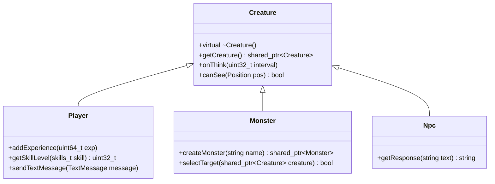
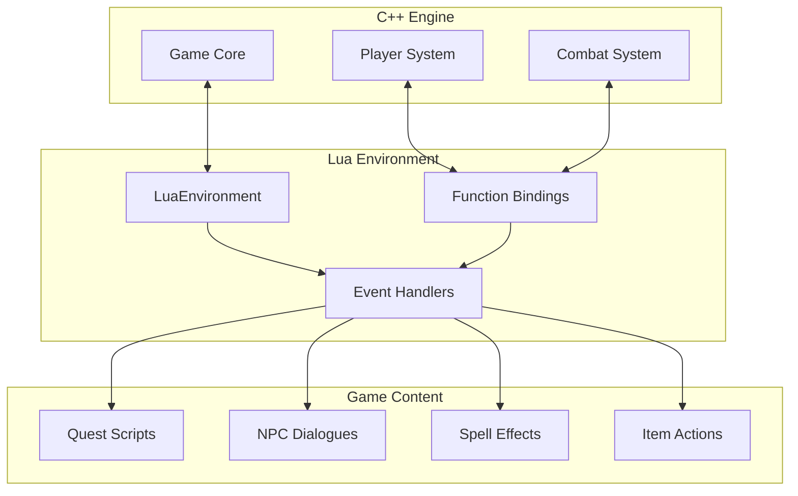

# Canary Server Architecture Reference

## Overview

This document provides a comprehensive reference for the Canary MMORPG server architecture, specifically tailored for BMAD framework agents working with Canary development. It covers the core systems, dependencies, and development patterns that agents need to understand.

## Core Architecture Components

### Game Singleton Pattern
The `Game` class serves as the central orchestrator for all server operations:

```cpp
class Game {
    -- Classe: Game
    static Game& getInstance() { return instance; }
    
    // Core responsibilities:
    // - Player management and sessions
    // - World state coordination
    // - Event processing through Dispatcher
    // - System lifecycle management
};
```

**Key Files:**
- `src/game/game.hpp` - Game class declaration
- `src/game/game.cpp` - Game implementation
- `src/canary_server.cpp` - Server initialization

### Event-Driven Architecture

#### Dispatcher System
The `Dispatcher` handles asynchronous event processing:

```cpp
class Dispatcher {
    -- Classe: Dispatcher
    void addEvent(const std::function<void()>& func, std::string description);
    void scheduleEvent(uint32_t delay, const std::function<void()>& func);
    
    // Used for:
    // - Player actions processing
    // - Monster AI updates
    // - Timed events and cleanup
    // - Cross-system communication
};
```

**Key Files:**
- `src/game/scheduling/dispatcher.hpp` - Dispatcher interface
- `src/game/scheduling/dispatcher.cpp` - Event processing logic
- `src/game/scheduling/task.hpp` - Task wrapper classes

### Creature Hierarchy



**Key Files:**
- `src/creatures/creature.hpp` - Base creature class
- `src/creatures/players/player.hpp` - Player-specific functionality
- `src/creatures/monsters/monster.hpp` - Monster AI and behavior

## Network Architecture

### Protocol Layer
- **ProtocolGame**: Main game communication protocol
- **ProtocolLogin**: Authentication and character selection
- **ProtocolStatus**: Server status queries

### Message Processing
- **NetworkMessage**: Incoming packet parsing
- **OutputMessage**: Outgoing packet construction
- **ConnectionManager**: Connection lifecycle management

**Key Files:**
- `src/server/network/protocol/protocolgame.hpp` - Game protocol
- `src/server/network/protocol/protocolgame.cpp` - Protocol implementation

## Lua Scripting Integration

### Lua Environment Architecture


### Key Lua Function Categories
- **Player Functions**: Player state, inventory, skills management
- **Creature Functions**: Monster and NPC behavior scripting
- **Combat Functions**: Spell effects, damage, conditions
- **Game Functions**: World state, events, global mechanics
- **Item Functions**: Item creation, modification, and effects

**Key Files:**
- `src/lua/functions/creatures/player/player_functions.cpp` - Player Lua API
- `src/lua/functions/creatures/creature_functions.cpp` - Creature Lua API

## Build System and Dependencies

### CMake Configuration
```yaml
Build Presets:
  - linux-debug: Debug build for Linux development
  - linux-release: Optimized Linux build
  - windows-debug: Debug build for Windows development
  - windows-release: Optimized Windows build

Key CMake Files:
  - CMakeLists.txt: Root build configuration
  - cmake/modules/BaseConfig.cmake: Base configuration
  - cmake/modules/CanaryLib.cmake: Canary-specific settings
  - src/CMakeLists.txt: Source build configuration
```

### vcpkg Dependencies
#### Nível Basic
```json

```

#### Nível Intermediate
```json
Core Libraries:
  - asio: Networking and async I/O
  - luajit: Lua scripting engine
  - libmariadb: MySQL database client
  - fmt: String formatting
  - spdlog: Logging framework
  - boost: Additional utilities
  - openssl: Cryptography and security
```

#### Nível Advanced
```json
Core Libraries:
  - asio: Networking and async I/O
  - luajit: Lua scripting engine
  - libmariadb: MySQL database client
  - fmt: String formatting
  - spdlog: Logging framework
  - boost: Additional utilities
  - openssl: Cryptography and security
-- Adicionar metatable para funcionalidade avançada
local mt = {
    __index = function(t, k)
        return rawget(t, k) or 'Valor não encontrado'
    end
    __call = function(t, ...)
        print('Objeto chamado com:', ...)
    end
}
setmetatable(meuObjeto, mt)
```

**Key Files:**
- `vcpkg.json` - Package manifest
- `CMakePresets.json` - Build preset configurations

## Database Architecture

### Configuration Management
```cpp
class ConfigManager {
    -- Classe: ConfigManager
    // Singleton pattern for server configuration
    static ConfigManager& getInstance();
    
    // Type-safe configuration access
    std::string getString(ConfigKey_t key);
    int32_t getNumber(ConfigKey_t key);
    bool getBoolean(ConfigKey_t key);
    float getFloat(ConfigKey_t key);
};
```

### Database Categories
- **Player Data**: Character stats, inventory, skills
- **World Data**: Guild information, houses, market
- **Game Data**: Server statistics, logs, events
- **Configuration**: Runtime server settings

**Key Files:**
- `config.lua` - Main configuration file
- `src/config/configmanager.cpp` - Configuration management
- `src/config/config_enums.hpp` - Configuration key enumerations

## Development Patterns

### Memory Management
```cpp
// Preferred patterns for Canary development:

// Use shared_ptr for entities
std::shared_ptr<Player> player = std::make_shared<Player>(protocol);

// Use weak_ptr to avoid cycles
std::weak_ptr<Creature> target = monster->getTarget();

// RAII for resource management
class ResourceManager {
    -- Classe: ResourceManager
    ResourceManager() { acquire(); }
    ~ResourceManager() { release(); }
};
```

### Event Handling
#### Nível Basic
```cpp
    player->sendTextMessage(MESSAGE_EVENT_ADVANCE, "You gained experience!");
```

#### Nível Intermediate
```cpp
// Dispatcher events for asynchronous processing
g_dispatcher.addEvent([player, amount]() {
    player->addExperience(amount);
    player->sendTextMessage(MESSAGE_EVENT_ADVANCE, "You gained experience!");
}, "player_experience_gain");

// Scheduled events for timed actions
g_dispatcher.scheduleEvent(5000, [monster]() {
    monster->heal(monster->getMaxHealth() * 0.1);
}, "monster_regeneration");
```

#### Nível Advanced
```cpp
// Dispatcher events for asynchronous processing
g_dispatcher.addEvent([player, amount]() {
    player->addExperience(amount);
    player->sendTextMessage(MESSAGE_EVENT_ADVANCE, "You gained experience!");
}, "player_experience_gain");

// Scheduled events for timed actions
g_dispatcher.scheduleEvent(5000, [monster]() {
    monster->heal(monster->getMaxHealth() * 0.1);
}, "monster_regeneration");
-- Adicionar metatable para funcionalidade avançada
local mt = {
    __index = function(t, k)
        return rawget(t, k) or 'Valor não encontrado'
    end
    __call = function(t, ...)
        print('Objeto chamado com:', ...)
    end
}
setmetatable(meuObjeto, mt)
```

### Lua Integration Patterns
#### Nível Basic
```cpp
// C++ to Lua function binding
lua_register(L, "doPlayerAddExperience", LuaScriptInterface::luaDoPlayerAddExperience);

// Lua to C++ callbacks
int32_t LuaScriptInterface::luaDoPlayerAddExperience(lua_State* L) {
    Player* player = getUserdata<Player>(L, 1);
    uint64_t experience = getNumber<uint64_t>(L, 2);
    
    if (player) {
        player->addExperience(experience);
        pushBoolean(L, true);
    } else {
        pushBoolean(L, false);
    }
    return 1;
}
```

#### Nível Intermediate
```cpp
// C++ to Lua function binding
lua_register(L, "doPlayerAddExperience", LuaScriptInterface::luaDoPlayerAddExperience);

// Lua to C++ callbacks
int32_t LuaScriptInterface::luaDoPlayerAddExperience(lua_State* L) {
    Player* player = getUserdata<Player>(L, 1);
    uint64_t experience = getNumber<uint64_t>(L, 2);
    
    if (player) {
        player->addExperience(experience);
        pushBoolean(L, true);
    } else {
        pushBoolean(L, false);
    }
    return 1;
}
-- Adicionar tratamento de erros
local success, result = pcall(function()
    -- Código original aqui
end)
if not success then
    print('Erro:', result)
end
```

#### Nível Advanced
```cpp
// C++ to Lua function binding
lua_register(L, "doPlayerAddExperience", LuaScriptInterface::luaDoPlayerAddExperience);

// Lua to C++ callbacks
int32_t LuaScriptInterface::luaDoPlayerAddExperience(lua_State* L) {
    Player* player = getUserdata<Player>(L, 1);
    uint64_t experience = getNumber<uint64_t>(L, 2);
    
    if (player) {
        player->addExperience(experience);
        pushBoolean(L, true);
    } else {
        pushBoolean(L, false);
    }
    return 1;
}
-- Adicionar metatable para funcionalidade avançada
local mt = {
    __index = function(t, k)
        return rawget(t, k) or 'Valor não encontrado'
    end
    __call = function(t, ...)
        print('Objeto chamado com:', ...)
    end
}
setmetatable(meuObjeto, mt)
```

## Performance Considerations

### Threading Model
- **Main Thread**: Game logic, player actions, world updates
- **I/O Threads**: Database operations, file I/O
- **Network Threads**: Client communication processing
- **Worker Threads**: Independent task processing

### Optimization Strategies
- **Object Pooling**: Reuse expensive objects (messages, temporary calculations)
- **Memory Alignment**: Structure padding for cache efficiency
- **Database Optimization**: Connection pooling, prepared statements
- **Network Optimization**: Message batching, compression
- **Lua Optimization**: Minimize C++ ↔ Lua transitions

## Security Architecture

### Anti-Cheat Measures
- **Server Authority**: All game logic validated server-side
- **Rate Limiting**: Action frequency limits to prevent abuse
- **Input Validation**: All client data thoroughly validated
- **State Verification**: Player state consistency checks

### Data Protection
- **Password Hashing**: Configurable password hashing methods
- **Database Security**: Prepared statements, input sanitization
- **Network Security**: Encrypted communication protocols
- **Access Control**: Role-based permission systems

## CI/CD Integration

### GitHub Actions Workflows
```yaml
Build Matrix:
  - Ubuntu 22.04 (gcc-13): Debug and Release
  - Ubuntu 24.04 (gcc-14): Debug and Release
  - Windows 2022 (MSVC): CMake and Solution builds
  - Docker: x86 and ARM builds

Quality Assurance:
  - C++ Analysis: cppcheck, clang-format
  - Lua Analysis: luacheck, stylua
  - Static Analysis: reviewdog integration
  - Unit Testing: CTest framework
```

### Quality Gates
- **Code Formatting**: Automatic formatting with clang-format and stylua
- **Static Analysis**: cppcheck for C++, luacheck for Lua
- **Build Validation**: Multi-platform compilation success
- **Test Execution**: Unit test suite execution
- **Docker Validation**: Container build and deployment

## Common Development Workflows

### Feature Development
1. **Design Phase**: Architecture and API design
2. **C++ Implementation**: Core engine functionality
3. **Lua Integration**: Script API and content hooks
4. **Testing**: Unit tests and integration validation
5. **Documentation**: Code comments and API documentation

### Content Creation
1. **Content Design**: Gameplay mechanics and requirements
2. **Lua Scripting**: Game logic implementation
3. **Data Configuration**: XML and configuration updates
4. **Testing**: Content validation and balance testing
5. **Integration**: Deployment to development server

### Bug Fixing
1. **Reproduction**: Issue isolation and debugging
2. **Root Cause Analysis**: Code investigation and profiling
3. **Fix Implementation**: Minimal, targeted code changes
4. **Regression Testing**: Validation of fix and related systems
5. **Deployment**: Coordinated release with testing validation

This architecture reference provides the foundation for BMAD agents to understand and work effectively with the Canary server codebase, ensuring that development workflows align with the project's technical requirements and best practices.
## 🔗 **Links Automáticos**

> [!info] **Links Gerados Automaticamente**
> Estes links foram criados automaticamente pelo sistema de linkagem da categoria **Core**

### **📚 Links Obrigatórios**
- [[../README|Hub Central da Wiki]]
- [[../dashboard/task_master|Task Master]]
- [[../dashboard/integrated_task_manager|Dashboard Central]]
- [[../maps/otclient_source_index|Índice do Código-Fonte]]
- [[../maps/modules_index|Índice de Módulos]]

### **🧭 Navegação**
- [[../maps/search_index|Índice de Busca]]
- [[../maps/tags_index|Índice de Tags]]
- [[../maps/category_indices|Índices por Categoria]]
- [[../maps/relationships|Relacionamentos]]

### **📊 Métricas da Categoria**
- **Categoria**: Core
- **Total de arquivos**: <!-- Contador automático -->
- **Arquivos linkados**: <!-- Contador automático -->
- **Taxa de linkagem**: <!-- Percentual automático -->

---

