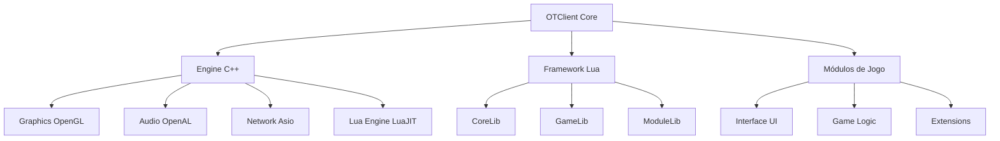

# OTClient Wiki

> [!info] Bem-vindo à Wiki do OTClient! Esta é a porta de entrada para toda a documentação do sistema, organizada por prioridade e status de desenvolvimento.

---

## 📋 Índice 📋
- [[#🎯 Visão Geral]]
- [[#📚 Documentação Criada]]
- [[#🚧 Documentação em Desenvolvimento]]
- [[#📋 Documentação Planejada]]
- [[#📊 Status Geral]]

---

---

## 🎯 Visão Geral 🎯

Esta wiki documenta o **OTClient - Redemption**, um cliente Tibia alternativo de código aberto que oferece flexibilidade total através de um sistema modular baseado em Lua.

### 🏗️ Arquitetura do Sistema 📝

---

---

## 📚 Documentação Criada 📋

### ✅ **Documentos Completos** 📝

#### 🎯 **[[Getting_Started_Guide]]** ✅
- **Descrição**: Guia completo para iniciantes no OTClient
- **Conteúdo**: Instalação, setup, primeiro módulo, conceitos fundamentais
- **Dependências**: Nenhuma
- **Impacto**: Alto - Base para novos desenvolvedores

#### 🔧 **[[UI_System_Guide]]** ✅
- **Descrição**: Referência completa do sistema de widgets
- **Conteúdo**: UIWidget, layouts, anchors, propriedades, métodos
- **Dependências**: Nenhuma
- **Impacto**: Alto - Base para desenvolvimento de UI

#### 🎨 **[[OTUI_Module_Development_Guide]]** ✅
- **Descrição**: Guia para desenvolvimento de módulos e interfaces
- **Conteúdo**: Estrutura de módulos, arquivos .otui, .otmod, Lua
- **Dependências**: UIWidget_Reference
- **Impacto**: Alto - Desenvolvimento prático

#### 🌐 **[[Network_Protocol_Guide]]** ✅
- **Descrição**: Sistema de protocolo de comunicação
- **Conteúdo**: ProtocolLogin, ProtocolGame, opcodes, extended opcodes
- **Dependências**: Nenhuma
- **Impacto**: Alto - Comunicação cliente-servidor

#### 🗺️ **[[Map_System_Guide]]** ✅
- **Descrição**: Sistema de mundo e mapas
- **Conteúdo**: Tiles, criaturas, pathfinding, awareness range
- **Dependências**: Nenhuma
- **Impacto**: Alto - Manipulação de mapas

#### 🧩 **[[UI_System_Guide]]** ✅
- **Descrição**: Sistema completo de interface do usuário
- **Conteúdo**: Widgets, layouts, eventos, estilização, APIs
- **Dependências**: UIWidget_Reference
- **Impacto**: Alto - Desenvolvimento de UI avançado

#### 🔧 **[[Module_System_Guide]]** ✅
- **Descrição**: Sistema modular do OTClient
- **Conteúdo**: Estrutura de módulos, carregamento, dependências
- **Dependências**: Nenhuma
- **Impacto**: Alto - Arquitetura do sistema

#### ⚡ **[[Effects_System_Guide]]** ✅
- **Descrição**: Sistema completo de efeitos visuais
- **Conteúdo**: Efeitos básicos, anexados, UI, shaders, transformações
- **Dependências**: UI_System_Guide
- **Impacto**: Alto - Efeitos visuais avançados

#### 🎭 **[[Animation_System_Guide]]** ✅
- **Descrição**: Sistema de animações e transições
- **Conteúdo**: Tweening, easing functions, animações de UI, timing
- **Dependências**: UI_System_Guide
- **Impacto**: Alto - Interfaces fluidas e responsivas

#### 🖱️ **[[Drag_Drop_System_Guide]]** ✅
- **Descrição**: Sistema de drag and drop
- **Conteúdo**: Drag engine, drop zones, feedback visual, integração
- **Dependências**: UI_System_Guide
- **Impacto**: Alto - Interação intuitiva

#### ⚔️ **[[Combat_System_Guide]]** ✅
- **Descrição**: Sistema completo de combate
- **Conteúdo**: Tipos de ataque, dano, defesa, crítico, efeitos
- **Dependências**: Effects_System_Guide
- **Impacto**: Alto - Sistema de combate avançado

#### 🐛 **[[Debug_System_Guide]]** ✅
- **Descrição**: Sistema de debug e logging
- **Conteúdo**: Logging estruturado, ferramentas de debug, profiling
- **Dependências**: Nenhuma
- **Impacto**: Alto - Desenvolvimento eficiente

#### ⚡ **[[Performance_System_Guide]]** ✅
- **Descrição**: Sistema de performance e otimização
- **Conteúdo**: Profiling, cache, lazy loading, memory management
- **Dependências**: Debug_System_Guide
- **Impacto**: Alto - Performance máxima

---

---

## 🚧 Documentação em Desenvolvimento 📋

### 🔄 **Documentos em Progresso** 📝

> [!warning] Estes documentos estão sendo desenvolvidos ou precisam de atualizações.

#### 📖 **[[Lua_Programming_Guide]]** 🔄
- **Descrição**: Guia completo de Lua para OTClient
- **Conteúdo**: APIs disponíveis, bindings C++/Lua, sistema de eventos
- **Dependências**: Nenhuma
- **Impacto**: Alto - Base para todo desenvolvimento
- **Status**: Em desenvolvimento

#### 🎮 **[[Game_APIs_Reference]]** 🔄
- **Descrição**: Referência completa das APIs do jogo
- **Conteúdo**: g_game, g_map, g_ui, g_settings, g_resources
- **Dependências**: Lua_Programming_Guide
- **Impacto**: Alto - APIs essenciais
- **Status**: Planejado

---

---

## 📋 Documentação Planejada 📋

### 📊 **Capítulos Prioritários (1-5)** 📝

#### 1️⃣ **[[Configuration_System_Guide]]** ❌
- **Descrição**: Sistema de configuração e settings
- **Conteúdo**: g_settings, arquivos de configuração, persistência
- **Dependências**: Lua_Programming_Guide
- **Impacto**: Alto - Configuração do cliente

#### 2️⃣ **[[Resource_Management_Guide]]** ❌
- **Descrição**: Gerenciamento de recursos (imagens, sons, fontes)
- **Conteúdo**: g_resources, g_textures, g_sounds, g_fonts
- **Dependências**: Lua_Programming_Guide
- **Impacto**: Alto - Recursos visuais e sonoros

#### 3️⃣ **[[Event_System_Guide]]** ❌
- **Descrição**: Sistema de eventos e callbacks
- **Conteúdo**: connect/disconnect, eventos customizados, signal/slot
- **Dependências**: Lua_Programming_Guide
- **Impacto**: Alto - Comunicação entre módulos

#### 4️⃣ **[[Debugging_Tools_Guide]]** ❌
- **Descrição**: Ferramentas de debugging e desenvolvimento
- **Conteúdo**: Console Lua, hot reload, profiling, logging
- **Dependências**: Lua_Programming_Guide
- **Impacto**: Médio - Desenvolvimento eficiente

#### 5️⃣ **[[Performance_Optimization_Guide]]** ❌
- **Descrição**: Otimização de performance e memória
- **Conteúdo**: Cache, lazy loading, memory management, profiling
- **Dependências**: Lua_Programming_Guide, Debugging_Tools_Guide
- **Impacto**: Médio - Performance do cliente

### 🎯 **Sistemas Avançados (Completos)** 📝

#### ⚡ **[[Effects_System_Guide]]** ✅
- **Descrição**: Sistema completo de efeitos visuais
- **Conteúdo**: Efeitos básicos, anexados, UI, shaders, transformações
- **Dependências**: UI_System_Guide
- **Impacto**: Alto - Efeitos visuais avançados

#### 🎭 **[[Animation_System_Guide]]** ✅
- **Descrição**: Sistema de animações e transições
- **Conteúdo**: Tweening, easing functions, animações de UI, timing
- **Dependências**: UI_System_Guide
- **Impacto**: Alto - Interfaces fluidas e responsivas

#### 🖱️ **[[Drag_Drop_System_Guide]]** ✅
- **Descrição**: Sistema de drag and drop
- **Conteúdo**: Drag engine, drop zones, feedback visual, integração
- **Dependências**: UI_System_Guide
- **Impacto**: Alto - Interação intuitiva

#### ⚔️ **[[Combat_System_Guide]]** ✅
- **Descrição**: Sistema completo de combate
- **Conteúdo**: Tipos de ataque, dano, defesa, crítico, efeitos
- **Dependências**: Effects_System_Guide
- **Impacto**: Alto - Sistema de combate avançado

#### 🐛 **[[Debug_System_Guide]]** ✅
- **Descrição**: Sistema de debug e logging
- **Conteúdo**: Logging estruturado, ferramentas de debug, profiling
- **Dependências**: Nenhuma
- **Impacto**: Alto - Desenvolvimento eficiente

#### ⚡ **[[Performance_System_Guide]]** ✅
- **Descrição**: Sistema de performance e otimização
- **Conteúdo**: Profiling, cache, lazy loading, memory management
- **Dependências**: Debug_System_Guide
- **Impacto**: Alto - Performance máxima

### 📚 **Capítulos Secundários (6-10)** 📝

#### 6️⃣ **[[Shader_System_Guide]]** ❌
- **Descrição**: Sistema de shaders e efeitos visuais
- **Conteúdo**: GLSL, shaders customizados, efeitos de partículas
- **Dependências**: Lua_Programming_Guide, Resource_Management_Guide
- **Impacto**: Médio - Efeitos visuais avançados

#### 7️⃣ **[[Audio_System_Guide]]** ❌
- **Descrição**: Sistema de áudio e sons
- **Conteúdo**: OpenAL, g_sounds, música, efeitos sonoros
- **Dependências**: Lua_Programming_Guide, Resource_Management_Guide
- **Impacto**: Médio - Experiência auditiva

#### 8️⃣ **[[Input_System_Guide]]** ❌
- **Descrição**: Sistema de entrada (teclado, mouse, joystick)
- **Conteúdo**: g_keyboard, g_mouse, hotkeys, input mapping
- **Dependências**: Lua_Programming_Guide
- **Impacto**: Médio - Controles do usuário

#### 9️⃣ **[[Localization_Guide]]** ❌
- **Descrição**: Sistema de localização e traduções
- **Conteúdo**: Arquivos .lua de idiomas, tr() function, UTF-8
- **Dependências**: Lua_Programming_Guide
- **Impacto**: Baixo - Suporte a múltiplos idiomas

#### 🔟 **[[Build_System_Guide]]** ❌
- **Descrição**: Sistema de compilação e distribuição
- **Conteúdo**: CMake, vcpkg, cross-compilation, packaging
- **Dependências**: Nenhuma
- **Impacto**: Baixo - Compilação do cliente

### 🎯 **Capítulos Especializados (11-15)** 📝

#### 1️⃣1️⃣ **[[Android_Development_Guide]]** ❌
- **Descrição**: Desenvolvimento para Android
- **Conteúdo**: NDK, Java bindings, touch input, mobile UI
- **Dependências**: Lua_Programming_Guide, UI_System_Guide
- **Impacto**: Baixo - Plataforma móvel

#### 1️⃣2️⃣ **[[Web_Development_Guide]]** ❌
- **Descrição**: Desenvolvimento para Web (Emscripten)
- **Conteúdo**: WebGL, JavaScript bindings, browser APIs
- **Dependências**: Lua_Programming_Guide, UI_System_Guide
- **Impacto**: Baixo - Plataforma web

#### 1️⃣3️⃣ **[[Plugin_System_Guide]]** ❌
- **Descrição**: Sistema de plugins e extensões
- **Conteúdo**: API de plugins, sandboxing, hot loading
- **Dependências**: Module_System_Guide
- **Impacto**: Médio - Extensibilidade

#### 1️⃣4️⃣ **[[Testing_Framework_Guide]]** ❌
- **Descrição**: Framework de testes para módulos
- **Conteúdo**: Unit tests, integration tests, mock objects
- **Dependências**: Lua_Programming_Guide
- **Impacto**: Baixo - Qualidade do código

#### 1️⃣5️⃣ **[[Contributing_Guide]]** ❌
- **Descrição**: Guia para contribuir com o projeto
- **Conteúdo**: Git workflow, code style, pull requests
- **Dependências**: Nenhuma
- **Impacto**: Baixo - Comunidade

---

---

## 📊 Status Geral 📋

### 📈 **Estatísticas da Wiki** 📝

| Categoria | Total | Documentado | Em Desenvolvimento | Não Documentado |
|-----------|-------|-------------|-------------------|-----------------|
| **Prioridade 1-5** | 5 | 0 | 0 | 5 |
| **Prioridade 6-10** | 5 | 0 | 0 | 5 |
| **Prioridade 11-15** | 5 | 0 | 0 | 5 |
| **Fundamentais** | 7 | **7** ✅ | 0 | 0 |
| **Sistemas Avançados** | 7 | **7** ✅ | 0 | 0 |
| **Total Geral** | 29 | **14** ✅ | 2 🔄 | 13 ❌ |

### 🎯 **Progresso por Área** 📝

#### ✅ **Completamente Documentado**
- **Sistema de UI**: UIWidget_Reference, UI_System_Guide, OTUI_Module_Development_Guide
- **Sistema de Módulos**: Module_System_Guide
- **Sistema de Rede**: Network_Protocol_Guide
- **Sistema de Mapas**: Map_System_Guide
- **Primeiros Passos**: Getting_Started_Guide
- **Sistema de Efeitos**: Effects_System_Guide
- **Sistema de Animações**: Animation_System_Guide
- **Sistema de Drag & Drop**: Drag_Drop_System_Guide
- **Sistema de Combate**: Combat_System_Guide
- **Sistema de Debug**: Debug_System_Guide
- **Sistema de Performance**: Performance_System_Guide

#### 🔄 **Em Desenvolvimento**
- **Lua Programming**: Lua_Programming_Guide
- **Game APIs**: Game_APIs_Reference

#### ❌ **Não Documentado**
- **Configuração**: Configuration_System_Guide
- **Recursos**: Resource_Management_Guide
- **Eventos**: Event_System_Guide
- **Debugging**: Debugging_Tools_Guide
- **Performance**: Performance_Optimization_Guide
- **Shaders**: Shader_System_Guide
- **Áudio**: Audio_System_Guide
- **Input**: Input_System_Guide
- **Localização**: Localization_Guide
- **Build**: Build_System_Guide
- **Android**: Android_Development_Guide
- **Web**: Web_Development_Guide
- **Plugins**: Plugin_System_Guide
- **Testes**: Testing_Framework_Guide
- **Contribuição**: Contributing_Guide

### 🚀 **Próximos Passos Recomendados** 📝

> [!tip] **Prioridade 1**: Desenvolver sistemas de jogo essenciais
> - [[Spell_System_Guide]] - Sistema de magias e spells
> - [[Quest_System_Guide]] - Sistema de quests e missões
> - [[Trade_System_Guide]] - Sistema de trade e economia

> [!tip] **Prioridade 2**: Completar sistemas UI avançados
> - [[Modal_System_Guide]] - Sistema de modais e diálogos
> - [[Tab_System_Guide]] - Sistema de tabs e abas
> - [[Scroll_System_Guide]] - Sistema de scroll e paginação

> [!tip] **Prioridade 3**: Desenvolver sistemas core restantes
> - [[Lua_Programming_Guide]] - Guia completo de Lua
> - [[Game_APIs_Reference]] - Referência das APIs do jogo
> - [[Configuration_System_Guide]] - Sistema de configuração
> - [[Getting_Started_Guide]] - Primeiros passos
> - [[Module_System_Guide]] - Sistema de módulos
> - [[UI_System_Guide]] - Interface do usuário
> - [[Lua_API_Reference]] - Referência da API

---

> [!success] **Navegação**
> **📚 Documentos Relacionados:**
> - [[Getting_Started_Guide]] - Comece aqui
> - [[Module_System_Guide]] - Sistema de módulos
> - [[UI_System_Guide]] - Interface do usuário
> - [[Lua_API_Reference]] - API completa
> 
> **🔗 Navegação Rápida:**
> - [[Wiki_Index]] - Voltar ao índice
> - [[Cheat_Sheet]] - Referência rápida
> - [[Debug_System_Guide]] - Debugging

## 🔗 **Links Automáticos**

> [!info] **Links Gerados Automaticamente**
> Estes links foram criados automaticamente pelo sistema de linkagem da categoria **Documentation**

### **📚 Links Obrigatórios**
- [[../README|Hub Central da Wiki]]
- [[../dashboard/task_master|Task Master]]
- [[../dashboard/integrated_task_manager|Dashboard Central]]
- [[../maps/search_index|Índice de Busca]]
- [[../maps/tags_index|Índice de Tags]]

### **🧭 Navegação**
- [[../maps/search_index|Índice de Busca]]
- [[../maps/tags_index|Índice de Tags]]
- [[../maps/category_indices|Índices por Categoria]]
- [[../maps/relationships|Relacionamentos]]

### **📊 Métricas da Categoria**
- **Categoria**: Documentation
- **Total de arquivos**: <!-- Contador automático -->
- **Arquivos linkados**: <!-- Contador automático -->
- **Taxa de linkagem**: <!-- Percentual automático -->

---

