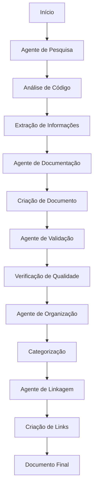
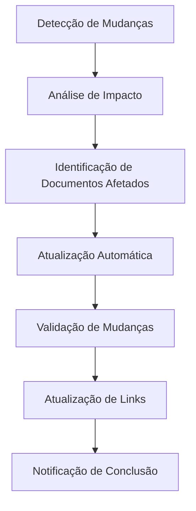
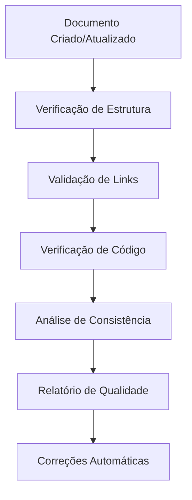

# 🤖 **Sistema BMAD - Guia Completo**

> [!info] **Sistema Gerador de Documentação**
> Este documento explica como funciona o sistema BMAD (Bot Multi-Agent Documentation) que gera automaticamente toda a documentação da wiki.

---

## 🎯 **Visão Geral do Sistema BMAD**

### **O que é o BMAD?**
O **BMAD (Bot Multi-Agent Documentation)** é um sistema inteligente de geração automática de documentação que utiliza múltiplos agentes especializados para criar, organizar e manter toda a documentação da wiki do OTClient.

### **Princípios Fundamentais**
- **Automação Total**: Geração automática de documentação sem intervenção manual
- **Agentes Especializados**: Cada agente tem uma função específica e expertise
- **Sistema Inteligente**: Aprendizado contínuo e adaptação automática
- **Qualidade Garantida**: Padrões altos de documentação mantidos automaticamente

---

## 🏗️ **Arquitetura do Sistema**

### **Componentes Principais**

#### **1. Agentes Especializados**
- **Agente de Pesquisa**: Analisa código-fonte e documentação existente
- **Agente de Documentação**: Cria e estrutura documentos
- **Agente de Validação**: Verifica qualidade e consistência
- **Agente de Organização**: Organiza e categoriza conteúdo
- **Agente de Linkagem**: Cria links automáticos entre documentos

#### **2. Sistema de Workflows**
- **Workflow de Criação**: Processo de criação de novos documentos
- **Workflow de Atualização**: Processo de atualização de documentos existentes
- **Workflow de Validação**: Processo de verificação de qualidade
- **Workflow de Organização**: Processo de categorização e estruturação

#### **3. Sistema de Templates**
- **Templates de Documentação**: Modelos para diferentes tipos de documentos
- **Templates de Agentes**: Modelos para criação de novos agentes
- **Templates de Workflows**: Modelos para criação de novos workflows

---

## 🤖 **Agentes do Sistema BMAD**

### **Agente de Pesquisa (Research Agent)**
**Função**: Analisa código-fonte e documentação existente para extrair informações relevantes.

**Capacidades**:
- Análise de código-fonte C++ e Lua
- Extração de funções, classes e estruturas
- Identificação de padrões e arquiteturas
- Geração de relatórios de análise

**Localização**: `wiki/bmad/agents/researcher_agent/`

### **Agente de Documentação (Documentation Agent)**
**Função**: Cria e estrutura documentos baseado nas informações coletadas.

**Capacidades**:
- Criação de guias e tutoriais
- Estruturação de documentação técnica
- Geração de exemplos de código
- Formatação em Markdown/Obsidian

**Localização**: `wiki/bmad/agents/documentation_agent/`

### **Agente de Validação (Validation Agent)**
**Função**: Verifica qualidade, consistência e funcionalidade da documentação.

**Capacidades**:
- Verificação de links quebrados
- Validação de exemplos de código
- Verificação de consistência de idioma
- Análise de estrutura e organização

**Localização**: `wiki/bmad/agents/validation_agent/`

### **Agente de Organização (Organization Agent)**
**Função**: Organiza e categoriza conteúdo para navegação eficiente.

**Capacidades**:
- Categorização automática de documentos
- Criação de índices e navegação
- Organização hierárquica de conteúdo
- Manutenção de estrutura da wiki

**Localização**: `wiki/bmad/agents/organization_agent/`

### **Agente de Linkagem (Linkage Agent)**
**Função**: Cria links automáticos entre documentos relacionados.

**Capacidades**:
- Detecção de relacionamentos entre documentos
- Criação de links automáticos
- Manutenção de navegação
- Validação de links

**Localização**: `wiki/bmad/agents/linkage_agent/`

---

## 🔄 **Workflows do Sistema**

### **Workflow de Criação de Documentação**



### **Workflow de Atualização**



### **Workflow de Validação**



---

## 📋 **Sistema de Tarefas**

### **Task Master**
O **Task Master** é o sistema principal de gerenciamento de tarefas que coordena todas as atividades do BMAD.

**Localização**: `wiki/dashboard/task_master.md`

**Funcionalidades**:
- Definição de Epics e Tasks
- Priorização de atividades
- Acompanhamento de progresso
- Geração de relatórios

### **Integrated Task Manager**
Sistema de integração que coordena tarefas entre diferentes componentes.

**Localização**: `wiki/dashboard/integrated_task_manager.md`

**Funcionalidades**:
- Integração entre sistemas
- Coordenação de workflows
- Sincronização de dados
- Relatórios de integração

---

## 🔧 **Automação Git**

### **Sistema de Automação Git**
O BMAD inclui um sistema completo de automação Git para controle de versão automático.

**Funcionalidades**:
- **Commits Automáticos**: Commits automáticos baseados em mudanças
- **Branch Management**: Gerenciamento automático de branches
- **Merge Automation**: Merge automático de branches
- **Conflict Resolution**: Resolução automática de conflitos simples

### **Agente Git**
Agente especializado em operações Git.

**Capacidades**:
- Monitoramento de mudanças
- Criação de commits
- Gerenciamento de branches
- Resolução de conflitos

---

## 📊 **Sistema de Métricas e Relatórios**

### **Métricas Coletadas**
- **Quantidade de Documentos**: Total de documentos criados
- **Taxa de Cobertura**: Percentual de código documentado
- **Qualidade de Links**: Percentual de links funcionais
- **Tempo de Processamento**: Tempo para criar/atualizar documentos
- **Taxa de Erro**: Percentual de erros encontrados

### **Relatórios Gerados**
- **Relatório Diário**: Resumo das atividades do dia
- **Relatório Semanal**: Análise semanal de progresso
- **Relatório Mensal**: Relatório completo mensal
- **Relatório de Qualidade**: Análise detalhada de qualidade

### **Localização dos Relatórios**
- **Relatórios de Tarefas**: `wiki/dashboard/`
- **Relatórios de Qualidade**: `wiki/log/`
- **Relatórios de Métricas**: `wiki/maps/`

---

## 🎨 **Templates e Modelos**

### **Templates de Documentação**
O sistema utiliza templates padronizados para diferentes tipos de documentos:

#### **Template de Guia**
```markdown
---
tags: [guide, category, topic]
type: guide
status: active
created: YYYY-MM-DD
---

# Título do Guia

> [!info] **Descrição**
> Descrição do guia

## Seção 1
Conteúdo...

## Seção 2
Conteúdo...

---
```

#### **Template de Agente**
```markdown
---
tags: [agent, specialization, automation]
type: agent
status: active
created: YYYY-MM-DD
---

# Nome do Agente

## Função
Descrição da função...

## Capacidades
- Capacidade 1
- Capacidade 2

## Workflows
- Workflow 1
- Workflow 2
```

### **Templates de Workflow**
Templates para criação de novos workflows automatizados.

---

## 🔍 **Sistema de Busca e Navegação**

### **Índices Automáticos**
O sistema gera automaticamente vários índices para navegação eficiente:

- **Índice Alfabético**: Organização alfabética de documentos
- **Índice por Categoria**: Organização por categorias temáticas
- **Índice de Busca**: Sistema de busca semântica
- **Índice de Relacionamentos**: Mapa de relacionamentos entre documentos

### **Sistema de Tags**
Sistema inteligente de tags para categorização automática:

- **Tags de Tipo**: guide, agent, workflow, template
- **Tags de Categoria**: Core, Game_Systems, UI_Systems, etc.
- **Tags de Status**: active, deprecated, draft
- **Tags de Prioridade**: critical, high, medium, low

---

## 🚀 **Como Usar o Sistema BMAD**

### **Para Desenvolvedores**
1. **Criar Nova Documentação**: O sistema detecta automaticamente mudanças no código
2. **Atualizar Documentação**: Mudanças são refletidas automaticamente
3. **Validar Qualidade**: Sistema executa validações automáticas
4. **Gerar Relatórios**: Relatórios são gerados automaticamente

### **Para Administradores**
1. **Monitorar Progresso**: Acompanhar progresso através do Task Master
2. **Configurar Agentes**: Ajustar configurações dos agentes
3. **Criar Workflows**: Definir novos workflows automatizados
4. **Analisar Métricas**: Revisar relatórios de qualidade e performance

### **Para Usuários**
1. **Navegar Documentação**: Usar índices e sistema de busca
2. **Seguir Guias**: Acessar guias estruturados automaticamente
3. **Encontrar Exemplos**: Localizar exemplos de código relevantes
4. **Reportar Problemas**: Sistema detecta problemas automaticamente

---

## 🔧 **Configuração e Personalização**

### **Configuração de Agentes**
Cada agente pode ser configurado através de arquivos de configuração:

```json
{
  "agent_name": "research_agent",
  "specialization": "code_analysis",
  "priority": "high",
  "auto_start": true,
  "workflow": "code_analysis_workflow"
}
```

### **Configuração de Workflows**
Workflows podem ser personalizados para necessidades específicas:

```json
{
  "workflow_name": "documentation_creation",
  "steps": [
    "research",
    "documentation",
    "validation",
    "organization",
    "linkage"
  ],
  "priority": "medium",
  "auto_execute": true
}
```

---

## 📈 **Monitoramento e Manutenção**

### **Monitoramento em Tempo Real**
- **Dashboard de Status**: Status em tempo real de todos os agentes
- **Logs de Atividade**: Logs detalhados de todas as atividades
- **Alertas Automáticos**: Alertas para problemas detectados
- **Métricas de Performance**: Métricas de performance em tempo real

### **Manutenção Automática**
- **Limpeza Automática**: Limpeza automática de arquivos temporários
- **Backup Automático**: Backup automático de configurações
- **Atualização Automática**: Atualização automática de templates
- **Otimização Automática**: Otimização automática de performance

---

## 🔮 **Futuras Melhorias**

### **Planejadas**
- **IA Avançada**: Integração com modelos de IA mais avançados
- **Análise Semântica**: Análise semântica mais profunda do conteúdo
- **Geração de Código**: Geração automática de código de exemplo
- **Integração Multi-Repositório**: Suporte a múltiplos repositórios

### **Em Desenvolvimento**
- **Sistema de Aprendizado**: Sistema de aprendizado contínuo
- **Otimização Automática**: Otimização automática de workflows
- **Interface Gráfica**: Interface gráfica para administração
- **API Externa**: API para integração com sistemas externos

---

## 📚 **Recursos Adicionais**

### **Documentação Relacionada**
- [[../bmad/README|Sistema BMAD Principal]]
- [[../bmad/agents/README|Guia de Agentes]]
- [[../bmad/workflows/README|Guia de Workflows]]
- [[../bmad/templates/README|Guia de Templates]]

### **Ferramentas e Scripts**
- [[../update/automatic_linkage_system.py|Sistema de Linkagem Automática]]
- [[../update/create_automatic_link_templates.py|Gerador de Templates]]
- [[../maps/linkage_rules.json|Regras de Linkagem]]

### **Relatórios e Métricas**
- [[../maps/automatic_linkage_report.json|Relatório de Linkagem]]
- [[../maps/automatic_link_templates_report.json|Relatório de Templates]]

---

> [!success] **Sistema BMAD Ativo**
> O sistema BMAD está atualmente ativo e funcionando automaticamente.
> Toda a documentação da wiki é gerada e mantida por este sistema.

> [!tip] **Contribuição**
> Para contribuir com o sistema BMAD, consulte a documentação de agentes e workflows.

> [!info] **Suporte**
> Para suporte técnico, consulte os relatórios de erro e logs do sistema. 