```mermaid
graph TD
    A[Player Cria Party] --> B[Verificar Permissões]
    B --> C{Permitido?}
    C -->|Não| D[Rejeitar Criação]
    C -->|Sim| E[Criar Party]
    E --> F[Definir Líder]
    F --> G[Configurar Exp Compartilhada]
    G --> H[Notificar Criação]
```

# 👥 OTCLIENT-016: Sistema de Grupos

## 🎯 **Visão Geral**

O **Sistema de Grupos** é um componente essencial do OTClient, responsável por gerenciar todos os grupos e partys de jogadores, incluindo convites, liderança, experiência compartilhada e comunicação em grupo. Este sistema trabalha em conjunto com o servidor Canary para fornecer funcionalidades completas de cooperação entre jogadores.

## 🏗️ **Arquitetura do Sistema**

### **📁 Estrutura de Arquivos**

```
📁 src/creatures/players/grouping/
├── party.hpp              # Definições de Party
├── party.cpp              # Implementação de Party
├── groups.hpp             # Definições de Groups
└── groups.cpp             # Implementação de Groups

📁 src/client/
├── protocolgameparse.cpp  # Parsing de protocolo
├── protocolgamesend.cpp   # Envio de protocolo
└── game.cpp               # Processamento de grupos

📁 src/lua/functions/creatures/player/
├── party_functions.hpp    # Funções Lua para Party
└── party_functions.cpp    # Implementação das funções
```

### **🔗 Dependências Principais**

- **Player System**: Sistema base de jogadores
- **Network Protocol**: Comunicação com servidor
- **Lua Scripting**: Scripts de grupo
- **Game Engine**: Sistema principal de jogo
- **Experience System**: Sistema de experiência

## 👥 **Componentes Principais**

### **1. Classe Party**

```cpp
class Party final : public SharedObject {
public:
    static std::shared_ptr<Party> create(const std::shared_ptr<Player> &leader);
    
    // Gerenciamento de membros
    std::shared_ptr<Player> getLeader() const;
    std::vector<std::shared_ptr<Player>> getPlayers() const;
    std::vector<std::shared_ptr<Player>> getMembers();
    std::vector<std::shared_ptr<Player>> getInvitees();
    size_t getMemberCount() const;
    size_t getInvitationCount() const;
    uint8_t getUniqueVocationsCount() const;
    
    // Operações de grupo
    void disband();
    bool invitePlayer(const std::shared_ptr<Player> &player);
    bool joinParty(const std::shared_ptr<Player> &player);
    void revokeInvitation(const std::shared_ptr<Player> &player);
    bool passPartyLeadership(const std::shared_ptr<Player> &player);
    bool leaveParty(const std::shared_ptr<Player> &player, bool forceRemove = false);
    bool removeInvite(const std::shared_ptr<Player> &player, bool removeFromPlayer = true);
    
    // Verificações
    bool isPlayerInvited(const std::shared_ptr<Player> &player) const;
    bool empty() const;
    bool canOpenCorpse(uint32_t ownerId) const;
    
    // Experiência compartilhada
    void shareExperience(uint64_t experience, const std::shared_ptr<Creature> &target, const std::shared_ptr<Player> &source = nullptr);
    void updateSharedExperience();
    void setSharedExperience(const std::shared_ptr<Player> &player, bool sharedExpActive);
    bool isSharedExperienceActive() const;
    bool isSharedExperienceEnabled() const;
    void setSharedExperienceEnabled(const std::shared_ptr<Player> &player, bool sharedExpEnabled);
    
    // Comunicação
    void updateAllPartyIcons();
    void broadcastPartyMessage(MessageClasses msgClass, const std::string &msg, bool sendToInvitations = false);
    
    // Análise de grupo
    void updateTrackerAnalyzer();
    void addPlayerLoot(const std::shared_ptr<Player> &player, const std::shared_ptr<Item> &item, uint64_t count);
    void addPlayerSupply(const std::shared_ptr<Player> &player, const std::shared_ptr<Item> &item, uint64_t count);
    void addPlayerDamage(const std::shared_ptr<Player> &player, uint64_t damage);
    void addPlayerHealing(const std::shared_ptr<Player> &player, uint64_t healing);
    void switchAnalyzerPriceType();
    void resetAnalyzer();
    std::vector<std::shared_ptr<PartyAnalyzer>> getMembersData() const;
    PartyAnalyzer_t getPriceType() const;
    
private:
    // Estados de experiência compartilhada
    enum SharedExpStatus_t : uint8_t {
        SHAREDEXP_OK,
        SHAREDEXP_TOOFARAWAY,
        SHAREDEXP_LEVELDIFFTOOLARGE,
        SHAREDEXP_MEMBERINACTIVE,
        SHAREDEXP_EMPTYPARTY
    };
    
    // Métodos privados
    const char* getSharedExpReturnMessage(SharedExpStatus_t value) const;
    bool isPlayerActive(const std::shared_ptr<Player> &player);
    SharedExpStatus_t getSharedExperienceStatus();
    uint32_t getHighestLevel();
    uint32_t getLowestLevel();
    uint32_t getMinLevel();
    uint32_t getMaxLevel();
    float shareRangeMultiplier() const;
    
    // Membros do grupo
    std::vector<std::shared_ptr<Player>> memberList;
    std::vector<std::shared_ptr<Player>> inviteList;
    std::weak_ptr<Player> m_leader;
    
    // Configurações de experiência
    bool sharedExpActive = false;
    bool sharedExpEnabled = false;
    
    // Análise de grupo
    time_t trackerTime = time(nullptr);
    PartyAnalyzer_t priceType = MARKET_PRICE;
    std::vector<std::shared_ptr<PartyAnalyzer>> membersData;
    std::map<uint32_t, int64_t> ticksMap;
};
```

### **2. Classe Group**

```cpp
struct Group {
    std::string name;
    std::array<bool, magic_enum::enum_integer(PlayerFlags_t::FlagLast)> flags { false };
    uint32_t maxDepotItems;
    uint32_t maxVipEntries;
    uint16_t id;
    bool access;
};

class Groups {
public:
    static uint8_t getFlagNumber(PlayerFlags_t playerFlags);
    static PlayerFlags_t getFlagFromNumber(uint8_t value);
    static bool reload();
    
    bool load();
    [nodiscard](nodiscard.md) std::shared_ptr<Group> getGroup(uint16_t id) const;
    std::vector<std::shared_ptr<Group>> &getGroups();
    
private:
    std::vector<std::shared_ptr<Group>> groups_vector;
};
```

### **3. Estruturas de Análise**

```cpp
struct PartyAnalyzer {
    std::shared_ptr<Player> player;
    uint64_t lootPrice = 0;
    uint64_t supplyPrice = 0;
    uint64_t damage = 0;
    uint64_t healing = 0;
    uint64_t balance = 0;
    
    PartyAnalyzer(const std::shared_ptr<Player> &p) : player(p) {}
};

enum PartyAnalyzer_t : uint8_t {
    MARKET_PRICE = 0,
    LAST_PRICE = 1,
    SELL_PRICE = 2
};
```

## ⚙️ **Mecânicas do Sistema**

### **1. Criação de Party**

```cpp
std::shared_ptr<Party> Party::create(const std::shared_ptr<Player> &leader) {
    auto party = std::make_shared<Party>();
    party->m_leader = leader;
    leader->setParty(party);
    
    // Configurar experiência compartilhada automática
    if (g_configManager().getBoolean(PARTY_AUTO_SHARE_EXPERIENCE)) {
        party->setSharedExperience(leader, true);
    }
    
    return party;
}
```

### **2. Sistema de Convites**

```cpp
bool Party::invitePlayer(const std::shared_ptr<Player> &player) {
    const auto &leader = getLeader();
    if (!leader) {
        return false;
    }
    
    if (!player || player->getParty()) {
        return false;
    }
    
    // Verificar se já foi convidado
    if (isPlayerInvited(player)) {
        return false;
    }
    
    // Verificar se é membro
    if (std::ranges::find(memberList, player) != memberList.end()) {
        return false;
    }
    
    // Adicionar à lista de convites
    inviteList.emplace_back(player);
    
    // Atualizar ícones
    leader->sendCreatureShield(player);
    player->sendCreatureShield(leader);
    
    // Enviar mensagem de convite
    std::ostringstream ss;
    ss << leader->getName() << " has invited you to " << leader->getPossessivePronoun() << " party.";
    player->sendTextMessage(MESSAGE_PARTY_MANAGEMENT, ss.str());
    
    ss.str(std::string());
    ss << "You have invited " << player->getName() << " to your party.";
    leader->sendTextMessage(MESSAGE_PARTY_MANAGEMENT, ss.str());
    
    return true;
}
```

### **3. Sistema de Entrada**

```cpp
bool Party::joinParty(const std::shared_ptr<Player> &player) {
    const auto &leader = getLeader();
    if (!leader) {
        return false;
    }
    
    // Verificar eventos Lua
    if (!g_events().eventPartyOnJoin(getParty(), player)) {
        return false;
    }
    
    if (!g_callbacks().checkCallback(EventCallback_t::partyOnJoin, &EventCallback::partyOnJoin, getParty(), player)) {
        return false;
    }
    
    // Verificar se está na lista de convites
    auto it = std::ranges::find(inviteList, player);
    if (it == inviteList.end()) {
        return false;
    }
    
    // Remover da lista de convites
    inviteList.erase(it);
    
    // Adicionar à lista de membros
    memberList.emplace_back(player);
    
    // Configurar party do jogador
    player->setParty(getParty());
    
    // Atualizar interface
    g_game().updatePlayerShield(player);
    
    // Atualizar ícones para todos os membros
    for (const auto &member : getMembers()) {
        member->sendCreatureSkull(player);
        member->sendPlayerPartyIcons(player);
        player->sendPlayerPartyIcons(member);
    }
    
    leader->sendCreatureSkull(player);
    player->sendCreatureSkull(player);
    leader->sendPlayerPartyIcons(player);
    player->sendPlayerPartyIcons(leader);
    
    // Atualizar helpers
    g_game().updatePlayerHelpers(player);
    updatePlayerStatus(player);
    
    // Remover convite
    player->removePartyInvitation(getParty());
    
    // Atualizar experiência compartilhada
    updateSharedExperience();
    
    // Enviar mensagem de boas-vindas
    const std::string &leaderName = leader->getName();
    std::ostringstream ss;
    ss << "You have joined " << leaderName << "'" << (leaderName.back() == 's' ? "" : "s") << " party. Open the party channel to communicate with your companions.";
    player->sendTextMessage(MESSAGE_PARTY_MANAGEMENT, ss.str());
    
    // Notificar outros membros
    ss.str(std::string());
    ss << player->getName() << " has joined the party.";
    broadcastPartyMessage(MESSAGE_PARTY_MANAGEMENT, ss.str());
    
    updateTrackerAnalyzer();
    return true;
}
```

### **4. Sistema de Saída**

```cpp
bool Party::leaveParty(const std::shared_ptr<Player> &player, bool forceRemove) {
    if (!player) {
        return false;
    }
    
    const auto &leader = getLeader();
    if (!leader) {
        return false;
    }
    
    if (player->getParty().get() != this && leader != player) {
        return false;
    }
    
    // Verificar eventos Lua
    bool canRemove = g_events().eventPartyOnLeave(getParty(), player);
    if (!forceRemove && !canRemove) {
        return false;
    }
    
    if (!g_callbacks().checkCallback(EventCallback_t::partyOnLeave, &EventCallback::partyOnLeave, getParty(), player)) {
        return false;
    }
    
    // Gerenciar liderança se necessário
    bool missingLeader = false;
    if (leader == player) {
        if (!memberList.empty()) {
            if (memberList.size() == 1 && inviteList.empty()) {
                missingLeader = true;
            } else {
                auto newLeader = memberList.front();
                while (!newLeader) {
                    memberList.erase(memberList.begin());
                    if (memberList.empty()) {
                        missingLeader = true;
                        break;
                    }
                    newLeader = memberList.front();
                }
                if (newLeader) {
                    passPartyLeadership(newLeader);
                }
            }
        } else {
            missingLeader = true;
        }
    }
    
    // Remover da lista de membros
    auto it = std::ranges::find(memberList, player);
    if (it != memberList.end()) {
        memberList.erase(it);
    }
    
    // Limpar party do jogador
    player->setParty(nullptr);
    player->sendClosePrivate(CHANNEL_PARTY);
    g_game().updatePlayerShield(player);
    g_game().updatePlayerHelpers(player);
    
    // Atualizar ícones para outros membros
    for (const auto &member : getMembers()) {
        member->sendCreatureSkull(player);
        player->sendPlayerPartyIcons(member);
        member->sendPartyCreatureUpdate(player);
        g_game().updatePlayerHelpers(member);
    }
    
    // Enviar mensagens
    player->sendTextMessage(MESSAGE_PARTY_MANAGEMENT, "You have left the party.");
    
    std::ostringstream ss;
    ss << player->getName() << " has left the party.";
    broadcastPartyMessage(MESSAGE_PARTY_MANAGEMENT, ss.str());
    
    // Atualizar experiência compartilhada
    updateSharedExperience();
    clearPlayerPoints(player);
    
    // Desbandar se necessário
    if (missingLeader || empty()) {
        disband();
    }
    
    return true;
}
```

### **5. Sistema de Liderança**

```cpp
bool Party::passPartyLeadership(const std::shared_ptr<Player> &player) {
    const auto &leader = getLeader();
    if (!leader || !player || leader == player || player->getParty().get() != this) {
        return false;
    }
    
    // Remover da lista de membros antes de broadcastar
    auto it = std::ranges::find(memberList, player);
    if (it != memberList.end()) {
        memberList.erase(it);
    }
    
    // Notificar mudança de liderança
    std::ostringstream ss;
    ss << player->getName() << " is now the leader of the party.";
    broadcastPartyMessage(MESSAGE_PARTY_MANAGEMENT, ss.str(), true);
    
    // Transferir liderança
    const auto &oldLeader = leader;
    m_leader = player;
    memberList.insert(memberList.begin(), oldLeader);
    
    // Atualizar sistemas
    updateSharedExperience();
    updateTrackerAnalyzer();
    
    // Atualizar ícones
    for (const auto &member : getMembers()) {
        member->sendPartyCreatureShield(oldLeader);
        member->sendPartyCreatureShield(player);
    }
    
    for (const auto &invitee : getInvitees()) {
        invitee->sendCreatureShield(oldLeader);
        invitee->sendCreatureShield(player);
    }
    
    player->sendPartyCreatureShield(oldLeader);
    player->sendPartyCreatureShield(player);
    
    // Notificar novo líder
    player->sendTextMessage(MESSAGE_PARTY_MANAGEMENT, "You are now the leader of the party.");
    return true;
}
```

## 🎮 **Fluxo de Grupos**

### **1. Criação de Party**



### **2. Sistema de Convites**



```mermaid
graph TD
    A[Líder Convida] --> B[Verificar Jogador]
    B --> C{Jogador Disponível?}
    C -->|Não| D[Rejeitar Convite]
    C -->|Sim| E[Adicionar à Lista]
    E --> F[Enviar Convite]
    F --> G[Jogador Aceita/Recusa]
    G --> H[Processar Resposta]
```

### **3. Experiência Compartilhada**

```cpp
void Party::shareExperience(uint64_t experience, const std::shared_ptr<Creature> &target, const std::shared_ptr<Player> &source) {
    if (!isSharedExperienceActive()) {
        return;
    }
    
    SharedExpStatus_t status = getSharedExperienceStatus();
    if (status != SHAREDEXP_OK) {
        if (source) {
            source->sendTextMessage(MESSAGE_PARTY_MANAGEMENT, getSharedExpReturnMessage(status));
        }
        return;
    }
    
    // Calcular experiência para cada membro
    std::vector<std::shared_ptr<Player>> members = getPlayers();
    uint64_t sharedExp = experience / members.size();
    
    for (const auto &member : members) {
        if (member && member->getPosition().getDistance(target->getPosition()) <= 30) {
            member->onGainSharedExperience(sharedExp, target);
        }
    }
}

SharedExpStatus_t Party::getSharedExperienceStatus() {
    if (empty()) {
        return SHAREDEXP_EMPTYPARTY;
    }
    
    const auto &leader = getLeader();
    if (!leader) {
        return SHAREDEXP_EMPTYPARTY;
    }
    
    std::vector<std::shared_ptr<Player>> members = getPlayers();
    if (members.size() < 2) {
        return SHAREDEXP_EMPTYPARTY;
    }
    
    uint32_t highestLevel = getHighestLevel();
    uint32_t lowestLevel = getLowestLevel();
    
    if (highestLevel - lowestLevel > 100) {
        return SHAREDEXP_LEVELDIFFTOOLARGE;
    }
    
    for (const auto &member : members) {
        if (!isPlayerActive(member)) {
            return SHAREDEXP_MEMBERINACTIVE;
        }
    }
    
    return SHAREDEXP_OK;
}
```

## 🎨 **Interface do Cliente**

### **1. Protocolo de Party**

```cpp
// Envio de convite de party
void ProtocolGame::sendPartyInvite(uint32_t playerId) {
    NetworkMessage msg;
    msg.addByte(0x7C);
    msg.add<uint32_t>(playerId);
    sendNetworkMessage(msg);
}

// Envio de aceite de convite
void ProtocolGame::sendPartyJoin(uint32_t leaderId) {
    NetworkMessage msg;
    msg.addByte(0x7D);
    msg.add<uint32_t>(leaderId);
    sendNetworkMessage(msg);
}

// Envio de saída de party
void ProtocolGame::sendPartyLeave() {
    NetworkMessage msg;
    msg.addByte(0x7E);
    sendNetworkMessage(msg);
}

// Envio de passagem de liderança
void ProtocolGame::sendPartyLeadership(uint32_t playerId) {
    NetworkMessage msg;
    msg.addByte(0x7F);
    msg.add<uint32_t>(playerId);
    sendNetworkMessage(msg);
}

// Envio de revogação de convite
void ProtocolGame::sendPartyRevokeInvite(uint32_t playerId) {
    NetworkMessage msg;
    msg.addByte(0x80);
    msg.add<uint32_t>(playerId);
    sendNetworkMessage(msg);
}
```

### **2. Parsing de Party**

```cpp
// Parsing de convite de party
void ProtocolGame::parsePartyInvite(const InputMessagePtr& msg) {
    uint32_t playerId = msg->getU32();
    g_game.processPartyInvite(playerId);
}

// Parsing de aceite de convite
void ProtocolGame::parsePartyJoin(const InputMessagePtr& msg) {
    uint32_t leaderId = msg->getU32();
    g_game.processPartyJoin(leaderId);
}

// Parsing de saída de party
void ProtocolGame::parsePartyLeave(const InputMessagePtr& msg) {
    g_game.processPartyLeave();
}

// Parsing de passagem de liderança
void ProtocolGame::parsePartyLeadership(const InputMessagePtr& msg) {
    uint32_t playerId = msg->getU32();
    g_game.processPartyLeadership(playerId);
}

// Parsing de revogação de convite
void ProtocolGame::parsePartyRevokeInvite(const InputMessagePtr& msg) {
    uint32_t playerId = msg->getU32();
    g_game.processPartyRevokeInvite(playerId);
}
```

### **3. Processamento de Party**

```cpp
// Processamento de convite
void Game::processPartyInvite(uint32_t playerId) {
    const auto &player = getPlayerByID(playerId);
    if (!player) {
        return;
    }
    
    const auto &leader = getPlayerByID(getLocalPlayer()->getID());
    if (!leader || !leader->getParty()) {
        return;
    }
    
    leader->getParty()->invitePlayer(player);
}

// Processamento de aceite
void Game::processPartyJoin(uint32_t leaderId) {
    const auto &player = getPlayerByID(getLocalPlayer()->getID());
    if (!player) {
        return;
    }
    
    const auto &leader = getPlayerByID(leaderId);
    if (!leader || !leader->getParty()) {
        return;
    }
    
    leader->getParty()->joinParty(player);
}

// Processamento de saída
void Game::processPartyLeave() {
    const auto &player = getPlayerByID(getLocalPlayer()->getID());
    if (!player || !player->getParty()) {
        return;
    }
    
    player->getParty()->leaveParty(player);
}
```

## 🔧 **Sistema de Análise**

### **1. Party Analyzer**

```cpp
class PartyAnalyzer {
private:
    std::map<uint32_t, std::shared_ptr<PartyAnalyzer>> memberData;
    PartyAnalyzer_t priceType = MARKET_PRICE;
    time_t startTime = time(nullptr);
    
public:
    void addPlayerLoot(const std::shared_ptr<Player> &player, const std::shared_ptr<Item> &item, uint64_t count) {
        auto it = memberData.find(player->getID());
        if (it != memberData.end()) {
            uint64_t price = getItemPrice(item, priceType);
            it->second->lootPrice += price * count;
            it->second->balance += price * count;
        }
    }
    
    void addPlayerSupply(const std::shared_ptr<Player> &player, const std::shared_ptr<Item> &item, uint64_t count) {
        auto it = memberData.find(player->getID());
        if (it != memberData.end()) {
            uint64_t price = getItemPrice(item, priceType);
            it->second->supplyPrice += price * count;
            it->second->balance -= price * count;
        }
    }
    
    void addPlayerDamage(const std::shared_ptr<Player> &player, uint64_t damage) {
        auto it = memberData.find(player->getID());
        if (it != memberData.end()) {
            it->second->damage += damage;
        }
    }
    
    void addPlayerHealing(const std::shared_ptr<Player> &player, uint64_t healing) {
        auto it = memberData.find(player->getID());
        if (it != memberData.end()) {
            it->second->healing += healing;
        }
    }
    
    void switchPriceType() {
        switch (priceType) {
            case MARKET_PRICE:
                priceType = LAST_PRICE;
                break;
            case LAST_PRICE:
                priceType = SELL_PRICE;
                break;
            case SELL_PRICE:
                priceType = MARKET_PRICE;
                break;
        }
    }
    
    void reset() {
        memberData.clear();
        startTime = time(nullptr);
    }
    
    std::vector<std::shared_ptr<PartyAnalyzer>> getMembersData() const {
        std::vector<std::shared_ptr<PartyAnalyzer>> data;
        for (const auto &pair : memberData) {
            data.push_back(pair.second);
        }
        return data;
    }
    
    PartyAnalyzer_t getPriceType() const {
        return priceType;
    }
    
private:
    uint64_t getItemPrice(const std::shared_ptr<Item> &item, PartyAnalyzer_t type) {
        switch (type) {
            case MARKET_PRICE:
                return item->getMarketPrice();
            case LAST_PRICE:
                return item->getLastPrice();
            case SELL_PRICE:
                return item->getSellPrice();
            default:
                return 0;
        }
    }
};
```

### **2. Sistema de Tracking**

```cpp
void Party::updateTrackerAnalyzer() {
    if (membersData.empty()) {
        for (const auto &member : getPlayers()) {
            membersData.emplace_back(std::make_shared<PartyAnalyzer>(member));
        }
    }
    
    trackerTime = time(nullptr);
}

void Party::addPlayerLoot(const std::shared_ptr<Player> &player, const std::shared_ptr<Item> &item, uint64_t count) {
    for (auto &analyzer : membersData) {
        if (analyzer->player == player) {
            analyzer->addPlayerLoot(player, item, count);
            break;
        }
    }
}

void Party::addPlayerSupply(const std::shared_ptr<Player> &player, const std::shared_ptr<Item> &item, uint64_t count) {
    for (auto &analyzer : membersData) {
        if (analyzer->player == player) {
            analyzer->addPlayerSupply(player, item, count);
            break;
        }
    }
}

void Party::addPlayerDamage(const std::shared_ptr<Player> &player, uint64_t damage) {
    for (auto &analyzer : membersData) {
        if (analyzer->player == player) {
            analyzer->addPlayerDamage(player, damage);
            break;
        }
    }
}

void Party::addPlayerHealing(const std::shared_ptr<Player> &player, uint64_t healing) {
    for (auto &analyzer : membersData) {
        if (analyzer->player == player) {
            analyzer->addPlayerHealing(player, healing);
            break;
        }
    }
}
```

## 📊 **Sistema de Gerenciamento**

### **1. Cache de Party**

```cpp
class PartyCache {
private:
    std::map<uint32_t, std::shared_ptr<Party>> partyCache;
    std::mutex cacheMutex;
    
public:
    void cacheParty(uint32_t playerId, std::shared_ptr<Party> party) {
        std::lock_guard<std::mutex> lock(cacheMutex);
        partyCache[playerId] = party;
    }
    
    std::shared_ptr<Party> getParty(uint32_t playerId) {
        std::lock_guard<std::mutex> lock(cacheMutex);
        auto it = partyCache.find(playerId);
        return it != partyCache.end() ? it->second : nullptr;
    }
    
    void removeParty(uint32_t playerId) {
        std::lock_guard<std::mutex> lock(cacheMutex);
        partyCache.erase(playerId);
    }
    
    void clear() {
        std::lock_guard<std::mutex> lock(cacheMutex);
        partyCache.clear();
    }
};
```

### **2. Sistema de Eventos**

```cpp
class PartyEventHandler {
public:
    virtual void onPartyCreate(const std::shared_ptr<Party> &party) = 0;
    virtual void onPartyJoin(const std::shared_ptr<Party> &party, const std::shared_ptr<Player> &player) = 0;
    virtual void onPartyLeave(const std::shared_ptr<Party> &party, const std::shared_ptr<Player> &player) = 0;
    virtual void onPartyDisband(const std::shared_ptr<Party> &party) = 0;
    virtual void onPartyLeadershipChange(const std::shared_ptr<Party> &party, const std::shared_ptr<Player> &newLeader) = 0;
    virtual void onPartyInvite(const std::shared_ptr<Party> &party, const std::shared_ptr<Player> &player) = 0;
    virtual void onPartyRevokeInvite(const std::shared_ptr<Party> &party, const std::shared_ptr<Player> &player) = 0;
};
```

## 🛡️ **Sistema de Segurança**

### **1. Validações de Party**

```cpp
class PartyValidator {
public:
    bool canCreateParty(const std::shared_ptr<Player> &player) const {
        return player && !player->getParty();
    }
    
    bool canInvitePlayer(const std::shared_ptr<Player> &leader, const std::shared_ptr<Player> &player) const {
        if (!leader || !player) {
            return false;
        }
        
        if (!leader->getParty() || leader->getParty()->getLeader() != leader) {
            return false;
        }
        
        if (player->getParty()) {
            return false;
        }
        
        return true;
    }
    
    bool canJoinParty(const std::shared_ptr<Player> &player, const std::shared_ptr<Party> &party) const {
        if (!player || !party) {
            return false;
        }
        
        if (player->getParty()) {
            return false;
        }
        
        if (!party->isPlayerInvited(player)) {
            return false;
        }
        
        return true;
    }
    
    bool canLeaveParty(const std::shared_ptr<Player> &player) const {
        if (!player || !player->getParty()) {
            return false;
        }
        
        // Verificar se está em combate
        if (player->hasCondition(CONDITION_INFIGHT) && !player->getZoneType() == ZONE_PROTECTION) {
            return false;
        }
        
        return true;
    }
};
```

### **2. Verificações de Integridade**

```cpp
class PartyIntegrityChecker {
public:
    bool validatePartyStructure(const std::shared_ptr<Party> &party) {
        if (!party) {
            return false;
        }
        
        const auto &leader = party->getLeader();
        if (!leader) {
            return false;
        }
        
        // Verificar se líder está na lista de membros
        const auto &members = party->getMembers();
        auto it = std::ranges::find(members, leader);
        if (it != members.end()) {
            return false; // Líder não deve estar na lista de membros
        }
        
        // Verificar se todos os membros têm a party correta
        for (const auto &member : members) {
            if (member->getParty() != party) {
                return false;
            }
        }
        
        return true;
    }
    
    bool validateInviteList(const std::shared_ptr<Party> &party) {
        if (!party) {
            return false;
        }
        
        const auto &invitees = party->getInvitees();
        for (const auto &invitee : invitees) {
            if (invitee->getParty()) {
                return false; // Convidado não deve estar em outra party
            }
        }
        
        return true;
    }
};
```

## 📈 **Otimizações de Performance**

### **1. Cache de Membros**

```cpp
class PartyMemberCache {
private:
    std::map<uint32_t, std::shared_ptr<Player>> memberCache;
    std::map<uint32_t, std::shared_ptr<Player>> inviteeCache;
    std::mutex cacheMutex;
    
public:
    void cacheMember(uint32_t playerId, std::shared_ptr<Player> player) {
        std::lock_guard<std::mutex> lock(cacheMutex);
        memberCache[playerId] = player;
    }
    
    void cacheInvitee(uint32_t playerId, std::shared_ptr<Player> player) {
        std::lock_guard<std::mutex> lock(cacheMutex);
        inviteeCache[playerId] = player;
    }
    
    std::shared_ptr<Player> getMember(uint32_t playerId) {
        std::lock_guard<std::mutex> lock(cacheMutex);
        auto it = memberCache.find(playerId);
        return it != memberCache.end() ? it->second : nullptr;
    }
    
    std::shared_ptr<Player> getInvitee(uint32_t playerId) {
        std::lock_guard<std::mutex> lock(cacheMutex);
        auto it = inviteeCache.find(playerId);
        return it != inviteeCache.end() ? it->second : nullptr;
    }
    
    void removeMember(uint32_t playerId) {
        std::lock_guard<std::mutex> lock(cacheMutex);
        memberCache.erase(playerId);
    }
    
    void removeInvitee(uint32_t playerId) {
        std::lock_guard<std::mutex> lock(cacheMutex);
        inviteeCache.erase(playerId);
    }
    
    void clear() {
        std::lock_guard<std::mutex> lock(cacheMutex);
        memberCache.clear();
        inviteeCache.clear();
    }
};
```

### **2. Lazy Loading de Dados**

```cpp
class LazyPartyData {
private:
    std::map<uint32_t, bool> loadedData;
    std::mutex dataMutex;
    
public:
    bool isDataLoaded(uint32_t partyId) const {
        std::lock_guard<std::mutex> lock(dataMutex);
        return loadedData.find(partyId) != loadedData.end();
    }
    
    void markDataLoaded(uint32_t partyId) {
        std::lock_guard<std::mutex> lock(dataMutex);
        loadedData[partyId] = true;
    }
    
    void unloadData(uint32_t partyId) {
        std::lock_guard<std::mutex> lock(dataMutex);
        loadedData.erase(partyId);
    }
    
    void clear() {
        std::lock_guard<std::mutex> lock(dataMutex);
        loadedData.clear();
    }
};
```

## 🎯 **Casos de Uso Específicos**

### **1. Sistema de Auto-Party**

```cpp
class AutoPartySystem {
private:
    std::map<uint32_t, time_t> lastInviteTime;
    uint32_t inviteCooldown = 30; // 30 segundos
    
public:
    bool canAutoInvite(const std::shared_ptr<Player> &leader, const std::shared_ptr<Player> &player) {
        if (!leader || !player) {
            return false;
        }
        
        // Verificar cooldown
        auto it = lastInviteTime.find(player->getID());
        if (it != lastInviteTime.end()) {
            time_t now = time(nullptr);
            if (now - it->second < inviteCooldown) {
                return false;
            }
        }
        
        // Verificar nível
        if (abs(static_cast<int>(leader->getLevel()) - static_cast<int>(player->getLevel())) > 20) {
            return false;
        }
        
        // Verificar vocação
        if (leader->getVocation()->getId() == player->getVocation()->getId()) {
            return false; // Mesma vocação
        }
        
        return true;
    }
    
    void autoInvite(const std::shared_ptr<Player> &leader, const std::shared_ptr<Player> &player) {
        if (canAutoInvite(leader, player)) {
            leader->getParty()->invitePlayer(player);
            lastInviteTime[player->getID()] = time(nullptr);
        }
    }
};
```

### **2. Sistema de Party Finder**

```cpp
class PartyFinder {
private:
    struct PartyRequest {
        uint32_t playerId;
        std::string playerName;
        uint32_t level;
        uint32_t vocation;
        std::string message;
        time_t timestamp;
    };
    
    std::vector<PartyRequest> requests;
    std::mutex requestsMutex;
    
public:
    void addRequest(const std::shared_ptr<Player> &player, const std::string &message) {
        std::lock_guard<std::mutex> lock(requestsMutex);
        
        PartyRequest request;
        request.playerId = player->getID();
        request.playerName = player->getName();
        request.level = player->getLevel();
        request.vocation = player->getVocation()->getId();
        request.message = message;
        request.timestamp = time(nullptr);
        
        requests.push_back(request);
    }
    
    void removeRequest(uint32_t playerId) {
        std::lock_guard<std::mutex> lock(requestsMutex);
        requests.erase(std::remove_if(requests.begin(), requests.end(),
            [playerId](const PartyRequest &req) { return req.playerId == playerId; }), requests.end());
    }
    
    std::vector<PartyRequest> getRequests(uint32_t minLevel, uint32_t maxLevel) {
        std::lock_guard<std::mutex> lock(requestsMutex);
        
        std::vector<PartyRequest> filtered;
        time_t now = time(nullptr);
        
        for (const auto &request : requests) {
            if (request.level >= minLevel && request.level <= maxLevel && 
                (now - request.timestamp) < 300) { // 5 minutos
                filtered.push_back(request);
            }
        }
        
        return filtered;
    }
    
    void cleanup() {
        std::lock_guard<std::mutex> lock(requestsMutex);
        time_t now = time(nullptr);
        requests.erase(std::remove_if(requests.begin(), requests.end(),
            [now](const PartyRequest &req) { return (now - req.timestamp) > 300; }), requests.end());
    }
};
```

### **3. Sistema de Party Rewards**

```cpp
class PartyRewardSystem {
private:
    struct Reward {
        uint32_t itemId;
        uint32_t count;
        float chance;
    };
    
    std::map<uint32_t, std::vector<Reward>> partyRewards;
    
public:
    void addPartyReward(uint32_t partySize, uint32_t itemId, uint32_t count, float chance) {
        Reward reward;
        reward.itemId = itemId;
        reward.count = count;
        reward.chance = chance;
        
        partyRewards[partySize].push_back(reward);
    }
    
    void distributeRewards(const std::shared_ptr<Party> &party, const std::shared_ptr<Creature> &target) {
        if (!party || !target) {
            return;
        }
        
        size_t partySize = party->getMemberCount() + 1; // +1 para o líder
        auto it = partyRewards.find(partySize);
        if (it == partyRewards.end()) {
            return;
        }
        
        for (const auto &reward : it->second) {
            if (uniform_random(1, 100) <= reward.chance * 100) {
                // Distribuir recompensa entre membros
                std::vector<std::shared_ptr<Player>> members = party->getPlayers();
                uint32_t rewardPerMember = reward.count / members.size();
                
                for (const auto &member : members) {
                    if (member && member->getPosition().getDistance(target->getPosition()) <= 30) {
                        g_game().addItem(member, reward.itemId, rewardPerMember);
                    }
                }
            }
        }
    }
};
```

## 🔮 **Futuras Melhorias**

### **1. Sistema de Party Avançado**

- **Party Roles**: Sistema de roles específicos (Tank, Healer, DPS)
- **Party Buffs**: Buffs especiais para partys
- **Party Quests**: Quests específicas para partys

### **2. Sistema de Matchmaking**

- **Auto-Matchmaking**: Sistema automático de formação de partys
- **Role-Based Matching**: Matching baseado em roles
- **Skill-Based Matching**: Matching baseado em habilidade

### **3. Sistema de Party Analytics**

- **Performance Tracking**: Rastreamento de performance individual
- **Party Statistics**: Estatísticas detalhadas de party
- **Leaderboards**: Rankings de partys

## 📚 **Referências Técnicas**

### **1. Arquivos Principais**

- `canary/src/creatures/players/grouping/party.hpp`: Definições de Party
- `canary/src/creatures/players/grouping/party.cpp`: Implementação de Party
- `canary/src/creatures/players/grouping/groups.hpp`: Definições de Groups
- `canary/src/lua/functions/creatures/player/party_functions.hpp`: Funções Lua

### **2. Documentação Relacionada**

- [OTCLIENT-015: Sistema de Quests](../OTCLIENT-015-Sistema-de-Quests.md)
- [OTCLIENT-017: Sistema de Guilds](../OTCLIENT-017-Sistema-de-Guilds.md)
- [OTCLIENT-019: Sistema de Chat](../OTCLIENT-019-Sistema-de-Chat.md)

### **3. APIs e Interfaces**

- **Party API**: Interface principal de partys
- **Group API**: Interface do sistema de grupos
- **Invite API**: Interface do sistema de convites
- **Experience API**: Interface do sistema de experiência compartilhada

---

**Documentação Criada**: 2025-01-27 16:45:00  
**Responsável**: Habdel Research Agent  
**Status**: ✅ **COMPLETA**  
**Próximo**: 📚 **OTCLIENT-017: Sistema de Guilds** 