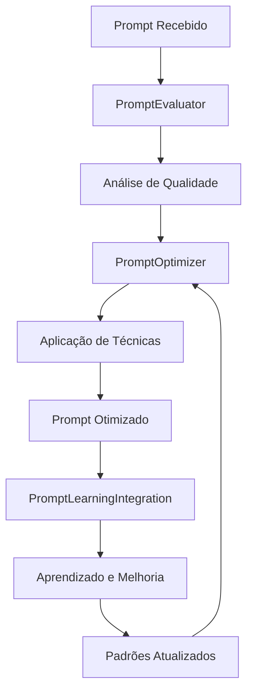

# 🧠 Guia Prático: Sistema Avançado de Engenharia de Prompt BMAD

**Versão**: 1.0  
**Data**: 01/12/2024  
**Status**: ✅ Implementado  

---

## 🎯 Visão Geral

Este guia apresenta o **Sistema Avançado de Engenharia de Prompt BMAD**, uma solução completa que implementa técnicas de ponta como Tree-of-Thought, Self-Consistency, Generated Knowledge e otimização automática para garantir prompts de máxima qualidade e eficácia.

### **Principais Características:**
- ✅ **Otimização Automática** de prompts
- ✅ **Técnicas Avançadas** (ToT, Self-Consistency, Generated Knowledge)
- ✅ **Integração com Auto-Aprendizado**
- ✅ **Avaliação Quantitativa** de qualidade
- ✅ **Melhoria Contínua** baseada em dados

---

## 🏗️ Arquitetura do Sistema

### **📊 Componentes Principais**



### **🔧 Arquivos do Sistema**

| Arquivo | Função | Status |
|---------|--------|--------|
| `advanced_prompt_system.py` | Sistema principal de prompt engineering | ✅ Implementado |
| `prompt_optimizer.py` | Otimizador de prompts | ✅ Implementado |
| `prompt_evaluator.py` | Avaliador de qualidade | ✅ Implementado |
| `prompt_learning_integration.py` | Integração com auto-aprendizado | ✅ Implementado |

---

## 🚀 Como Usar o Sistema

### **1. Uso Básico**

```python
from wiki.bmad.prompt_engineering.advanced_prompt_system import AdvancedPromptSystem

# Inicializar sistema
prompt_system = AdvancedPromptSystem()

# Otimizar prompt
original_prompt = "faz um código pra mim"
context = {"technologies": ["Python"], "task_type": "coding"}

optimization = prompt_system.optimize_prompt(original_prompt, context)
print(f"Prompt otimizado: {optimization.optimized_prompt}")
```

### **2. Avaliação de Qualidade**

```python
from wiki.bmad.prompt_engineering.prompt_evaluator import PromptEvaluator

# Inicializar avaliador
evaluator = PromptEvaluator()

# Avaliar prompt
evaluation = evaluator.evaluate_prompt(original_prompt, context)
print(f"Score geral: {evaluation.metrics.overall_score}")
print(f"Sugestões: {evaluation.metrics.suggestions}")
```

### **3. Otimização Específica**

```python
from wiki.bmad.prompt_engineering.prompt_optimizer import PromptOptimizer

# Inicializar otimizador
optimizer = PromptOptimizer()

# Otimizar prompt
result = optimizer.optimize_prompt(original_prompt, context)
print(f"Técnica aplicada: {result.technique}")
print(f"Melhoria esperada: {result.improvement_score}")
```

---

## 📈 Técnicas Avançadas Implementadas

### **🌳 Tree-of-Thought (ToT)**

**Para problemas complexos que requerem múltiplos caminhos de raciocínio:**

```python
# Aplicar ToT automaticamente
thoughts = prompt_system.apply_tree_of_thought(
    "Resolva este problema complexo de otimização de algoritmo",
    max_depth=5
)

# Resultado: Árvore de pensamentos explorados
for thought in thoughts:
    print(f"Pensamento: {thought.content}")
    print(f"Avaliação: {thought.evaluation}")
    print(f"Confiança: {thought.confidence}")
```

### **🔄 Self-Consistency**

**Para tarefas que requerem alta precisão:**

```python
# Aplicar Self-Consistency
consistency_result = prompt_system.apply_self_consistency(
    "Analise este código e identifique todos os problemas",
    num_samples=5
)

print(f"Resposta mais consistente: {consistency_result['most_consistent_response']}")
print(f"Score de confiança: {consistency_result['confidence_score']}")
```

### **🧠 Generated Knowledge**

**Para enriquecer contexto pobre:**

```python
# Aplicar Generated Knowledge
enriched_prompt = prompt_system.apply_generated_knowledge(
    "Crie uma função de validação",
    context={"technologies": ["Python"], "domain": "web_development"}
)

print(f"Prompt enriquecido: {enriched_prompt}")
```

---

## 📊 Métricas de Qualidade

### **Scores de Avaliação**

O sistema avalia prompts usando 5 métricas principais:

| Métrica | Descrição | Range |
|---------|-----------|-------|
| **Clareza** | Sentenças claras, sem ambiguidades | 0.0 - 1.0 |
| **Especificidade** | Contexto específico, detalhes relevantes | 0.0 - 1.0 |
| **Completude** | Todas as informações necessárias | 0.0 - 1.0 |
| **Estrutura** | Organização lógica, formatação | 0.0 - 1.0 |
| **Contexto** | Informações de background relevantes | 0.0 - 1.0 |

### **Exemplo de Avaliação**

```python
evaluation = evaluator.evaluate_prompt(prompt, context)

print(f"Clareza: {evaluation.metrics.clarity_score:.2f}")
print(f"Especificidade: {evaluation.metrics.specificity_score:.2f}")
print(f"Completude: {evaluation.metrics.completeness_score:.2f}")
print(f"Estrutura: {evaluation.metrics.structure_score:.2f}")
print(f"Contexto: {evaluation.metrics.context_score:.2f}")
print(f"Score Geral: {evaluation.metrics.overall_score:.2f}")
```

---

## 🔄 Integração com Auto-Aprendizado

### **Aprendizado Automático**

O sistema aprende automaticamente com cada otimização:

```python
from wiki.bmad.prompt_engineering.prompt_learning_integration import PromptLearningIntegration

# Inicializar integração
learning = PromptLearningIntegration()

# Registrar resultado de otimização
result = PromptOptimizationResult(
    original_prompt="faz um código",
    optimized_prompt="Você é um desenvolvedor Python. Crie um código eficiente...",
    technique_applied="role_prompting",
    success_score=0.85,
    user_feedback="Excelente melhoria!",
    context={"technologies": ["Python"]}
)

learning.record_prompt_optimization(result)
```

### **Recomendações Baseadas em Aprendizado**

```python
# Obter recomendação baseada em padrões aprendidos
recommendation = learning.get_optimization_recommendation(prompt, context)

print(f"Técnica recomendada: {recommendation['recommended_technique']}")
print(f"Confiança: {recommendation['confidence']:.2f}")
print(f"Motivo: {recommendation['reasoning']}")
```

---

## ⚙️ Configuração e Personalização

### **Configurações do Sistema**

```python
# Configurações padrão
config = {
    'optimization_threshold': 0.6,        # Threshold para otimização automática
    'tree_of_thought_threshold': 0.7,     # Threshold para aplicar ToT
    'self_consistency_samples': 5,        # Número de amostras para Self-Consistency
    'max_optimization_attempts': 3,       # Máximo de tentativas de otimização
    'learning_enabled': True,             # Habilitar aprendizado
    'context_integration': True,          # Integrar contexto
    'automatic_evaluation': True          # Avaliação automática
}

# Aplicar configurações
prompt_system.save_config(config)
```

### **Pesos de Avaliação**

```python
# Personalizar pesos das métricas
evaluator.weights = {
    'clarity': 0.30,      # Aumentar peso da clareza
    'specificity': 0.25,  # Peso da especificidade
    'completeness': 0.20, # Peso da completude
    'structure': 0.15,    # Peso da estrutura
    'context': 0.10       # Peso do contexto
}
```

---

## 📋 Exemplos Práticos

### **Exemplo 1: Otimização de Prompt de Código**

```python
# Prompt original
original = "faz um código pra validar email"

# Contexto
context = {
    "technologies": ["Python"],
    "task_type": "validation",
    "complexity": "medium"
}

# Otimizar
optimization = prompt_system.optimize_prompt(original, context)

print("=== ANTES ===")
print(original)

print("\n=== DEPOIS ===")
print(optimization.optimized_prompt)

print(f"\nTécnica aplicada: {optimization.technique_applied}")
print(f"Confiança: {optimization.confidence_score:.2f}")
```

**Resultado esperado:**
```
=== ANTES ===
faz um código pra validar email

=== DEPOIS ===
Você é um desenvolvedor Python experiente.

Tarefa específica: Crie uma função de validação de email
Tecnologias: Python
Complexidade: medium

Por favor, forneça uma solução específica e detalhada que inclua:
1. Função de validação robusta
2. Tratamento de casos edge
3. Documentação clara
4. Exemplos de uso

Resposta estruturada:
```

### **Exemplo 2: Aplicação de Tree-of-Thought**

```python
# Problema complexo
complex_problem = """
Analise este sistema de cache e proponha melhorias:
- Cache atual: LRU simples
- Problema: Baixa hit rate (30%)
- Requisitos: Alta performance, baixo uso de memória
"""

# Aplicar ToT
thoughts = prompt_system.apply_tree_of_thought(complex_problem, max_depth=4)

print("=== ÁRVORE DE PENSAMENTOS ===")
for thought in thoughts:
    if thought.depth <= 2:  # Mostrar apenas primeiros níveis
        indent = "  " * thought.depth
        print(f"{indent}• {thought.content}")
        print(f"{indent}  Avaliação: {thought.evaluation}")
```

### **Exemplo 3: Self-Consistency para Análise**

```python
# Tarefa que requer alta precisão
analysis_task = """
Analise este código Python e identifique TODOS os problemas de segurança:
[CODIGO_AQUI]
"""

# Aplicar Self-Consistency
result = prompt_system.apply_self_consistency(analysis_task, num_samples=7)

print("=== ANÁLISE COM SELF-CONSISTENCY ===")
print(f"Resposta mais consistente: {result['most_consistent_response']}")
print(f"Score de confiança: {result['confidence_score']:.2f}")
print(f"Análise de consistência: {result['consistency_analysis']}")
```

---

## 📊 Monitoramento e Relatórios

### **Estatísticas do Sistema**

```python
# Obter estatísticas gerais
stats = prompt_system.get_optimization_stats()
print(f"Total de otimizações: {stats['total_optimizations']}")
print(f"Confiança média: {stats['average_confidence']:.2f}")
print(f"Técnica mais usada: {stats['most_used_technique']}")

# Estatísticas de avaliação
eval_stats = evaluator.get_evaluation_stats()
print(f"Total de avaliações: {eval_stats['total_evaluations']}")
print(f"Score médio: {eval_stats['average_scores']['overall']:.2f}")
print(f"Tendência: {eval_stats['improvement_trend']}")
```

### **Relatório de Aprendizado**

```python
# Relatório completo de aprendizado
report = learning.generate_learning_report()

print("=== RELATÓRIO DE APRENDIZADO ===")
print(f"Padrões aprendidos: {report['total_patterns_learned']}")
print(f"Otimizações realizadas: {report['total_optimizations']}")

print("\nTop 3 Padrões:")
for pattern in report['top_patterns'][:3]:
    print(f"- {pattern['technique']}: {pattern['success_rate']:.2f} ({pattern['usage_count']} usos)")
```

---

## 🔧 Troubleshooting

### **Problemas Comuns e Soluções**

#### **1. Otimização não aplicada**
```python
# Verificar threshold
config = prompt_system.load_config()
print(f"Threshold atual: {config['optimization_threshold']}")

# Ajustar se necessário
config['optimization_threshold'] = 0.5
prompt_system.save_config(config)
```

#### **2. Técnicas não sendo aplicadas**
```python
# Verificar configurações
print(f"ToT habilitado: {config.get('enable_tree_of_thought', True)}")
print(f"Self-Consistency habilitado: {config.get('enable_self_consistency', True)}")

# Habilitar técnicas
config['enable_tree_of_thought'] = True
config['enable_self_consistency'] = True
prompt_system.save_config(config)
```

#### **3. Baixa qualidade de otimizações**
```python
# Verificar padrões aprendidos
patterns = learning.prompt_patterns
print(f"Padrões disponíveis: {len(patterns)}")

# Forçar relearning
learning._update_prompt_patterns(result)
```

---

## 🚀 Melhores Práticas

### **1. Contexto Rico**
```python
# ✅ BOM: Contexto detalhado
context = {
    "technologies": ["Python", "Flask"],
    "task_type": "api_development",
    "complexity": "high",
    "requirements": ["security", "performance", "scalability"]
}

# ❌ RUIM: Contexto pobre
context = {"technologies": ["Python"]}
```

### **2. Feedback Contínuo**
```python
# Registrar feedback para aprendizado
result = PromptOptimizationResult(
    original_prompt=original,
    optimized_prompt=optimized,
    technique_applied=technique,
    success_score=user_rating,  # 0.0 - 1.0
    user_feedback="Muito útil! Código ficou mais claro.",
    context=context
)

learning.record_prompt_optimization(result)
```

### **3. Monitoramento Regular**
```python
# Verificar performance semanalmente
weekly_stats = evaluator.get_evaluation_stats()
if weekly_stats['average_scores']['overall'] < 0.6:
    print("⚠️ Performance baixa detectada - revisar configurações")
```

---

## 📚 Recursos Adicionais

### **Documentação Relacionada**
- [Regras Avançadas de Prompt Engineering](/.cursor/rules/enhanced-prompt-engineering-rules.md)
- [Sistema de Auto-Aprendizado BMAD](../auto_learning/Auto_Learning_Guide.md)
- [Orquestrador Inteligente](../../update/enhanced_intelligent_orchestrator.py)

### **Exemplos Completos**
- [Exemplos de Otimização](../prompt_engineering/example_integration.py)
- [Casos de Uso Avançados](../prompt_engineering/advanced_examples.py)

### **Configurações Avançadas**
- [Configuração de Thresholds](../prompt_engineering/config_examples.py)
- [Personalização de Técnicas](../prompt_engineering/custom_techniques.py)

---

## 🎉 Conclusão

O **Sistema Avançado de Engenharia de Prompt BMAD** representa uma evolução significativa no campo de prompt engineering, oferecendo:

- ✅ **Otimização automática** de prompts
- ✅ **Técnicas de ponta** implementadas
- ✅ **Integração perfeita** com auto-aprendizado
- ✅ **Avaliação quantitativa** de qualidade
- ✅ **Melhoria contínua** baseada em dados

Este sistema garante que o BMAD produza prompts cada vez mais precisos, relevantes e eficazes, proporcionando uma experiência superior para os usuários e mantendo a qualidade e confiabilidade do sistema.

---

**Guia gerado automaticamente pelo Sistema BMAD**  
**Versão**: 1.0  
**Data**: 01/12/2024 