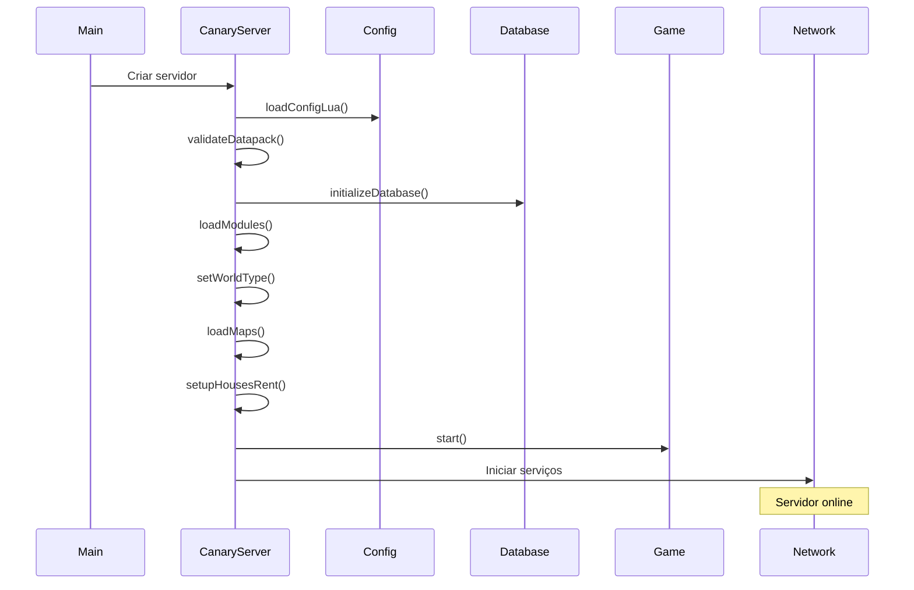

# Fundamentos do Canary

> [!info] **Sobre este Guia**
> Este guia apresenta os fundamentos do Canary, um servidor MMORPG open-source desenvolvido em C++. Baseado na análise técnica da [[habdel/CANARY-001|CANARY-001]], este documento serve como ponto de entrada para desenvolvedores que querem entender a arquitetura e funcionamento do Canary.

## 🎯 **O que é o Canary?**

O **Canary** é um servidor MMORPG open-source desenvolvido em C++ que funciona como um fork do projeto OTServBR-Global. É um servidor robusto e modular que oferece uma arquitetura completa para jogos MMORPG baseados em Tibia.

### **Características Principais**
- **Linguagem**: C++ moderno
- **Scripting**: Lua integrado
- **Arquitetura**: Modular e extensível
- **Protocolo**: Compatível com Open Tibia
- **Licença**: Open Source

## 🏗️ **Arquitetura do Sistema**

### **Visão Geral da Arquitetura**

```mermaid
graph TB
    A[CanaryServer] --> B[Core Systems]
    A --> C[Game Systems]
    A --> D[Creature Systems]
    A --> E[Data Systems]
    A --> F[Network Systems]
    A --> G[Scripting Systems]
    
    B --> B1[ServiceManager]
    B --> B2[Logger]
    B --> B3[RSA Security]
    
    C --> C1[Game Engine]
    C --> C2[Combat System]
    C --> C3[Movement System]
    C --> C4[Scheduling]
    C --> C5[Zones]
    
    D --> D1[Players]
    D --> D2[NPCs]
    D --> D3[Monsters]
    D --> D4[Combat]
    D --> D5[Interactions]
    
    E --> E1[Database]
    E --> E2[Items]
    E --> E3[Map]
    E --> E4[Config]
    
    F --> F1[IO Management]
    F --> F2[Protocol Handling]
    F --> F3[Connection Management]
    
    G --> G1[Lua Engine]
    G --> G2[Scripts]
    G --> G3[Modules]
    G --> G4[Functions]
```



### **Componentes Principais**

#### **1. Core Systems**
- **CanaryServer**: Servidor principal
- **ServiceManager**: Gerenciamento de serviços
- **Logger**: Sistema de logs
- **RSA Security**: Criptografia e segurança

#### **2. Game Systems**
- **Game Engine**: Lógica principal do jogo
- **Combat System**: Sistema de combate
- **Movement System**: Sistema de movimento
- **Scheduling**: Agendamento de eventos
- **Zones**: Gerenciamento de zonas

#### **3. Creature Systems**
- **Players**: Sistema de jogadores
- **NPCs**: Personagens não-jogáveis
- **Monsters**: Sistema de monstros
- **Combat**: Sistema de combate
- **Interactions**: Interações entre criaturas

#### **4. Data Systems**
- **Database**: Sistema de banco de dados
- **Items**: Sistema de itens
- **Map**: Sistema de mapas
- **Config**: Sistema de configuração

#### **5. Network Systems**
- **IO Management**: Gerenciamento de I/O
- **Protocol Handling**: Manipulação de protocolos
- **Connection Management**: Gerenciamento de conexões

#### **6. Scripting Systems**
- **Lua Engine**: Motor Lua
- **Scripts**: Scripts Lua
- **Modules**: Módulos Lua
- **Functions**: Funções Lua

## 📁 **Estrutura de Diretórios**

### **Diretórios Principais**

| Diretório | Propósito | Status |
|-----------|-----------|--------|
| `src/` | Código-fonte principal | ✅ Disponível |
| `src/game/` | Sistemas de jogo | ✅ Disponível |
| `src/creatures/` | Sistema de criaturas | ✅ Disponível |
| `src/lua/` | Sistema de scripting | ✅ Disponível |
| `src/database/` | Sistema de banco de dados | ✅ Disponível |
| `src/io/` | Sistema de I/O | ✅ Disponível |
| `src/map/` | Sistema de mapas | ✅ Disponível |
| `src/items/` | Sistema de itens | ✅ Disponível |
| `data/` | Dados do servidor | ✅ Disponível |
| `config.lua.dist` | Configuração padrão | ✅ Disponível |

### **Arquivos de Configuração**

**config.lua.dist** - Configuração principal do servidor:

```lua
-- Core settings
useAnyDatapackFolder = false
dataPackDirectory = "data-otservbr-global"
coreDirectory = "data"

-- Log level
logLevel = "info"

-- Combat settings
worldType = "pvp"
protectionLevel = 7
pzLocked = 60 * 1000

-- Connection Config
ip = "127.0.0.1"
loginProtocolPort = 7171
gameProtocolPort = 7172
statusProtocolPort = 7171
maxPlayers = 0
serverName = "OTServBR-Global"

-- Packet Compression
packetCompressionLevel = 6

-- Item and containers limit
maxItem = 5000
maxContainer = 500
maxContainerDepth = 200
```

## 🔧 **Componentes Principais**

### **1. CanaryServer (Servidor Principal)**

**Localização**: `src/canary_server.hpp`, `src/canary_server.cpp`

**Responsabilidades**:
- Inicialização e gerenciamento do servidor
- Coordenação de todos os subsistemas
- Gerenciamento de ciclo de vida
- Tratamento de erros e exceções

**Estrutura Principal**:
```cpp
class CanaryServer {
public:
    explicit CanaryServer(
        Logger &logger,
        RSA &rsa,
        ServiceManager &serviceManager
    );

    int run();

private:
    void loadConfigLua();
    void validateDatapack();
    void initializeDatabase();
    void loadModules();
    void setWorldType();
    void loadMaps() const;
    void setupHousesRent();
};
```

### **2. Game Engine**

- **Localização**: `src/game/`
- **Arquivos Principais**: `game.hpp`, `game.cpp`
- **Funcionalidades**: Lógica principal do jogo, combate, movimento

### **3. Creature System**

- **Localização**: `src/creatures/`
- **Subsistemas**:
  - `players/` - Sistema de jogadores
  - `npcs/` - Sistema de NPCs
  - `monsters/` - Sistema de monstros
  - `combat/` - Sistema de combate
  - `interactions/` - Sistema de interações

### **4. Lua Scripting**

- **Localização**: `src/lua/`
- **Subsistemas**:
  - `scripts/` - Scripts Lua
  - `modules/` - Módulos Lua
  - `functions/` - Funções Lua
  - `callbacks/` - Callbacks Lua

## 🚀 **Como Funciona**

### **Fluxo de Inicialização**



### **Estados do Servidor**

```cpp
enum GameState_t : uint8_t {
    GAME_STATE_STARTUP = 0,
    GAME_STATE_INIT = 1,
    GAME_STATE_NORMAL = 2,
    GAME_STATE_CLOSED = 3,
    GAME_STATE_SHUTDOWN = 4,
    GAME_STATE_CLOSING = 5
};
```

## 🔗 **Integração com OTClient**

### **Arquitetura Complementar**

O Canary e o OTClient formam um ecossistema complementar:

- **Canary**: Servidor (lado servidor)
- **OTClient**: Cliente (lado cliente)
- **Protocolo**: Comunicação padronizada
- **Lua**: Scripting compartilhado

### **Pontos de Integração**

1. **Protocolos de Comunicação**
   - Login/Autenticação
   - Comunicação em tempo real
   - Sincronização de dados

2. **APIs Unificadas**
   - APIs Lua compartilhadas
   - Padrões de comunicação
   - Interfaces unificadas

3. **Sistemas Correspondentes**
   - OTClient Chat ↔ Canary Communication
   - OTClient Configuration ↔ Canary Config
   - OTClient Logs ↔ Canary Logger
   - OTClient Game Systems ↔ Canary Game Engine

## 📚 **Aprendizado Progressivo**

### **Nível Básico**
- Entender a arquitetura geral
- Configurar ambiente básico
- Executar servidor simples

### **Nível Intermediário**
- Modificar configurações
- Criar scripts Lua básicos
- Entender protocolos

### **Nível Avançado**
- Desenvolver módulos customizados
- Otimizar performance
- Integrar com OTClient

### **Nível Especialista**
- Contribuir para o projeto
- Desenvolver extensões complexas
- Otimizar arquitetura

## 🛠️ **Exemplos Práticos**

### **Exemplo 1: Servidor Básico**

```cpp
#include "canary_server.hpp"

int main() {
    Logger logger;
    RSA rsa;
    ServiceManager serviceManager;
    
    CanaryServer server(logger, rsa, serviceManager);
    return server.run();
}
```

### **Exemplo 2: Configuração Customizada**

```lua
-- config.lua
-- Core settings
useAnyDatapackFolder = false
dataPackDirectory = "data-otservbr-global"
coreDirectory = "data"

-- Log level
logLevel = "info"

-- Connection Config
ip = "127.0.0.1"
loginProtocolPort = 7171
gameProtocolPort = 7172
statusProtocolPort = 7171
maxPlayers = 0
serverName = "Meu Servidor Canary"

-- World settings
worldType = "pvp"
protectionLevel = 7
```

### **Exemplo 3: Script Lua Básico**

```lua
-- data/scripts/example.lua
function onPlayerLogin(player)
    player:sendTextMessage(MESSAGE_INFO_DESCR, "Bem-vindo ao servidor Canary!")
    return true
end
```

## 🔍 **Troubleshooting**

### **Problemas Comuns**

1. **Erro de Configuração**
   - Verificar `config.lua`
   - Validar caminhos de diretórios
   - Verificar permissões

2. **Erro de Banco de Dados**
   - Verificar conexão
   - Validar schema
   - Verificar credenciais

3. **Erro de Rede**
   - Verificar portas
   - Validar firewall
   - Verificar IP

### **Logs e Debug**

```lua
-- Habilitar logs detalhados
logLevel = "debug"

-- Verificar logs em tempo real
tail -f data/logs/server.log
```

## 📖 **Próximos Passos**

### **Leitura Recomendada**

1. [[canary_arquitetura_core|Arquitetura Core do Canary]] - Análise detalhada da arquitetura
2. [[canary_sistema_rede|Sistema de Rede]] - Comunicação cliente-servidor
3. [[canary_sistema_ui|Sistema de UI]] - Interfaces do usuário
4. [[canary_sistema_modulos|Sistema de Módulos]] - Extensibilidade

### **Recursos Adicionais**

- [[wikipedia_canary_otclient|Wikipedia Canary + OTClient]] - Visão geral completa
- [[guia_navegacao|Guia de Navegação]] - Como navegar pela documentação
- [[glossario_tecnico|Glossário Técnico]] - Termos e conceitos

## 🎯 **Conclusão**

O Canary representa uma arquitetura robusta e moderna para servidores MMORPG, oferecendo:

- **Modularidade**: Componentes bem separados
- **Extensibilidade**: Fácil adição de funcionalidades
- **Performance**: Otimizado para alta carga
- **Compatibilidade**: Compatível com protocolos Open Tibia
- **Scripting**: Lua integrado para customização

Esta base sólida permite o desenvolvimento de servidores MMORPG complexos e escaláveis, formando a base para integração com o OTClient e criação de um ecossistema completo de desenvolvimento de jogos.

---

**Tags**: #canary #fundamentos #arquitetura #servidor #mmorpg #c++ #lua  
**Nível**: Beginner  
**Tempo Estimado**: 30 minutos  
**Próximo**: [[canary_arquitetura_core|Arquitetura Core do Canary]] 