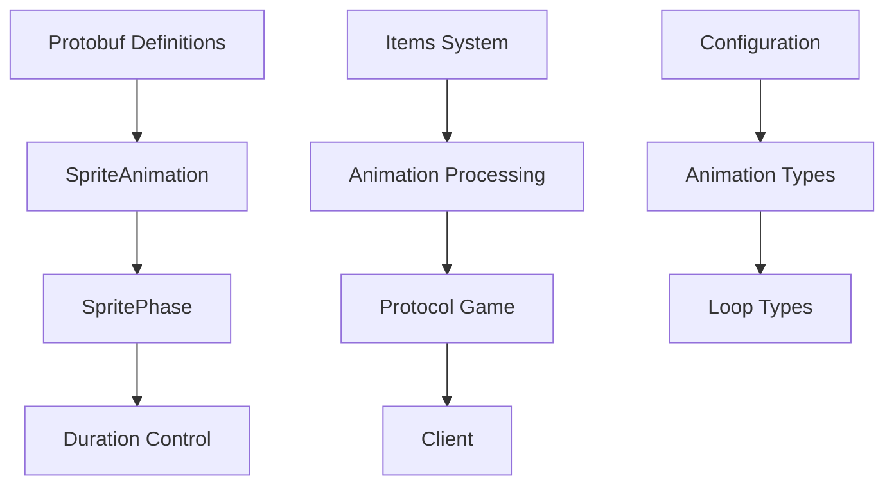

# 🎬 Sistema de Animações - Canary

## 📋 **Visão Geral**

O Sistema de Animações do Canary é responsável por gerenciar animações de sprites no servidor, incluindo configuração de fases, controle de sincronização e tipos de loop para itens animados.

### **🎯 Características Principais**
- **Animações de Sprites**: Configuração de fases de animação
- **Controle de Sincronização**: Sincronização entre clientes
- **Tipos de Loop**: Ping-pong, infinito e contado
- **Protocolo Otimizado**: Dados compactos via protobuf
- **Compatibilidade**: Suporte a protocolos antigos e novos

## 🏗️ **Arquitetura do Sistema**

### **Estrutura de Componentes**
```
canary/src/
├── protobuf/
│   └── appearances.proto          # Definições de animações
├── items/
│   ├── items.cpp                  # Processamento de animações
│   ├── items_definitions.hpp      # Tipos de animação
│   └── item.cpp                   # Implementação de itens
└── server/network/protocol/
    └── protocolgame.cpp           # Protocolo de animações
```

### **Diagrama da Arquitetura**


## 🔧 **Componentes Principais**

### **1. SpriteAnimation (Protobuf)**
```protobuf
message SpritePhase {
    optional uint32 duration_min = 1;
    optional uint32 duration_max = 2;
}

message SpriteAnimation {
    optional uint32 default_start_phase = 1;
    optional bool synchronized = 2;
    optional bool random_start_phase = 3;
    optional ANIMATION_LOOP_TYPE loop_type = 4;
    optional uint32 loop_count = 5;
    repeated SpritePhase sprite_phase = 6;
}

enum ANIMATION_LOOP_TYPE {
    ANIMATION_LOOP_TYPE_PINGPONG = -1;
    ANIMATION_LOOP_TYPE_INFINITE = 0;
    ANIMATION_LOOP_TYPE_COUNTED = 1;
}
```

**Funcionalidades**:
- **Configuração de fases**: Definição de fases de animação
- **Controle de sincronização**: Sincronização entre clientes
- **Tipos de loop**: Ping-pong, infinito, contado
- **Fases de sprite**: Com duração configurável

### **2. Sistema de Itens**
```cpp
enum AnimationType_t {
    ANIMATION_NONE = 0,
    ANIMATION_RANDOM = 1,
    ANIMATION_DESYNC = 2
};

struct ItemType {
    // ... outros campos
    AnimationType_t animationType = ANIMATION_NONE;
    uint32_t animationSpeed = 0;
    bool hasAnimation = false;
};
```

**Funcionalidades**:
- **Carregamento de animações**: Processamento de animações de itens
- **Tipos de animação**: RANDOM, DESYNC
- **Suporte a protocolos antigos**: Compatibilidade com versões anteriores

### **3. Protocolo de Rede**
```cpp
void ProtocolGame::sendAddItem(const Position& pos, uint32_t stackpos, const Item* item) {
    // ... código existente
    
    if (it.animationType == ANIMATION_RANDOM) {
        // Animação com fase inicial aleatória
        msg.add<uint8_t>(randomNumber(0, it.animationPhases - 1));
    } else if (it.animationType == ANIMATION_DESYNC) {
        // Animação dessincronizada
        msg.add<uint8_t>((ticks % it.animationPhases));
    }
    
    // ... resto do código
}
```

**Funcionalidades**:
- **Envio de dados de animação**: Transmissão para clientes
- **Sincronização de fases**: Controle de timing
- **Controle de compatibilidade**: Suporte a protocolos antigos

## 🔧 **APIs e Interfaces**

### **Carregamento de Animação**
```cpp
// Carregamento de animação de item
bool Items::parseItemNode(const pugi::xml_node& itemNode, uint16_t id) {
    // ... código existente
    
    if (objectFrame.sprite_info().has_animation()) {
        const auto& animation = objectFrame.sprite_info().animation();
        
        if (animation.random_start_phase()) {
            iType.animationType = ANIMATION_RANDOM;
        } else {
            iType.animationType = ANIMATION_DESYNC;
        }
        
        iType.hasAnimation = true;
        iType.animationSpeed = animation.sprite_phase(0).duration_min();
    }
    
    return true;
}
```

### **Processamento de Animação no Protocolo**
```cpp
// Envio de animação para cliente
void ProtocolGame::sendAddItem(const Position& pos, uint32_t stackpos, const Item* item) {
    // ... código existente
    
    if (it.animationType == ANIMATION_RANDOM) {
        // Animação com fase inicial aleatória
        msg.add<uint8_t>(randomNumber(0, it.animationPhases - 1));
    } else if (it.animationType == ANIMATION_DESYNC) {
        // Animação dessincronizada
        msg.add<uint8_t>((ticks % it.animationPhases));
    }
    
    // ... resto do código
}
```

### **Configuração de SpriteInfo**
```protobuf
message SpriteInfo {
    optional uint32 pattern_width = 1;
    optional uint32 pattern_height = 2;
    optional uint32 pattern_depth = 3;
    optional uint32 layers = 4;
    repeated uint32 sprite_id = 5;
    optional uint32 bounding_square = 7;
    optional SpriteAnimation animation = 6;  // Animação do sprite
    optional bool is_opaque = 8;
    repeated Box bounding_box_per_direction = 9;
}
```

## 🎮 **Sistema de Animações**

### **Tipos de Animação Suportados**

#### **1. ANIMATION_NONE**
- **Descrição**: Item sem animação
- **Uso**: Itens estáticos como paredes, chão
- **Performance**: Máxima (sem overhead)

#### **2. ANIMATION_RANDOM**
- **Descrição**: Animação com fase inicial aleatória
- **Uso**: Efeitos visuais, itens decorativos
- **Características**:
  - Fase inicial aleatória para cada instância
  - Efeito visual diversificado
  - Ideal para múltiplas instâncias

#### **3. ANIMATION_DESYNC**
- **Descrição**: Animação dessincronizada
- **Uso**: Itens animados comuns
- **Características**:
  - Baseada no tempo do servidor
  - Sincronização entre clientes
  - Performance otimizada

### **Configuração de Fases**
```protobuf
message SpritePhase {
    optional uint32 duration_min = 1;  // Duração mínima em ms
    optional uint32 duration_max = 2;  // Duração máxima em ms
}
```

### **Tipos de Loop**
```protobuf
enum ANIMATION_LOOP_TYPE {
    ANIMATION_LOOP_TYPE_PINGPONG = -1;  // Ida e volta
    ANIMATION_LOOP_TYPE_INFINITE = 0;   // Loop infinito
    ANIMATION_LOOP_TYPE_COUNTED = 1;    // Loop contado
}
```

## 🔄 **Sistema de Sincronização**

### **Sincronização de Tempo**
- **Base**: Tempo do servidor (ticks)
- **Cálculo**: `(ticks % animationPhases)`
- **Vantagem**: Sincronização automática entre clientes

### **Animação Aleatória**
- **Base**: Número aleatório por instância
- **Cálculo**: `randomNumber(0, animationPhases - 1)`
- **Vantagem**: Diversidade visual

### **Controle de Performance**
```cpp
// Verificação de suporte a animação
bool supportAnimation = g_configManager().getBoolean(OLD_PROTOCOL);

if (supportAnimation) {
    // Processar animação apenas se suportado
    if (objectFrame.sprite_info().has_animation()) {
        // Configurar animação
    }
}
```

## 🎯 **Integração com Outros Sistemas**

### **Sistema de Itens**
- **Carregamento**: Durante inicialização do servidor
- **Processamento**: Em tempo real durante gameplay
- **Armazenamento**: Em memória para performance

### **Sistema de Rede**
- **Transmissão**: Via protocolo de jogo
- **Sincronização**: Automática entre servidor e clientes
- **Otimização**: Dados compactos via protobuf

### **Sistema de Protocolo**
- **Compatibilidade**: Suporte a protocolos antigos e novos
- **Flexibilidade**: Configuração por item
- **Performance**: Processamento otimizado

## 🔧 **Otimizações e Performance**

### **Estratégias de Otimização**
1. **Carregamento Lazy**: Animações carregadas sob demanda
2. **Cache Inteligente**: Dados de animação em memória
3. **Compressão**: Dados protobuf otimizados
4. **Seleção Condicional**: Animação apenas quando necessário

### **Controle de Memória**
```cpp
// Verificação de suporte antes de processar
if (!objectFrame.sprite_info().has_animation()) {
    return; // Pular processamento se não há animação
}
```

### **Performance de Rede**
- **Dados Mínimos**: Apenas informações essenciais
- **Sincronização Eficiente**: Baseada em ticks do servidor
- **Cache Cliente**: Redução de retransmissão

## 📊 **Métricas e Monitoramento**

### **Métricas Disponíveis**
- **Número de Itens Animados**: Por tipo e categoria
- **Uso de Memória**: Por animação
- **Performance de Rede**: Dados transmitidos
- **Tempo de Processamento**: Por frame

### **Logs e Debug**
```cpp
// Log de animação carregada
if (animation.random_start_phase()) {
    g_logger().debug("Animation loaded: RANDOM type for item {}", id);
} else {
    g_logger().debug("Animation loaded: DESYNC type for item {}", id);
}
```

## 🔗 **Integração com Cliente**

### **Protocolo de Comunicação**
1. **Servidor**: Envia dados de animação via protobuf
2. **Cliente**: Recebe e processa animações
3. **Sincronização**: Baseada em tempo do servidor
4. **Renderização**: Cliente responsável pela exibição

### **Compatibilidade**
- **Protocolos Antigos**: Suporte via configuração
- **Protocolos Novos**: Funcionalidades completas
- **Fallback**: Comportamento padrão para incompatibilidades

## 🚀 **Comparação com OTClient**

### **Similaridades**
- **Sprite animations**: Ambos suportam animações de sprites
- **Protocol handling**: Manipulação de protocolos
- **Performance optimization**: Otimizações de performance

### **Diferenças**
- **Server vs Client**: Canary é servidor, OTClient é cliente
- **Protobuf focus**: Canary usa protobuf, OTClient usa protocolo tradicional
- **Synchronization**: Canary controla sincronização, OTClient renderiza
- **Configuration**: Canary configura, OTClient exibe

## 📈 **Benefícios da Arquitetura**

### **Para Desenvolvedores**
- **Flexibilidade**: Configuração flexível de animações
- **Performance**: Alta performance e baixa latência
- **Compatibilidade**: Suporte a múltiplos protocolos
- **Debugging**: Facilidade de debug e profiling

### **Para o Sistema**
- **Scalability**: Escalabilidade horizontal
- **Reliability**: Alta confiabilidade e estabilidade
- **Efficiency**: Eficiência de recursos
- **Compatibility**: Compatibilidade com clientes antigos

### **Para a Integração**
- **Protocol compatibility**: Compatibilidade com OTClient
- **Extensibility**: Fácil extensão para novos protocolos
- **Interoperability**: Interoperabilidade com outros sistemas
- **Future-proof**: Preparado para futuras expansões

## 🔧 **Troubleshooting**

### **Problemas Comuns**

#### **Animação não carrega**
```cpp
// Verificar se animação existe
if (!objectFrame.sprite_info().has_animation()) {
    g_logger().warn("No animation found for item {}", id);
    return false;
}

// Verificar se fases existem
if (animation.sprite_phase_size() == 0) {
    g_logger().error("No sprite phases found for item {}", id);
    return false;
}
```

#### **Animação não sincroniza**
```cpp
// Verificar configuração de sincronização
if (animation.synchronized()) {
    // Usar tempo do servidor para sincronização
    uint8_t phase = (ticks % animation.sprite_phase_size());
} else {
    // Usar fase aleatória
    uint8_t phase = randomNumber(0, animation.sprite_phase_size() - 1);
}
```

#### **Performance baixa**
```cpp
// Verificar se animação é necessária
if (it.animationType == ANIMATION_NONE) {
    return; // Pular processamento
}

// Verificar suporte a protocolo
if (oldProtocol && !supportAnimation) {
    return; // Pular para protocolos antigos
}
```

### **Debug e Logging**
```cpp
// Log detalhado de animação
g_logger().debug("Processing animation for item {}: type={}, phases={}", 
    id, static_cast<int>(animationType), animationPhases);

// Log de performance
auto start = std::chrono::high_resolution_clock::now();
// ... processamento da animação
auto end = std::chrono::high_resolution_clock::now();
auto duration = std::chrono::duration_cast<std::chrono::microseconds>(end - start);

g_logger().debug("Animation processing took {} microseconds", duration.count());
```

## 🎯 **Próximos Passos**

### **Aprendizado Progressivo**
1. **Básico**: Entender conceitos de animações e sprites
2. **Intermediário**: Configurar animações simples
3. **Avançado**: Implementar animações complexas
4. **Especialista**: Otimizar performance e criar frameworks

### **Links Relacionados**
- [[canary_fundamentos|Fundamentos do Canary]]
- [[canary_arquitetura_core|Arquitetura Core]]
- [[canary_sistema_rede|Sistema de Rede]]
- [[canary_sistema_ui|Sistema de UI]]

---

**Baseado na pesquisa Habdel**: [[../habdel/CANARY-008|CANARY-008: Sistema de Animações]] 