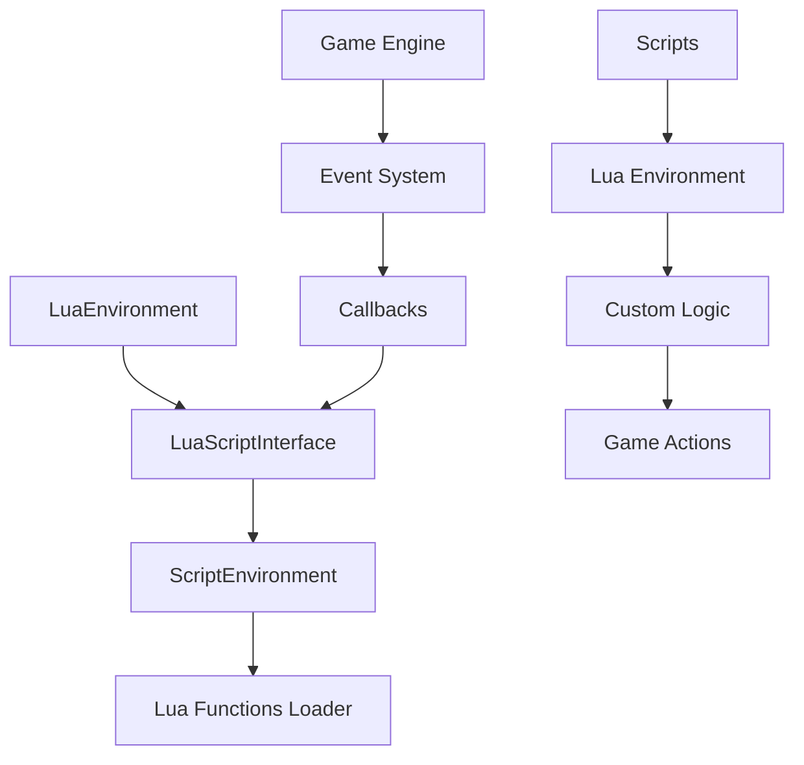

# 🐍 Sistema Lua - Canary

## 📋 **Visão Geral**

O Sistema Lua do Canary é o ambiente de execução principal para scripts Lua, fornecendo uma interface completa entre o código C++ do servidor e scripts Lua customizados.

### **🎯 Características Principais**
- **Ambiente Lua Completo**: Gerenciamento de estado Lua e execução de scripts
- **Interface C++/Lua**: Ponte entre código nativo e scripts
- **Sistema de Eventos**: Gerenciamento de callbacks e eventos
- **Tratamento de Erros**: Sistema robusto de tratamento de erros
- **Performance Otimizada**: Pool de ambientes e cache inteligente

## 🏗️ **Arquitetura do Sistema**

### **Estrutura de Diretórios**
```
canary/src/lua/
├── functions/           # Funções Lua expostas ao script
│   ├── core/           # Funções core do sistema
│   ├── creatures/      # Funções relacionadas a criaturas
│   ├── events/         # Funções de eventos
│   ├── items/          # Funções de itens
│   ├── map/            # Funções de mapa
│   └── lua_functions_loader.cpp
├── scripts/            # Sistema de scripts
│   ├── lua_environment.cpp
│   ├── luascript.cpp
│   ├── script_environment.cpp
│   └── luajit_sync.hpp
├── callbacks/          # Sistema de callbacks
├── creature/           # Callbacks específicos de criaturas
├── global/             # Variáveis globais Lua
└── modules/            # Módulos Lua
```

### **Diagrama da Arquitetura**


## 🔧 **Componentes Principais**

### **1. LuaEnvironment**
```cpp
class LuaEnvironment {
public:
    explicit LuaEnvironment();
    ~LuaEnvironment();

    lua_State* getLuaState() const { return luaState; }
    
    // Gerenciamento de timers
    void addTimer(uint32_t delay, const std::function<void()>& callback);
    void removeTimer(uint32_t timerId);
    
    // Gerenciamento de objetos de área
    void addAreaObject(const std::shared_ptr<AreaCombat>& area);
    void removeAreaObject(uint32_t areaId);
    
    // Coleta de lixo
    void collectGarbage();

private:
    lua_State* luaState;
    std::map<uint32_t, std::function<void()>> timers;
    std::map<uint32_t, std::shared_ptr<AreaCombat>> areaObjects;
};
```

**Funcionalidades**:
- **Gerenciamento do estado Lua**: Controle do `lua_State`
- **Controle de timers**: Agendamento de eventos temporizados
- **Gerenciamento de objetos de área**: Objetos de combate em área
- **Coleta de lixo automática**: Gerenciamento de memória

### **2. LuaScriptInterface**
```cpp
class LuaScriptInterface {
public:
    explicit LuaScriptInterface();
    ~LuaScriptInterface();

    // Carregamento de arquivos
    int32_t loadFile(const std::string& file, const std::string& scriptName);
    
    // Execução de funções
    bool callFunction(int params);
    void callVoidFunction(int params);
    
    // Tratamento de erros
    static void reportError(const char* function, const std::string& error_desc);
    static std::string getErrorDesc(ErrorCode_t code);

private:
    lua_State* luaState;
    std::string lastLuaError;
    std::string loadingFile;
    std::string loadingScriptName;
};
```

**Funcionalidades**:
- **Carregamento de arquivos Lua**: Leitura e compilação de scripts
- **Execução de funções**: Chamada de funções Lua
- **Tratamento de erros**: Sistema robusto de tratamento de erros
- **Gerenciamento de metadados**: Controle de informações de carregamento

### **3. ScriptEnvironment**
```cpp
class ScriptEnvironment {
public:
    ScriptEnvironment();
    ~ScriptEnvironment();

    // Gerenciamento de contexto
    void setScriptId(int32_t scriptId, LuaScriptInterface* scriptInterface);
    int32_t getScriptId() const { return scriptId; }
    
    // Gerenciamento de resultados temporários
    void setResult(const LuaVariant& result);
    const LuaVariant& getResult() const { return result; }
    
    // Gerenciamento de itens temporários
    void addTempItem(const std::shared_ptr<Item>& item);
    void removeTempItem(const std::shared_ptr<Item>& item);

private:
    int32_t scriptId;
    LuaVariant result;
    std::vector<std::shared_ptr<Item>> tempItems;
    LuaScriptInterface* scriptInterface;
};
```

**Funcionalidades**:
- **Isolamento de contexto**: Contexto isolado para cada script
- **Gerenciamento de resultados**: Controle de valores de retorno
- **Controle de itens temporários**: Gerenciamento de objetos temporários

## 🔧 **APIs e Interfaces**

### **Funções Core**
```cpp
// Carregamento do sistema Lua
void Lua::load(lua_State* L);

// Registro de classes
void registerClass(lua_State* L, const std::string& className, 
                  const std::string& baseClass, lua_CFunction newFunction = nullptr);

// Registro de métodos
void registerMethod(lua_State* L, const std::string& globalName, 
                   const std::string& methodName, lua_CFunction func);

// Registro de variáveis globais
void registerGlobalVariable(lua_State* L, const std::string& name, lua_Number value);
void registerGlobalString(lua_State* L, const std::string& variable, const std::string& name);
```

### **Funções de Conversão**
```cpp
// Push functions
static void pushThing(lua_State* L, const std::shared_ptr<Thing>& thing);
static void pushVariant(lua_State* L, const LuaVariant& var);
static void pushString(lua_State* L, const std::string& value);
static void pushNumber(lua_State* L, lua_Number value);
static void pushBoolean(lua_State* L, bool value);
static void pushPosition(lua_State* L, const Position& position, int32_t stackpos = 0);

// Get functions
static std::string getString(lua_State* L, int32_t arg);
static int32_t getNumber(lua_State* L, int32_t arg);
static bool getBoolean(lua_State* L, int32_t arg);
static std::shared_ptr<Creature> getCreature(lua_State* L, int32_t arg);
static std::shared_ptr<Player> getPlayer(lua_State* L, int32_t arg, bool allowOffline = false);
```

### **Funções de Validação**
```cpp
static bool isNumber(lua_State* L, int32_t arg);
static bool isString(lua_State* L, int32_t arg);
static bool isBoolean(lua_State* L, int32_t arg);
static bool isTable(lua_State* L, int32_t arg);
static bool isFunction(lua_State* L, int32_t arg);
static bool isUserdata(lua_State* L, int32_t arg);
```

## 📝 **Exemplos Práticos**

### **1. Carregamento de Script**
```cpp
// Carregamento de arquivo Lua
int32_t LuaScriptInterface::loadFile(const std::string& file, const std::string& scriptName) {
    int ret = luaL_loadfile(luaState, file.c_str());
    if (ret != 0) {
        lastLuaError = popString(luaState);
        return -1;
    }
    
    if (!isFunction(luaState, -1)) {
        return -1;
    }
    
    loadingFile = file;
    setLoadingScriptName(scriptName);
    
    if (!reserveScriptEnv()) {
        return -1;
    }
    
    ScriptEnvironment* env = getScriptEnv();
    env->setScriptId(EVENT_ID_LOADING, this);
    
    ret = protectedCall(luaState, 0, 0);
    if (ret != 0) {
        reportError(nullptr, popString(luaState));
        resetScriptEnv();
        return -1;
    }
    
    resetScriptEnv();
    return 0;
}
```

### **2. Registro de Função Global**
```cpp
// Registro de função global
void registerGlobalMethod(lua_State* L, const std::string& functionName, lua_CFunction func) {
    lua_register(L, functionName.c_str(), func);
}
```

### **3. Manipulação de Userdata**
```cpp
// Push userdata
template <class T>
static void pushUserdata(lua_State* L, T* value) {
    T** userdata = static_cast<T**>(lua_newuserdata(L, sizeof(T*)));
    *userdata = value;
}

// Get userdata
template <class T>
static T* getUserdata(lua_State* L, int32_t arg) {
    T** userdata = getRawUserdata<T>(L, arg);
    if (!userdata) {
        return nullptr;
    }
    return *userdata;
}
```

## 🎮 **Sistema de Scripts**

### **Estrutura de Scripts**
```
canary/data/scripts/
├── actions/           # Ações de itens
├── creaturescripts/   # Scripts de criaturas
├── eventcallbacks/    # Callbacks de eventos
├── globalevents/      # Eventos globais
├── lib/              # Bibliotecas Lua
├── movements/        # Scripts de movimento
├── runes/            # Scripts de runas
├── spells/           # Scripts de magias
├── systems/          # Sistemas customizados
├── talkactions/      # Ações de fala
└── weapons/          # Scripts de armas
```

### **Exemplo de Script Lua**
```lua
-- Exemplo de script de ação
function onUse(player, item, fromPosition, target, toPosition, isHotkey)
    if player:getStorageValue(1000) == 1 then
        player:sendTextMessage(MESSAGE_INFO_DESCR, "Você já usou este item.")
        return false
    end
    
    player:setStorageValue(1000, 1)
    player:addItem(2160, 100) -- 100 crystal coins
    player:sendTextMessage(MESSAGE_INFO_DESCR, "Você recebeu 100 crystal coins!")
    
    return true
end
```

## 🔄 **Sistema de Eventos**

### **Tipos de Eventos**
- **Creature Events**: Eventos relacionados a criaturas
- **Item Events**: Eventos relacionados a itens
- **Global Events**: Eventos globais do servidor
- **Timer Events**: Eventos baseados em tempo

### **Sistema de Callbacks**
```cpp
// Registro de callback
static void pushCallback(lua_State* L, int32_t callback);

// Execução de callback
bool callFunction(int params) const;
void callVoidFunction(int params) const;
```

## 🛡️ **Tratamento de Erros**

### **Sistema de Erro**
```cpp
// Reportar erro
static void reportError(const char* function, const std::string& error_desc, bool stack_trace = false);

// Obter descrição do erro
static std::string getErrorDesc(ErrorCode_t code);

// Stack trace
std::string getStackTrace(const std::string& error_desc) const;
```

### **Chamada Protegida**
```cpp
// Execução protegida de função Lua
static int protectedCall(lua_State* L, int nargs, int nresults);
```

## 🔧 **Otimizações e Performance**

### **Gerenciamento de Memória**
- **Coleta de lixo automática**: `collectGarbage()`
- **Userdata compartilhado**: `getUserdataShared()`
- **Metadados fracos**: `setWeakMetatable()`

### **Cache de Ambiente**
- **Pool de ambientes**: 16 ambientes simultâneos
- **Reutilização de contexto**: `reserveScriptEnv()`
- **Reset automático**: `resetScriptEnv()`

## 📊 **Métricas e Monitoramento**

### **Métricas Disponíveis**
- **Tempo de execução** de scripts
- **Uso de memória** do ambiente Lua
- **Número de erros** por script
- **Performance** de funções críticas

### **Logs e Debug**
```cpp
// Log formatado
static std::string getFormatedLoggerMessage(lua_State* L);

// Debug de overflow
if (number < 0) {
    g_logger().debug("[{}] overflow, setting to default unsigned value (0)", __FUNCTION__);
    return T(0);
}
```

## 🔗 **Integração com Outros Sistemas**

### **Sistema de Combate**
- **AreaCombat**: Objetos de área de combate
- **CombatDamage**: Dados de dano
- **InstantSpell**: Magias instantâneas

### **Sistema de Jogo**
- **Game**: Interface principal do jogo
- **Dispatcher**: Agendamento de eventos
- **Teleport**: Sistema de teleporte

### **Sistema de Criaturas**
- **Player**: Jogadores
- **Monster**: Monstros
- **Npc**: NPCs
- **Guild**: Guildas

## 🚀 **Comparação com OTClient**

### **Similaridades**
- **Lua scripting**: Ambos usam Lua para extensibilidade
- **Event system**: Sistema de eventos similar
- **Environment management**: Gerenciamento de ambiente

### **Diferenças**
- **Server vs Client**: Canary é servidor, OTClient é cliente
- **Estrutura mais organizada**: Separação clara entre funções e scripts
- **Sistema de callbacks avançado**: Melhor gerenciamento de eventos
- **Performance superior**: Otimizações específicas para servidor

## 📈 **Benefícios da Arquitetura**

### **Para Desenvolvedores**
- **Flexibilidade**: Sistema Lua completo e flexível
- **Performance**: Otimizações específicas para servidor
- **Debugging**: Sistema robusto de tratamento de erros
- **Extensibilidade**: Fácil criação de scripts customizados

### **Para o Sistema**
- **Stability**: Alta estabilidade e confiabilidade
- **Memory efficiency**: Gerenciamento eficiente de memória
- **Thread safety**: Operações thread-safe
- **Scalability**: Escalabilidade horizontal

## 🔧 **Troubleshooting**

### **Problemas Comuns**

#### **Script não carrega**
```cpp
// Verificar se arquivo existe
if (!std::filesystem::exists(file)) {
    g_logger().error("Script file not found: {}", file);
    return -1;
}

// Verificar permissões
if (!std::filesystem::is_regular_file(file)) {
    g_logger().error("Script path is not a file: {}", file);
    return -1;
}
```

#### **Erro de sintaxe**
```cpp
// Verificar erro de compilação
if (ret != 0) {
    lastLuaError = popString(luaState);
    g_logger().error("Lua syntax error: {}", lastLuaError);
    return -1;
}
```

#### **Erro de execução**
```cpp
// Verificar erro de execução
if (ret != 0) {
    reportError(nullptr, popString(luaState));
    resetScriptEnv();
    return -1;
}
```

### **Debug e Logging**
```cpp
// Log detalhado de execução
g_logger().debug("Executing script: {} for player {}", 
    scriptName, player->getName());

// Log de performance
auto start = std::chrono::high_resolution_clock::now();
// ... execução do script
auto end = std::chrono::high_resolution_clock::now();
auto duration = std::chrono::duration_cast<std::chrono::microseconds>(end - start);

g_logger().debug("Script execution took {} microseconds", duration.count());
```

## 🎯 **Próximos Passos**

### **Aprendizado Progressivo**
1. **Básico**: Entender conceitos de Lua e ambiente
2. **Intermediário**: Criar scripts simples com eventos
3. **Avançado**: Implementar sistemas complexos
4. **Especialista**: Otimizar performance e criar frameworks

### **Links Relacionados**
- [[canary_fundamentos|Fundamentos do Canary]]
- [[canary_arquitetura_core|Arquitetura Core]]
- [[canary_sistema_scripting|Sistema de Scripting]]
- [[canary_sistema_rede|Sistema de Rede]]

---

**Baseado na pesquisa Habdel**: [[../habdel/CANARY-007|CANARY-007: Sistema de Lua]] 