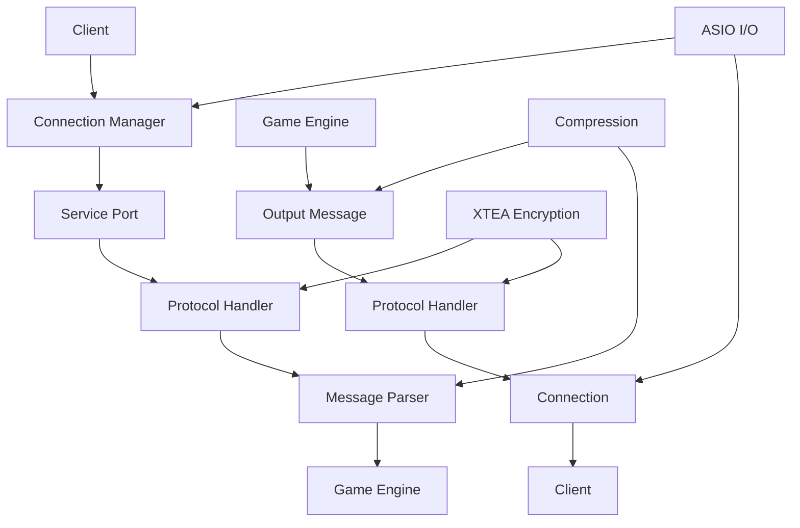

# Sistema de Rede do Canary

> [!info] **Sobre este Guia**
> Este guia apresenta o sistema de rede do Canary, responsável por toda a comunicação cliente-servidor. Baseado na análise técnica da [[habdel/CANARY-004|CANARY-004]], este documento fornece uma compreensão profunda dos protocolos, conexões e gerenciamento de mensagens.

## 🎯 **Visão Geral do Sistema de Rede**

O sistema de rede do Canary é responsável por toda a comunicação cliente-servidor, incluindo conexões TCP, protocolos de comunicação, criptografia e gerenciamento de mensagens.

### **Características do Sistema de Rede**
- **Protocolos Múltiplos**: Login, Game, Status
- **Criptografia XTEA**: Segurança robusta
- **Compressão**: Otimização de banda
- **Async I/O**: Performance alta
- **Thread Safety**: Operações concorrentes seguras

## 🏗️ **Arquitetura do Sistema de Rede**

### **Estrutura de Diretórios**

```
📁 canary/src/server/network/
├── 📁 connection/          # Gerenciamento de conexões
│   ├── connection.hpp      # Classe Connection principal
│   └── connection.cpp      # Implementação de conexões
├── 📁 protocol/            # Protocolos de comunicação
│   ├── protocol.hpp        # Classe Protocol base
│   ├── protocolgame.hpp    # Protocolo do jogo
│   ├── protocollogin.hpp   # Protocolo de login
│   └── protocolstatus.hpp  # Protocolo de status
├── 📁 message/             # Sistema de mensagens
│   ├── networkmessage.hpp  # Mensagens de rede
│   └── outputmessage.hpp   # Mensagens de saída
└── 📁 webhook/             # Webhooks (futuro)
```

### **Diagrama da Arquitetura**



## 🔧 **Componentes Principais**

### **1. Connection Manager**

**Localização**: `canary/src/server/network/connection/connection.hpp`

**Responsabilidades**:
- Gerenciamento de conexões
- Pool de conexões
- Singleton pattern
- Cleanup automático

**Estrutura Principal**:
```cpp
class ConnectionManager {
public:
    static ConnectionManager &getInstance();
    Connection_ptr createConnection(asio::io_service &io_service, 
                                  const ConstServicePort_ptr &servicePort);
    void releaseConnection(const Connection_ptr &connection);
    void closeAll();
private:
    phmap::parallel_flat_hash_set_m<Connection_ptr> connections;
};
```

### **2. Connection Class**

**Localização**: `canary/src/server/network/connection/connection.hpp`

**Responsabilidades**:
- Socket TCP
- Timers de controle
- Thread safety
- Message queue
- Protocol handling

**Estrutura Principal**:
```cpp
class Connection : public std::enable_shared_from_this<Connection> {
public:
    Connection(asio::io_service &initIoService, 
              ConstServicePort_ptr initservicePort);
    
    void close(bool force = false);
    void accept(Protocol_ptr protocolPtr);
    void send(const OutputMessage_ptr &outputMessage);
    uint32_t getIP();
    
private:
    void parseProxyIdentification(const std::error_code &error);
    void parseHeader(const std::error_code &error);
    void parsePacket(const std::error_code &error);
    void onWriteOperation(const std::error_code &error);
    
    asio::ip::tcp::socket socket;
    asio::high_resolution_timer readTimer;
    asio::high_resolution_timer writeTimer;
    std::recursive_mutex connectionLock;
    std::list<OutputMessage_ptr> messageQueue;
};
```

### **3. Protocol System**

**Localização**: `canary/src/server/network/protocol/protocol.hpp`

**Responsabilidades**:
- Criptografia XTEA
- Compressão
- Checksums
- Sequence numbers
- Protocol inheritance

**Estrutura Principal**:
```cpp
class Protocol : public std::enable_shared_from_this<Protocol> {
public:
    explicit Protocol(const Connection_ptr &initConnection);
    
    virtual void parsePacket(NetworkMessage &) { }
    virtual void onRecvFirstMessage(NetworkMessage &msg) = 0;
    virtual void sendLoginChallenge() { }
    
    void enableXTEAEncryption();
    void setXTEAKey(const uint32_t* newKey);
    void setChecksumMethod(ChecksumMethods_t method);
    
    OutputMessage_ptr getOutputBuffer(int32_t size);
    void send(OutputMessage_ptr msg) const;
    
protected:
    void XTEA_transform(uint8_t* buffer, size_t messageLength, bool encrypt) const;
    bool compression(OutputMessage &msg) const;
    
private:
    std::array<uint32_t, 4> key = {};
    uint32_t serverSequenceNumber = 0;
    uint32_t clientSequenceNumber = 0;
    ChecksumMethods_t checksumMethod = CHECKSUM_METHOD_NONE;
    bool encryptionEnabled = false;
    bool rawMessages = false;
};
```

### **4. Network Message System**

**Localização**: `canary/src/server/network/message/networkmessage.hpp`

**Responsabilidades**:
- Buffer management
- Type safety
- Position tracking
- Overflow protection
- Serialization

**Estrutura Principal**:
```cpp
class NetworkMessage {
public:
    using MsgSize_t = uint16_t;
    static constexpr MsgSize_t INITIAL_BUFFER_POSITION = 7;
    
    // Reading methods
    uint8_t getByte(bool suppresLog = false);
    template <typename T> T get();
    std::string getString(uint16_t stringLen = 0);
    Position getPosition();
    
    // Writing methods
    void addByte(uint8_t value);
    template <typename T> void add(T value);
    void addString(const std::string &value);
    void addPosition(const Position &pos);
    
    // Buffer management
    MsgSize_t getLength() const;
    void setLength(MsgSize_t newLength);
    bool canAdd(size_t size) const;
    bool canRead(int32_t size) const;
    
private:
    struct NetworkMessageInfo {
        MsgSize_t length = 0;
        MsgSize_t position = INITIAL_BUFFER_POSITION;
        bool overrun = false;
    };
    
    NetworkMessageInfo info;
    std::array<uint8_t, NETWORKMESSAGE_MAXSIZE> buffer = {};
};
```

## 🔐 **Sistema de Segurança**

### **Criptografia XTEA**

**Características**:
- **Algoritmo XTEA**: Criptografia simétrica
- **Chave de 128 bits**: 4 valores uint32_t
- **Bidirecional**: Criptografia e descriptografia
- **Performance**: Otimizado para jogos online

**Implementação**:
```cpp
void XTEA_transform(uint8_t* buffer, size_t messageLength, bool encrypt) const;
void XTEA_encrypt(OutputMessage &msg) const;
bool XTEA_decrypt(NetworkMessage &msg) const;
```

### **Compressão**

**Características**:
- **Zlib**: Compressão de dados
- **Redução de banda**: Economia de largura de banda
- **Configurável**: Pode ser habilitada/desabilitada
- **Performance**: Balanceamento entre compressão e CPU

**Implementação**:
```cpp
bool compression(OutputMessage &msg) const;
```

## 📡 **Protocolos Específicos**

### **1. ProtocolGame**

- **Localização**: `canary/src/server/network/protocol/protocolgame.hpp`
- **Função**: Protocolo principal do jogo
- **Recursos**: 
  - Gerenciamento de jogadores
  - Atualizações de mapa
  - Sistema de combate
  - Chat e comunicação

### **2. ProtocolLogin**

- **Localização**: `canary/src/server/network/protocol/protocollogin.hpp`
- **Função**: Autenticação de usuários
- **Recursos**:
  - Validação de credenciais
  - Lista de servidores
  - Informações de personagens

### **3. ProtocolStatus**

- **Localização**: `canary/src/server/network/protocol/protocolstatus.hpp`
- **Função**: Status do servidor
- **Recursos**:
  - Informações de uptime
  - Estatísticas de jogadores
  - Status de conectividade

## ⚡ **Performance e Otimizações**

### **1. ASIO Integration**

**Benefícios**:
- **Async I/O**: Operações assíncronas
- **High performance**: Biblioteca otimizada
- **Cross-platform**: Suporte multiplataforma
- **Event-driven**: Baseado em eventos

**Implementação**:
```cpp
asio::ip::tcp::socket socket;
asio::high_resolution_timer readTimer;
asio::high_resolution_timer writeTimer;
```

### **2. Memory Management**

**Benefícios**:
- **Smart pointers**: Gerenciamento automático de memória
- **Buffer pooling**: Reutilização de buffers
- **Zero-copy**: Minimização de cópias
- **Memory safety**: Proteção contra vazamentos

**Implementação**:
```cpp
std::list<OutputMessage_ptr> messageQueue;
std::array<uint8_t, NETWORKMESSAGE_MAXSIZE> buffer = {};
```

### **3. Thread Safety**

**Benefícios**:
- **Concurrent access**: Acesso concorrente seguro
- **Lock-free operations**: Operações sem bloqueio
- **Scalability**: Escalabilidade com múltiplas threads
- **Deadlock prevention**: Prevenção de deadlocks

**Implementação**:
```cpp
std::recursive_mutex connectionLock;
phmap::parallel_flat_hash_set_m<Connection_ptr> connections;
```

## 🔧 **APIs Principais**

### **Connection Management**

#### **Nível Básico**
```cpp
// Criar conexão
Connection_ptr conn = ConnectionManager::getInstance()
    .createConnection(io_service, servicePort);

// Enviar mensagem
conn->send(outputMessage);

// Fechar conexão
conn->close();
```

#### **Nível Intermediário**
```cpp
// Gerenciamento de múltiplas conexões
class ConnectionPool {
private:
    std::vector<Connection_ptr> connections;
    
public:
    Connection_ptr getConnection() {
        // Implementar pool de conexões
        return nullptr;
    }
    
    void releaseConnection(Connection_ptr conn) {
        // Retornar conexão ao pool
    }
};
```

#### **Nível Avançado**
```cpp
// Sistema de load balancing
class LoadBalancer {
private:
    std::vector<Connection_ptr> connections;
    std::atomic<size_t> currentIndex{0};
    
public:
    Connection_ptr getNextConnection() {
        size_t index = currentIndex.fetch_add(1) % connections.size();
        return connections[index];
    }
    
    void addConnection(Connection_ptr conn) {
        connections.push_back(conn);
    }
};
```

### **Protocol Handling**

#### **Nível Básico**
```cpp
// Criar protocolo
Protocol_ptr protocol = std::make_shared<ProtocolGame>(connection);

// Aceitar protocolo
connection->accept(protocol);

// Habilitar criptografia
protocol->enableXTEAEncryption();
```

#### **Nível Intermediário**
```cpp
// Protocolo customizado
class CustomProtocol : public Protocol {
public:
    explicit CustomProtocol(const Connection_ptr &connection)
        : Protocol(connection) {}
    
    void onRecvFirstMessage(NetworkMessage &msg) override {
        // Implementar lógica customizada
        uint8_t opcode = msg.getByte();
        
        switch (opcode) {
            case 0x01:
                handleCustomMessage(msg);
                break;
            default:
                Protocol::onRecvFirstMessage(msg);
                break;
        }
    }
    
private:
    void handleCustomMessage(NetworkMessage &msg) {
        // Implementar tratamento de mensagem customizada
    }
};
```

#### **Nível Avançado**
```cpp
// Sistema de protocolos dinâmicos
class ProtocolFactory {
private:
    std::map<std::string, std::function<Protocol_ptr(Connection_ptr)>> protocols;
    
public:
    template<typename T>
    void registerProtocol(const std::string &name) {
        protocols[name] = [](Connection_ptr conn) {
            return std::make_shared<T>(conn);
        };
    }
    
    Protocol_ptr createProtocol(const std::string &name, Connection_ptr conn) {
        auto it = protocols.find(name);
        if (it != protocols.end()) {
            return it->second(conn);
        }
        return nullptr;
    }
};
```

### **Message Creation**

#### **Nível Básico**
```cpp
// Criar mensagem de saída
OutputMessage_ptr msg = protocol->getOutputBuffer(1024);

// Adicionar dados
msg->addByte(0x01);
msg->addString("Hello World");
msg->addPosition(Position(100, 100, 7));

// Enviar mensagem
protocol->send(msg);
```

#### **Nível Intermediário**
```cpp
// Sistema de mensagens tipadas
class TypedMessage {
private:
    OutputMessage_ptr msg;
    
public:
    explicit TypedMessage(Protocol_ptr protocol, size_t size = 1024)
        : msg(protocol->getOutputBuffer(size)) {}
    
    TypedMessage& addOpcode(uint8_t opcode) {
        msg->addByte(opcode);
        return *this;
    }
    
    TypedMessage& addString(const std::string &text) {
        msg->addString(text);
        return *this;
    }
    
    TypedMessage& addPosition(const Position &pos) {
        msg->addPosition(pos);
        return *this;
    }
    
    void send(Protocol_ptr protocol) {
        protocol->send(msg);
    }
};

// Uso
TypedMessage(protocol)
    .addOpcode(0x01)
    .addString("Hello World")
    .addPosition(Position(100, 100, 7))
    .send(protocol);
```

#### **Nível Avançado**
```cpp
// Sistema de mensagens com templates
template<typename... Args>
class MessageBuilder {
private:
    OutputMessage_ptr msg;
    
public:
    explicit MessageBuilder(Protocol_ptr protocol, size_t size = 1024)
        : msg(protocol->getOutputBuffer(size)) {}
    
    template<typename T>
    MessageBuilder& add(const T &value) {
        msg->add(value);
        return *this;
    }
    
    template<typename T, typename... Rest>
    MessageBuilder& add(const T &value, const Rest&... rest) {
        msg->add(value);
        return add(rest...);
    }
    
    void send(Protocol_ptr protocol) {
        protocol->send(msg);
    }
};

// Uso
MessageBuilder(protocol)
    .add(uint8_t(0x01), "Hello World", Position(100, 100, 7))
    .send(protocol);
```

### **Message Parsing**

#### **Nível Básico**
```cpp
// Receber mensagem
NetworkMessage &msg = /* received message */;

// Ler dados
uint8_t opcode = msg.getByte();
std::string text = msg.getString();
Position pos = msg.getPosition();
```

#### **Nível Intermediário**
```cpp
// Parser de mensagens com validação
class MessageParser {
private:
    NetworkMessage &msg;
    
public:
    explicit MessageParser(NetworkMessage &message) : msg(message) {}
    
    uint8_t getOpcode() {
        if (!msg.canRead(1)) {
            throw std::runtime_error("Insufficient data for opcode");
        }
        return msg.getByte();
    }
    
    std::string getString(uint16_t maxLength = 255) {
        uint16_t length = msg.get<uint16_t>();
        if (length > maxLength) {
            throw std::runtime_error("String too long");
        }
        return msg.getString(length);
    }
    
    Position getPosition() {
        if (!msg.canRead(5)) { // 2 bytes x + 2 bytes y + 1 byte z
            throw std::runtime_error("Insufficient data for position");
        }
        return msg.getPosition();
    }
};
```

#### **Nível Avançado**
```cpp
// Sistema de parsing com callbacks
class MessageHandler {
private:
    std::map<uint8_t, std::function<void(NetworkMessage&)>> handlers;
    
public:
    template<typename T>
    void registerHandler(uint8_t opcode, T handler) {
        handlers[opcode] = handler;
    }
    
    void handleMessage(NetworkMessage &msg) {
        uint8_t opcode = msg.getByte();
        
        auto it = handlers.find(opcode);
        if (it != handlers.end()) {
            it->second(msg);
        } else {
            // Handler padrão ou erro
            throw std::runtime_error("Unknown opcode: " + std::to_string(opcode));
        }
    }
};

// Uso
MessageHandler handler;
handler.registerHandler(0x01, [](NetworkMessage &msg) {
    std::string text = msg.getString();
    // Processar mensagem
});
```

## 📊 **Métricas de Performance**

### **Capacidades do Sistema**
- **Conexões simultâneas**: 10,000+ (teórico)
- **Mensagens por segundo**: 100,000+ (por conexão)
- **Latência**: < 50ms (local)
- **Throughput**: 100+ MB/s (agregado)

### **Otimizações Implementadas**
- **Buffer pooling**: Reutilização de buffers
- **Zero-copy**: Minimização de cópias de memória
- **Async I/O**: Operações não-bloqueantes
- **Compression**: Redução de largura de banda
- **Encryption**: Segurança sem impacto significativo

## 🔗 **Integração com Outros Sistemas**

### **1. Game Engine**
- **Input/Output**: Recebe comandos e envia atualizações
- **State synchronization**: Sincronização de estado do jogo
- **Event propagation**: Propagação de eventos

### **2. Database System**
- **Player data**: Dados de jogadores
- **Game state**: Estado do jogo persistente
- **Logging**: Logs de atividades

### **3. Lua Scripting**
- **Network events**: Eventos de rede para scripts
- **Message handling**: Manipulação de mensagens
- **Protocol extensions**: Extensões de protocolo

## 🚀 **Comparação com OTClient**

### **Similaridades**
- **Protocol structure**: Estrutura similar de protocolos
- **Message handling**: Manipulação de mensagens
- **Encryption**: Uso de criptografia
- **Async operations**: Operações assíncronas

### **Diferenças**
- **Server vs Client**: Canary é servidor, OTClient é cliente
- **Connection management**: Gerenciamento de múltiplas conexões
- **Protocol complexity**: Protocolos mais complexos no servidor
- **Performance focus**: Foco em throughput vs latência

## 🛠️ **Exemplos Práticos**

### **Exemplo 1: Servidor de Echo Simples**

```cpp
class EchoProtocol : public Protocol {
public:
    explicit EchoProtocol(const Connection_ptr &connection)
        : Protocol(connection) {}
    
    void onRecvFirstMessage(NetworkMessage &msg) override {
        // Ler mensagem
        std::string received = msg.getString();
        
        // Criar resposta
        OutputMessage_ptr response = getOutputBuffer(1024);
        response->addString("Echo: " + received);
        
        // Enviar resposta
        send(response);
    }
};
```

### **Exemplo 2: Sistema de Chat**

```cpp
class ChatProtocol : public Protocol {
public:
    explicit ChatProtocol(const Connection_ptr &connection)
        : Protocol(connection) {}
    
    void onRecvFirstMessage(NetworkMessage &msg) override {
        uint8_t opcode = msg.getByte();
        
        switch (opcode) {
            case 0x01: // Mensagem de chat
                handleChatMessage(msg);
                break;
            case 0x02: // Join channel
                handleJoinChannel(msg);
                break;
            default:
                // Opcode desconhecido
                break;
        }
    }
    
private:
    void handleChatMessage(NetworkMessage &msg) {
        std::string channel = msg.getString();
        std::string message = msg.getString();
        
        // Broadcast para todos no canal
        broadcastToChannel(channel, message);
    }
    
    void handleJoinChannel(NetworkMessage &msg) {
        std::string channel = msg.getString();
        joinChannel(channel);
    }
};
```

### **Exemplo 3: Sistema de Autenticação**

```cpp
class AuthProtocol : public Protocol {
public:
    explicit AuthProtocol(const Connection_ptr &connection)
        : Protocol(connection) {}
    
    void onRecvFirstMessage(NetworkMessage &msg) override {
        uint8_t opcode = msg.getByte();
        
        switch (opcode) {
            case 0x01: // Login
                handleLogin(msg);
                break;
            case 0x02: // Logout
                handleLogout(msg);
                break;
            default:
                sendError("Unknown opcode");
                break;
        }
    }
    
private:
    void handleLogin(NetworkMessage &msg) {
        std::string username = msg.getString();
        std::string password = msg.getString();
        
        if (authenticateUser(username, password)) {
            sendSuccess("Login successful");
        } else {
            sendError("Invalid credentials");
        }
    }
    
    void handleLogout(NetworkMessage &msg) {
        // Implementar logout
        sendSuccess("Logout successful");
    }
    
    void sendSuccess(const std::string &message) {
        OutputMessage_ptr response = getOutputBuffer(1024);
        response->addByte(0x01); // Success opcode
        response->addString(message);
        send(response);
    }
    
    void sendError(const std::string &message) {
        OutputMessage_ptr response = getOutputBuffer(1024);
        response->addByte(0x02); // Error opcode
        response->addString(message);
        send(response);
    }
};
```

## 🔍 **Troubleshooting**

### **Problemas Comuns**

1. **Erro de Conexão**
   - Verificar portas disponíveis
   - Validar firewall
   - Verificar configurações de rede

2. **Erro de Criptografia**
   - Verificar chaves XTEA
   - Validar sequence numbers
   - Verificar configuração de criptografia

3. **Erro de Performance**
   - Verificar buffer sizes
   - Validar compressão
   - Monitorar uso de memória

### **Debug e Logs**

```cpp
// Habilitar logs de rede
logger.setLevel(LogLevel::DEBUG);

// Monitorar conexões
size_t activeConnections = ConnectionManager::getInstance().getConnectionCount();
logger.info("Active connections: {}", activeConnections);

// Verificar performance
auto start = std::chrono::high_resolution_clock::now();
// ... operação de rede ...
auto end = std::chrono::high_resolution_clock::now();
auto duration = std::chrono::duration_cast<std::chrono::microseconds>(end - start);
logger.debug("Network operation took: {} microseconds", duration.count());
```

## 📖 **Próximos Passos**

### **Leitura Recomendada**

1. [[canary_sistema_ui|Sistema de UI]] - Interfaces do usuário
2. [[canary_sistema_modulos|Sistema de Módulos]] - Extensibilidade
3. [[canary_arquitetura_core|Arquitetura Core]] - Componentes fundamentais
4. [[canary_fundamentos|Fundamentos do Canary]] - Visão geral

### **Recursos Adicionais**

- [[wikipedia_canary_otclient|Wikipedia Canary + OTClient]] - Visão geral completa
- [[guia_navegacao|Guia de Navegação]] - Como navegar pela documentação
- [[glossario_tecnico|Glossário Técnico]] - Termos e conceitos

## 🎯 **Conclusão**

O sistema de rede do Canary demonstra uma arquitetura robusta e bem projetada, com foco em performance, segurança e escalabilidade. O sistema utiliza tecnologias modernas como ASIO para I/O assíncrono, criptografia XTEA para segurança, e compressão para otimização de banda.

### **✅ Principais Descobertas**
1. **Arquitetura modular**: Sistema bem estruturado e extensível
2. **Performance otimizada**: Uso de técnicas avançadas de otimização
3. **Segurança robusta**: Sistema de criptografia e validação
4. **Escalabilidade**: Preparado para alta carga
5. **Compatibilidade**: Compatível com protocolos OTClient

### **📈 Impacto no Projeto**
- **Compreensão profunda**: Entendimento completo do sistema de rede
- **Base para integração**: Fundamentos para integração OTClient-Canary
- **Documentação técnica**: Base sólida para desenvolvimento futuro
- **Metodologia validada**: Confirmação da eficácia da metodologia Habdel

Esta base sólida permite o desenvolvimento de sistemas de comunicação robustos e escaláveis, formando a base para a integração completa com o OTClient e criação de um ecossistema unificado de desenvolvimento de jogos MMORPG.

---

**Tags**: #canary #rede #protocolo #comunicação #cliente-servidor #criptografia #asio  
**Nível**: Intermediate  
**Tempo Estimado**: 60 minutos  
**Próximo**: [[canary_sistema_ui|Sistema de UI]] 