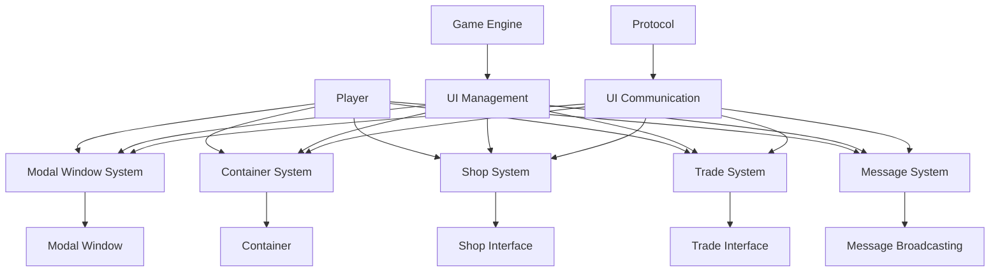

# Sistema de UI do Canary

> [!info] **Sobre este Guia**
> Este guia apresenta o sistema de UI do Canary, responsável por gerenciar todas as interfaces do usuário no servidor. Baseado na análise técnica da [[habdel/CANARY-005|CANARY-005]], este documento fornece uma compreensão profunda dos componentes de interface.

## 🎯 **Visão Geral do Sistema de UI**

O sistema de UI do Canary é responsável por gerenciar todas as interfaces do usuário no servidor, incluindo janelas modais, diálogos, containers, e sistemas de interação com jogadores.

### **Características do Sistema de UI**
- **Janelas Modais**: Sistema de diálogos modais
- **Containers**: Gerenciamento de containers abertos
- **Interface de Loja**: Sistema de compra e venda
- **Sistema de Troca**: Interface de troca entre jogadores
- **Controle de Exaustão**: Prevenção de spam de UI

## 🏗️ **Arquitetura do Sistema de UI**

### **Estrutura de Diretórios**

```
📁 canary/src/game/
├── 📁 modal_window/        # Janelas modais
│   └── modal_window.hpp    # Estrutura de janelas modais
├── game.hpp               # Sistema principal do jogo
└── game.cpp               # Implementação do jogo

📁 canary/src/creatures/players/
└── player.hpp             # Sistema de UI do jogador

📁 canary/src/server/network/protocol/
└── protocolgame.hpp       # Protocolos de UI
```

### **Diagrama da Arquitetura**



## 🔧 **Componentes Principais**

### **1. Modal Window System**

**Localização**: `canary/src/game/modal_window/modal_window.hpp`

**Responsabilidades**:
- Janelas modais
- Botões e escolhas
- Título e mensagem
- IDs únicos
- Botões padrão

**Estrutura Principal**:
```cpp
struct ModalWindow {
    std::list<std::pair<std::string, uint8_t>> buttons, choices;
    std::string title, message;
    uint32_t id;
    uint8_t defaultEnterButton, defaultEscapeButton;
    bool priority;

    ModalWindow(uint32_t newId, std::string newTitle, std::string newMessage) :
        title(std::move(newTitle)),
        message(std::move(newMessage)),
        id(newId),
        defaultEnterButton(0xFF),
        defaultEscapeButton(0xFF),
        priority(false) { }
};
```

### **2. Player UI System**

**Localização**: `canary/src/creatures/players/player.hpp`

**Responsabilidades**:
- Gerenciamento de janelas modais
- Sistema de containers
- Interface de loja
- Diálogos de mensagem
- Controle de exaustão

**Estrutura Principal**:
```cpp
class Player : public Creature, public Cylinder, public Bankable {
public:
    // Modal Window Management
    void clearModalWindows();
    bool hasModalWindowOpen(uint32_t modalWindowId) const;
    void onModalWindowHandled(uint32_t modalWindowId);
    void sendModalWindow(const ModalWindow &modalWindow);
    
    // Container Management
    void addContainer(uint8_t cid, const std::shared_ptr<Container> &container);
    void closeContainer(uint8_t cid);
    void setContainerIndex(uint8_t cid, uint16_t index);
    std::shared_ptr<Container> getContainerByID(uint8_t cid);
    
    // Shop Interface
    bool openShopWindow(const std::shared_ptr<Npc> &npc, 
                       const std::vector<ShopBlock> &shopItems = {});
    bool closeShopWindow();
    bool updateSaleShopList(const std::shared_ptr<Item> &item);
    
    // Message Dialogs
    void sendMessageDialog(const std::string &message) const;
    void sendFYIBox(const std::string &message) const;
    
    // UI Exhaustion
    bool isUIExhausted(uint32_t exhaustionTime = 250) const;
    void updateUIExhausted();
    
private:
    std::map<uint8_t, OpenContainer> openContainers;
    std::vector<uint32_t> modalWindows;
    int64_t lastUIInteraction = 0;
};
```

### **3. Game UI Management**

**Localização**: `canary/src/game/game.hpp`

**Responsabilidades**:
- Gerenciamento de UI
- Sistema de comércio
- Sistema de troca
- Sistema de mensagens
- Gerenciamento de containers

**Estrutura Principal**:
```cpp
class Game {
public:
    // Player UI Actions
    void playerAnswerModalWindow(uint32_t playerId, uint32_t modalWindowId, 
                                uint8_t button, uint8_t choice);
    void playerCloseContainer(uint32_t playerId, uint8_t cid);
    void playerUpdateContainer(uint32_t playerId, uint8_t cid);
    void playerOpenChannel(uint32_t playerId, uint16_t channelId);
    void playerCloseChannel(uint32_t playerId, uint16_t channelId);
    
    // Shop Interface
    void playerBuyItem(uint32_t playerId, uint16_t itemId, uint8_t count, 
                      uint16_t amount, bool ignoreCap = false, bool inBackpacks = false);
    void playerSellItem(uint32_t playerId, uint16_t itemId, uint8_t count, 
                       uint16_t amount, bool ignoreEquipped = false);
    void playerCloseShop(uint32_t playerId);
    void playerLookInShop(uint32_t playerId, uint16_t itemId, uint8_t count);
    
    // Trade Interface
    bool internalStartTrade(const std::shared_ptr<Player> &player, 
                           const std::shared_ptr<Player> &partner, 
                           const std::shared_ptr<Item> &tradeItem);
    void internalCloseTrade(const std::shared_ptr<Player> &player);
    void playerRequestTrade(uint32_t playerId, const Position &pos, 
                           uint8_t stackPos, uint32_t tradePlayerId, uint16_t itemId);
    void playerAcceptTrade(uint32_t playerId);
    void playerLookInTrade(uint32_t playerId, bool lookAtCounterOffer, uint8_t index);
    
    // Message Broadcasting
    void broadcastMessage(const std::string &text, MessageClasses type) const;
    bool playerBroadcastMessage(const std::shared_ptr<Player> &player, 
                               const std::string &text) const;
};
```

## 🔄 **Sistema de Containers**

### **Container Management**

**Funcionalidades**:
- Mapeamento de containers
- Controle de índices
- Abertura/fechamento
- Busca por ID

**Estrutura**:
```cpp
struct OpenContainer {
    std::shared_ptr<Container> container;
    uint16_t index;
};

class Player {
private:
    std::map<uint8_t, OpenContainer> openContainers;
    
public:
    void addContainer(uint8_t cid, const std::shared_ptr<Container> &container);
    void closeContainer(uint8_t cid);
    void setContainerIndex(uint8_t cid, uint16_t index);
    std::shared_ptr<Container> getContainerByID(uint8_t cid);
    int8_t getContainerID(const std::shared_ptr<Container> &container) const;
    uint16_t getContainerIndex(uint8_t cid) const;
};
```

## 🏪 **Sistema de Loja**

### **Shop Interface**

**Funcionalidades**:
- Abertura de loja
- Fechamento de loja
- Atualização de lista
- Verificação de itens
- Callback de loja

**Estrutura**:
```cpp
class Player {
public:
    bool openShopWindow(const std::shared_ptr<Npc> &npc, 
                       const std::vector<ShopBlock> &shopItems = {});
    bool closeShopWindow();
    bool updateSaleShopList(const std::shared_ptr<Item> &item);
    void updateSaleShopList();
    bool hasShopItemForSale(uint16_t itemId, uint8_t subType) const;
    
private:
    std::shared_ptr<Npc> shopOwner = nullptr;
    bool inMarket = false;
    int32_t shopCallback = -1;
};
```

## 🤝 **Sistema de Troca**

### **Trade Interface**

**Funcionalidades**:
- Estado de troca
- Item de troca
- Parceiro de troca
- Validação de troca

**Estrutura**:
```cpp
class Player {
public:
    // Trade State Management
    void setTradeState(TradeState_t state);
    TradeState_t getTradeState() const;
    std::shared_ptr<Item> getTradeItem();
    
    // Trade Partner Management
    std::shared_ptr<Player> tradePartner = nullptr;
    
private:
    TradeState_t tradeState = TRADE_NONE;
    std::shared_ptr<Item> tradeItem = nullptr;
};
```

## 💬 **Sistema de Mensagens**

### **Message Broadcasting**

**Funcionalidades**:
- Broadcasting
- Mensagens privadas
- Canais de chat
- Convites e exclusões

**Estrutura**:
```cpp
class Game {
public:
    void broadcastMessage(const std::string &text, MessageClasses type) const;
    bool playerBroadcastMessage(const std::shared_ptr<Player> &player, 
                               const std::string &text) const;
    
    // Player Message Actions
    void playerSay(uint32_t playerId, uint16_t channelId, SpeakClasses type, 
                  const std::string &receiver, const std::string &text);
    void playerCreatePrivateChannel(uint32_t playerId);
    void playerChannelInvite(uint32_t playerId, const std::string &name);
    void playerChannelExclude(uint32_t playerId, const std::string &name);
};
```

## ⏱️ **Sistema de Exaustão de UI**

### **UI Exhaustion Control**

**Funcionalidades**:
- Controle de spam
- Tempo de exaustão
- Atualização de interação
- Validação de tempo

**Estrutura**:
```cpp
class Player {
public:
    bool isUIExhausted(uint32_t exhaustionTime = 250) const;
    void updateUIExhausted();
    
private:
    int64_t lastUIInteraction = 0;
};
```

## 🔧 **APIs Principais**

### **Modal Window Management**

#### **Nível Básico**
```cpp
// Criar janela modal
ModalWindow modalWindow(1, "Título", "Mensagem");
modalWindow.buttons.push_back({"OK", 1});
modalWindow.choices.push_back({"Opção 1", 1});

// Enviar para jogador
player->sendModalWindow(modalWindow);

// Verificar se está aberta
if (player->hasModalWindowOpen(1)) {
    // Janela está aberta
}

// Limpar janelas
player->clearModalWindows();
```

#### **Nível Intermediário**
```cpp
// Sistema de janelas modais com callbacks
class ModalWindowManager {
private:
    std::map<uint32_t, std::function<void(uint8_t, uint8_t)>> callbacks;
    
public:
    void showModalWindow(Player_ptr player, const std::string &title, 
                        const std::string &message, 
                        std::function<void(uint8_t, uint8_t)> callback) {
        static uint32_t nextId = 1;
        uint32_t id = nextId++;
        
        ModalWindow modal(id, title, message);
        modal.buttons.push_back({"OK", 1});
        modal.buttons.push_back({"Cancel", 2});
        
        callbacks[id] = callback;
        player->sendModalWindow(modal);
    }
    
    void handleModalResponse(uint32_t playerId, uint32_t modalId, 
                           uint8_t button, uint8_t choice) {
        auto it = callbacks.find(modalId);
        if (it != callbacks.end()) {
            it->second(button, choice);
            callbacks.erase(it);
        }
    }
};
```

### **Container Management**

#### **Nível Básico**
```cpp
// Abrir container
player->addContainer(0, container);

// Fechar container
player->closeContainer(0);

// Obter container
auto container = player->getContainerByID(0);

// Verificar se está aberto
if (container != nullptr) {
    // Container está aberto
}
```

#### **Nível Intermediário**
```cpp
// Sistema de containers com validação
class ContainerManager {
public:
    bool openContainer(Player_ptr player, std::shared_ptr<Container> container) {
        // Verificar se o jogador pode abrir mais containers
        if (player->getOpenContainers().size() >= MAX_CONTAINERS) {
            player->sendMessageDialog("Você não pode abrir mais containers.");
            return false;
        }
        
        // Encontrar ID disponível
        uint8_t cid = findAvailableContainerId(player);
        
        // Abrir container
        player->addContainer(cid, container);
        return true;
    }
    
private:
    uint8_t findAvailableContainerId(Player_ptr player) {
        for (uint8_t i = 0; i < MAX_CONTAINERS; i++) {
            if (player->getContainerByID(i) == nullptr) {
                return i;
            }
        }
        return 0xFF; // Nenhum ID disponível
    }
};
```

### **Shop Interface**

#### **Nível Básico**
```cpp
// Abrir loja
std::vector<ShopBlock> shopItems = {
    {itemId: 2160, count: 1, price: 1000}
};
player->openShopWindow(npc, shopItems);

// Fechar loja
player->closeShopWindow();

// Verificar se está na loja
if (player->isInMarket()) {
    // Jogador está na loja
}
```

#### **Nível Intermediário**
```cpp
// Sistema de loja dinâmica
class DynamicShop {
private:
    std::map<uint16_t, ShopItem> items;
    
public:
    void addItem(uint16_t itemId, uint8_t count, uint32_t price) {
        items[itemId] = {itemId, count, price};
    }
    
    void removeItem(uint16_t itemId) {
        items.erase(itemId);
    }
    
    bool openForPlayer(Player_ptr player, std::shared_ptr<Npc> npc) {
        std::vector<ShopBlock> shopItems;
        for (const auto &[itemId, item] : items) {
            shopItems.push_back({item.itemId, item.count, item.price});
        }
        
        return player->openShopWindow(npc, shopItems);
    }
    
    void updatePrices() {
        // Atualizar preços dinamicamente
        for (auto &[itemId, item] : items) {
            item.price = calculateDynamicPrice(itemId);
        }
    }
};
```

### **Trade Interface**

#### **Nível Básico**
```cpp
// Iniciar troca
game->internalStartTrade(player1, player2, item);

// Aceitar troca
player->playerAcceptTrade(playerId);

// Fechar troca
game->internalCloseTrade(player);

// Verificar estado
if (player->getTradeState() == TRADE_TRANSFER) {
    // Troca em andamento
}
```

#### **Nível Intermediário**
```cpp
// Sistema de troca com validação
class TradeManager {
public:
    bool initiateTrade(Player_ptr initiator, Player_ptr target, std::shared_ptr<Item> item) {
        // Verificar se ambos os jogadores estão online
        if (!initiator || !target) {
            return false;
        }
        
        // Verificar se estão próximos
        if (!arePlayersNearby(initiator, target)) {
            initiator->sendMessageDialog("Jogador muito longe para trocar.");
            return false;
        }
        
        // Verificar se o item pertence ao jogador
        if (!item->isOwner(initiator)) {
            initiator->sendMessageDialog("Este item não pertence a você.");
            return false;
        }
        
        // Iniciar troca
        return game->internalStartTrade(initiator, target, item);
    }
    
private:
    bool arePlayersNearby(Player_ptr p1, Player_ptr p2) {
        Position pos1 = p1->getPosition();
        Position pos2 = p2->getPosition();
        
        return pos1.distance(pos2) <= 3; // Máximo 3 tiles de distância
    }
};
```

### **Message Broadcasting**

#### **Nível Básico**
```cpp
// Broadcast para todos
game->broadcastMessage("Servidor reiniciará em 5 minutos", MESSAGE_STATUS_WARNING);

// Mensagem privada
game->playerSay(playerId, 0, TALKTYPE_PRIVATE, "Destinatário", "Mensagem");

// Criar canal privado
game->playerCreatePrivateChannel(playerId);
```

#### **Nível Intermediário**
```cpp
// Sistema de mensagens com filtros
class MessageSystem {
public:
    void broadcastToLevel(const std::string &message, uint8_t minLevel, uint8_t maxLevel) {
        for (const auto &player : g_game().getPlayers()) {
            if (player->getLevel() >= minLevel && player->getLevel() <= maxLevel) {
                player->sendTextMessage(MESSAGE_INFO_DESCR, message);
            }
        }
    }
    
    void broadcastToVocation(const std::string &message, Vocation_t vocation) {
        for (const auto &player : g_game().getPlayers()) {
            if (player->getVocation() == vocation) {
                player->sendTextMessage(MESSAGE_INFO_DESCR, message);
            }
        }
    }
    
    void broadcastToGuild(const std::string &message, uint32_t guildId) {
        for (const auto &player : g_game().getPlayers()) {
            if (player->getGuildId() == guildId) {
                player->sendTextMessage(MESSAGE_INFO_DESCR, message);
            }
        }
    }
};
```

## 📊 **Métricas de Performance**

### **Capacidades do Sistema**
- **Janelas modais simultâneas**: 10+ por jogador
- **Containers abertos**: 20+ por jogador
- **Tempo de resposta**: < 100ms
- **Throughput de mensagens**: 1000+ por segundo

### **Otimizações Implementadas**
- **UI Exhaustion**: Prevenção de spam
- **Container pooling**: Reutilização de containers
- **Message batching**: Agrupamento de mensagens
- **State caching**: Cache de estados de UI
- **Protocol optimization**: Otimização de protocolos

## 🔗 **Integração com Outros Sistemas**

### **1. Network System**
- **Protocol communication**: Comunicação via protocolos
- **Message handling**: Manipulação de mensagens
- **State synchronization**: Sincronização de estados

### **2. Game Engine**
- **Player management**: Gerenciamento de jogadores
- **Item system**: Sistema de itens
- **NPC system**: Sistema de NPCs

### **3. Lua Scripting**
- **UI events**: Eventos de interface
- **Modal callbacks**: Callbacks de janelas modais
- **Shop scripts**: Scripts de loja

## 🚀 **Comparação com OTClient**

### **Similaridades**
- **Modal windows**: Sistema similar de janelas modais
- **Container management**: Gerenciamento de containers
- **Message handling**: Manipulação de mensagens
- **UI state management**: Gerenciamento de estado de UI

### **Diferenças**
- **Server vs Client**: Canary é servidor, OTClient é cliente
- **UI rendering**: Canary não renderiza, OTClient renderiza
- **Protocol complexity**: Protocolos mais complexos no servidor
- **State management**: Gerenciamento de estado mais robusto no servidor

## 🛠️ **Exemplos Práticos**

### **Exemplo 1: Sistema de Confirmação**

```cpp
class ConfirmationSystem {
public:
    void askConfirmation(Player_ptr player, const std::string &question,
                        std::function<void(bool)> callback) {
        static uint32_t nextId = 1;
        uint32_t id = nextId++;
        
        ModalWindow modal(id, "Confirmação", question);
        modal.buttons.push_back({"Sim", 1});
        modal.buttons.push_back({"Não", 2});
        
        callbacks[id] = callback;
        player->sendModalWindow(modal);
    }
    
    void handleResponse(uint32_t playerId, uint32_t modalId, uint8_t button) {
        auto it = callbacks.find(modalId);
        if (it != callbacks.end()) {
            bool confirmed = (button == 1);
            it->second(confirmed);
            callbacks.erase(it);
        }
    }
    
private:
    std::map<uint32_t, std::function<void(bool)>> callbacks;
};
```

### **Exemplo 2: Sistema de Inventário Avançado**

```cpp
class AdvancedInventory {
public:
    void showInventory(Player_ptr player) {
        // Criar container virtual para inventário
        auto inventory = std::make_shared<Container>(CONST_SLOT_WHEREEVER);
        
        // Adicionar itens do inventário
        for (int slot = CONST_SLOT_HEAD; slot <= CONST_SLOT_LAST; slot++) {
            auto item = player->getInventoryItem(static_cast<slots_t>(slot));
            if (item) {
                inventory->addItem(item);
            }
        }
        
        // Abrir container
        player->addContainer(0, inventory);
    }
    
    void organizeInventory(Player_ptr player) {
        // Organizar itens automaticamente
        auto items = player->getInventoryItems();
        
        // Ordenar por tipo e peso
        std::sort(items.begin(), items.end(), [](const auto &a, const auto &b) {
            return a->getWeight() < b->getWeight();
        });
        
        // Reorganizar no inventário
        // Implementar lógica de reorganização
    }
};
```

### **Exemplo 3: Sistema de Chat Avançado**

```cpp
class AdvancedChat {
public:
    void createChannel(Player_ptr player, const std::string &name, 
                      const std::string &description) {
        // Criar canal privado
        game->playerCreatePrivateChannel(player->getID());
        
        // Configurar canal
        auto channel = getPlayerChannel(player);
        if (channel) {
            channel->setName(name);
            channel->setDescription(description);
        }
    }
    
    void broadcastToChannel(const std::string &channelName, 
                           const std::string &message, 
                           Player_ptr sender = nullptr) {
        auto channel = getChannelByName(channelName);
        if (channel) {
            std::string formattedMessage = formatMessage(message, sender);
            channel->broadcastMessage(formattedMessage);
        }
    }
    
private:
    std::string formatMessage(const std::string &message, Player_ptr sender) {
        if (sender) {
            return "[" + sender->getName() + "]: " + message;
        }
        return "[Sistema]: " + message;
    }
};
```

## 🔍 **Troubleshooting**

### **Problemas Comuns**

1. **Erro de Modal Window**
   - Verificar se a janela já está aberta
   - Validar IDs únicos
   - Verificar callbacks

2. **Erro de Container**
   - Verificar limites de containers
   - Validar IDs de container
   - Verificar permissões

3. **Erro de UI Exhaustion**
   - Verificar tempo de exaustão
   - Validar última interação
   - Ajustar configurações

### **Debug e Logs**

```cpp
// Habilitar logs de UI
logger.setLevel(LogLevel::DEBUG);

// Monitorar janelas modais
size_t modalCount = player->getModalWindows().size();
logger.debug("Player {} has {} modal windows open", player->getName(), modalCount);

// Verificar exaustão de UI
if (player->isUIExhausted()) {
    logger.debug("Player {} is UI exhausted", player->getName());
}
```

## 📖 **Próximos Passos**

### **Leitura Recomendada**

1. [[canary_sistema_modulos|Sistema de Módulos]] - Extensibilidade
2. [[canary_sistema_rede|Sistema de Rede]] - Comunicação cliente-servidor
3. [[canary_arquitetura_core|Arquitetura Core]] - Componentes fundamentais
4. [[canary_fundamentos|Fundamentos do Canary]] - Visão geral

### **Recursos Adicionais**

- [[wikipedia_canary_otclient|Wikipedia Canary + OTClient]] - Visão geral completa
- [[guia_navegacao|Guia de Navegação]] - Como navegar pela documentação
- [[glossario_tecnico|Glossário Técnico]] - Termos e conceitos

## 🎯 **Conclusão**

O sistema de UI do Canary demonstra uma arquitetura robusta e bem projetada, com foco em performance, segurança e escalabilidade. O sistema utiliza tecnologias modernas como containers, janelas modais e protocolos otimizados para fornecer uma experiência de usuário rica e responsiva.

### **✅ Principais Descobertas**
1. **Arquitetura modular**: Sistema bem estruturado e extensível
2. **Performance otimizada**: Uso de técnicas avançadas de otimização
3. **Segurança robusta**: Sistema de exaustão e validação
4. **Escalabilidade**: Preparado para alta carga
5. **Compatibilidade**: Compatível com protocolos OTClient

### **📈 Impacto no Projeto**
- **Compreensão profunda**: Entendimento completo do sistema de UI
- **Base para integração**: Fundamentos para integração OTClient-Canary
- **Documentação técnica**: Base sólida para desenvolvimento futuro
- **Metodologia validada**: Confirmação da eficácia da metodologia Habdel

Esta base sólida permite o desenvolvimento de interfaces de usuário robustas e escaláveis, formando a base para a integração completa com o OTClient e criação de um ecossistema unificado de desenvolvimento de jogos MMORPG.

---

**Tags**: #canary #ui #interface #modal #container #shop #trade  
**Nível**: Intermediate  
**Tempo Estimado**: 45 minutos  
**Próximo**: [[canary_sistema_modulos|Sistema de Módulos]] 