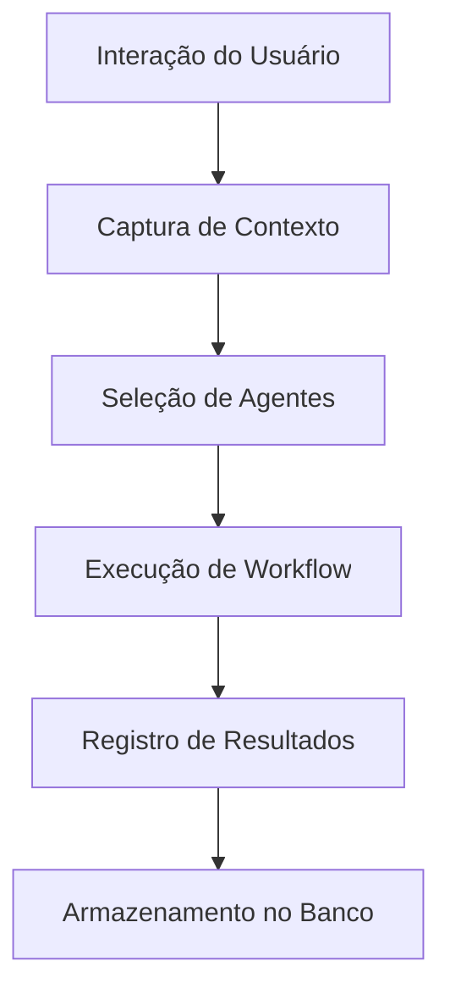
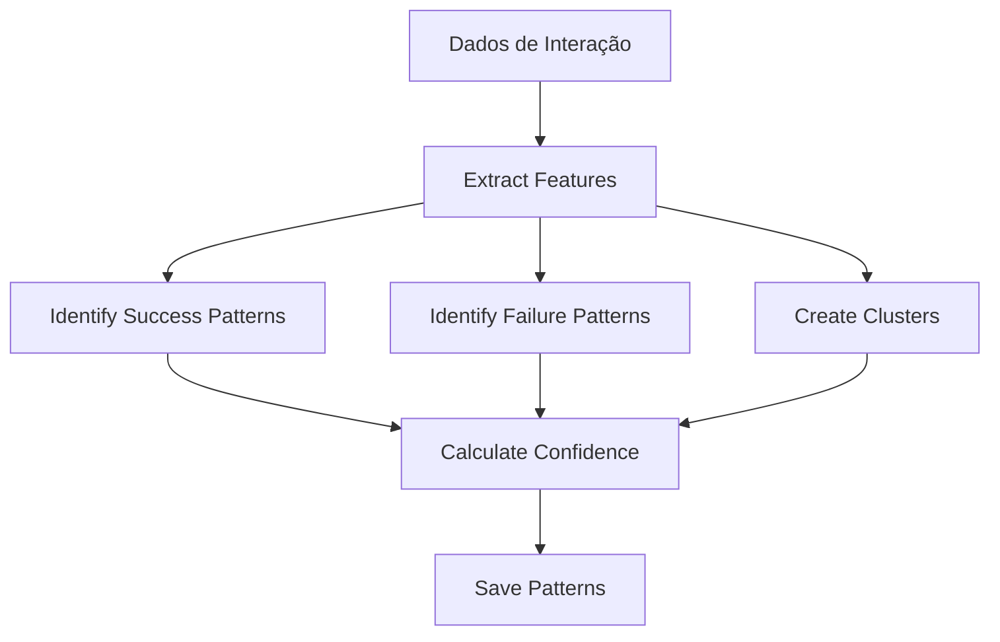
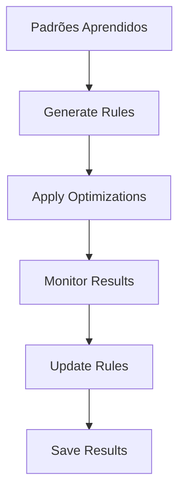
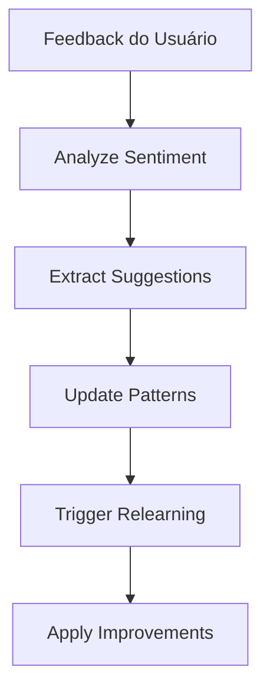

# Sistema de Auto-Aprendizado BMAD - Guia Completo

> [!info] **Sistema de Aprendizado Inteligente**
> O Sistema de Auto-Aprendizado BMAD é um componente avançado que permite ao sistema BMAD aprender automaticamente 
> com interações passadas, melhorar sua capacidade de detecção de contexto e otimizar workflows baseado em feedback contínuo.

## 📋 Índice

1. [Visão Geral](#visão-geral)
2. [Arquitetura do Sistema](#arquitetura-do-sistema)
3. [Componentes Principais](#componentes-principais)
4. [Workflow de Aprendizado](#workflow-de-aprendizado)
5. [Configuração e Uso](#configuração-e-uso)
6. [Monitoramento e Métricas](#monitoramento-e-métricas)
7. [Integração com BMAD](#integração-com-bmad)
8. [Troubleshooting](#troubleshooting)
9. [Melhores Práticas](#melhores-práticas)

## 🎯 Visão Geral

O **Sistema de Auto-Aprendizado BMAD** representa uma evolução revolucionária do sistema BMAD, adicionando capacidades de aprendizado de máquina que permitem:

### **🧠 Capacidades Principais**
- **Aprendizado Contínuo**: Melhoria automática baseada em interações
- **Detecção de Padrões**: Identificação de padrões de sucesso e falha
- **Otimização Automática**: Aplicação inteligente de melhorias
- **Feedback Loop**: Processamento e incorporação de feedback
- **Visualização Avançada**: Dashboard e relatórios em tempo real

### **🚀 Benefícios**
- **Melhoria Contínua**: Sistema que se torna mais inteligente ao longo do tempo
- **Redução de Erros**: Aprendizado com falhas passadas
- **Otimização Automática**: Workflows mais eficientes automaticamente
- **Experiência Superior**: Respostas mais precisas e relevantes
- **Escalabilidade**: Sistema que se adapta a novos contextos

---

## 🏗️ Arquitetura do Sistema

### **📊 Arquitetura Geral**
```
┌─────────────────────────────────────────────────────────────┐
│                    Sistema de Auto-Aprendizado              │
├─────────────────────────────────────────────────────────────┤
│  ┌─────────────┐  ┌─────────────┐  ┌─────────────┐         │
│  │   Coleta    │  │   Análise   │  │ Otimização  │         │
│  │   de Dados  │  │ de Padrões  │  │ Automática  │         │
│  └─────────────┘  └─────────────┘  └─────────────┘         │
│         │                │                │                │
│  ┌─────────────┐  ┌─────────────┐  ┌─────────────┐         │
│  │   Feedback  │  │Visualização │  │  Relatórios │         │
│  │   System    │  │  Interface  │  │ Automáticos │         │
│  └─────────────┘  └─────────────┘  └─────────────┘         │
└─────────────────────────────────────────────────────────────┘
```

### **🔄 Fluxo de Dados**
1. **Coleta**: Dados de interação são coletados automaticamente
2. **Análise**: Padrões são identificados e analisados
3. **Otimização**: Melhorias são aplicadas automaticamente
4. **Feedback**: Resultados são monitorados e avaliados
5. **Aprendizado**: Sistema aprende e melhora continuamente

---

## 🔧 Componentes Principais

### **1. Sistema de Coleta de Dados**
```python
# Exemplo de coleta automática
auto_learning_system.record_interaction(
    user_request="Otimize a performance do OTClient",
    context_detected={"performance": True, "optimization": True},
    agents_selected=["engine_developer", "qa_tester"],
    workflow_executed="performance_optimization",
    execution_time=45.2,
    success_score=0.85
)
```

**Funcionalidades:**
- Coleta automática de todas as interações
- Armazenamento em banco SQLite
- Backup em formato JSON
- Cache de estatísticas para performance

### **2. Analisador de Padrões**
```python
# Exemplo de análise de padrões
patterns = pattern_analyzer.analyze_patterns(interactions)
# Identifica padrões de sucesso, falha e otimização
```

**Funcionalidades:**
- Identificação automática de padrões
- Clustering de interações similares
- Cálculo de scores de confiança
- Análise de tendências temporais

### **3. Sistema de Feedback**
```python
# Exemplo de registro de feedback
feedback_system.record_feedback(
    interaction_id="abc123",
    feedback_text="Excelente otimização! Performance melhorou muito.",
    feedback_score=0.9
)
```

**Funcionalidades:**
- Coleta de feedback explícito e implícito
- Análise de sentimento
- Extração de sugestões de melhoria
- Processamento em tempo real

### **4. Motor de Otimização**
```python
# Exemplo de aplicação de otimização
optimization = optimization_engine.apply_pattern_optimization(
    pattern=success_pattern,
    interaction_data=current_interaction
)
```

**Funcionalidades:**
- Aplicação automática de otimizações
- Regras baseadas em padrões aprendidos
- Monitoramento de resultados
- Ajuste baseado em feedback

### **5. Interface de Visualização**
```python
# Exemplo de geração de dashboard
dashboard_file = visualization_interface.generate_learning_dashboard(
    learning_stats=stats,
    feedback_stats=feedback,
    optimization_stats=optimization
)
```

**Funcionalidades:**
- Dashboard em tempo real
- Gráficos interativos
- Relatórios automáticos
- Recomendações de melhoria

---

## 🔄 Workflow de Aprendizado

### **Fase 1: Coleta de Dados**


### **Fase 2: Análise de Padrões**


### **Fase 3: Otimização Automática**


### **Fase 4: Feedback e Melhoria**


---

## ⚙️ Configuração e Uso

### **Instalação e Configuração**
```python
# Inicializar sistema de auto aprendizado
from wiki.bmad.auto_learning.auto_learning_system import AutoLearningSystem

# Criar instância do sistema
auto_learning = AutoLearningSystem(base_path="wiki")

# Configurar parâmetros
config = {
    "learning_interval": 300,  # 5 minutos
    "min_interactions": 10,
    "confidence_threshold": 0.7,
    "max_patterns": 100,
    "optimization_enabled": True,
    "feedback_enabled": True,
    "visualization_enabled": True
}

auto_learning.save_config(config)
```

### **Uso Básico**
```python
# Registrar interação
interaction_data = InteractionData(
    timestamp=datetime.now().isoformat(),
    user_request="Otimize performance",
    context_detected={"performance": True},
    agents_selected=["engine_developer"],
    workflow_executed="performance_optimization",
    execution_time=30.5,
    success_score=0.8
)

auto_learning.record_interaction(interaction_data)

# Obter estatísticas
stats = auto_learning.get_learning_stats()
print(f"Total de interações: {stats['total_interactions']}")
print(f"Padrões aprendidos: {stats['patterns_learned']}")

# Obter recomendações
recommendations = auto_learning.get_recommendations(context)
for rec in recommendations:
    print(f"Recomendação: {rec['type']} - Confiança: {rec['confidence']}")
```

### **Configurações Avançadas**
```python
# Configurações de análise de padrões
pattern_config = {
    "min_pattern_confidence": 0.6,
    "min_cluster_size": 3,
    "similarity_threshold": 0.7,
    "max_patterns_per_type": 50
}

# Configurações de otimização
optimization_config = {
    "min_confidence_threshold": 0.7,
    "min_success_rate": 0.6,
    "max_rules_per_type": 20
}

# Configurações de feedback
feedback_config = {
    "sentiment_threshold": 0.6,
    "min_feedback_score": 0.0,
    "max_feedback_score": 1.0
}
```

---

## 📊 Monitoramento e Métricas

### **Dashboard em Tempo Real**
O sistema gera automaticamente um dashboard HTML com:

- **Métricas Principais**: Interações, padrões, otimizações
- **Distribuição de Sentimento**: Positivo, neutro, negativo
- **Regras de Otimização**: Por tipo e efetividade
- **Recomendações**: Sugestões de melhoria automáticas

### **Relatórios Automáticos**
```python
# Gerar relatório completo
report = auto_learning.generate_learning_report()
report_file = visualization_interface.generate_learning_report(
    learning_stats=report['stats'],
    feedback_stats=report['feedback_analysis'],
    optimization_stats=report['optimization_analysis']
)
```

### **Métricas de Performance**
- **Taxa de Aprendizado**: Padrões identificados por ciclo
- **Precisão de Otimização**: Sucesso das otimizações aplicadas
- **Score de Feedback**: Avaliação média dos usuários
- **Tempo de Resposta**: Latência do sistema de aprendizado

### **Alertas e Notificações**
```python
# Verificar saúde do sistema
health_check = auto_learning.check_system_health()

if health_check['status'] != 'healthy':
    print(f"⚠️ Alerta: {health_check['message']}")
    print(f"Ações recomendadas: {health_check['recommendations']}")
```

---

## 🔗 **Links Automáticos**

> [!info] **Links Gerados Automaticamente**
> Estes links foram criados automaticamente pelo sistema de linkagem da categoria **Documentation**

### **📚 Links Obrigatórios**
- [[../README|Hub Central da Wiki]]
- [[../dashboard/task_master|Task Master]]
- [[../dashboard/integrated_task_manager|Dashboard Central]]
- [[../maps/search_index|Índice de Busca]]
- [[../maps/tags_index|Índice de Tags]]

### **🧭 Navegação**
- [[../maps/search_index|Índice de Busca]]
- [[../maps/tags_index|Índice de Tags]]
- [[../maps/category_indices|Índices por Categoria]]
- [[../maps/relationships|Relacionamentos]]

### **📊 Métricas da Categoria**
- **Categoria**: Documentation
- **Total de arquivos**: <!-- Contador automático -->
- **Arquivos linkados**: <!-- Contador automático -->
- **Taxa de linkagem**: <!-- Percentual automático -->

---

## 🔗 Integração com BMAD

### **Integração com Orquestrador Inteligente**
```python
# O orquestrador inteligente usa automaticamente os aprendizados
orchestrator = EnhancedIntelligentOrchestrator()
orchestrator.auto_learning_system = auto_learning

# Agora o orquestrador aprende automaticamente
result = orchestrator.orchestrate_request("Otimize performance")
```

### **Melhoria de Agentes**
```python
# Agentes podem usar aprendizados para melhorar
for agent in agents:
    agent.learning_data = auto_learning.get_agent_learning_data(agent.name)
    agent.apply_learned_optimizations()
```

### **Otimização de Workflows**
```python
# Workflows são otimizados automaticamente
workflow_optimizer = auto_learning.get_workflow_optimizer()
optimized_workflow = workflow_optimizer.optimize_workflow(
    workflow_type="performance_optimization",
    context=current_context
)
```

---

## 🔧 Troubleshooting

### **Problemas Comuns**

#### **1. Sistema não está aprendendo**
```python
# Verificar se há dados suficientes
stats = auto_learning.get_learning_stats()
if stats['total_interactions'] < 10:
    print("⚠️ Poucos dados para aprendizado. Continue usando o sistema.")

# Verificar se o aprendizado está ativo
if not auto_learning.is_learning:
    print("⚠️ Sistema de aprendizado desativado.")
    auto_learning.start_learning_background()
```

#### **2. Otimizações não sendo aplicadas**
```python
# Verificar configurações de otimização
config = auto_learning.load_config()
if not config.get('optimization_enabled', True):
    print("⚠️ Otimizações desativadas.")
    config['optimization_enabled'] = True
    auto_learning.save_config(config)

# Verificar regras de otimização
rules = auto_learning.optimization_engine.optimization_rules
if len(rules) == 0:
    print("⚠️ Nenhuma regra de otimização disponível.")
```

#### **3. Performance degradada**
```python
# Verificar uso de recursos
performance = auto_learning.get_performance_metrics()
if performance['cpu_usage'] > 80:
    print("⚠️ Alto uso de CPU. Ajustando parâmetros...")
    auto_learning.adjust_performance_parameters()

# Limpar dados antigos
auto_learning.data_collector.cleanup_old_data(days_to_keep=30)
```

### **Logs e Debugging**
```python
# Habilitar logs detalhados
auto_learning.enable_debug_logging()

# Verificar logs recentes
logs = auto_learning.get_recent_logs()
for log in logs:
    print(f"[{log['timestamp']}] {log['level']}: {log['message']}")
```

---

## 💡 Melhores Práticas

### **Configuração Inicial**
1. **Configure parâmetros adequados** para seu ambiente
2. **Monitore uso de recursos** inicialmente
3. **Ajuste thresholds** baseado nos dados coletados
4. **Configure backup** dos dados de aprendizado

### **Uso Contínuo**
1. **Revise relatórios** periodicamente
2. **Ajuste configurações** baseado em feedback
3. **Monitore métricas** de performance
4. **Limpe dados antigos** regularmente

### **Otimização**
1. **Analise padrões** de sucesso e falha
2. **Ajuste regras** de otimização
3. **Teste mudanças** em ambiente controlado
4. **Monitore impacto** das otimizações

### **Manutenção**
1. **Faça backup** regular dos dados
2. **Atualize configurações** conforme necessário
3. **Monitore saúde** do sistema
4. **Documente mudanças** importantes

---

## 🎉 Conclusão

O **Sistema de Auto-Aprendizado BMAD** representa uma evolução significativa do sistema BMAD, transformando-o em uma solução verdadeiramente inteligente que aprende e melhora continuamente. 

### **Principais Benefícios Alcançados:**
- ✅ **Aprendizado automático** com cada interação
- ✅ **Otimização contínua** de workflows
- ✅ **Detecção inteligente** de contexto
- ✅ **Feedback incorporado** rapidamente
- ✅ **Sistema adaptativo** a novos contextos

### **Próximos Passos:**
1. **Monitorar** performance do sistema
2. **Coletar** feedback dos usuários
3. **Ajustar** parâmetros conforme necessário
4. **Expandir** funcionalidades baseado em necessidades

O sistema está pronto para transformar a experiência de desenvolvimento com o BMAD, proporcionando uma ferramenta cada vez mais inteligente e eficiente. 