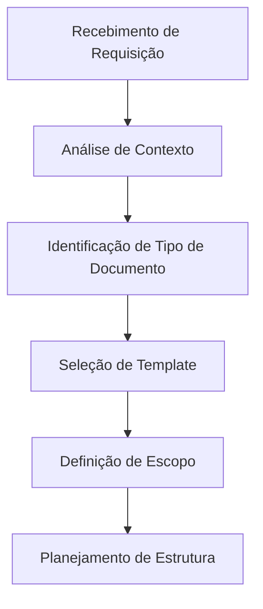
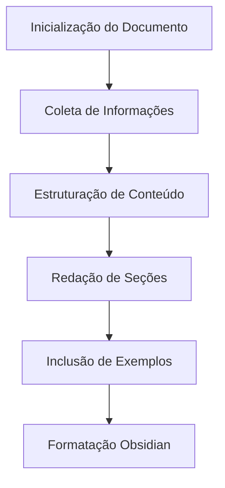
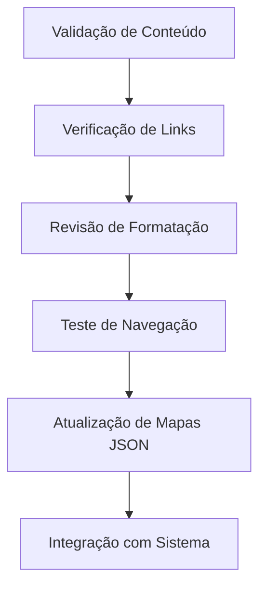
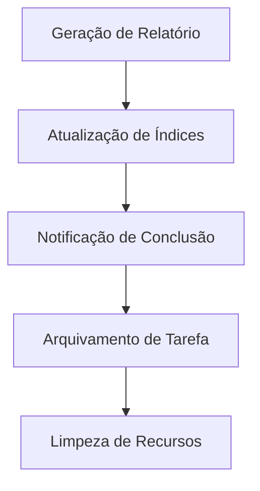

# Workflow de Documentação BMAD

## 📋 Informações do Workflow

- **Nome**: Documentation Workflow
- **Tipo**: Criação e Manutenção de Documentação
- **Versão**: 1.0
- **Status**: Ativo
- **Criado em**: 2024-12-19
- **Complexidade**: Média

## 🎯 Objetivo

Automatizar e padronizar o processo de criação, atualização e manutenção de documentação no sistema OTClient, garantindo consistência, qualidade e organização.

## 🔄 Fluxo de Execução

### **Fase 1: Análise e Planejamento**


### **Fase 2: Criação e Desenvolvimento**


### **Fase 3: Validação e Revisão**


### **Fase 4: Finalização e Distribuição**


## 🧠 Agentes Envolvidos

### **Agente Principal**
- **Nome**: Documentation Agent
- **Responsabilidade**: Coordenação e execução principal
- **Prioridade**: Alta

### **Agentes de Suporte**
- **Context Analyzer**: Análise de contexto e requisitos
- **Template Manager**: Seleção e aplicação de templates
- **Content Writer**: Redação e estruturação de conteúdo
- **Format Validator**: Validação de formatação Obsidian
- **JSON Updater**: Atualização de mapas de navegação

### **Agentes de Validação**
- **Quality Checker**: Verificação de qualidade e consistência
- **Link Validator**: Validação de links internos e externos
- **Navigation Tester**: Teste de navegação e usabilidade

## ⚙️ Configuração

### **Parâmetros de Execução**
#### Nível Basic
```json
  "notification_enabled": true,
```

#### Nível Intermediate
```json
{
  "timeout": 3600,
  "max_retries": 2,
  "parallel_execution": true,
  "validation_required": true,
  "notification_enabled": true,
  "auto_backup": true,
  "quality_threshold": 0.9
}
```

#### Nível Advanced
```json
{
  "timeout": 3600,
  "max_retries": 2,
  "parallel_execution": true,
  "validation_required": true,
  "notification_enabled": true,
  "auto_backup": true,
  "quality_threshold": 0.9
}
```

### **Condições de Entrada**
- **Tipo de Documento**: Definido (guia, referência, tutorial, etc.)
- **Escopo**: Delimitado e aprovado
- **Template**: Selecionado e validado
- **Recursos**: Disponíveis e acessíveis

### **Critérios de Saída**
- **Documento Criado**: Arquivo markdown funcional
- **Formatação Correta**: Padrão Obsidian aplicado
- **Links Válidos**: Navegação funcionando
- **Mapas Atualizados**: JSON sincronizado
- **Relatório Gerado**: Status de conclusão

## 📊 Monitoramento

### **Métricas de Performance**
- **Tempo de Criação**: < 60 minutos por documento
- **Taxa de Sucesso**: > 95%
- **Qualidade Média**: > 90%
- **Satisfação do Usuário**: > 85%

### **Pontos de Controle**
- **Ponto 1**: Validação de requisitos
- **Ponto 2**: Estruturação de conteúdo
- **Ponto 3**: Formatação final
- **Ponto 4**: Integração com sistema

## 🔧 Implementação

### **Código Principal**
#### Nível Basic
```lua
-- Workflow de documentação
function executeDocumentationWorkflow(request)
    local workflow = DocumentationWorkflow.new()
    
    -- Fase 1: Análise e Planejamento
    local plan = workflow:analyzeAndPlan(request)
    
    -- Fase 2: Criação e Desenvolvimento
    local document = workflow:createDocument(plan)
    
    -- Fase 3: Validação e Revisão
    local validated = workflow:validateAndReview(document)
    
    -- Fase 4: Finalização e Distribuição
    local result = workflow:finalizeAndDistribute(validated)
    
    return result
end
```

#### Nível Intermediate
```lua
-- Workflow de documentação
function executeDocumentationWorkflow(request)
    local workflow = DocumentationWorkflow.new()
    
    -- Fase 1: Análise e Planejamento
    local plan = workflow:analyzeAndPlan(request)
    
    -- Fase 2: Criação e Desenvolvimento
    local document = workflow:createDocument(plan)
    
    -- Fase 3: Validação e Revisão
    local validated = workflow:validateAndReview(document)
    
    -- Fase 4: Finalização e Distribuição
    local result = workflow:finalizeAndDistribute(validated)
    
    return result
end
-- Adicionar tratamento de erros
local success, result = pcall(function()
    -- Código original aqui
end)
if not success then
    print('Erro:', result)
end
```

#### Nível Advanced
```lua
-- Workflow de documentação
function executeDocumentationWorkflow(request)
    local workflow = DocumentationWorkflow.new()
    
    -- Fase 1: Análise e Planejamento
    local plan = workflow:analyzeAndPlan(request)
    
    -- Fase 2: Criação e Desenvolvimento
    local document = workflow:createDocument(plan)
    
    -- Fase 3: Validação e Revisão
    local validated = workflow:validateAndReview(document)
    
    -- Fase 4: Finalização e Distribuição
    local result = workflow:finalizeAndDistribute(validated)
    
    return result
end
-- Adicionar metatable para funcionalidade avançada
local mt = {
    __index = function(t, k)
        return rawget(t, k) or 'Valor não encontrado'
    end
    __call = function(t, ...)
        print('Objeto chamado com:', ...)
    end
}
setmetatable(meuObjeto, mt)
```

### **Funções de Suporte**
#### Nível Basic
```lua
-- Análise de contexto
function analyzeContext(request)
    local context = {
        dependencies = request.dependencies
end
-- Criação de documento
function createDocument(plan)
    local template = selectTemplate(plan.type)
    local content = generateContent(plan)
    local formatted = applyFormatting(content, template)
end
-- Validação de qualidade
function validateQuality(document)
    local score = 0
end
```

#### Nível Intermediate
```lua
-- Análise de contexto
function analyzeContext(request)
    local context = {
        type = request.document_type,
        scope = request.scope,
        priority = request.priority,
        dependencies = request.dependencies
    }
    return context
end

-- Criação de documento
function createDocument(plan)
    local template = selectTemplate(plan.type)
    local content = generateContent(plan)
    local formatted = applyFormatting(content, template)
    return formatted
end

-- Validação de qualidade
function validateQuality(document)
    local score = 0
    score = score + validateFormatting(document)
    score = score + validateLinks(document)
    score = score + validateContent(document)
    return score >= 0.9
end
```

#### Nível Advanced
```lua
-- Análise de contexto
function analyzeContext(request)
    local context = {
        type = request.document_type,
        scope = request.scope,
        priority = request.priority,
        dependencies = request.dependencies
    }
    return context
end

-- Criação de documento
function createDocument(plan)
    local template = selectTemplate(plan.type)
    local content = generateContent(plan)
    local formatted = applyFormatting(content, template)
    return formatted
end

-- Validação de qualidade
function validateQuality(document)
    local score = 0
    score = score + validateFormatting(document)
    score = score + validateLinks(document)
    score = score + validateContent(document)
    return score >= 0.9
end
-- Adicionar metatable para funcionalidade avançada
local mt = {
    __index = function(t, k)
        return rawget(t, k) or 'Valor não encontrado'
    end
    __call = function(t, ...)
        print('Objeto chamado com:', ...)
    end
}
setmetatable(meuObjeto, mt)
```

## 🚨 Tratamento de Erros

### **Cenários de Erro**
- **Template Não Encontrado**: Criação automática de template básico
- **Conteúdo Insuficiente**: Solicitação de informações adicionais
- **Formatação Inválida**: Correção automática ou manual
- **Links Quebrados**: Reparo automático ou notificação

### **Estratégias de Recuperação**
```lua
-- Recuperação de erros
function handleDocumentationError(error, context)
    -- Função: handleDocumentationError
    if error.type == "template_missing" then
    -- Verificação condicional
        return createBasicTemplate(context)
    elseif error.type == "insufficient_content" then
        return requestAdditionalInfo(context)
    elseif error.type == "formatting_error" then
        return autoFixFormatting(context)
    elseif error.type == "broken_links" then
        return repairLinks(context)
    end
end
```

## 📝 Exemplos de Uso

### **Cenário 1: Criação de Guia**
#### Nível Basic
```lua
local request = {
    document_type = "guide",
    title = "Guia de Configuração Avançada",
    scope = "configuration",
    priority = "high"
}

local result = executeDocumentationWorkflow(request)
print("Documento criado:", result.file_path)
```

#### Nível Intermediate
```lua
local request = {
    document_type = "guide",
    title = "Guia de Configuração Avançada",
    scope = "configuration",
    priority = "high"
}

local result = executeDocumentationWorkflow(request)
print("Documento criado:", result.file_path)
-- Adicionar tratamento de erros
local success, result = pcall(function()
    -- Código original aqui
end)
if not success then
    print('Erro:', result)
end
```

#### Nível Advanced
```lua
local request = {
    document_type = "guide",
    title = "Guia de Configuração Avançada",
    scope = "configuration",
    priority = "high"
}

local result = executeDocumentationWorkflow(request)
print("Documento criado:", result.file_path)
-- Adicionar metatable para funcionalidade avançada
local mt = {
    __index = function(t, k)
        return rawget(t, k) or 'Valor não encontrado'
    end
    __call = function(t, ...)
        print('Objeto chamado com:', ...)
    end
}
setmetatable(meuObjeto, mt)
```

### **Cenário 2: Atualização de Referência**
#### Nível Basic
```lua
local request = {
    document_type = "reference",
    action = "update",
    file_path = "wiki/otclient/API_Reference.md",
    changes = {
        new_sections = ["section1", "section2"],
        updated_content = "new_content"
    }
}

local result = executeDocumentationWorkflow(request)
```

#### Nível Intermediate
```lua
local request = {
    document_type = "reference",
    action = "update",
    file_path = "wiki/otclient/API_Reference.md",
    changes = {
        new_sections = ["section1", "section2"],
        updated_content = "new_content"
    }
}

local result = executeDocumentationWorkflow(request)
-- Adicionar tratamento de erros
local success, result = pcall(function()
    -- Código original aqui
end)
if not success then
    print('Erro:', result)
end
```

#### Nível Advanced
```lua
local request = {
    document_type = "reference",
    action = "update",
    file_path = "wiki/otclient/API_Reference.md",
    changes = {
        new_sections = ["section1", "section2"],
        updated_content = "new_content"
    }
}

local result = executeDocumentationWorkflow(request)
-- Adicionar metatable para funcionalidade avançada
local mt = {
    __index = function(t, k)
        return rawget(t, k) or 'Valor não encontrado'
    end
    __call = function(t, ...)
        print('Objeto chamado com:', ...)
    end
}
setmetatable(meuObjeto, mt)
```

## 🔗 **Links Automáticos**

> [!info] **Links Gerados Automaticamente**
> Estes links foram criados automaticamente pelo sistema de linkagem da categoria **Documentation**

### **📚 Links Obrigatórios**
- [[../README|Hub Central da Wiki]]
- [[../dashboard/task_master|Task Master]]
- [[../dashboard/integrated_task_manager|Dashboard Central]]
- [[../maps/search_index|Índice de Busca]]
- [[../maps/tags_index|Índice de Tags]]

### **🧭 Navegação**
- [[../maps/search_index|Índice de Busca]]
- [[../maps/tags_index|Índice de Tags]]
- [[../maps/category_indices|Índices por Categoria]]
- [[../maps/relationships|Relacionamentos]]

### **📊 Métricas da Categoria**
- **Categoria**: Documentation
- **Total de arquivos**: <!-- Contador automático -->
- **Arquivos linkados**: <!-- Contador automático -->
- **Taxa de linkagem**: <!-- Percentual automático -->

---

## 🔗 Integração

### **Sistemas Externos**
- **OTClient Source**: Extração de informações do código
- **BMAD System**: Coordenação com agentes especializados
- **JSON Maps**: Atualização automática de navegação

### **APIs Utilizadas**
- **File System API**: Criação e modificação de arquivos
- **JSON API**: Atualização de mapas de navegação
- **Template API**: Aplicação de templates

## 📚 Documentação

### **Referências**
- [[BMAD_System_Guide]]
- [[Documentation_Rules]]
- [[Wiki_Rules]]

### **Tutoriais Relacionados**
- [[Template_Usage_Guide]]
- [[Obsidian_Formatting_Guide]]

---

## 🔄 Atualizações

### **Histórico de Versões**
- **v1.0**: Versão inicial com fluxo básico
- **v1.1**: Adicionado validação automática
- **v1.2**: Integração com sistema BMAD

### **Próximas Melhorias**
- IA para geração automática de conteúdo
- Sistema de revisão colaborativa
- Integração com controle de versão

---

*Workflow criado pelo Sistema BMAD - OTClient Documentation* 