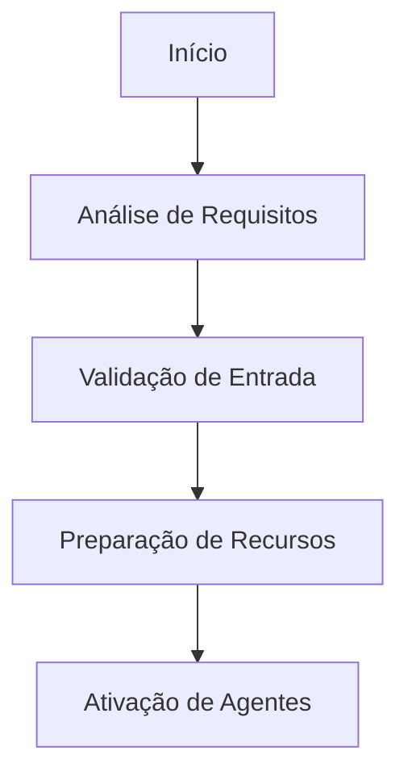
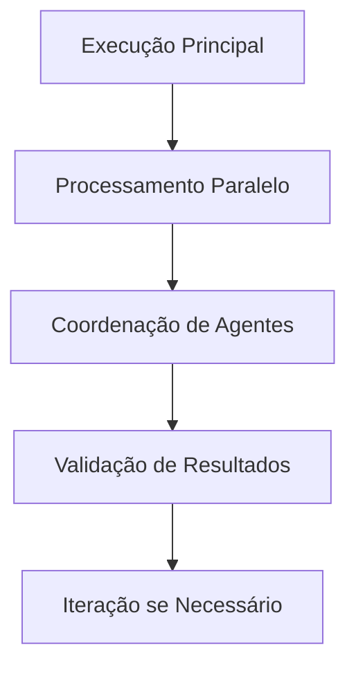
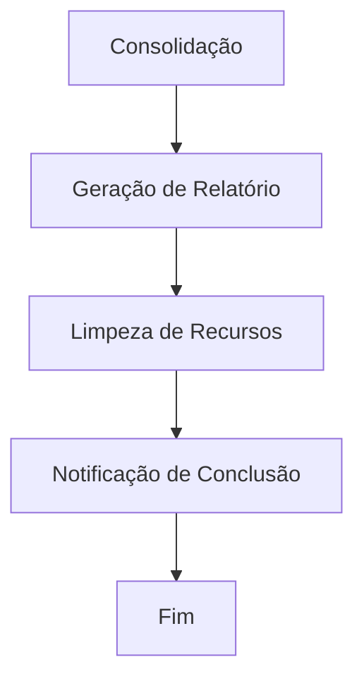

# Template de Workflow BMAD

## 📋 Informações do Workflow

- **Nome**: [Nome do Workflow]
- **Tipo**: [Tipo de Workflow]
- **Versão**: 1.0
- **Status**: Ativo
- **Criado em**: [Data]
- **Complexidade**: [Baixa/Média/Alta]

## 🎯 Objetivo

[Descrição clara do objetivo e resultado esperado do workflow]

## 🔄 Fluxo de Execução

### **Fase 1: Inicialização**


### **Fase 2: Execução**


### **Fase 3: Finalização**


## 🧠 Agentes Envolvidos

### **Agente Principal**
- **Nome**: [Nome do Agente]
- **Responsabilidade**: [Descrição da responsabilidade]
- **Prioridade**: [Alta/Média/Baixa]

### **Agentes de Suporte**
- **Agente 1**: [Nome] - [Função]
- **Agente 2**: [Nome] - [Função]
- **Agente 3**: [Nome] - [Função]

### **Agentes de Validação**
- **Validador 1**: [Nome] - [Critério de validação]
- **Validador 2**: [Nome] - [Critério de validação]

## ⚙️ Configuração

### **Parâmetros de Execução**
```json
{
  "timeout": 1800,
  "max_retries": 3,
  "parallel_execution": true,
  "validation_required": true,
  "notification_enabled": true
}
```

### **Condições de Entrada**
- [Condição 1]: [Valor esperado]
- [Condição 2]: [Valor esperado]
- [Condição 3]: [Valor esperado]

### **Critérios de Saída**
- [Critério 1]: [Condição de sucesso]
- [Critério 2]: [Condição de sucesso]
- [Critério 3]: [Condição de sucesso]

## 📊 Monitoramento

### **Métricas de Performance**
- **Tempo de Execução**: [Meta em segundos]
- **Taxa de Sucesso**: [Meta em %]
- **Uso de Recursos**: [Meta em %]

### **Pontos de Controle**
- [Ponto de controle 1]: [Verificação]
- [Ponto de controle 2]: [Verificação]
- [Ponto de controle 3]: [Verificação]

## 🔧 Implementação

### **Código Principal**
```lua
-- Workflow principal
function executeWorkflow(input)
    local workflow = WorkflowTemplate.new()
    
    -- Fase 1: Inicialização
    workflow:initialize(input)
    
    -- Fase 2: Execução
    local results = workflow:execute()
    
    -- Fase 3: Finalização
    workflow:finalize(results)
    
    return results
end
```

### **Funções de Suporte**
```lua
-- Validação de entrada
function validateInput(input)
    -- Validação dos dados de entrada
end

-- Processamento principal
function processData(data)
    -- Processamento dos dados
end

-- Geração de relatório
function generateReport(results)
    -- Geração do relatório final
end
```

## 🚨 Tratamento de Erros

### **Cenários de Erro**
- **Erro de Validação**: [Ação de recuperação]
- **Timeout**: [Ação de recuperação]
- **Falha de Agente**: [Ação de recuperação]
- **Erro de Sistema**: [Ação de recuperação]

### **Estratégias de Recuperação**
```lua
-- Recuperação automática
function handleError(error, context)
    if error.type == "validation" then
        return retryValidation(context)
    elseif error.type == "timeout" then
        return extendTimeout(context)
    elseif error.type == "agent_failure" then
        return replaceAgent(context)
    end
end
```

## 📝 Exemplos de Uso

### **Cenário 1: Processamento Simples**
```lua
local input = {
    data = "exemplo",
    priority = "high"
}

local result = executeWorkflow(input)
print("Resultado:", result.status)
```

### **Cenário 2: Processamento Complexo**
```lua
local input = {
    data = complex_data,
    agents = ["agent1", "agent2", "agent3"],
    validation = true
}

local result = executeWorkflow(input)
```

## 🔗 Integração

### **Sistemas Externos**
- [Sistema 1]: [Tipo de integração]
- [Sistema 2]: [Tipo de integração]

### **APIs Utilizadas**
- [API 1]: [Endpoint e função]
- [API 2]: [Endpoint e função]

## 📚 Documentação

### **Referências**
- [Documentação 1]
- [Documentação 2]

### **Tutoriais Relacionados**
- [Tutorial 1]
- [Tutorial 2]

---

## 🔄 Atualizações

### **Histórico de Versões**
- **v1.0**: Versão inicial
- **v1.1**: [Melhoria 1]
- **v1.2**: [Melhoria 2]

### **Próximas Melhorias**
- [Melhoria planejada 1]
- [Melhoria planejada 2]

---

*Template criado pelo Sistema BMAD - OTClient Documentation* 