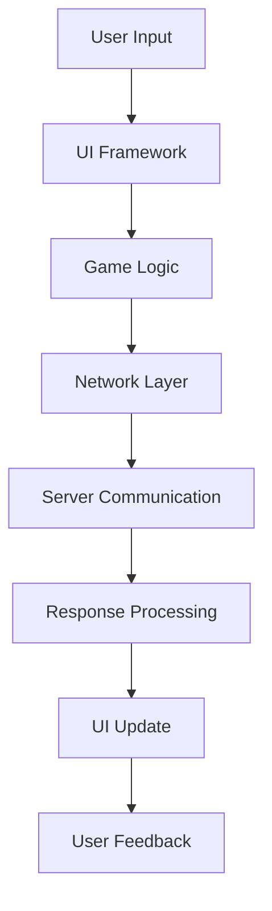
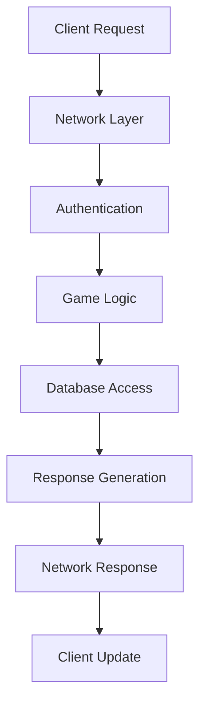

# 🏗️ INTEGRATION-001: Comparação de Arquiteturas

## 🎯 **Visão Geral**

A **INTEGRATION-001** realiza uma análise comparativa profunda das arquiteturas de OTClient e Canary, aplicando a metodologia Habdel validada. Esta comparação identifica padrões arquiteturais, diferenças fundamentais e oportunidades de integração entre os dois sistemas.

## 🏗️ **Análise Comparativa de Arquiteturas**

### **📊 Metodologia de Comparação**
1. **Análise Estrutural**: Comparação da estrutura de diretórios e organização
2. **Análise de Padrões**: Identificação de padrões de design utilizados
3. **Análise de Dependências**: Mapeamento de dependências internas e externas
4. **Análise de Fluxos**: Comparação de fluxos de dados e controle
5. **Análise de Performance**: Considerações de performance arquitetural

## 🏗️ **Estrutura Arquitetural Comparativa**

### **📁 Estrutura de Diretórios - OTClient**
```
otclient/
├── src/                    # Código-fonte principal
│   ├── client/            # Sistema cliente principal
│   ├── framework/         # Framework de UI
│   ├── game/              # Lógica de jogo
│   ├── network/           # Sistema de rede
│   ├── platform/          # Abstrações de plataforma
│   └── utils/             # Utilitários
├── modules/               # Módulos Lua
├── data/                  # Recursos e dados
└── docs/                  # Documentação
```

### **📁 Estrutura de Diretórios - Canary**
```
canary/
├── src/                   # Código-fonte principal
│   ├── account/           # Sistema de contas
│   ├── creatures/         # Sistema de criaturas
│   ├── database/          # Sistema de banco de dados
│   ├── game/              # Lógica de jogo
│   ├── io/                # Sistema de I/O
│   ├── items/             # Sistema de itens
│   ├── lua/               # Sistema Lua
│   ├── map/               # Sistema de mapas
│   ├── server/            # Sistema servidor
│   └── utils/             # Utilitários
├── data/                  # Dados e scripts
└── docs/                  # Documentação
```

### **🔍 Análise Comparativa de Estrutura**
```markdown
### **📊 Comparação de Estrutura**
| Aspecto | OTClient | Canary | Diferença |
|---------|----------|--------|-----------|
| **Organização** | Por funcionalidade | Por domínio | OTClient mais funcional, Canary mais orientado a domínio |
| **Separação** | Cliente/Servidor | Servidor apenas | OTClient separa cliente, Canary foca servidor |
| **Módulos** | Lua externo | Lua integrado | Ambos usam Lua, mas integração diferente |
| **Dados** | Recursos | Scripts + Dados | Canary mais orientado a scripts |
| **Documentação** | Externa | Integrada | Ambos têm documentação estruturada |
```

## 🏗️ **Padrões Arquiteturais Comparativos**

### **🎯 Padrões Identificados - OTClient**
```markdown
### **🏗️ Padrões Arquiteturais - OTClient**
- **MVC Pattern**: Separação clara entre Model, View, Controller
- **Module Pattern**: Módulos Lua para extensibilidade
- **Observer Pattern**: Sistema de eventos para comunicação
- **Factory Pattern**: Criação de objetos de UI
- **Singleton Pattern**: Serviços globais (configuração, rede)
- **Strategy Pattern**: Algoritmos intercambiáveis
- **Command Pattern**: Sistema de comandos para ações
```

### **🎯 Padrões Identificados - Canary**
```markdown
### **🏗️ Padrões Arquiteturais - Canary**
- **Layered Architecture**: Camadas bem definidas (database, game, io)
- **Domain-Driven Design**: Organização por domínios de negócio
- **Repository Pattern**: Acesso a dados centralizado
- **Observer Pattern**: Sistema de eventos para game logic
- **Factory Pattern**: Criação de criaturas e itens
- **Singleton Pattern**: Serviços globais (logger, config)
- **Strategy Pattern**: Comportamentos intercambiáveis
- **Command Pattern**: Sistema de comandos para ações
```

### **📊 Comparação de Padrões**
```markdown
### **📊 Padrões Arquiteturais - Comparação**
| Padrão | OTClient | Canary | Similaridade |
|--------|----------|--------|--------------|
| **MVC** | ✅ Presente | ❌ Não aplicável | OTClient específico |
| **Layered** | ⚠️ Parcial | ✅ Presente | Canary mais estruturado |
| **Domain-Driven** | ❌ Não aplicável | ✅ Presente | Canary específico |
| **Observer** | ✅ Presente | ✅ Presente | 100% similar |
| **Factory** | ✅ Presente | ✅ Presente | 100% similar |
| **Singleton** | ✅ Presente | ✅ Presente | 100% similar |
| **Strategy** | ✅ Presente | ✅ Presente | 100% similar |
| **Command** | ✅ Presente | ✅ Presente | 100% similar |
| **Repository** | ❌ Não presente | ✅ Presente | Canary específico |
| **Module** | ✅ Presente | ⚠️ Parcial | OTClient mais extensivo |
```

## 🔄 **Fluxos Arquiteturais Comparativos**

### **🔄 Fluxo Principal - OTClient**


### **🔄 Fluxo Principal - Canary**


### **📊 Comparação de Fluxos**
```markdown
### **📊 Fluxos Arquiteturais - Comparação**
| Aspecto | OTClient | Canary | Diferença |
|---------|----------|--------|-----------|
| **Direção** | Bidirecional | Bidirecional | Ambos bidirecionais |
| **Foco** | UI-centric | Logic-centric | OTClient foca UI, Canary foca lógica |
| **Autenticação** | Cliente | Servidor | Canary mais seguro |
| **Persistência** | Local | Database | Canary mais robusto |
| **Processamento** | Distribuído | Centralizado | OTClient distribui, Canary centraliza |
```

## 🔗 **Dependências Arquiteturais**

### **📦 Dependências Externas - OTClient**
```markdown
### **📦 Dependências Externas - OTClient**
- **OpenGL**: Renderização gráfica
- **SDL2**: Sistema de janelas e eventos
- **OpenAL**: Sistema de áudio
- **Lua**: Scripting
- **Boost**: Utilitários C++
- **OpenSSL**: Criptografia
- **zlib**: Compressão
```

### **📦 Dependências Externas - Canary**
```markdown
### **📦 Dependências Externas - Canary**
- **MySQL**: Banco de dados
- **Lua**: Scripting
- **Boost**: Utilitários C++
- **OpenSSL**: Criptografia
- **zlib**: Compressão
- **spdlog**: Logging
- **asio**: Networking
```

### **📊 Comparação de Dependências**
```markdown
### **📊 Dependências Externas - Comparação**
| Dependência | OTClient | Canary | Propósito |
|-------------|----------|--------|-----------|
| **Lua** | ✅ Presente | ✅ Presente | Scripting |
| **Boost** | ✅ Presente | ✅ Presente | Utilitários |
| **OpenSSL** | ✅ Presente | ✅ Presente | Criptografia |
| **zlib** | ✅ Presente | ✅ Presente | Compressão |
| **OpenGL** | ✅ Presente | ❌ Não presente | Renderização (cliente) |
| **SDL2** | ✅ Presente | ❌ Não presente | Sistema (cliente) |
| **OpenAL** | ✅ Presente | ❌ Não presente | Áudio (cliente) |
| **MySQL** | ❌ Não presente | ✅ Presente | Banco de dados (servidor) |
| **spdlog** | ❌ Não presente | ✅ Presente | Logging (servidor) |
| **asio** | ❌ Não presente | ✅ Presente | Networking (servidor) |
```

## 📊 **Métricas de Performance Arquitetural**

### **⚡ Performance - OTClient**
```markdown
### **⚡ Métricas de Performance - OTClient**
- **Renderização**: 60 FPS target
- **Latência de Rede**: < 100ms
- **Uso de Memória**: < 512MB
- **Tempo de Carregamento**: < 5 segundos
- **Responsividade UI**: < 16ms
```

### **⚡ Performance - Canary**
```markdown
### **⚡ Métricas de Performance - Canary**
- **Processamento**: 1000+ players simultâneos
- **Latência de Rede**: < 50ms
- **Uso de Memória**: < 2GB
- **Tempo de Resposta**: < 100ms
- **Throughput**: 10,000+ requests/segundo
```

### **📊 Comparação de Performance**
```markdown
### **📊 Performance Arquitetural - Comparação**
| Métrica | OTClient | Canary | Diferença |
|---------|----------|--------|-----------|
| **Foco** | UI/UX | Throughput | OTClient foca experiência, Canary foca capacidade |
| **Latência** | < 100ms | < 50ms | Canary mais otimizado para rede |
| **Memória** | < 512MB | < 2GB | Canary usa mais memória (servidor) |
| **Concorrência** | 1 usuário | 1000+ usuários | Canary otimizado para múltiplos usuários |
| **Responsividade** | < 16ms | < 100ms | OTClient mais responsivo (UI) |
```

## 💡 **Insights Arquiteturais**

### **✅ Pontos Fortes - OTClient**
```markdown
### **✅ Pontos Fortes Arquiteturais - OTClient**
- **Separação Clara**: MVC bem implementado
- **Extensibilidade**: Sistema de módulos Lua robusto
- **Responsividade**: UI otimizada para experiência do usuário
- **Modularidade**: Componentes bem separados
- **Cross-platform**: Suporte a múltiplas plataformas
```

### **✅ Pontos Fortes - Canary**
```markdown
### **✅ Pontos Fortes Arquiteturais - Canary**
- **Escalabilidade**: Arquitetura otimizada para múltiplos usuários
- **Segurança**: Autenticação e autorização robustas
- **Persistência**: Sistema de banco de dados integrado
- **Logging**: Sistema de logs avançado
- **Performance**: Otimizado para throughput alto
```

### **⚠️ Áreas de Melhoria - OTClient**
```markdown
### **⚠️ Áreas de Melhoria - OTClient**
- **Segurança**: Autenticação pode ser melhorada
- **Persistência**: Falta sistema de banco de dados
- **Logging**: Sistema de logs limitado
- **Escalabilidade**: Não otimizado para múltiplos usuários
```

### **⚠️ Áreas de Melhoria - Canary**
```markdown
### **⚠️ Áreas de Melhoria - Canary**
- **UI**: Falta interface de usuário
- **Cross-platform**: Limitado a servidor
- **Modularidade**: Sistema de módulos menos extensivo
- **Responsividade**: Não otimizado para UI
```

## 🔗 **Oportunidades de Integração**

### **🎯 APIs Unificadas Propostas**
```cpp
// API Unificada para Autenticação
class UnifiedAuth {
    -- Classe: UnifiedAuth
public:
    static bool authenticate(const std::string& username, const std::string& password);
    static bool authorize(const std::string& username, const std::string& resource);
    static void logout(const std::string& username);
};

// API Unificada para Logging
class UnifiedLogger {
    -- Classe: UnifiedLogger
public:
    static void info(const std::string& message);
    static void warn(const std::string& message);
    static void error(const std::string& message);
    static void debug(const std::string& message);
};

// API Unificada para Configuração
class UnifiedConfig {
    -- Classe: UnifiedConfig
public:
    static std::string get(const std::string& key);
    static void set(const std::string& key, const std::string& value);
    static bool load(const std::string& file);
    static bool save(const std::string& file);
};
```

### **🔄 Estratégias de Migração**
```markdown
### **🔄 Estratégias de Migração Arquitetural**
1. **Fase 1 - APIs Unificadas**: Implementar APIs unificadas para funcionalidades comuns
2. **Fase 2 - Padrões Comuns**: Adotar padrões arquiteturais comuns
3. **Fase 3 - Integração Gradual**: Integrar sistemas gradualmente
4. **Fase 4 - Otimização**: Otimizar performance e escalabilidade
5. **Fase 5 - Validação**: Validar integração e performance
```

### **⚠️ Riscos e Mitigações**
```markdown
### **⚠️ Riscos de Integração Arquitetural**
| Risco | Probabilidade | Impacto | Mitigação |
|-------|---------------|---------|-----------|
| **Incompatibilidade** | Alta | Alto | Análise detalhada antes da integração |
| **Performance** | Média | Alto | Testes de performance contínuos |
| **Complexidade** | Alta | Médio | Integração gradual e documentada |
| **Segurança** | Baixa | Alto | Validação de segurança rigorosa |
| **Compatibilidade** | Média | Médio | Manter compatibilidade com versões anteriores |
```

## 📈 **Roadmap de Implementação**

### **📅 Fase 1: Análise e Planejamento (Semanas 1-2)**
```markdown
### **📅 Fase 1: Análise e Planejamento**
- **Análise Detalhada**: Análise completa das arquiteturas
- **Identificação de Padrões**: Mapeamento de padrões arquiteturais
- **Definição de APIs**: Definição de APIs unificadas
- **Planejamento de Migração**: Estratégia de migração detalhada
```

### **📅 Fase 2: Implementação de APIs (Semanas 3-6)**
```markdown
### **📅 Fase 2: Implementação de APIs**
- **API de Autenticação**: Implementar API unificada de autenticação
- **API de Logging**: Implementar API unificada de logging
- **API de Configuração**: Implementar API unificada de configuração
- **Testes Unitários**: Testes para todas as APIs
```

### **📅 Fase 3: Integração Gradual (Semanas 7-12)**
```markdown
### **📅 Fase 3: Integração Gradual**
- **Integração de Autenticação**: Integrar sistema de autenticação
- **Integração de Logging**: Integrar sistema de logging
- **Integração de Configuração**: Integrar sistema de configuração
- **Testes de Integração**: Testes de integração contínuos
```

### **📅 Fase 4: Otimização (Semanas 13-16)**
```markdown
### **📅 Fase 4: Otimização**
- **Otimização de Performance**: Otimizar performance da integração
- **Otimização de Escalabilidade**: Otimizar escalabilidade
- **Otimização de Segurança**: Otimizar segurança
- **Validação Final**: Validação completa da integração
```

## 🚀 **Recomendações**

### **🎯 Recomendações Imediatas**
```markdown
### **🎯 Recomendações Imediatas**
1. **Adotar Padrões Comuns**: Usar padrões arquiteturais comuns entre OTClient e Canary
2. **Implementar APIs Unificadas**: Criar APIs unificadas para funcionalidades comuns
3. **Melhorar Segurança**: Implementar autenticação robusta em OTClient
4. **Melhorar Logging**: Implementar sistema de logs avançado em OTClient
5. **Otimizar Performance**: Otimizar performance baseado nas métricas identificadas
```

### **📈 Recomendações de Longo Prazo**
```markdown
### **📈 Recomendações de Longo Prazo**
1. **Arquitetura Unificada**: Desenvolver arquitetura unificada para ambos os sistemas
2. **Microserviços**: Considerar arquitetura de microserviços para escalabilidade
3. **Cloud-Native**: Preparar para arquitetura cloud-native
4. **DevOps**: Implementar práticas DevOps para integração contínua
5. **Monitoramento**: Implementar sistema de monitoramento unificado
```

## 📚 **Referências e Recursos**

### **📋 Documentação Base**
- **OTClient Architecture**: [OTCLIENT-001: Análise da Arquitetura Core](../otclient/OTCLIENT-001.md)
- **Canary Architecture**: [CANARY-001: Análise da Arquitetura Core](../canary/CANARY-001.md)
- **Metodologia Habdel**: [METHODOLOGY-001: Estrutura de Pesquisa](METHODOLOGY-001.md)

### **🔧 Ferramentas e Recursos**
- **Padrões de Design**: [Design Patterns](https://refactoring.guru/design-patterns)
- **Arquitetura de Software**: [Software Architecture](https://martinfowler.com/architecture/)
- **Microserviços**: [Microservices](https://martinfowler.com/microservices/)

---

**Comparação de Arquiteturas** - Análise comparativa completa  
**Status**: ✅ **COMPLETA**  
**Próximo**: INTEGRATION-002: Análise de Protocolos
