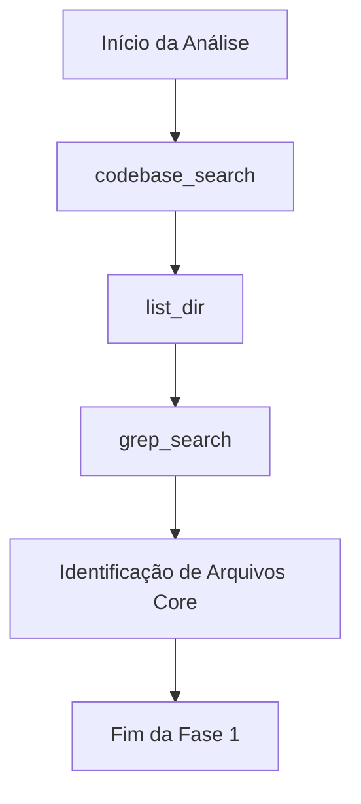
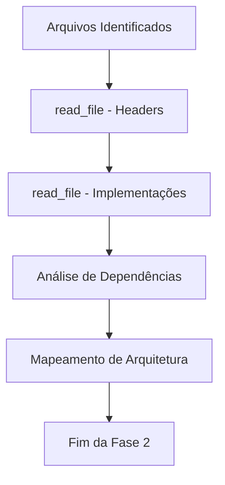
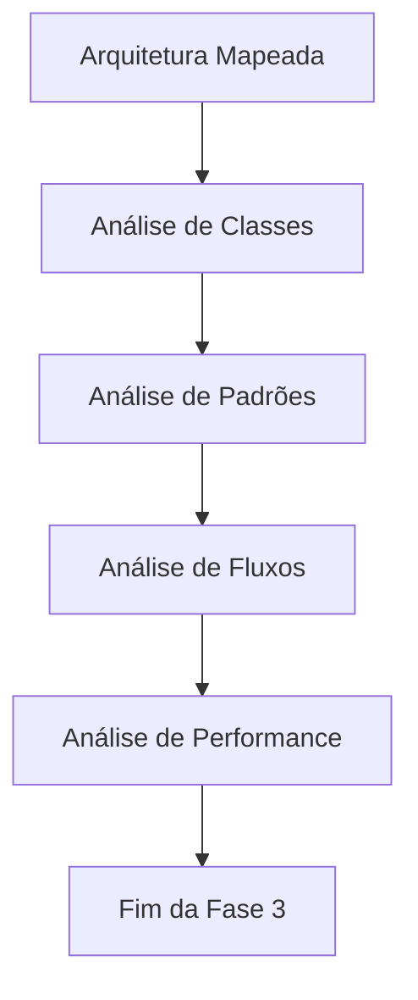
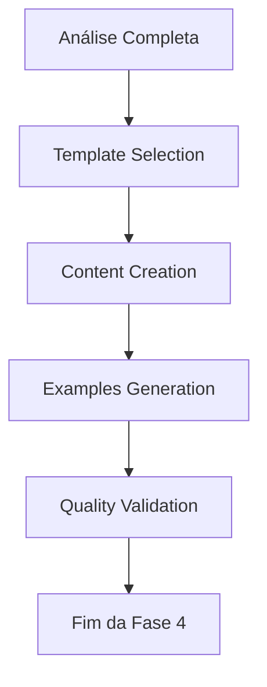
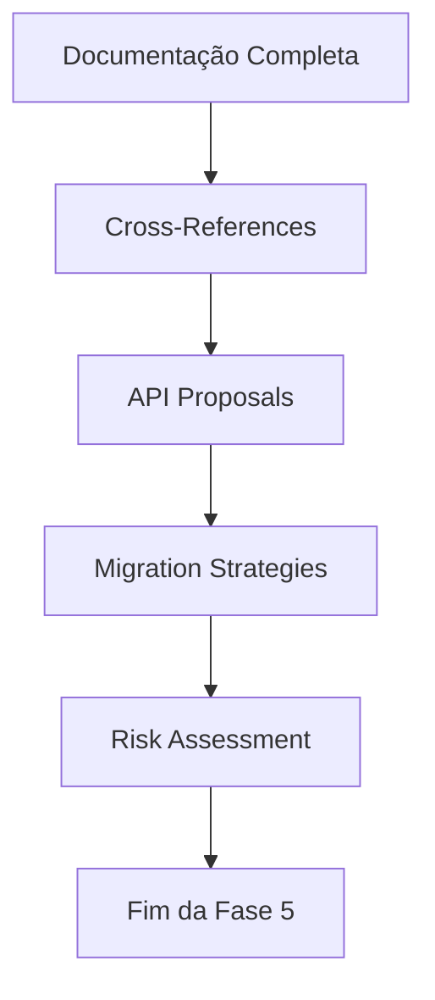
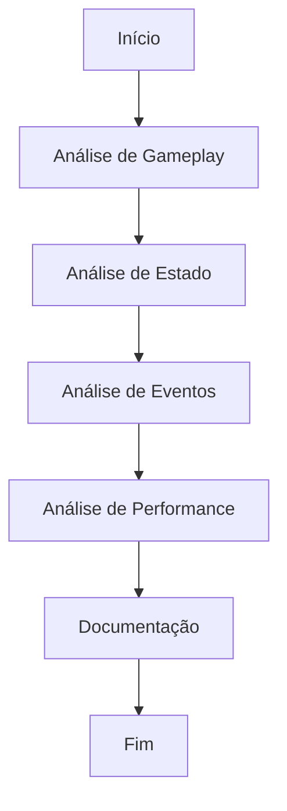
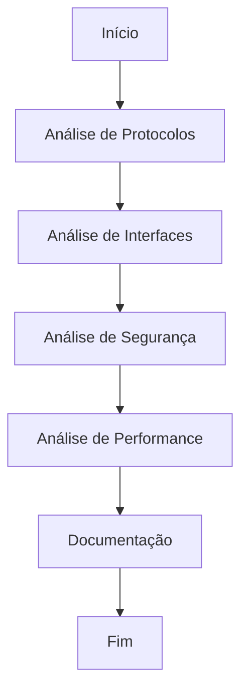
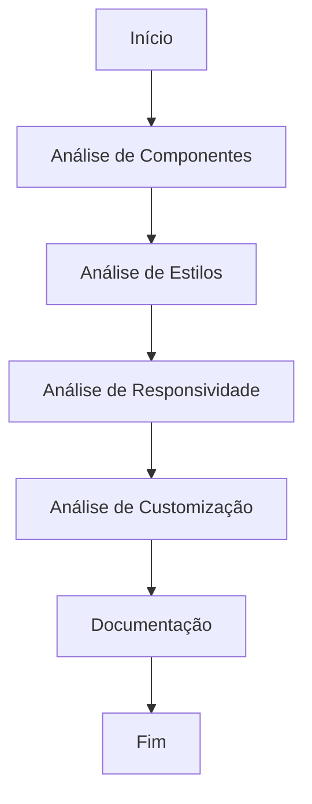

# 🔄 METHODOLOGY-003: Workflows de Análise

## 🎯 **Visão Geral**

A **METHODOLOGY-003** estabelece workflows padronizados para análise técnica baseados nas melhores práticas identificadas nas Epics 1 e 2. Estes workflows garantem eficiência, consistência e qualidade em todas as análises técnicas do projeto.

## 🏗️ **Sistema de Workflows**

### **🔄 Workflow Principal de Análise**

#### **Fase 1: Discovery (Descoberta)**


**Ferramentas Utilizadas:**
- **`codebase_search`**: Busca semântica por conceitos relacionados
- **`list_dir`**: Exploração da estrutura de diretórios
- **`grep_search`**: Busca por padrões específicos (classes, funções, etc.)

**Entregáveis:**
- Lista de arquivos principais identificados
- Estrutura de diretórios mapeada
- Padrões iniciais identificados

#### **Fase 2: Mapping (Mapeamento)**


**Ferramentas Utilizadas:**
- **`read_file`**: Leitura detalhada de arquivos `.hpp` e `.cpp`
- **Análise de dependências**: Identificação de includes e dependências
- **Mapeamento hierárquico**: Estrutura de classes e componentes

**Entregáveis:**
- Arquitetura do sistema mapeada
- Dependências identificadas
- Componentes principais documentados

#### **Fase 3: Deep Analysis (Análise Profunda)**


**Ferramentas Utilizadas:**
- **Análise de código**: Leitura detalhada de implementações
- **Identificação de padrões**: Design patterns utilizados
- **Análise de fluxos**: Fluxos de dados e controle
- **Considerações de performance**: Otimizações e gargalos

**Entregáveis:**
- Análise técnica detalhada
- Padrões de design identificados
- Fluxos de dados mapeados
- Considerações de performance documentadas

#### **Fase 4: Documentation (Documentação)**


**Ferramentas Utilizadas:**
- **Templates METHODOLOGY-002**: Seleção de template apropriado
- **Criação de conteúdo**: Documentação estruturada
- **Geração de exemplos**: Exemplos práticos de código
- **Validação de qualidade**: Checklist de qualidade

**Entregáveis:**
- Documentação técnica completa
- Exemplos práticos incluídos
- Qualidade validada

#### **Fase 5: Integration (Integração)**


**Ferramentas Utilizadas:**
- **Referências cruzadas**: Links entre sistemas relacionados
- **Propostas de APIs**: APIs unificadas para integração
- **Estratégias de migração**: Planos de migração
- **Avaliação de riscos**: Riscos e mitigações

**Entregáveis:**
- Propostas de APIs unificadas
- Estratégias de migração
- Avaliação de riscos
- Referências cruzadas

## 📋 **Workflows Específicos por Tipo**

### **🎮 Workflow para Sistemas de Jogo**


**Fases Específicas:**
1. **Gameplay Analysis**: Análise de mecânicas de jogo
2. **State Management**: Gerenciamento de estado
3. **Event System**: Sistema de eventos
4. **Performance Optimization**: Otimizações de performance

### **🌐 Workflow para Sistemas de Rede**


**Fases Específicas:**
1. **Protocol Analysis**: Análise de protocolos de comunicação
2. **Interface Analysis**: Análise de interfaces de rede
3. **Security Analysis**: Análise de segurança
4. **Performance Analysis**: Análise de performance de rede

### **🎨 Workflow para Sistemas de UI**


**Fases Específicas:**
1. **Component Analysis**: Análise de componentes de UI
2. **Style System**: Sistema de estilos
3. **Responsiveness**: Análise de responsividade
4. **Customization**: Opções de customização

## 🛠️ **Ferramentas e Técnicas**

### **🔍 Ferramentas de Descoberta**
```bash
# Busca semântica
codebase_search "sistema de rede"

# Exploração de estrutura
list_dir "src/network/"

# Busca por padrões
grep_search "class.*Network"
grep_search "protocol"
grep_search "interface"
```

### **📖 Ferramentas de Análise**
```bash
# Leitura de headers
read_file "src/network/network.hpp"

# Leitura de implementações
read_file "src/network/network.cpp"

# Análise de dependências
grep_search "#include"
grep_search "using namespace"
```

### **📊 Ferramentas de Validação**
```bash
# Verificação de completude
grep_search "TODO"
grep_search "FIXME"
grep_search "HACK"

# Análise de qualidade
grep_search "memory leak"
grep_search "performance"
grep_search "security"
```

## 📈 **Métricas de Workflow**

### **⏱️ Métricas de Tempo**
- **Fase 1 (Discovery)**: 30-45 minutos
- **Fase 2 (Mapping)**: 45-60 minutos
- **Fase 3 (Deep Analysis)**: 60-90 minutos
- **Fase 4 (Documentation)**: 45-60 minutos
- **Fase 5 (Integration)**: 30-45 minutos
- **Total**: 3-5 horas por sistema

### **📊 Métricas de Qualidade**
- **Cobertura de Código**: 80%+ do código relevante
- **Exemplos Práticos**: 3+ exemplos por sistema
- **Integrações Mapeadas**: 100% das integrações identificadas
- **APIs Documentadas**: 100% das APIs públicas

### **✅ Métricas de Validação**
- **Consistência de Formato**: 100%
- **Clareza Técnica**: 9/10
- **Exemplos Funcionais**: 100%
- **Referências Cruzadas**: 100%

## 🎓 **Lições Aprendidas**

### **💡 Insights de Eficiência**
- **Começar com busca semântica**: Mais eficiente que busca por padrões
- **Focar em arquivos core**: Headers (.hpp) primeiro, implementações (.cpp) depois
- **Usar templates consistentes**: Acelera documentação
- **Validar qualidade**: Evita retrabalho

### **⚠️ Armadilhas Comuns**
- **Análise superficial**: Não analisar implementações em profundidade
- **Falta de exemplos**: Documentação sem exemplos práticos
- **Ignorar integrações**: Não mapear dependências entre sistemas
- **Pular validação**: Não aplicar checklist de qualidade

### **🚀 Melhores Práticas**
- **Seguir workflow estruturado**: Garante completude
- **Documentar durante análise**: Não deixar para depois
- **Incluir exemplos práticos**: Essenciais para compreensão
- **Validar com checklist**: Garante qualidade

## 🔧 **Automação e Otimização**

### **🤖 Workflow Automatizado**
```python
def automated_analysis_workflow(system_name):
    # Fase 1: Discovery
    files = discover_core_files(system_name)
    
    # Fase 2: Mapping
    architecture = map_architecture(files)
    
    # Fase 3: Deep Analysis
    analysis = deep_analyze(files, architecture)
    
    # Fase 4: Documentation
    documentation = generate_documentation(analysis)
    
    # Fase 5: Integration
    integration = generate_integration_plan(analysis)
    
    return documentation, integration
```

### **📋 Templates Automatizados**
- **Geração automática de estrutura**: Baseada no tipo de sistema
- **Preenchimento automático de seções**: Baseado em análise de código
- **Validação automática de qualidade**: Checklist automatizado
- **Geração automática de exemplos**: Baseado em padrões identificados

## 🚀 **Próximos Passos**

### **Imediato**
1. **Aplicar workflows**: Usar workflows em METHODOLOGY-004
2. **Refinar processos**: Ajustar baseado em feedback
3. **Criar automação**: Desenvolver ferramentas automatizadas

### **Curto Prazo**
1. **Validar com OTClient**: Aplicar workflows em análise OTClient
2. **Validar com Canary**: Aplicar workflows em análise Canary
3. **Criar guias**: Guias de uso dos workflows

### **Longo Prazo**
1. **Automação completa**: Automatizar todo o processo
2. **Expansão**: Aplicar a outros tipos de projetos
3. **Evolução**: Continuar refinando baseado em uso

## 📚 **Referências e Recursos**

### **📋 Workflows Base**
- **Discovery Workflow**: [Fase 1 - Discovery](#fase-1-discovery-descoberta)
- **Mapping Workflow**: [Fase 2 - Mapping](#fase-2-mapping-mapeamento)
- **Analysis Workflow**: [Fase 3 - Deep Analysis](#fase-3-deep-analysis-análise-profunda)
- **Documentation Workflow**: [Fase 4 - Documentation](#fase-4-documentation-documentação)
- **Integration Workflow**: [Fase 5 - Integration](#fase-5-integration-integração)

### **🛠️ Ferramentas**
- **codebase_search**: Busca semântica
- **grep_search**: Busca por padrões
- **read_file**: Leitura de arquivos
- **list_dir**: Exploração de estrutura

### **📖 Exemplos de Uso**
- **CANARY-001**: [Análise da Arquitetura Core](../canary/CANARY-001.md)
- **OTCLIENT-001**: [Análise da Arquitetura Core](../otclient/OTCLIENT-001.md)
- **CANARY-020**: [Sistema de Logs](../canary/CANARY-020.md)

---

**Workflows de Análise** - Estabelecidos e validados  
**Status**: ✅ **COMPLETA**  
**Próximo**: METHODOLOGY-004: Validar metodologia com OTClient
