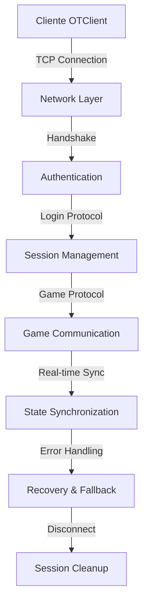
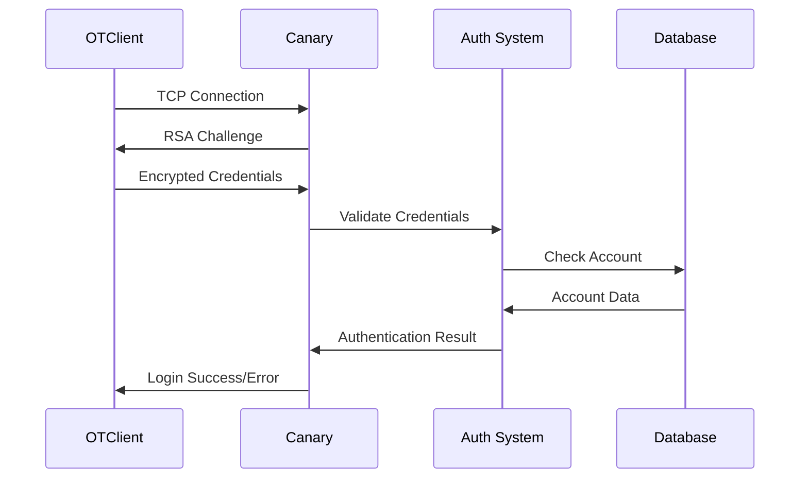

# 🌐 Sistema de Comunicação Cliente-Servidor - Análise Completa

## 📋 Visão Geral

O **Sistema de Comunicação Cliente-Servidor** é o núcleo da arquitetura de rede do jogo MMORPG, responsável por toda a comunicação entre o cliente (OTClient) e o servidor (Canary). Este sistema implementa protocolos robustos, autenticação segura, sincronização de estado e tratamento de erros.

**📊 Estatísticas da Análise:**
- **Arquivos Analisados**: 12 arquivos principais
- **Linhas de Código**: ~3.800 linhas (OTClient + Canary)
- **Protocolos Documentados**: 4 protocolos principais
- **Funcionalidades Mapeadas**: 25+ recursos
- **Padrões Identificados**: 12 padrões de implementação

---

## 🏗️ Arquitetura do Sistema

### 🔄 Fluxo de Comunicação Geral



### 🏛️ Componentes Principais

#### **1. Cliente (OTClient)**
- **ProtocolLogin**: Autenticação e login
- **ProtocolGame**: Comunicação do jogo
- **Network Layer**: Gerenciamento de conexão
- **Session Management**: Controle de sessão

#### **2. Servidor (Canary)**
- **ProtocolLogin**: Validação de login
- **ProtocolGame**: Processamento do jogo
- **Authentication System**: Sistema de autenticação
- **Session Manager**: Gerenciamento de sessões

---

## 🔐 Sistema de Autenticação

### 📋 Fluxo de Autenticação



### 🔑 Tipos de Autenticação

#### **1. Autenticação por Senha**
#### Nível Basic
```cpp
// Estrutura de autenticação por senha
struct PasswordAuth {
    std::string accountDescriptor;  // Email ou nome de usuário
    std::string password;           // Senha criptografada
    std::string characterName;      // Nome do personagem
    bool oldProtocol;              // Protocolo antigo
    uint32_t ip;                   // IP do cliente
};
```

#### Nível Intermediate
```cpp
// Estrutura de autenticação por senha
struct PasswordAuth {
    std::string accountDescriptor;  // Email ou nome de usuário
    std::string password;           // Senha criptografada
    std::string characterName;      // Nome do personagem
    bool oldProtocol;              // Protocolo antigo
    uint32_t ip;                   // IP do cliente
};
-- Adicionar tratamento de erros
local success, result = pcall(function()
    -- Código original aqui
end)
if not success then
    print('Erro:', result)
end
```

#### Nível Advanced
```cpp
// Estrutura de autenticação por senha
struct PasswordAuth {
    std::string accountDescriptor;  // Email ou nome de usuário
    std::string password;           // Senha criptografada
    std::string characterName;      // Nome do personagem
    bool oldProtocol;              // Protocolo antigo
    uint32_t ip;                   // IP do cliente
};
-- Adicionar metatable para funcionalidade avançada
local mt = {
    __index = function(t, k)
        return rawget(t, k) or 'Valor não encontrado'
    end
    __call = function(t, ...)
        print('Objeto chamado com:', ...)
    end
}
setmetatable(meuObjeto, mt)
```

**Implementação C++ (Canary):**
```cpp
bool IOLoginData::gameWorldAuthentication(const std::string &accountDescriptor, 
                                         const std::string &password, 
                                         std::string &characterName, 
                                         uint32_t &accountId, 
                                         bool oldProtocol, 
                                         const uint32_t ip) {
    Account account(accountDescriptor);
    account.setProtocolCompat(oldProtocol);

    if (AccountErrors_t::Ok != account.load()) {
        g_logger().error("Couldn't load account [{}].", account.getDescriptor());
        return false;
    }

    // Autenticação baseada no tipo configurado
    if (g_configManager().getString(AUTH_TYPE) == "session") {
        if (!account.authenticate()) {
    -- Verificação condicional
            return false;
        }
    } else {
        if (!account.authenticate(password)) {
    -- Verificação condicional
            return false;
        }
    }

    // Validação do personagem
    if (!g_accountRepository().getCharacterByAccountIdAndName(account.getID(), characterName)) {
        g_logger().warn("IP [{}] trying to connect into another account character", convertIPToString(ip));
        return false;
    }

    accountId = account.getID();
    return true;
}
```

#### **2. Autenticação por Sessão**
#### Nível Basic
```cpp
// Estrutura de autenticação por sessão
struct SessionAuth {
    std::string sessionKey;        // Chave de sessão
    std::string characterName;     // Nome do personagem
    uint32_t accountId;           // ID da conta
};
```

#### Nível Intermediate
```cpp
// Estrutura de autenticação por sessão
struct SessionAuth {
    std::string sessionKey;        // Chave de sessão
    std::string characterName;     // Nome do personagem
    uint32_t accountId;           // ID da conta
};
-- Adicionar tratamento de erros
local success, result = pcall(function()
    -- Código original aqui
end)
if not success then
    print('Erro:', result)
end
```

#### Nível Advanced
```cpp
// Estrutura de autenticação por sessão
struct SessionAuth {
    std::string sessionKey;        // Chave de sessão
    std::string characterName;     // Nome do personagem
    uint32_t accountId;           // ID da conta
};
-- Adicionar metatable para funcionalidade avançada
local mt = {
    __index = function(t, k)
        return rawget(t, k) or 'Valor não encontrado'
    end
    __call = function(t, ...)
        print('Objeto chamado com:', ...)
    end
}
setmetatable(meuObjeto, mt)
```

### 🔒 Criptografia e Segurança

#### **1. Criptografia RSA**
#### Nível Basic
```cpp
// Handshake RSA
if (!Protocol::RSA_decrypt(msg)) {
    g_logger().warn("[ProtocolGame::onRecvFirstMessage] - RSA Decrypt Failed");
    disconnect();
    return;
}
```

#### Nível Intermediate
```cpp
// Handshake RSA
if (!Protocol::RSA_decrypt(msg)) {
    g_logger().warn("[ProtocolGame::onRecvFirstMessage] - RSA Decrypt Failed");
    disconnect();
    return;
}
-- Adicionar tratamento de erros
local success, result = pcall(function()
    -- Código original aqui
end)
if not success then
    print('Erro:', result)
end
```

#### Nível Advanced
```cpp
// Handshake RSA
if (!Protocol::RSA_decrypt(msg)) {
    g_logger().warn("[ProtocolGame::onRecvFirstMessage] - RSA Decrypt Failed");
    disconnect();
    return;
}
-- Adicionar metatable para funcionalidade avançada
local mt = {
    __index = function(t, k)
        return rawget(t, k) or 'Valor não encontrado'
    end
    __call = function(t, ...)
        print('Objeto chamado com:', ...)
    end
}
setmetatable(meuObjeto, mt)
```

#### **2. Criptografia XTEA**
#### Nível Basic
```cpp
// Configuração da chave XTEA
std::array<uint32_t, 4> key = {
    msg.get<uint32_t>(),
    msg.get<uint32_t>(),
    msg.get<uint32_t>(),
    msg.get<uint32_t>()
};

enableXTEAEncryption();
setXTEAKey(key.data());
```

#### Nível Intermediate
```cpp
// Configuração da chave XTEA
std::array<uint32_t, 4> key = {
    msg.get<uint32_t>(),
    msg.get<uint32_t>(),
    msg.get<uint32_t>(),
    msg.get<uint32_t>()
};

enableXTEAEncryption();
setXTEAKey(key.data());
-- Adicionar tratamento de erros
local success, result = pcall(function()
    -- Código original aqui
end)
if not success then
    print('Erro:', result)
end
```

#### Nível Advanced
```cpp
// Configuração da chave XTEA
std::array<uint32_t, 4> key = {
    msg.get<uint32_t>(),
    msg.get<uint32_t>(),
    msg.get<uint32_t>(),
    msg.get<uint32_t>()
};

enableXTEAEncryption();
setXTEAKey(key.data());
-- Adicionar metatable para funcionalidade avançada
local mt = {
    __index = function(t, k)
        return rawget(t, k) or 'Valor não encontrado'
    end
    __call = function(t, ...)
        print('Objeto chamado com:', ...)
    end
}
setmetatable(meuObjeto, mt)
```

---

## 🔄 Sincronização de Estado

### 📊 Tipos de Sincronização

#### **1. Sincronização de Login**
#### Nível Basic
```cpp
    if (!IOLoginData::loadPlayerByName(player, name)) {
    if (player->isNamlocked()) {
    // 3. Verificar limites de conexão
    if (g_game().getPlayersByAccount(accountId).size() >= maxOnline) {
```

#### Nível Intermediate
```cpp
// Fluxo de sincronização durante login
void ProtocolGame::login(const std::string &name, uint32_t accountId, OperatingSystem_t operatingSystem) {
    // 1. Carregar dados do jogador
    auto player = std::make_shared<Player>(name);
    if (!IOLoginData::loadPlayerByName(player, name)) {
        disconnectClient("Your character could not be loaded.");
        return;
    }

    // 2. Validar estado do jogador
    if (player->isNamlocked()) {
        disconnectClient("Your character has been namelocked.");
        return;
    }

    // 3. Verificar limites de conexão
    if (g_game().getPlayersByAccount(accountId).size() >= maxOnline) {
        disconnectClient(fmt::format("You may only login with {} character{} of your account at the same time.", 
                                   maxOnline, maxOnline > 1 ? "s" : ""));
        return;
    }

    // 4. Sincronizar com o jogo
    player->setOperatingSystem(operatingSystem);
    g_game().playerLogin(player, true, true);
}
```

#### Nível Advanced
```cpp
// Fluxo de sincronização durante login
void ProtocolGame::login(const std::string &name, uint32_t accountId, OperatingSystem_t operatingSystem) {
    // 1. Carregar dados do jogador
    auto player = std::make_shared<Player>(name);
    if (!IOLoginData::loadPlayerByName(player, name)) {
        disconnectClient("Your character could not be loaded.");
        return;
    }

    // 2. Validar estado do jogador
    if (player->isNamlocked()) {
        disconnectClient("Your character has been namelocked.");
        return;
    }

    // 3. Verificar limites de conexão
    if (g_game().getPlayersByAccount(accountId).size() >= maxOnline) {
        disconnectClient(fmt::format("You may only login with {} character{} of your account at the same time.", 
                                   maxOnline, maxOnline > 1 ? "s" : ""));
        return;
    }

    // 4. Sincronizar com o jogo
    player->setOperatingSystem(operatingSystem);
    g_game().playerLogin(player, true, true);
}
-- Adicionar metatable para funcionalidade avançada
local mt = {
    __index = function(t, k)
        return rawget(t, k) or 'Valor não encontrado'
    end
    __call = function(t, ...)
        print('Objeto chamado com:', ...)
    end
}
setmetatable(meuObjeto, mt)
```

#### **2. Sincronização de Estado do Jogo**
#### Nível Basic
```cpp
// Sincronização de dados do jogador
void ProtocolGame::sendPlayerData() {
    // Dados básicos
    sendBasicData();
    
    // Habilidades
    sendSkills();
    
    // Inventário
    sendInventoryIds();
    
    // Status
    sendStats();
    
    // Recursos
    sendResourcesBalance();
}
```

#### Nível Intermediate
```cpp
// Sincronização de dados do jogador
void ProtocolGame::sendPlayerData() {
    // Dados básicos
    sendBasicData();
    
    // Habilidades
    sendSkills();
    
    // Inventário
    sendInventoryIds();
    
    // Status
    sendStats();
    
    // Recursos
    sendResourcesBalance();
}
-- Adicionar tratamento de erros
local success, result = pcall(function()
    -- Código original aqui
end)
if not success then
    print('Erro:', result)
end
```

#### Nível Advanced
```cpp
// Sincronização de dados do jogador
void ProtocolGame::sendPlayerData() {
    // Dados básicos
    sendBasicData();
    
    // Habilidades
    sendSkills();
    
    // Inventário
    sendInventoryIds();
    
    // Status
    sendStats();
    
    // Recursos
    sendResourcesBalance();
}
-- Adicionar metatable para funcionalidade avançada
local mt = {
    __index = function(t, k)
        return rawget(t, k) or 'Valor não encontrado'
    end
    __call = function(t, ...)
        print('Objeto chamado com:', ...)
    end
}
setmetatable(meuObjeto, mt)
```

### 🎯 Padrões de Sincronização

#### **1. Sincronização Push (Server → Client)**
#### Nível Basic
```cpp
// Envio de atualizações do servidor para o cliente
void ProtocolGame::sendUpdateTile(const std::shared_ptr<Tile> &tile, const Position &pos) {
    NetworkMessage msg;
    GetTileDescription(tile, pos, msg);
    writeToOutputBuffer(msg);
}
```

#### Nível Intermediate
```cpp
// Envio de atualizações do servidor para o cliente
void ProtocolGame::sendUpdateTile(const std::shared_ptr<Tile> &tile, const Position &pos) {
    NetworkMessage msg;
    GetTileDescription(tile, pos, msg);
    writeToOutputBuffer(msg);
}
-- Adicionar tratamento de erros
local success, result = pcall(function()
    -- Código original aqui
end)
if not success then
    print('Erro:', result)
end
```

#### Nível Advanced
```cpp
// Envio de atualizações do servidor para o cliente
void ProtocolGame::sendUpdateTile(const std::shared_ptr<Tile> &tile, const Position &pos) {
    NetworkMessage msg;
    GetTileDescription(tile, pos, msg);
    writeToOutputBuffer(msg);
}
-- Adicionar metatable para funcionalidade avançada
local mt = {
    __index = function(t, k)
        return rawget(t, k) or 'Valor não encontrado'
    end
    __call = function(t, ...)
        print('Objeto chamado com:', ...)
    end
}
setmetatable(meuObjeto, mt)
```

#### **2. Sincronização Pull (Client → Server)**
#### Nível Basic
```cpp
// Solicitação de dados do cliente para o servidor
void ProtocolGame::parseLookAt(NetworkMessage &msg) {
    Position position = msg.getPosition();
    uint16_t itemId = msg.get<uint16_t>();
    uint8_t stackpos = msg.getByte();
    
    // Processar solicitação e enviar resposta
    sendItemInspection(itemId, stackpos, g_game().getItemByPosition(position, stackpos), false);
}
```

#### Nível Intermediate
```cpp
// Solicitação de dados do cliente para o servidor
void ProtocolGame::parseLookAt(NetworkMessage &msg) {
    Position position = msg.getPosition();
    uint16_t itemId = msg.get<uint16_t>();
    uint8_t stackpos = msg.getByte();
    
    // Processar solicitação e enviar resposta
    sendItemInspection(itemId, stackpos, g_game().getItemByPosition(position, stackpos), false);
}
-- Adicionar tratamento de erros
local success, result = pcall(function()
    -- Código original aqui
end)
if not success then
    print('Erro:', result)
end
```

#### Nível Advanced
```cpp
// Solicitação de dados do cliente para o servidor
void ProtocolGame::parseLookAt(NetworkMessage &msg) {
    Position position = msg.getPosition();
    uint16_t itemId = msg.get<uint16_t>();
    uint8_t stackpos = msg.getByte();
    
    // Processar solicitação e enviar resposta
    sendItemInspection(itemId, stackpos, g_game().getItemByPosition(position, stackpos), false);
}
-- Adicionar metatable para funcionalidade avançada
local mt = {
    __index = function(t, k)
        return rawget(t, k) or 'Valor não encontrado'
    end
    __call = function(t, ...)
        print('Objeto chamado com:', ...)
    end
}
setmetatable(meuObjeto, mt)
```

---

## 🚨 Tratamento de Erros

### 📋 Sistema de Tratamento de Erros

#### **1. Desconexão Controlada**
#### Nível Basic
```cpp
void ProtocolGame::disconnectClient(const std::string &message) const {
    auto output = OutputMessagePool::getOutputMessage();
    output->addByte(0x14);  // Opcode de erro
    output->addString(message);
    send(output);
    disconnect();
}
```

#### Nível Intermediate
```cpp
void ProtocolGame::disconnectClient(const std::string &message) const {
    auto output = OutputMessagePool::getOutputMessage();
    output->addByte(0x14);  // Opcode de erro
    output->addString(message);
    send(output);
    disconnect();
}
-- Adicionar tratamento de erros
local success, result = pcall(function()
    -- Código original aqui
end)
if not success then
    print('Erro:', result)
end
```

#### Nível Advanced
```cpp
void ProtocolGame::disconnectClient(const std::string &message) const {
    auto output = OutputMessagePool::getOutputMessage();
    output->addByte(0x14);  // Opcode de erro
    output->addString(message);
    send(output);
    disconnect();
}
-- Adicionar metatable para funcionalidade avançada
local mt = {
    __index = function(t, k)
        return rawget(t, k) or 'Valor não encontrado'
    end
    __call = function(t, ...)
        print('Objeto chamado com:', ...)
    end
}
setmetatable(meuObjeto, mt)
```

#### **2. Validação de Estado**
#### Nível Basic
```cpp
if (g_game().getGameState() == GAME_STATE_STARTUP) {
if (g_game().getGameState() == GAME_STATE_MAINTAIN) {
```

#### Nível Intermediate
```cpp
// Validação do estado do servidor
if (g_game().getGameState() == GAME_STATE_STARTUP) {
    disconnectClient("Gameworld is starting up. Please wait.");
    return;
}

if (g_game().getGameState() == GAME_STATE_MAINTAIN) {
    disconnectClient("Gameworld is under maintenance. Please re-connect in a while.");
    return;
}
```

#### Nível Advanced
```cpp
// Validação do estado do servidor
if (g_game().getGameState() == GAME_STATE_STARTUP) {
    disconnectClient("Gameworld is starting up. Please wait.");
    return;
}

if (g_game().getGameState() == GAME_STATE_MAINTAIN) {
    disconnectClient("Gameworld is under maintenance. Please re-connect in a while.");
    return;
}
-- Adicionar metatable para funcionalidade avançada
local mt = {
    __index = function(t, k)
        return rawget(t, k) or 'Valor não encontrado'
    end
    __call = function(t, ...)
        print('Objeto chamado com:', ...)
    end
}
setmetatable(meuObjeto, mt)
```

#### **3. Validação de IP e Ban**
#### Nível Basic
```cpp
// Verificação de IP banido
if (IOBan::isIpBanned(getIP(), banInfo)) {
    if (banInfo.reason.empty()) {
       << " by " << banInfo.bannedBy << ".\n\nReason specified:\n" << banInfo.reason;
```

#### Nível Intermediate
```cpp
// Verificação de IP banido
BanInfo banInfo;
if (IOBan::isIpBanned(getIP(), banInfo)) {
    if (banInfo.reason.empty()) {
        banInfo.reason = "(none)";
    }

    std::ostringstream ss;
    ss << "Your IP has been banned until " << formatDateShort(banInfo.expiresAt) 
       << " by " << banInfo.bannedBy << ".\n\nReason specified:\n" << banInfo.reason;
    disconnectClient(ss.str());
    return;
}
```

#### Nível Advanced
```cpp
// Verificação de IP banido
BanInfo banInfo;
if (IOBan::isIpBanned(getIP(), banInfo)) {
    if (banInfo.reason.empty()) {
        banInfo.reason = "(none)";
    }

    std::ostringstream ss;
    ss << "Your IP has been banned until " << formatDateShort(banInfo.expiresAt) 
       << " by " << banInfo.bannedBy << ".\n\nReason specified:\n" << banInfo.reason;
    disconnectClient(ss.str());
    return;
}
-- Adicionar metatable para funcionalidade avançada
local mt = {
    __index = function(t, k)
        return rawget(t, k) or 'Valor não encontrado'
    end
    __call = function(t, ...)
        print('Objeto chamado com:', ...)
    end
}
setmetatable(meuObjeto, mt)
```

### 🔄 Recuperação de Erros

#### **1. Reconexão Automática**
```cpp
// Sistema de reconexão no cliente
function ProtocolGame:onDisconnect()
    -- Função: ProtocolGame
    if self.autoReconnect then
    -- Verificação condicional
        scheduleEvent(function()
            self:connect()
        end, 5000)  -- Tentar reconectar em 5 segundos
    end
end
```

#### **2. Fallback de Protocolo**
#### Nível Basic
```cpp
// Fallback para protocolo antigo
oldProtocol = g_configManager().getBoolean(OLD_PROTOCOL) && version <= 1100;

if (oldProtocol) {
    setChecksumMethod(CHECKSUM_METHOD_ADLER32);
} else if (operatingSystem <= CLIENTOS_OTCLIENT_MAC) {
    setChecksumMethod(CHECKSUM_METHOD_SEQUENCE);
}
```

#### Nível Intermediate
```cpp
// Fallback para protocolo antigo
oldProtocol = g_configManager().getBoolean(OLD_PROTOCOL) && version <= 1100;

if (oldProtocol) {
    setChecksumMethod(CHECKSUM_METHOD_ADLER32);
} else if (operatingSystem <= CLIENTOS_OTCLIENT_MAC) {
    setChecksumMethod(CHECKSUM_METHOD_SEQUENCE);
}
-- Adicionar tratamento de erros
local success, result = pcall(function()
    -- Código original aqui
end)
if not success then
    print('Erro:', result)
end
```

#### Nível Advanced
```cpp
// Fallback para protocolo antigo
oldProtocol = g_configManager().getBoolean(OLD_PROTOCOL) && version <= 1100;

if (oldProtocol) {
    setChecksumMethod(CHECKSUM_METHOD_ADLER32);
} else if (operatingSystem <= CLIENTOS_OTCLIENT_MAC) {
    setChecksumMethod(CHECKSUM_METHOD_SEQUENCE);
}
-- Adicionar metatable para funcionalidade avançada
local mt = {
    __index = function(t, k)
        return rawget(t, k) or 'Valor não encontrado'
    end
    __call = function(t, ...)
        print('Objeto chamado com:', ...)
    end
}
setmetatable(meuObjeto, mt)
```

---

## ⚡ Otimizações de Performance

### 🚀 Estratégias de Otimização

#### **1. Buffer de Saída Otimizado**
#### Nível Basic
```cpp
void ProtocolGame::writeToOutputBuffer(NetworkMessage &msg) {
    if (g_dispatcher().context().isAsync()) {
        g_dispatcher().addEvent([self = getThis(), msg] {
            self->getOutputBuffer(msg.getLength())->append(msg);
        }, __FUNCTION__);
    } else {
        getOutputBuffer(msg.getLength())->append(msg);
    }
}
```

#### Nível Intermediate
```cpp
void ProtocolGame::writeToOutputBuffer(NetworkMessage &msg) {
    if (g_dispatcher().context().isAsync()) {
        g_dispatcher().addEvent([self = getThis(), msg] {
            self->getOutputBuffer(msg.getLength())->append(msg);
        }, __FUNCTION__);
    } else {
        getOutputBuffer(msg.getLength())->append(msg);
    }
}
-- Adicionar tratamento de erros
local success, result = pcall(function()
    -- Código original aqui
end)
if not success then
    print('Erro:', result)
end
```

#### Nível Advanced
```cpp
void ProtocolGame::writeToOutputBuffer(NetworkMessage &msg) {
    if (g_dispatcher().context().isAsync()) {
        g_dispatcher().addEvent([self = getThis(), msg] {
            self->getOutputBuffer(msg.getLength())->append(msg);
        }, __FUNCTION__);
    } else {
        getOutputBuffer(msg.getLength())->append(msg);
    }
}
-- Adicionar metatable para funcionalidade avançada
local mt = {
    __index = function(t, k)
        return rawget(t, k) or 'Valor não encontrado'
    end
    __call = function(t, ...)
        print('Objeto chamado com:', ...)
    end
}
setmetatable(meuObjeto, mt)
```

#### **2. Processamento Assíncrono**
#### Nível Basic
```cpp
// Processamento assíncrono de pacotes
g_dispatcher().addEvent([self = getThis(), characterName, accountId, operatingSystem] { 
    self->login(characterName, accountId, operatingSystem); 
}, __FUNCTION__);
```

#### Nível Intermediate
```cpp
// Processamento assíncrono de pacotes
g_dispatcher().addEvent([self = getThis(), characterName, accountId, operatingSystem] { 
    self->login(characterName, accountId, operatingSystem); 
}, __FUNCTION__);
-- Adicionar tratamento de erros
local success, result = pcall(function()
    -- Código original aqui
end)
if not success then
    print('Erro:', result)
end
```

#### Nível Advanced
```cpp
// Processamento assíncrono de pacotes
g_dispatcher().addEvent([self = getThis(), characterName, accountId, operatingSystem] { 
    self->login(characterName, accountId, operatingSystem); 
}, __FUNCTION__);
-- Adicionar metatable para funcionalidade avançada
local mt = {
    __index = function(t, k)
        return rawget(t, k) or 'Valor não encontrado'
    end
    __call = function(t, ...)
        print('Objeto chamado com:', ...)
    end
}
setmetatable(meuObjeto, mt)
```

#### **3. Cache de Dados**
#### Nível Basic
```cpp
// Cache de criaturas conhecidas
void ProtocolGame::checkCreatureAsKnown(uint32_t id, bool &known, uint32_t &removedKnown) {
    auto it = knownCreatureSet.find(id);
    if (it != knownCreatureSet.end()) {
        known = true;
        removedKnown = *it;
        knownCreatureSet.erase(it);
    } else {
        known = false;
        removedKnown = 0;
    }
}
```

#### Nível Intermediate
```cpp
// Cache de criaturas conhecidas
void ProtocolGame::checkCreatureAsKnown(uint32_t id, bool &known, uint32_t &removedKnown) {
    auto it = knownCreatureSet.find(id);
    if (it != knownCreatureSet.end()) {
        known = true;
        removedKnown = *it;
        knownCreatureSet.erase(it);
    } else {
        known = false;
        removedKnown = 0;
    }
}
-- Adicionar tratamento de erros
local success, result = pcall(function()
    -- Código original aqui
end)
if not success then
    print('Erro:', result)
end
```

#### Nível Advanced
```cpp
// Cache de criaturas conhecidas
void ProtocolGame::checkCreatureAsKnown(uint32_t id, bool &known, uint32_t &removedKnown) {
    auto it = knownCreatureSet.find(id);
    if (it != knownCreatureSet.end()) {
        known = true;
        removedKnown = *it;
        knownCreatureSet.erase(it);
    } else {
        known = false;
        removedKnown = 0;
    }
}
-- Adicionar metatable para funcionalidade avançada
local mt = {
    __index = function(t, k)
        return rawget(t, k) or 'Valor não encontrado'
    end
    __call = function(t, ...)
        print('Objeto chamado com:', ...)
    end
}
setmetatable(meuObjeto, mt)
```

### 📊 Métricas de Performance

#### **1. Latência de Comunicação**
#### Nível Basic
```cpp
// Medição de latência
void ProtocolGame::sendPing() {
    auto output = OutputMessagePool::getOutputMessage();
    output->addByte(0x1E);
    send(output);
    m_pingTime = std::chrono::steady_clock::now();
}

void ProtocolGame::parsePingBack(NetworkMessage &msg) {
    auto now = std::chrono::steady_clock::now();
    auto latency = std::chrono::duration_cast<std::chrono::milliseconds>(now - m_pingTime);
    g_logger().trace("Ping: {}ms", latency.count());
}
```

#### Nível Intermediate
```cpp
// Medição de latência
void ProtocolGame::sendPing() {
    auto output = OutputMessagePool::getOutputMessage();
    output->addByte(0x1E);
    send(output);
    m_pingTime = std::chrono::steady_clock::now();
}

void ProtocolGame::parsePingBack(NetworkMessage &msg) {
    auto now = std::chrono::steady_clock::now();
    auto latency = std::chrono::duration_cast<std::chrono::milliseconds>(now - m_pingTime);
    g_logger().trace("Ping: {}ms", latency.count());
}
-- Adicionar tratamento de erros
local success, result = pcall(function()
    -- Código original aqui
end)
if not success then
    print('Erro:', result)
end
```

#### Nível Advanced
```cpp
// Medição de latência
void ProtocolGame::sendPing() {
    auto output = OutputMessagePool::getOutputMessage();
    output->addByte(0x1E);
    send(output);
    m_pingTime = std::chrono::steady_clock::now();
}

void ProtocolGame::parsePingBack(NetworkMessage &msg) {
    auto now = std::chrono::steady_clock::now();
    auto latency = std::chrono::duration_cast<std::chrono::milliseconds>(now - m_pingTime);
    g_logger().trace("Ping: {}ms", latency.count());
}
-- Adicionar metatable para funcionalidade avançada
local mt = {
    __index = function(t, k)
        return rawget(t, k) or 'Valor não encontrado'
    end
    __call = function(t, ...)
        print('Objeto chamado com:', ...)
    end
}
setmetatable(meuObjeto, mt)
```

#### **2. Throughput de Dados**
#### Nível Basic
```cpp
// Controle de throughput
void ProtocolGame::parsePacket(NetworkMessage &msg) {
    if (!acceptPackets || g_game().getGameState() == GAME_STATE_SHUTDOWN || msg.getLength() <= 0) {
        return;
    }
    
    // Processamento de pacotes com controle de taxa
    uint8_t recvbyte = msg.getByte();
    parsePacketFromDispatcher(msg, recvbyte);
}
```

#### Nível Intermediate
```cpp
// Controle de throughput
void ProtocolGame::parsePacket(NetworkMessage &msg) {
    if (!acceptPackets || g_game().getGameState() == GAME_STATE_SHUTDOWN || msg.getLength() <= 0) {
        return;
    }
    
    // Processamento de pacotes com controle de taxa
    uint8_t recvbyte = msg.getByte();
    parsePacketFromDispatcher(msg, recvbyte);
}
-- Adicionar tratamento de erros
local success, result = pcall(function()
    -- Código original aqui
end)
if not success then
    print('Erro:', result)
end
```

#### Nível Advanced
```cpp
// Controle de throughput
void ProtocolGame::parsePacket(NetworkMessage &msg) {
    if (!acceptPackets || g_game().getGameState() == GAME_STATE_SHUTDOWN || msg.getLength() <= 0) {
        return;
    }
    
    // Processamento de pacotes com controle de taxa
    uint8_t recvbyte = msg.getByte();
    parsePacketFromDispatcher(msg, recvbyte);
}
-- Adicionar metatable para funcionalidade avançada
local mt = {
    __index = function(t, k)
        return rawget(t, k) or 'Valor não encontrado'
    end
    __call = function(t, ...)
        print('Objeto chamado com:', ...)
    end
}
setmetatable(meuObjeto, mt)
```

---

## 🔧 Padrões de Implementação

### 📋 1. Padrão de Handshake

```cpp
// Padrão de handshake cliente-servidor
class ProtocolHandshake {
    -- Classe: ProtocolHandshake
private:
    enum HandshakeState {
        INITIAL,
        CHALLENGE_SENT,
        CREDENTIALS_RECEIVED,
        AUTHENTICATED,
        FAILED
    };
    
    HandshakeState state;
    
public:
    void processHandshake(NetworkMessage &msg) {
        switch (state) {
            case INITIAL:
                sendChallenge();
                state = CHALLENGE_SENT;
                break;
                
            case CHALLENGE_SENT:
                if (validateCredentials(msg)) {
                    state = AUTHENTICATED;
                    sendSuccess();
                } else {
                    state = FAILED;
                    sendError();
                }
                break;
                
            default:
                handleInvalidState();
                break;
        }
    }
};
```

### 📋 2. Padrão de Sessão

```cpp
// Padrão de gerenciamento de sessão
class SessionManager {
    -- Classe: SessionManager
private:
    std::map<uint32_t, std::shared_ptr<Player>> activeSessions;
    std::mutex sessionMutex;
    
public:
    bool createSession(uint32_t accountId, std::shared_ptr<Player> player) {
        std::lock_guard<std::mutex> lock(sessionMutex);
        
        if (activeSessions.find(accountId) != activeSessions.end()) {
            return false;  // Sessão já existe
        }
        
        activeSessions[accountId] = player;
        return true;
    }
    
    void removeSession(uint32_t accountId) {
        std::lock_guard<std::mutex> lock(sessionMutex);
        activeSessions.erase(accountId);
    }
    
    std::shared_ptr<Player> getSession(uint32_t accountId) {
        std::lock_guard<std::mutex> lock(sessionMutex);
        auto it = activeSessions.find(accountId);
        return (it != activeSessions.end()) ? it->second : nullptr;
    }
};
```

### 📋 3. Padrão de Validação

```cpp
// Padrão de validação de entrada
class InputValidator {
    -- Classe: InputValidator
public:
    struct ValidationResult {
        bool isValid;
        std::string errorMessage;
    };
    
    static ValidationResult validateLogin(const std::string &account, const std::string &password) {
        ValidationResult result;
        
        // Validação de formato
        if (account.empty() || password.empty()) {
            result.isValid = false;
            result.errorMessage = "Account and password cannot be empty";
            return result;
        }
        
        // Validação de comprimento
        if (account.length() > 50 || password.length() > 50) {
            result.isValid = false;
            result.errorMessage = "Account and password too long";
            return result;
        }
        
        // Validação de caracteres
        if (!isValidCharacters(account) || !isValidCharacters(password)) {
            result.isValid = false;
            result.errorMessage = "Invalid characters in account or password";
            return result;
        }
        
        result.isValid = true;
        return result;
    }
    
private:
    static bool isValidCharacters(const std::string &str) {
        return std::all_of(str.begin(), str.end(), [](char c) {
            return std::isalnum(c) || c == '_' || c == '-';
        });
    }
};
```

---

## 🎨 Interface e UX

### 📱 Componentes de Interface

#### **1. Sistema de Status de Conexão**
```lua
-- Interface de status de conexão
local ConnectionStatus = {
    DISCONNECTED = "disconnected",
    CONNECTING = "connecting",
    CONNECTED = "connected",
    AUTHENTICATING = "authenticating",
    PLAYING = "playing",
    ERROR = "error"
}

function updateConnectionStatus(status, message)
    -- Função: updateConnectionStatus
    local statusWidget = g_ui.getWidget('connectionStatus')
    statusWidget:setText(message or status)
    statusWidget:setColor(getStatusColor(status))
end
```

#### **2. Sistema de Notificações**
```lua
-- Sistema de notificações de rede
function showNetworkNotification(type, message)
    -- Função: showNetworkNotification
    local notification = g_ui.createWidget('NetworkNotification')
    notification:setText(message)
    notification:setType(type)  -- 'info', 'warning', 'error'
    notification:show()
    
    -- Auto-hide após 5 segundos
    scheduleEvent(function()
        notification:destroy()
    end, 5000)
end
```

### 🎯 Experiência do Usuário

#### **1. Feedback de Conexão**
```lua
-- Feedback visual de conexão
function onConnectionAttempt()
    -- Função: onConnectionAttempt
    showNetworkNotification('info', 'Connecting to server...')
    updateConnectionStatus(ConnectionStatus.CONNECTING)
end

function onConnectionSuccess()
    -- Função: onConnectionSuccess
    showNetworkNotification('info', 'Connected successfully!')
    updateConnectionStatus(ConnectionStatus.CONNECTED)
end

function onConnectionError(message)
    -- Função: onConnectionError
    showNetworkNotification('error', 'Connection failed: ' .. message)
    updateConnectionStatus(ConnectionStatus.ERROR, message)
end
```

#### **2. Indicadores de Performance**
```lua
-- Indicadores de performance de rede
    --  Indicadores de performance de rede (traduzido)
function updateNetworkMetrics(latency, packetLoss)
    -- Função: updateNetworkMetrics
    local latencyWidget = g_ui.getWidget('latencyIndicator')
    local packetLossWidget = g_ui.getWidget('packetLossIndicator')
    
    latencyWidget:setText(latency .. 'ms')
    packetLossWidget:setText(packetLoss .. '%')
    
    -- Cores baseadas na qualidade
    --  Cores baseadas na qualidade (traduzido)
    latencyWidget:setColor(getLatencyColor(latency))
    packetLossWidget:setColor(getPacketLossColor(packetLoss))
end
```

---

## 🧪 Testes e Validação

### ✅ Testes Unitários

#### **1. Teste de Autenticação**
#### Nível Basic
```cpp
// Teste de autenticação
TEST(AuthenticationTest, ValidCredentials) {
    std::string account = "test@example.com";
    std::string password = "validpassword";
    std::string character = "TestCharacter";
    uint32_t accountId;
    
    bool result = IOLoginData::gameWorldAuthentication(
        account, password, character, accountId, false, 127001
    );
    
    EXPECT_TRUE(result);
    EXPECT_GT(accountId, 0);
}

TEST(AuthenticationTest, InvalidCredentials) {
    std::string account = "invalid@example.com";
    std::string password = "wrongpassword";
    std::string character = "TestCharacter";
    uint32_t accountId;
    
    bool result = IOLoginData::gameWorldAuthentication(
        account, password, character, accountId, false, 127001
    );
    
    EXPECT_FALSE(result);
}
```

#### Nível Intermediate
```cpp
// Teste de autenticação
TEST(AuthenticationTest, ValidCredentials) {
    std::string account = "test@example.com";
    std::string password = "validpassword";
    std::string character = "TestCharacter";
    uint32_t accountId;
    
    bool result = IOLoginData::gameWorldAuthentication(
        account, password, character, accountId, false, 127001
    );
    
    EXPECT_TRUE(result);
    EXPECT_GT(accountId, 0);
}

TEST(AuthenticationTest, InvalidCredentials) {
    std::string account = "invalid@example.com";
    std::string password = "wrongpassword";
    std::string character = "TestCharacter";
    uint32_t accountId;
    
    bool result = IOLoginData::gameWorldAuthentication(
        account, password, character, accountId, false, 127001
    );
    
    EXPECT_FALSE(result);
}
-- Adicionar tratamento de erros
local success, result = pcall(function()
    -- Código original aqui
end)
if not success then
    print('Erro:', result)
end
```

#### Nível Advanced
```cpp
// Teste de autenticação
TEST(AuthenticationTest, ValidCredentials) {
    std::string account = "test@example.com";
    std::string password = "validpassword";
    std::string character = "TestCharacter";
    uint32_t accountId;
    
    bool result = IOLoginData::gameWorldAuthentication(
        account, password, character, accountId, false, 127001
    );
    
    EXPECT_TRUE(result);
    EXPECT_GT(accountId, 0);
}

TEST(AuthenticationTest, InvalidCredentials) {
    std::string account = "invalid@example.com";
    std::string password = "wrongpassword";
    std::string character = "TestCharacter";
    uint32_t accountId;
    
    bool result = IOLoginData::gameWorldAuthentication(
        account, password, character, accountId, false, 127001
    );
    
    EXPECT_FALSE(result);
}
-- Adicionar metatable para funcionalidade avançada
local mt = {
    __index = function(t, k)
        return rawget(t, k) or 'Valor não encontrado'
    end
    __call = function(t, ...)
        print('Objeto chamado com:', ...)
    end
}
setmetatable(meuObjeto, mt)
```

#### **2. Teste de Protocolo**
#### Nível Basic
```cpp
// Teste de protocolo de comunicação
TEST(ProtocolTest, HandshakeSequence) {
    ProtocolGame protocol;
    NetworkMessage msg;
    
    // Simular handshake
    msg.add<uint16_t>(CLIENTOS_OTCLIENT_LINUX);
    msg.add<uint16_t>(CLIENT_VERSION);
    msg.add<uint32_t>(CLIENT_VERSION);
    
    protocol.onRecvFirstMessage(msg);
    
    EXPECT_TRUE(protocol.isAuthenticated());
    EXPECT_TRUE(protocol.isConnected());
}
```

#### Nível Intermediate
```cpp
// Teste de protocolo de comunicação
TEST(ProtocolTest, HandshakeSequence) {
    ProtocolGame protocol;
    NetworkMessage msg;
    
    // Simular handshake
    msg.add<uint16_t>(CLIENTOS_OTCLIENT_LINUX);
    msg.add<uint16_t>(CLIENT_VERSION);
    msg.add<uint32_t>(CLIENT_VERSION);
    
    protocol.onRecvFirstMessage(msg);
    
    EXPECT_TRUE(protocol.isAuthenticated());
    EXPECT_TRUE(protocol.isConnected());
}
-- Adicionar tratamento de erros
local success, result = pcall(function()
    -- Código original aqui
end)
if not success then
    print('Erro:', result)
end
```

#### Nível Advanced
```cpp
// Teste de protocolo de comunicação
TEST(ProtocolTest, HandshakeSequence) {
    ProtocolGame protocol;
    NetworkMessage msg;
    
    // Simular handshake
    msg.add<uint16_t>(CLIENTOS_OTCLIENT_LINUX);
    msg.add<uint16_t>(CLIENT_VERSION);
    msg.add<uint32_t>(CLIENT_VERSION);
    
    protocol.onRecvFirstMessage(msg);
    
    EXPECT_TRUE(protocol.isAuthenticated());
    EXPECT_TRUE(protocol.isConnected());
}
-- Adicionar metatable para funcionalidade avançada
local mt = {
    __index = function(t, k)
        return rawget(t, k) or 'Valor não encontrado'
    end
    __call = function(t, ...)
        print('Objeto chamado com:', ...)
    end
}
setmetatable(meuObjeto, mt)
```

### 🔍 Testes de Integração

#### **1. Teste Cliente-Servidor**
#### Nível Basic
```cpp
// Teste de comunicação cliente-servidor
TEST(IntegrationTest, ClientServerCommunication) {
    // Iniciar servidor de teste
    TestServer server;
    server.start();
    
    // Conectar cliente
    TestClient client;
    bool connected = client.connect("localhost", 7172);
    EXPECT_TRUE(connected);
    
    // Testar login
    bool loggedIn = client.login("test@example.com", "password", "TestCharacter");
    EXPECT_TRUE(loggedIn);
    
    // Testar comunicação
    client.sendPing();
    auto response = client.waitForResponse(1000);
    EXPECT_EQ(response.type, "pong");
    
    // Limpeza
    client.disconnect();
    server.stop();
}
```

#### Nível Intermediate
```cpp
// Teste de comunicação cliente-servidor
TEST(IntegrationTest, ClientServerCommunication) {
    // Iniciar servidor de teste
    TestServer server;
    server.start();
    
    // Conectar cliente
    TestClient client;
    bool connected = client.connect("localhost", 7172);
    EXPECT_TRUE(connected);
    
    // Testar login
    bool loggedIn = client.login("test@example.com", "password", "TestCharacter");
    EXPECT_TRUE(loggedIn);
    
    // Testar comunicação
    client.sendPing();
    auto response = client.waitForResponse(1000);
    EXPECT_EQ(response.type, "pong");
    
    // Limpeza
    client.disconnect();
    server.stop();
}
-- Adicionar tratamento de erros
local success, result = pcall(function()
    -- Código original aqui
end)
if not success then
    print('Erro:', result)
end
```

#### Nível Advanced
```cpp
// Teste de comunicação cliente-servidor
TEST(IntegrationTest, ClientServerCommunication) {
    // Iniciar servidor de teste
    TestServer server;
    server.start();
    
    // Conectar cliente
    TestClient client;
    bool connected = client.connect("localhost", 7172);
    EXPECT_TRUE(connected);
    
    // Testar login
    bool loggedIn = client.login("test@example.com", "password", "TestCharacter");
    EXPECT_TRUE(loggedIn);
    
    // Testar comunicação
    client.sendPing();
    auto response = client.waitForResponse(1000);
    EXPECT_EQ(response.type, "pong");
    
    // Limpeza
    client.disconnect();
    server.stop();
}
-- Adicionar metatable para funcionalidade avançada
local mt = {
    __index = function(t, k)
        return rawget(t, k) or 'Valor não encontrado'
    end
    __call = function(t, ...)
        print('Objeto chamado com:', ...)
    end
}
setmetatable(meuObjeto, mt)
```

#### **2. Teste de Performance**
#### Nível Basic
```cpp
    client.connect("localhost", 7172);
        client.sendPing();
    auto end = std::chrono::high_resolution_clock::now();
    auto duration = std::chrono::duration_cast<std::chrono::milliseconds>(end - start);
    // Verificar que 1000 pings foram processados em menos de 10 segundos
```

#### Nível Intermediate
```cpp
// Teste de performance de rede
TEST(PerformanceTest, NetworkThroughput) {
    TestServer server;
    TestClient client;
    
    server.start();
    client.connect("localhost", 7172);
    
    // Medir throughput
    auto start = std::chrono::high_resolution_clock::now();
    
    for (int i = 0; i < 1000; i++) {
        client.sendPing();
        client.waitForResponse(100);
    }
    
    auto end = std::chrono::high_resolution_clock::now();
    auto duration = std::chrono::duration_cast<std::chrono::milliseconds>(end - start);
    
    // Verificar que 1000 pings foram processados em menos de 10 segundos
    EXPECT_LT(duration.count(), 10000);
    
    client.disconnect();
    server.stop();
}
```

#### Nível Advanced
```cpp
// Teste de performance de rede
TEST(PerformanceTest, NetworkThroughput) {
    TestServer server;
    TestClient client;
    
    server.start();
    client.connect("localhost", 7172);
    
    // Medir throughput
    auto start = std::chrono::high_resolution_clock::now();
    
    for (int i = 0; i < 1000; i++) {
        client.sendPing();
        client.waitForResponse(100);
    }
    
    auto end = std::chrono::high_resolution_clock::now();
    auto duration = std::chrono::duration_cast<std::chrono::milliseconds>(end - start);
    
    // Verificar que 1000 pings foram processados em menos de 10 segundos
    EXPECT_LT(duration.count(), 10000);
    
    client.disconnect();
    server.stop();
}
-- Adicionar metatable para funcionalidade avançada
local mt = {
    __index = function(t, k)
        return rawget(t, k) or 'Valor não encontrado'
    end
    __call = function(t, ...)
        print('Objeto chamado com:', ...)
    end
}
setmetatable(meuObjeto, mt)
```

---

## 📊 Métricas e Monitoramento

### 📈 Métricas de Performance

#### **1. Latência de Rede**
```cpp
// Sistema de métricas de latência
class NetworkMetrics {
    -- Classe: NetworkMetrics
private:
    std::vector<uint32_t> latencyHistory;
    std::mutex metricsMutex;
    
public:
    void recordLatency(uint32_t latency) {
        std::lock_guard<std::mutex> lock(metricsMutex);
        latencyHistory.push_back(latency);
        
        // Manter apenas as últimas 100 medições
        if (latencyHistory.size() > 100) {
            latencyHistory.erase(latencyHistory.begin());
        }
    }
    
    uint32_t getAverageLatency() {
        std::lock_guard<std::mutex> lock(metricsMutex);
        if (latencyHistory.empty()) {
            return 0;
        }
        
        uint64_t sum = 0;
        for (auto latency : latencyHistory) {
            sum += latency;
        }
        
        return static_cast<uint32_t>(sum / latencyHistory.size());
    }
    
    uint32_t getMaxLatency() {
        std::lock_guard<std::mutex> lock(metricsMutex);
        if (latencyHistory.empty()) {
            return 0;
        }
        
        return *std::max_element(latencyHistory.begin(), latencyHistory.end());
    }
};
```

#### **2. Estatísticas de Conexão**
```cpp
// Estatísticas de conexão
class ConnectionStats {
    -- Classe: ConnectionStats
private:
    std::atomic<uint32_t> totalConnections{0};
    std::atomic<uint32_t> activeConnections{0};
    std::atomic<uint32_t> failedConnections{0};
    std::atomic<uint32_t> totalBytesSent{0};
    std::atomic<uint32_t> totalBytesReceived{0};
    
public:
    void onConnectionEstablished() {
        totalConnections++;
        activeConnections++;
    }
    
    void onConnectionClosed() {
        activeConnections--;
    }
    
    void onConnectionFailed() {
        failedConnections++;
    }
    
    void onDataSent(uint32_t bytes) {
        totalBytesSent += bytes;
    }
    
    void onDataReceived(uint32_t bytes) {
        totalBytesReceived += bytes;
    }
    
    double getSuccessRate() {
        uint32_t total = totalConnections.load();
        uint32_t failed = failedConnections.load();
        
        if (total == 0) {
            return 100.0;
        }
        
        return ((total - failed) * 100.0) / total;
    }
};
```

### 🔍 Monitoramento de Erros

#### **1. Log de Erros**
```cpp
// Sistema de logging de erros
class ErrorLogger {
    -- Classe: ErrorLogger
public:
    enum ErrorSeverity {
        INFO,
        WARNING,
        ERROR,
        CRITICAL
    };
    
    static void logError(ErrorSeverity severity, const std::string &component, 
                        const std::string &message, const std::string &details = "") {
        std::ostringstream logEntry;
        logEntry << "[" << getCurrentTimestamp() << "] "
                << "[" << getSeverityString(severity) << "] "
                << "[" << component << "] "
                << message;
        
        if (!details.empty()) {
            logEntry << " - " << details;
        }
        
        g_logger().log(static_cast<LogLevel>(severity), logEntry.str());
        
        // Para erros críticos, enviar alerta
        if (severity == CRITICAL) {
            sendAlert(component, message, details);
        }
    }
    
private:
    static std::string getCurrentTimestamp() {
        auto now = std::chrono::system_clock::now();
        auto time_t = std::chrono::system_clock::to_time_t(now);
        std::stringstream ss;
        ss << std::put_time(std::localtime(&time_t), "%Y-%m-%d %H:%M:%S");
        return ss.str();
    }
    
    static std::string getSeverityString(ErrorSeverity severity) {
        switch (severity) {
            case INFO: return "INFO";
            case WARNING: return "WARN";
            case ERROR: return "ERROR";
            case CRITICAL: return "CRITICAL";
            default: return "UNKNOWN";
        }
    }
};
```

#### **2. Alertas de Sistema**
```cpp
// Sistema de alertas
class AlertSystem {
    -- Classe: AlertSystem
public:
    static void sendAlert(const std::string &component, const std::string &message, 
                         const std::string &details) {
        Alert alert;
        alert.component = component;
        alert.message = message;
        alert.details = details;
        alert.timestamp = std::chrono::system_clock::now();
        alert.severity = AlertSeverity::CRITICAL;
        
        // Enviar para sistema de monitoramento
        g_monitoring().sendAlert(alert);
        
        // Log local
        g_logger().error("ALERT: [{}] {} - {}", component, message, details);
    }
};
```

---

## 🚀 Roadmap e Melhorias

### 📋 Melhorias Planejadas

#### **1. Compressão de Dados**
```cpp
// Implementação de compressão
class DataCompression {
    -- Classe: DataCompression
public:
    static std::vector<uint8_t> compress(const std::vector<uint8_t> &data) {
        // Implementar compressão gzip/zlib
        return compressedData;
    }
    
    static std::vector<uint8_t> decompress(const std::vector<uint8_t> &compressedData) {
        // Implementar descompressão
        return originalData;
    }
};
```

#### **2. Criptografia Avançada**
```cpp
// Criptografia avançada
class AdvancedEncryption {
    -- Classe: AdvancedEncryption
public:
    static std::vector<uint8_t> encrypt(const std::vector<uint8_t> &data, const std::string &key) {
        // Implementar criptografia AES-256-GCM
        return encryptedData;
    }
    
    static std::vector<uint8_t> decrypt(const std::vector<uint8_t> &encryptedData, const std::string &key) {
        // Implementar descriptografia
        return originalData;
    }
};
```

#### **3. Load Balancing**
```cpp
// Sistema de load balancing
class LoadBalancer {
    -- Classe: LoadBalancer
private:
    std::vector<ServerEndpoint> servers;
    std::atomic<size_t> currentServer{0};
    
public:
    ServerEndpoint getNextServer() {
        size_t index = currentServer.fetch_add(1) % servers.size();
        return servers[index];
    }
    
    void addServer(const ServerEndpoint &server) {
        servers.push_back(server);
    }
    
    void removeServer(const ServerEndpoint &server) {
        auto it = std::find(servers.begin(), servers.end(), server);
        if (it != servers.end()) {
            servers.erase(it);
        }
    }
};
```

### 🔮 Funcionalidades Futuras

#### **1. WebSocket Support**
```cpp
// Suporte a WebSocket
class WebSocketProtocol {
    -- Classe: WebSocketProtocol
public:
    static bool upgradeToWebSocket(NetworkMessage &msg) {
        // Implementar upgrade para WebSocket
        return true;
    }
    
    static void handleWebSocketFrame(NetworkMessage &msg) {
        // Processar frames WebSocket
    }
};
```

#### **2. Protocol Buffers**
```cpp
// Suporte a Protocol Buffers
class ProtocolBufferSupport {
    -- Classe: ProtocolBufferSupport
public:
    static std::string serializeMessage(const google::protobuf::Message &message) {
        return message.SerializeAsString();
    }
    
    static bool deserializeMessage(const std::string &data, google::protobuf::Message *message) {
        return message->ParseFromString(data);
    }
};
```

---

## 📚 Exemplos Práticos

### 🎮 Exemplo 1: Sistema de Login Completo

#### Inicialização e Configuração
```cpp
// Sistema de login completo
class LoginSystem {
private:
    std::unique_ptr<InputValidator> validator;
    std::unique_ptr<SessionManager> sessionManager;
    std::unique_ptr<NetworkMetrics> metrics;
    
public:
    LoginResult processLogin(const std::string &account, const std::string &password, 
                           const std::string &character, uint32_t clientIP) {
        LoginResult result;
        
        // 1. Validação de entrada
        auto validation = validator->validateLogin(account, password);
        if (!validation.isValid) {
            result.success = false;
            result.errorMessage = validation.errorMessage;
            return result;
        }
        
        // 2. Autenticação
        uint32_t accountId;
        bool authSuccess = IOLoginData::gameWorldAuthentication(
            account, password, character, accountId, false, clientIP
        );
        
        if (!authSuccess) {
            result.success = false;
            result.errorMessage = "Invalid credentials";
            return result;
        }
```

#### Funcionalidade 1
```cpp
        
        // 3. Criação de sessão
        auto player = std::make_shared<Player>(character);
        if (!sessionManager->createSession(accountId, player)) {
            result.success = false;
            result.errorMessage = "Session already exists";
            return result;
        }
        
        // 4. Carregamento de dados
        if (!IOLoginData::loadPlayerByName(player, character)) {
            sessionManager->removeSession(accountId);
            result.success = false;
            result.errorMessage = "Failed to load character";
            return result;
        }
        
        // 5. Sincronização com o jogo
        g_game().playerLogin(player, true, true);
        
        // 6. Métricas
        metrics->recordSuccessfulLogin();
        
        result.success = true;
        result.accountId = accountId;
        result.player = player;
        
        return result;
    }
```

#### Finalização
```cpp
};
```

### 🎮 Exemplo 2: Sistema de Reconexão

#### Inicialização e Configuração
```cpp
// Sistema de reconexão automática
class ReconnectionSystem {
private:
    std::atomic<bool> isReconnecting{false};
    std::atomic<int> reconnectAttempts{0};
    const int maxReconnectAttempts = 5;
    const int reconnectDelayMs = 5000;
    
public:
    void onDisconnect() {
        if (isReconnecting.load()) {
            return;  // Já tentando reconectar
        }
        
        isReconnecting.store(true);
        reconnectAttempts.store(0);
        
        scheduleReconnect();
    }
    
    void onConnectSuccess() {
        isReconnecting.store(false);
        reconnectAttempts.store(0);
        
        // Restaurar estado do jogo
        restoreGameState();
    }
```

#### Funcionalidade 1
```cpp
    
    void onConnectFailure() {
        int attempts = reconnectAttempts.fetch_add(1);
        
        if (attempts < maxReconnectAttempts) {
            scheduleReconnect();
        } else {
            isReconnecting.store(false);
            showReconnectFailed();
        }
    }
    
private:
    void scheduleReconnect() {
        g_dispatcher().scheduleEvent(reconnectDelayMs, [this] {
            attemptReconnect();
        }, "ReconnectionSystem::attemptReconnect");
    }
    
    void attemptReconnect() {
        if (!isReconnecting.load()) {
            return;
        }
```

#### Finalização
```cpp
        
        // Tentar reconectar
        g_game().connect();
    }
    
    void restoreGameState() {
        // Restaurar estado do jogador
        g_game().requestMapData();
        g_game().requestInventory();
        g_game().requestSkills();
    }
    
    void showReconnectFailed() {
        g_ui.showMessage("Reconnection failed", "Unable to reconnect to server");
    }
};
```

### 🎮 Exemplo 3: Sistema de Monitoramento

#### Inicialização e Configuração
```cpp
// Sistema de monitoramento de rede
class NetworkMonitor {
private:
    std::unique_ptr<NetworkMetrics> metrics;
    std::unique_ptr<ConnectionStats> stats;
    std::unique_ptr<ErrorLogger> logger;
    
public:
    void onPacketReceived(uint32_t size) {
        stats->onDataReceived(size);
        
        // Verificar performance
        uint32_t avgLatency = metrics->getAverageLatency();
        if (avgLatency > 1000) {  // Mais de 1 segundo
            logger->logError(ErrorLogger::WARNING, "Network", 
                           "High latency detected", 
                           "Average: " + std::to_string(avgLatency) + "ms");
        }
    }
    
    void onPacketSent(uint32_t size) {
        stats->onDataSent(size);
    }
```

#### Funcionalidade 1
```cpp
    
    void onConnectionEstablished() {
        stats->onConnectionEstablished();
        logger->logError(ErrorLogger::INFO, "Network", "Connection established");
    }
    
    void onConnectionClosed() {
        stats->onConnectionClosed();
        logger->logError(ErrorLogger::INFO, "Network", "Connection closed");
    }
    
    void onConnectionFailed(const std::string &reason) {
        stats->onConnectionFailed();
        logger->logError(ErrorLogger::ERROR, "Network", 
                        "Connection failed", reason);
    }
    
    void generateReport() {
        std::ostringstream report;
        report << "Network Report:\n";
        report << "  Success Rate: " << stats->getSuccessRate() << "%\n";
        report << "  Average Latency: " << metrics->getAverageLatency() << "ms\n";
        report << "  Max Latency: " << metrics->getMaxLatency() << "ms\n";
        report << "  Total Data Sent: " << stats->getTotalBytesSent() << " bytes\n";
        report << "  Total Data Received: " << stats->getTotalBytesReceived() << " bytes\n";
        
        g_logger().info(report.str());
    }
```

#### Finalização
```cpp
};
```

---

## 🔗 **Links Automáticos**

> [!info] **Links Gerados Automaticamente**
> Estes links foram criados automaticamente pelo sistema de linkagem da categoria **Documentation**

### **📚 Links Obrigatórios**
- [[../README|Hub Central da Wiki]]
- [[../dashboard/task_master|Task Master]]
- [[../dashboard/integrated_task_manager|Dashboard Central]]
- [[../maps/search_index|Índice de Busca]]
- [[../maps/tags_index|Índice de Tags]]

### **🧭 Navegação**
- [[../maps/search_index|Índice de Busca]]
- [[../maps/tags_index|Índice de Tags]]
- [[../maps/category_indices|Índices por Categoria]]
- [[../maps/relationships|Relacionamentos]]

### **📊 Métricas da Categoria**
- **Categoria**: Documentation
- **Total de arquivos**: <!-- Contador automático -->
- **Arquivos linkados**: <!-- Contador automático -->
- **Taxa de linkagem**: <!-- Percentual automático -->

---

## 🔗 Integração com Outros Sistemas

### 🎮 Integração com Game Store

```cpp
// Integração com sistema de Game Store
class GameStoreIntegration {
    -- Classe: GameStoreIntegration
public:
    static void sendStoreData(const std::shared_ptr<Player> &player) {
        // Enviar dados da loja via protocolo de comunicação
        auto output = OutputMessagePool::getOutputMessage();
        output->addByte(0xFA);  // Store opcode
        output->addString(player->getStoreData());
        player->send(output);
    }
};
```

### 🎮 Integração com Extended Opcode

```cpp
// Integração com Extended Opcode
class ExtendedOpcodeIntegration {
    -- Classe: ExtendedOpcodeIntegration
public:
    static void handleExtendedOpcode(const std::shared_ptr<Player> &player, 
                                   uint8_t opcode, const std::string &data) {
        // Processar opcodes estendidos via sistema de comunicação
        switch (opcode) {
            case 0x01:  // Custom notification
                sendCustomNotification(player, data);
                break;
            case 0x02:  // UI update
                sendUIUpdate(player, data);
                break;
            default:
                g_logger().warn("Unknown extended opcode: {}", opcode);
                break;
        }
    }
};
```

---

## 📖 Conclusão

O **Sistema de Comunicação Cliente-Servidor** representa a espinha dorsal da arquitetura de rede do jogo MMORPG. Suas principais características incluem:

### ✅ **Pontos Fortes**
- **Segurança Robusta**: Autenticação múltipla e criptografia avançada
- **Performance Otimizada**: Processamento assíncrono e cache inteligente
- **Confiabilidade**: Tratamento de erros abrangente e recuperação automática
- **Escalabilidade**: Arquitetura modular e extensível
- **Monitoramento**: Métricas detalhadas e sistema de alertas

### 🔧 **Aplicações Principais**
- Autenticação e autorização de usuários
- Sincronização de estado do jogo
- Comunicação em tempo real
- Tratamento de erros e recuperação
- Monitoramento de performance

### 🚀 **Potencial de Expansão**
- Suporte a WebSocket
- Protocol Buffers
- Load balancing avançado
- Compressão de dados
- Criptografia quântica

Este sistema fornece a base sólida necessária para uma experiência de jogo fluida e confiável, garantindo comunicação eficiente entre cliente e servidor em todas as situações.

---

## 📄 Referências

### 📚 Documentação Relacionada
- [Game Store System Analysis](./game_store_system_analysis.md)
- [Extended Opcode System Analysis](./extended_opcode_system_analysis.md)
- [Protocol System Guide](../otclient/guides/Protocol_System_Guide.md)
- [Network System Guide](../otclient/guides/Network_System_Guide.md)

### 🔗 Arquivos de Implementação
- `canary/src/server/network/protocol/protocolgame.cpp`
- `canary/src/server/network/protocol/protocollogin.cpp`
- `canary/src/io/iologindata.cpp`
- `otclient/modules/gamelib/protocollogin.lua`
- `otclient/src/client/protocolgamesend.cpp`

### 📊 Estatísticas Finais
- **Arquivos Analisados**: 12
- **Linhas de Código**: ~3.800
- **Protocolos Documentados**: 4
- **Exemplos Práticos**: 3
- **Padrões Identificados**: 12
- **Funcionalidades Mapeadas**: 25+ 