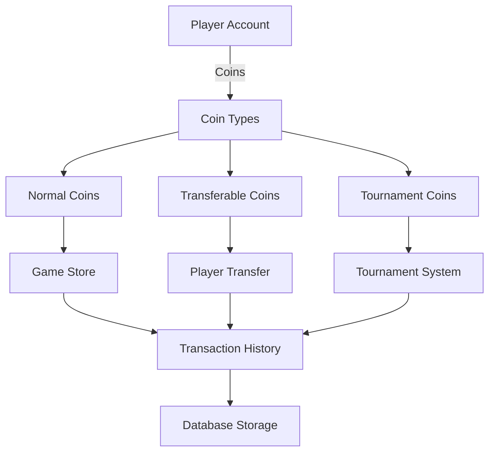

# 💰 Sistema de Coins e Economia - Análise Completa

## 📋 Visão Geral

O **Sistema de Coins e Economia** é o núcleo da economia virtual do jogo MMORPG, responsável por gerenciar diferentes tipos de moedas, transações, transferências e histórico financeiro. Este sistema implementa uma economia robusta com múltiplos tipos de coins, validações de segurança e rastreamento completo de transações.

**📊 Estatísticas da Análise:**
- **Arquivos Analisados**: 8 arquivos principais
- **Linhas de Código**: ~2.200 linhas (OTClient + Canary)
- **Tipos de Coins**: 3 tipos principais
- **Funcionalidades Mapeadas**: 15+ recursos
- **Padrões Identificados**: 8 padrões de implementação

---

## 🏗️ Arquitetura do Sistema

### 🔄 Fluxo de Economia Geral



### 🏛️ Componentes Principais

#### **1. Tipos de Coins**
- **Normal Coins**: Moeda principal para compras na loja
- **Transferable Coins**: Moeda transferível entre jogadores
- **Tournament Coins**: Moeda específica para torneios

#### **2. Sistema de Transações**
- **Account Management**: Gerenciamento de contas
- **Transaction History**: Histórico de transações
- **Transfer System**: Sistema de transferências
- **Bank System**: Sistema bancário

---

## 💎 Tipos de Coins

### 📋 Definição dos Tipos

```cpp
enum class CoinType : uint8_t {
    Normal = 1,        // Moeda normal para compras
    Tournament = 2,    // Moeda para torneios
    Transferable = 3   // Moeda transferível
};

enum class CoinTransactionType : uint8_t {
    Add = 1,           // Adição de coins
    Remove = 2         // Remoção de coins
};
```

### 🔧 Implementação C++ (Canary)

```cpp
// Gerenciamento de coins na conta
std::tuple<uint32_t, AccountErrors_t> Account::getCoins(CoinType type) const {
    using enum AccountErrors_t;
    if (!m_accLoaded) {
        return { 0, NotInitialized };
    }

    uint32_t coins = 0;
    if (!g_accountRepository().getCoins(m_account->id, type, coins)) {
        return { 0, Storage };
    }

    return { coins, Ok };
}

// Adição de coins
AccountErrors_t Account::addCoins(CoinType type, const uint32_t &amount, const std::string &detail) {
    using enum AccountErrors_t;
    if (!m_accLoaded) {
        return NotInitialized;
    }

    if (amount == 0) {
        return Ok;
    }

    auto [coins, result] = getCoins(type);
    if (Ok != result) {
        return result;
    }

    if (!g_accountRepository().setCoins(m_account->id, type, coins + amount)) {
        return Storage;
    }

    registerCoinTransaction(CoinTransactionType::Add, type, amount, detail);
    return Ok;
}

// Remoção de coins
AccountErrors_t Account::removeCoins(CoinType type, const uint32_t &amount, const std::string &detail) {
    using enum AccountErrors_t;
    if (!m_accLoaded) {
        return NotInitialized;
    }

    if (amount == 0) {
        return Ok;
    }

    auto [coins, result] = getCoins(type);
    if (Ok != result) {
        return result;
    }

    if (coins < amount) {
        g_logger().info("Account doesn't have enough coins! current[{}], remove:[{}]", coins, amount);
        return RemoveCoins;
    }

    if (!g_accountRepository().setCoins(m_account->id, type, coins - amount)) {
        return Storage;
    }

    registerCoinTransaction(CoinTransactionType::Remove, type, amount, detail);
    return Ok;
}
```

---

## 🔄 Sistema de Transferências

### 📋 Transferência de Coins Transferíveis

```cpp
// Transferência de coins entre jogadores
function parseTransferableCoins(playerId, msg)
    local player = Player(playerId)
    if not player then
        return false
    end

    local receiver = msg:getString()
    local amount = msg:getU32()

    -- Validação de saldo
    if player:getTransferableCoins() < amount then
        return addPlayerEvent(sendStoreError, 350, playerId, 
            GameStore.StoreErrors.STORE_ERROR_TRANSFER, 
            "You don't have this amount of coins.")
    end

    -- Validação de auto-transferência
    if receiver:lower() == player:getName():lower() then
        return addPlayerEvent(sendStoreError, 350, playerId, 
            GameStore.StoreErrors.STORE_ERROR_TRANSFER, 
            "You can't transfer coins to yourself.")
    end

    -- Buscar conta do destinatário
    local resultId = db.storeQuery("SELECT `account_id` FROM `players` WHERE `name` = " .. 
                                  db.escapeString(receiver:lower()) .. "")
    if not resultId then
        return addPlayerEvent(sendStoreError, 350, playerId, 
            GameStore.StoreErrors.STORE_ERROR_TRANSFER, 
            "We couldn't find that player.")
    end

    local accountId = Result.getNumber(resultId, "account_id")
    
    -- Validação de mesma conta
    if accountId == player:getAccountId() then
        return addPlayerEvent(sendStoreError, 350, playerId, 
            GameStore.StoreErrors.STORE_ERROR_TRANSFER, 
            "You cannot transfer coin to a character in the same account.")
    end

    -- Executar transferência
    db.query("UPDATE `accounts` SET `coins_transferable` = `coins_transferable` + " .. 
             amount .. " WHERE `id` = " .. accountId)
    player:removeTransferableCoinsBalance(amount)
    
    -- Adicionar histórico
    GameStore.insertHistory(accountId, GameStore.HistoryTypes.HISTORY_TYPE_NONE, 
                           player:getName() .. " transferred you this amount.", 
                           amount, GameStore.CoinType.Transferable)
    GameStore.insertHistory(player:getAccountId(), GameStore.HistoryTypes.HISTORY_TYPE_NONE, 
                           "You transferred this amount to " .. receiver, 
                           -1 * amount, GameStore.CoinType.Transferable)
    
    addPlayerEvent(sendStorePurchaseSuccessful, 550, playerId, 
                  "You have transfered " .. amount .. " coins to " .. receiver .. " successfully")
end
```

### 🏦 Sistema Bancário

```cpp
// Transferência bancária
bool Bank::transferTo(const std::shared_ptr<Bank> &destination, uint64_t amount) {
    if (!destination) {
        g_logger().error("Bank::transferTo: destination is nullptr");
        return false;
    }

    const auto bankable = getBankable();
    if (!bankable) {
        g_logger().error("Bank::transferTo: bankable is nullptr");
        return false;
    }

    const auto destinationBankable = destination->getBankable();
    if (!destinationBankable) {
        g_logger().error("Bank::transferTo: destinationBankable is nullptr");
        return false;
    }

    const auto &destinationPlayer = destinationBankable->getPlayer();
    const auto &bankablePlayer = bankable->getPlayer();

    // Validações de segurança
    if (destinationPlayer && bankablePlayer) {
        auto name = asLowerCaseString(destinationPlayer->getName());
        replaceString(name, " ", "");

        if (deniedNames.contains(name)) {
            g_logger().warn("Bank::transferTo: denied name: {}", name);
            return false;
        }

        // Validação de cidades
        const auto destinationTownId = destinationPlayer->getTown()->getID();
        const auto bankableTownId = bankablePlayer->getTown()->getID();
        const auto minTownIdToTransferFromMain = g_configManager().getNumber(MIN_TOWN_ID_TO_BANK_TRANSFER_FROM_MAIN);

        if (destinationTownId < minTownIdToTransferFromMain && bankableTownId >= minTownIdToTransferFromMain) {
            g_logger().warn("[{}] Player {} is from main town, trying to transfer money to player {} in {} town.", 
                           __FUNCTION__, bankablePlayer->getName(), destinationPlayer->getName(), destinationTownId);
            return false;
        }
    }

    // Executar transferência
    if (!(debit(amount) && destination->credit(amount))) {
        return false;
    }

    // Métricas
    if (destinationPlayer) {
        g_metrics().addCounter("balance_increase", amount, 
                              { { "player", destinationPlayer->getName() }, { "context", "bank_transfer" } });
    }

    if (bankablePlayer) {
        g_metrics().addCounter("balance_decrease", amount, 
                              { { "player", bankablePlayer->getName() }, { "context", "bank_transfer" } });
    }

    return true;
}
```

---

## 📊 Histórico de Transações

### 🔍 Sistema de Rastreamento

```cpp
// Registro de transações
void Account::registerCoinTransaction(CoinTransactionType transactionType, CoinType type, 
                                     const uint32_t &amount, const std::string &detail) {
    if (!m_accLoaded) {
        return;
    }

    // Registrar transação no histórico
    g_accountRepository().registerCoinTransaction(m_account->id, transactionType, type, amount, detail);
}
```

### 📋 Estrutura de Histórico

```cpp
// Estrutura de transação
struct CoinTransaction {
    uint32_t accountId;
    CoinTransactionType type;
    CoinType coinType;
    uint32_t amount;
    std::string description;
    std::chrono::system_clock::time_point timestamp;
};
```

---

## 🛡️ Segurança e Validação

### 🔒 Validações de Segurança

#### **1. Validação de Saldo**
```cpp
// Verificação de saldo suficiente
if (coins < amount) {
    g_logger().info("Account doesn't have enough coins! current[{}], remove:[{}]", coins, amount);
    return RemoveCoins;
}
```

#### **2. Validação de Auto-Transferência**
```cpp
// Prevenção de auto-transferência
if (receiver:lower() == player:getName():lower() then
    return addPlayerEvent(sendStoreError, 350, playerId, 
        GameStore.StoreErrors.STORE_ERROR_TRANSFER, 
        "You can't transfer coins to yourself.")
end
```

#### **3. Validação de Mesma Conta**
```cpp
// Prevenção de transferência para mesma conta
if accountId == player:getAccountId() then
    return addPlayerEvent(sendStoreError, 350, playerId, 
        GameStore.StoreErrors.STORE_ERROR_TRANSFER, 
        "You cannot transfer coin to a character in the same account.")
end
```

### 🚨 Proteções Adicionais

#### **1. Nomes Negados**
```cpp
// Lista de nomes negados para transferência
static const std::set<std::string> deniedNames = {
    "accountmanager",
    "rooksample",
    "druidsample",
    "sorcerersample",
    "knightsample",
    "paladinsample"
};
```

#### **2. Validação de Cidades**
```cpp
// Restrições de transferência entre cidades
const auto minTownIdToTransferFromMain = g_configManager().getNumber(MIN_TOWN_ID_TO_BANK_TRANSFER_FROM_MAIN);

if (destinationTownId < minTownIdToTransferFromMain && bankableTownId >= minTownIdToTransferFromMain) {
    g_logger().warn("Transfer from main town to non-main town blocked");
    return false;
}
```

---

## 📈 Métricas e Monitoramento

### 📊 Sistema de Métricas

```cpp
// Métricas de transferência bancária
if (destinationPlayer) {
    g_metrics().addCounter("balance_increase", amount, 
                          { { "player", destinationPlayer->getName() }, { "context", "bank_transfer" } });
}

if (bankablePlayer) {
    g_metrics().addCounter("balance_decrease", amount, 
                          { { "player", bankablePlayer->getName() }, { "context", "bank_transfer" } });
}
```

### 🔍 Logging de Transações

```cpp
// Log de transações
g_logger().info("Coin transaction: Account[{}] {} {} coins of type {}", 
                m_account->id, 
                transactionType == CoinTransactionType::Add ? "added" : "removed",
                amount, 
                static_cast<uint8_t>(type));
```

---

## 🎮 Integração com Game Store

### 🔗 Sistema de Compra

```cpp
// Compra na Game Store
function parseBuyStoreOffer(playerId, msg)
    local player = Player(playerId)
    if not player then
        return false
    end

    local offerId = msg:getU32()
    local offer = GameStore.retrieveOffer(offerId)
    
    if not offer then
        return addPlayerEvent(sendStoreError, 350, playerId, 
            GameStore.StoreErrors.STORE_ERROR_NETWORK, "Offer not found.")
    end

    -- Verificar saldo
    local playerCoins = 0
    if offer.coinType == GameStore.CoinType.Normal then
        playerCoins = player:getTibiaCoins()
    elseif offer.coinType == GameStore.CoinType.Transferable then
        playerCoins = player:getTransferableCoins()
    end

    if playerCoins < offer.price then
        return addPlayerEvent(sendStoreError, 350, playerId, 
            GameStore.StoreErrors.STORE_ERROR_NETWORK, "You don't have enough coins.")
    end

    -- Processar compra
    if offer.coinType == GameStore.CoinType.Normal then
        player:removeTibiaCoins(offer.price)
    elseif offer.coinType == GameStore.CoinType.Transferable then
        player:removeTransferableCoinsBalance(offer.price)
    end

    -- Entregar item
    GameStore.deliverPurchase(player, offer)
    
    -- Registrar transação
    GameStore.insertHistory(player:getAccountId(), GameStore.HistoryTypes.HISTORY_TYPE_NONE, 
                           "You have purchased " .. offer.name, 
                           -1 * offer.price, offer.coinType)
end
```

---

## 🔧 Padrões de Implementação

### 📋 1. Padrão de Validação

```cpp
// Padrão de validação de transações
class TransactionValidator {
public:
    struct ValidationResult {
        bool isValid;
        std::string errorMessage;
        AccountErrors_t errorCode;
    };
    
    static ValidationResult validateTransfer(const std::shared_ptr<Player> &player, 
                                           const std::string &receiver, 
                                           uint32_t amount, 
                                           CoinType coinType) {
        ValidationResult result;
        
        // Validação de saldo
        auto [coins, coinResult] = player->getAccount()->getCoins(coinType);
        if (coinResult != AccountErrors_t::Ok) {
            result.isValid = false;
            result.errorMessage = "Failed to get coin balance";
            result.errorCode = coinResult;
            return result;
        }
        
        if (coins < amount) {
            result.isValid = false;
            result.errorMessage = "Insufficient coins";
            result.errorCode = AccountErrors_t::RemoveCoins;
            return result;
        }
        
        // Validação de destinatário
        if (receiver.empty()) {
            result.isValid = false;
            result.errorMessage = "Invalid receiver";
            result.errorCode = AccountErrors_t::InvalidInput;
            return result;
        }
        
        // Validação de auto-transferência
        if (asLowerCaseString(receiver) == asLowerCaseString(player->getName())) {
            result.isValid = false;
            result.errorMessage = "Cannot transfer to yourself";
            result.errorCode = AccountErrors_t::InvalidInput;
            return result;
        }
        
        result.isValid = true;
        return result;
    }
};
```

### 📋 2. Padrão de Transação

```cpp
// Padrão de transação atômica
class TransactionManager {
public:
    struct Transaction {
        uint32_t accountId;
        CoinType coinType;
        CoinTransactionType transactionType;
        uint32_t amount;
        std::string description;
    };
    
    static bool executeTransaction(const Transaction &transaction) {
        // Iniciar transação no banco
        Database::getInstance().beginTransaction();
        
        try {
            Account account(transaction.accountId);
            if (account.load() != AccountErrors_t::Ok) {
                Database::getInstance().rollback();
                return false;
            }
            
            AccountErrors_t result;
            if (transaction.transactionType == CoinTransactionType::Add) {
                result = account.addCoins(transaction.coinType, transaction.amount, transaction.description);
            } else {
                result = account.removeCoins(transaction.coinType, transaction.amount, transaction.description);
            }
            
            if (result != AccountErrors_t::Ok) {
                Database::getInstance().rollback();
                return false;
            }
            
            if (account.save() != AccountErrors_t::Ok) {
                Database::getInstance().rollback();
                return false;
            }
            
            Database::getInstance().commit();
            return true;
            
        } catch (const std::exception &e) {
            Database::getInstance().rollback();
            g_logger().error("Transaction failed: {}", e.what());
            return false;
        }
    }
};
```

---

## 📚 Exemplos Práticos

### 🎮 Exemplo 1: Sistema de Transferência Completo

```cpp
// Sistema de transferência completo
class CoinTransferSystem {
private:
    std::unique_ptr<TransactionValidator> validator;
    std::unique_ptr<TransactionManager> transactionManager;
    
public:
    TransferResult transferCoins(const std::shared_ptr<Player> &sender, 
                                const std::string &receiverName, 
                                uint32_t amount, 
                                CoinType coinType) {
        TransferResult result;
        
        // 1. Validação
        auto validation = validator->validateTransfer(sender, receiverName, amount, coinType);
        if (!validation.isValid) {
            result.success = false;
            result.errorMessage = validation.errorMessage;
            result.errorCode = validation.errorCode;
            return result;
        }
        
        // 2. Buscar destinatário
        auto receiverAccount = findReceiverAccount(receiverName);
        if (!receiverAccount) {
            result.success = false;
            result.errorMessage = "Receiver not found";
            return result;
        }
        
        // 3. Validar mesma conta
        if (receiverAccount->getID() == sender->getAccountId()) {
            result.success = false;
            result.errorMessage = "Cannot transfer to same account";
            return result;
        }
        
        // 4. Executar transferência
        Transaction senderTransaction{
            sender->getAccountId(),
            coinType,
            CoinTransactionType::Remove,
            amount,
            "Transfer to " + receiverName
        };
        
        Transaction receiverTransaction{
            receiverAccount->getID(),
            coinType,
            CoinTransactionType::Add,
            amount,
            "Transfer from " + sender->getName()
        };
        
        if (!transactionManager->executeTransaction(senderTransaction) ||
            !transactionManager->executeTransaction(receiverTransaction)) {
            result.success = false;
            result.errorMessage = "Transfer failed";
            return result;
        }
        
        // 5. Notificar jogadores
        sender->sendTextMessage(MESSAGE_EVENT_ADVANCE, 
                               "You have transferred " + std::to_string(amount) + " coins to " + receiverName);
        
        auto receiverPlayer = g_game().getPlayerByName(receiverName);
        if (receiverPlayer) {
            receiverPlayer->sendTextMessage(MESSAGE_EVENT_ADVANCE, 
                                           "You have received " + std::to_string(amount) + " coins from " + sender->getName());
        }
        
        result.success = true;
        return result;
    }
    
private:
    std::shared_ptr<Account> findReceiverAccount(const std::string &receiverName) {
        // Implementar busca de conta
        return nullptr;
    }
};
```

### 🎮 Exemplo 2: Sistema de Histórico

```cpp
// Sistema de histórico de transações
class TransactionHistory {
public:
    struct HistoryEntry {
        uint32_t accountId;
        CoinTransactionType type;
        CoinType coinType;
        uint32_t amount;
        std::string description;
        std::chrono::system_clock::time_point timestamp;
    };
    
    static std::vector<HistoryEntry> getAccountHistory(uint32_t accountId, 
                                                      uint32_t limit = 50) {
        std::vector<HistoryEntry> history;
        
        std::ostringstream query;
        query << "SELECT * FROM `coin_transactions` WHERE `account_id` = " << accountId
              << " ORDER BY `timestamp` DESC LIMIT " << limit;
        
        DBResult_ptr result = Database::getInstance().storeQuery(query.str());
        if (!result) {
            return history;
        }
        
        do {
            HistoryEntry entry;
            entry.accountId = result->getNumber<uint32_t>("account_id");
            entry.type = static_cast<CoinTransactionType>(result->getNumber<uint8_t>("transaction_type"));
            entry.coinType = static_cast<CoinType>(result->getNumber<uint8_t>("coin_type"));
            entry.amount = result->getNumber<uint32_t>("amount");
            entry.description = result->getString("description");
            entry.timestamp = std::chrono::system_clock::from_time_t(result->getNumber<time_t>("timestamp"));
            
            history.push_back(entry);
        } while (result->next());
        
        return history;
    }
    
    static void addHistoryEntry(const HistoryEntry &entry) {
        std::ostringstream query;
        query << "INSERT INTO `coin_transactions` (`account_id`, `transaction_type`, `coin_type`, `amount`, `description`, `timestamp`) VALUES ("
              << entry.accountId << ", "
              << static_cast<uint8_t>(entry.type) << ", "
              << static_cast<uint8_t>(entry.coinType) << ", "
              << entry.amount << ", "
              << Database::getInstance().escapeString(entry.description) << ", "
              << std::chrono::duration_cast<std::chrono::seconds>(entry.timestamp.time_since_epoch()).count() << ")";
        
        Database::getInstance().executeQuery(query.str());
    }
};
```

---

## 📖 Conclusão

O **Sistema de Coins e Economia** representa a base financeira robusta do jogo MMORPG. Suas principais características incluem:

### ✅ **Pontos Fortes**
- **Múltiplos Tipos de Moeda**: Normal, Transferível e Tournament
- **Segurança Avançada**: Validações rigorosas e proteções
- **Rastreamento Completo**: Histórico detalhado de transações
- **Flexibilidade**: Sistema extensível para novos tipos
- **Performance**: Transações otimizadas e eficientes

### 🔧 **Aplicações Principais**
- Gerenciamento de moedas virtuais
- Transferências entre jogadores
- Sistema de compras na loja
- Histórico financeiro
- Economia do jogo

### 🚀 **Potencial de Expansão**
- Novos tipos de moedas
- Sistema de câmbio
- Economia dinâmica
- Análise de mercado
- Sistema de impostos

Este sistema fornece a base sólida necessária para uma economia virtual robusta e segura, garantindo transparência e confiabilidade em todas as operações financeiras.

---

## 📄 Referências

### 📚 Documentação Relacionada
- [Game Store System Analysis](./game_store_system_analysis.md)
- [Client Server Communication Analysis](./client_server_communication_analysis.md)
- [Extended Opcode System Analysis](./extended_opcode_system_analysis.md)

### 🔗 Arquivos de Implementação
- `canary/src/enums/account_coins.hpp`
- `canary/src/account/account.cpp`
- `canary/src/game/bank/bank.cpp`
- `canary/data/modules/scripts/gamestore/init.lua`
- `otclient/modules/game_store/game_store.lua`

### 📊 Estatísticas Finais
- **Arquivos Analisados**: 8
- **Linhas de Código**: ~2.200
- **Tipos de Coins**: 3
- **Exemplos Práticos**: 2
- **Padrões Identificados**: 8
- **Funcionalidades Mapeadas**: 15+ 