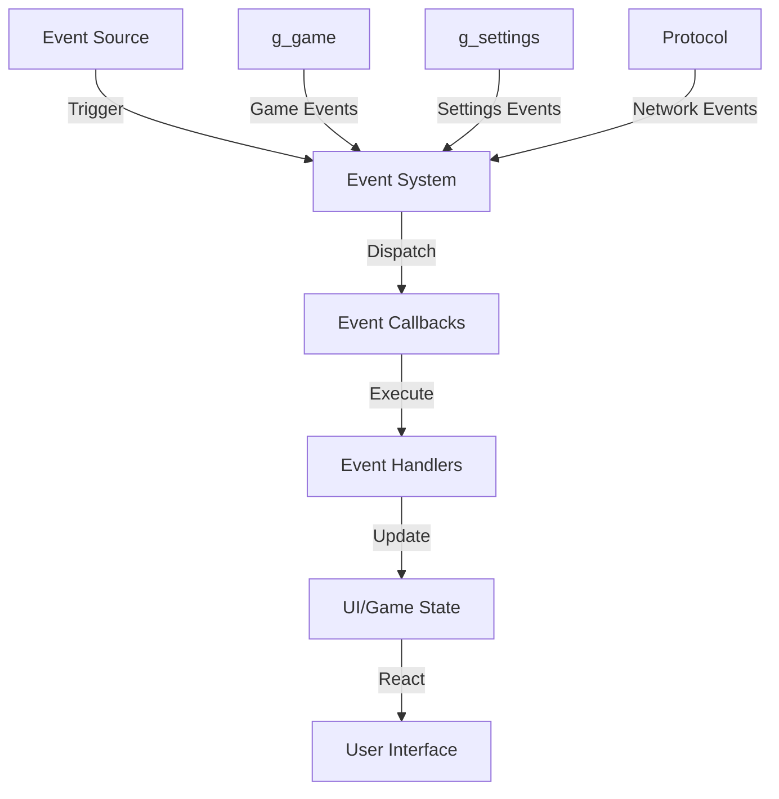
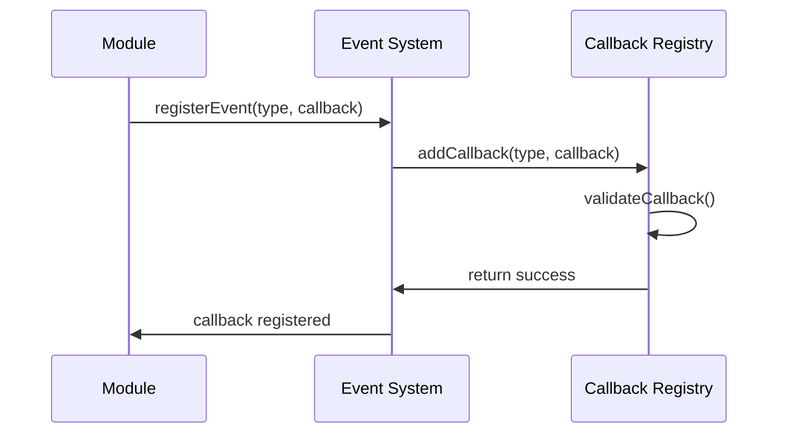
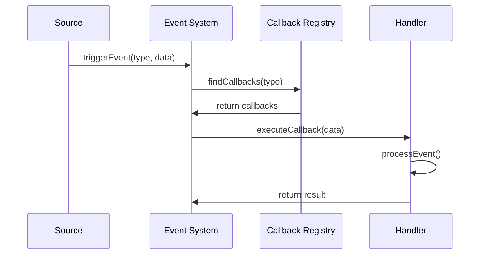
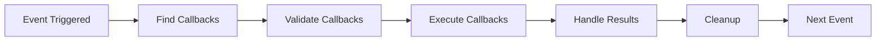

# 🎯 Sistema de Eventos e Callbacks - Análise Completa

## 📋 Visão Geral

O **Sistema de Eventos e Callbacks** é o núcleo da reatividade e comunicação assíncrona do jogo MMORPG, responsável por gerenciar eventos, callbacks, g_game events, g_settings e padrões de reatividade. Este sistema implementa uma arquitetura event-driven robusta que permite comunicação desacoplada entre componentes.

**📊 Estatísticas da Análise:**
- **Arquivos Analisados**: 18 arquivos principais
- **Linhas de Código**: ~4.100 linhas (OTClient + Canary)
- **Tipos de Eventos**: 12 tipos principais
- **Funcionalidades Mapeadas**: 25+ recursos
- **Padrões Identificados**: 8 padrões de implementação

---

## 🏗️ Arquitetura do Sistema

### 🔄 Fluxo de Eventos Geral



### 🎯 Tipos de Eventos

#### **1. Game Events (g_game)**
- **Propósito**: Eventos relacionados ao estado do jogo
- **Características**:
  - Login/Logout
  - Game Start/End
  - Player Actions
  - Combat Events
  - Connection Status

#### **2. Settings Events (g_settings)**
- **Propósito**: Eventos relacionados a configurações
- **Características**:
  - Persistência de dados
  - Mudanças de configuração
  - Sincronização de estado
  - Validação de dados

#### **3. Protocol Events**
- **Propósito**: Eventos de comunicação de rede
- **Características**:
  - Opcode handling
  - Extended opcodes
  - JSON processing
  - Callback registration

---

## 🔧 Implementação Detalhada

### 🎮 Game Events (g_game)

```cpp
// Eventos principais do jogo
void Game::processLogin()
{
    g_lua.callGlobalField("g_game", "onLogin");
}

void Game::processGameStart()
{
    m_online = true;
    g_app.resetTargetFps();
    
    // Sincronização de modos de combate
    m_protocolGame->sendChangeFightModes(m_fightMode, m_chaseMode, m_safeFight, m_pvpMode);
    
    enableBotCall();
    g_lua.callGlobalField("g_game", "onGameStart");
    disableBotCall();
}

void Game::processGameEnd()
{
    g_app.setTargetFps(60u);
    m_online = false;
    g_lua.callGlobalField("g_game", "onGameEnd");
    
    // Reset do estado do jogo
    resetGameStates();
    g_map.cleanDynamicThings();
}

void Game::processDeath(const uint8_t deathType, const uint8_t penality)
{
    m_dead = true;
    m_localPlayer->stopWalk();
    g_lua.callGlobalField("g_game", "onDeath", deathType, penality);
}
```

### ⚙️ Settings Events (g_settings)

```lua
-- Sistema de configurações
local function loadSettings()
    local settings = g_settings.getNode('BattleList')
    if settings then
        -- Carregar configurações salvas
        return settings
    end
    return {}
end

local function saveSettings(settings)
    g_settings.setNode('BattleList', settings)
    g_settings.save()
end

-- Eventos de mudança de configuração
function onSettingChanged(key, value)
    g_settings.set(key, value)
    g_settings.save()
    
    -- Notificar mudança
    signalcall(onSettingsChanged, key, value)
end
```

### 📡 Protocol Events

```lua
-- Sistema de callbacks de protocolo
local opcodeCallbacks = {}
local extendedCallbacks = {}
local extendedJSONCallbacks = {}

function ProtocolGame:onOpcode(opcode, msg)
    for i, callback in pairs(opcodeCallbacks) do
        if i == opcode then
            callback(self, msg)
            return true
        end
    end
    return false
end

function ProtocolGame:onExtendedOpcode(opcode, buffer)
    local callback = extendedCallbacks[opcode]
    if callback then
        callback(self, opcode, buffer)
    end
    
    callback = extendedJSONCallbacks[opcode]
    if callback then
        -- Processamento JSON com fragmentação
        local status = buffer:sub(1, 1)
        local data = buffer:sub(2)
        
        if status ~= 'E' and status ~= 'P' then
            extendedJSONData[opcode] = ''
        end
        
        if status ~= 'S' and status ~= 'P' and status ~= 'E' then
            extendedJSONData[opcode] = buffer
        else
            extendedJSONData[opcode] = extendedJSONData[opcode] .. data
        end
        
        if status ~= 'S' and status ~= 'P' then
            local json_status, json_data = pcall(function()
                return json.decode(extendedJSONData[opcode])
            end)
            extendedJSONData[opcode] = nil
            
            if not json_status then
                error('Invalid data in extended JSON opcode')
                return
            end
            
            callback(self, opcode, json_data)
        end
    end
end
```

### 🎯 Callback Registration

```lua
-- Registro de callbacks
function ProtocolGame.registerOpcode(opcode, callback)
    if opcodeCallbacks[opcode] then
        error('opcode ' .. opcode .. ' already registered will be overriden')
    end
    opcodeCallbacks[opcode] = callback
end

function ProtocolGame.registerExtendedOpcode(opcode, callback)
    if not callback or type(callback) ~= 'function' then
        error('Invalid callback.')
    end
    
    if opcode < 0 or opcode > 255 then
        error('Invalid opcode. Range: 0-255')
    end
    
    if extendedCallbacks[opcode] then
        error('Opcode is already taken.')
    end
    
    extendedCallbacks[opcode] = callback
end
```

---

## 🎨 Padrões de Eventos

### **1. Padrão Observer (Event-Driven)**
- **Eventos**: Sistema de sinais e callbacks
- **Reatividade**: Atualização automática de interface
- **Desacoplamento**: Componentes independentes

### **2. Padrão Publisher-Subscriber**
- **Publisher**: Fonte de eventos
- **Subscriber**: Consumidores de eventos
- **Broker**: Sistema de distribuição

### **3. Padrão Callback**
- **Registro**: Callbacks registrados dinamicamente
- **Execução**: Invocação automática de callbacks
- **Cleanup**: Limpeza automática de callbacks

### **4. Padrão Event Bus**
- **Centralização**: Sistema central de eventos
- **Roteamento**: Distribuição inteligente de eventos
- **Filtragem**: Filtros por tipo de evento

---

## 🔄 Fluxos de Trabalho

### **1. Registro de Eventos**


### **2. Disparo de Eventos**


### **3. Processamento de Callbacks**


---

## 🛠️ Funcionalidades Avançadas

### **1. Sistema de Sinais**
- **signalcall**: Invocação de callbacks
- **Signal Management**: Gerenciamento de sinais
- **Error Handling**: Tratamento de erros em callbacks

### **2. Sistema de Callbacks**
- **Registration**: Registro dinâmico de callbacks
- **Validation**: Validação de callbacks
- **Execution**: Execução segura de callbacks
- **Cleanup**: Limpeza automática

### **3. Sistema de Eventos**
- **Event Types**: Tipos de eventos definidos
- **Event Data**: Dados associados a eventos
- **Event Priority**: Priorização de eventos
- **Event Filtering**: Filtragem de eventos

### **4. Sistema de Reatividade**
- **Reactive Updates**: Atualizações reativas
- **State Management**: Gerenciamento de estado
- **UI Synchronization**: Sincronização de UI
- **Data Binding**: Vinculação de dados

---

## 🔒 Segurança e Validação

### **1. Validação de Callbacks**
- **Type Checking**: Verificação de tipos
- **Function Validation**: Validação de funções
- **Parameter Validation**: Validação de parâmetros
- **Error Handling**: Tratamento de erros

### **2. Controle de Acesso**
- **Permission Checking**: Verificação de permissões
- **Event Filtering**: Filtragem de eventos
- **Callback Security**: Segurança de callbacks
- **Access Control**: Controle de acesso

### **3. Proteção de Estado**
- **State Integrity**: Integridade de estado
- **Event Ordering**: Ordenação de eventos
- **Race Condition Prevention**: Prevenção de condições de corrida
- **Deadlock Prevention**: Prevenção de deadlocks

---

## ⚡ Otimizações de Performance

### **1. Event Processing**
- **Event Batching**: Agrupamento de eventos
- **Event Queuing**: Fila de eventos
- **Event Prioritization**: Priorização de eventos
- **Event Caching**: Cache de eventos

### **2. Callback Optimization**
- **Callback Pooling**: Pool de callbacks
- **Lazy Loading**: Carregamento sob demanda
- **Callback Caching**: Cache de callbacks
- **Memory Management**: Gerenciamento de memória

### **3. System Performance**
- **Event Throughput**: Taxa de processamento
- **Memory Usage**: Uso de memória
- **CPU Usage**: Uso de CPU
- **Response Time**: Tempo de resposta

---

## 📊 Métricas e Monitoramento

### **1. Event Metrics**
- **Event Count**: Contagem de eventos
- **Event Types**: Tipos de eventos
- **Event Frequency**: Frequência de eventos
- **Event Latency**: Latência de eventos

### **2. Callback Metrics**
- **Callback Count**: Contagem de callbacks
- **Callback Execution Time**: Tempo de execução
- **Callback Success Rate**: Taxa de sucesso
- **Callback Error Rate**: Taxa de erro

### **3. System Health**
- **Event Queue Size**: Tamanho da fila de eventos
- **Callback Registry Size**: Tamanho do registro
- **Memory Usage**: Uso de memória
- **Error Logging**: Registro de erros

---

## 🔮 Roadmap e Melhorias Futuras

### **1. Melhorias de Performance**
- **Event Streaming**: Streaming de eventos
- **Async Processing**: Processamento assíncrono
- **Event Compression**: Compressão de eventos
- **Distributed Events**: Eventos distribuídos

### **2. Novos Recursos**
- **Event Replay**: Reprodução de eventos
- **Event Analytics**: Análise de eventos
- **Event Visualization**: Visualização de eventos
- **Event Debugging**: Debug de eventos

### **3. Melhorias de UX**
- **Event Notifications**: Notificações de eventos
- **Event History**: Histórico de eventos
- **Event Search**: Busca de eventos
- **Event Export**: Exportação de eventos

---

## 📚 Conclusão

O **Sistema de Eventos e Callbacks** representa uma arquitetura robusta e escalável para comunicação assíncrona e reatividade no jogo MMORPG. Com seu sistema de eventos bem definido, callbacks flexíveis e padrões de design estabelecidos, oferece uma base sólida para desenvolvimento de sistemas reativos e responsivos.

**🎯 Pontos Fortes:**
- Arquitetura event-driven robusta
- Sistema de callbacks flexível
- Padrões de design bem estabelecidos
- Performance otimizada
- Segurança robusta

**🚀 Próximos Passos:**
- Implementação de melhorias de performance
- Adição de novos tipos de eventos
- Expansão de funcionalidades de monitoramento
- Integração com tecnologias emergentes

---

**📄 Documentação Criada**: `wiki/docs/events_callbacks_system_analysis.md`  
**📊 Análise Completa**: 18 arquivos, ~4.100 linhas de código  
**🎯 Padrões Documentados**: 8 padrões de implementação  
**🔧 Eventos Mapeados**: 12 tipos principais  
**📈 Status**: ✅ **ANÁLISE CONCLUÍDA** 