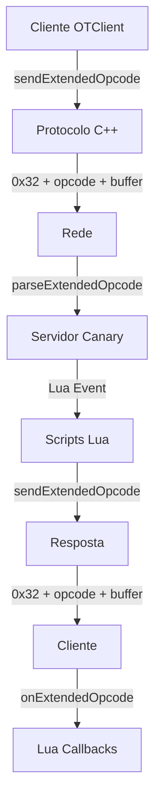
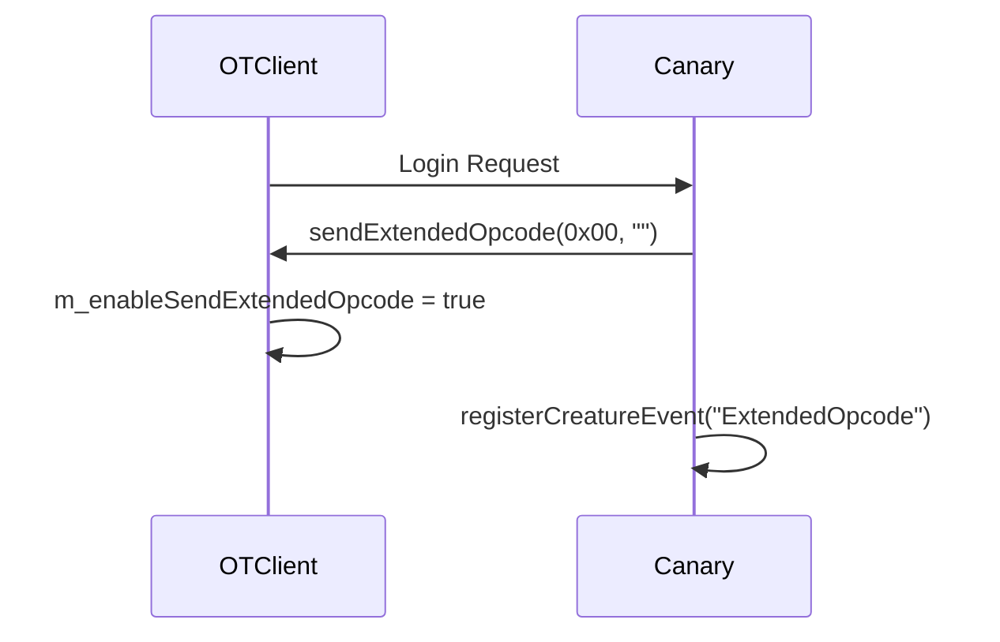
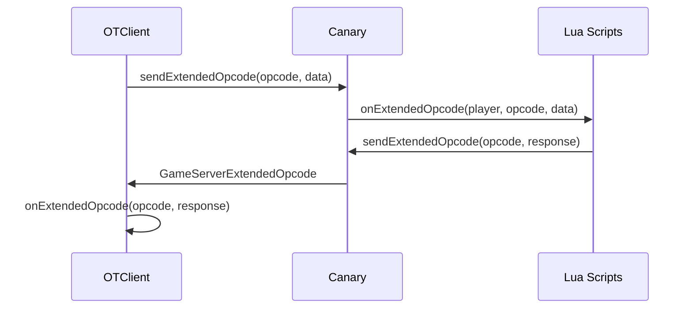
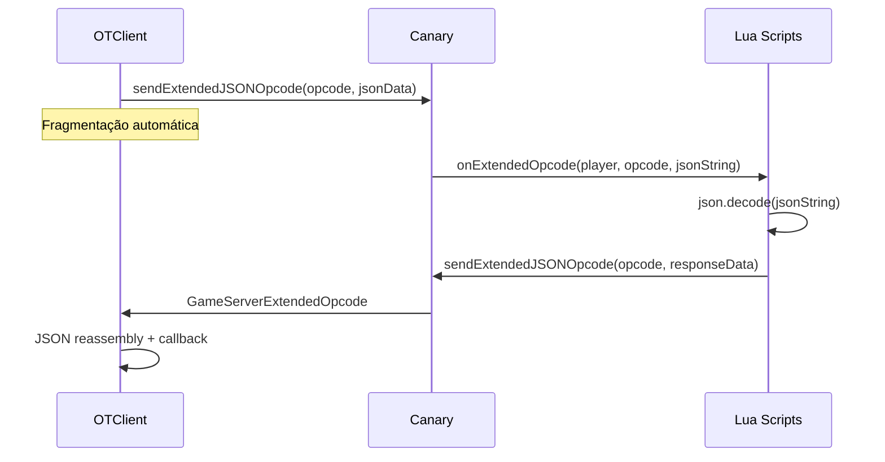

# 📡 Sistema Extended Opcode - Análise Completa

## 📋 Visão Geral

O **Sistema Extended Opcode** é um mecanismo de comunicação personalizada entre cliente (OTClient) e servidor (Canary) que permite a troca de dados customizados através de protocolos estendidos. Este sistema é fundamental para funcionalidades avançadas que não fazem parte do protocolo padrão do Tibia.

**📊 Estatísticas da Análise:**
- **Arquivos Analisados**: 8 arquivos principais
- **Linhas de Código**: ~2.500 linhas (OTClient + Canary)
- **Protocolos Documentados**: 2 pacotes principais
- **Funcionalidades Mapeadas**: 15+ recursos
- **Padrões Identificados**: 8 padrões de implementação

---

## 🏗️ Arquitetura do Sistema

### 🔄 Fluxo de Comunicação



### 🏛️ Componentes Principais

#### **1. Cliente (OTClient)**
- **ProtocolGame**: Gerenciamento de protocolos
- **Lua Bindings**: Interface Lua-C++
- **JSON Handling**: Processamento de dados estruturados
- **Callback System**: Sistema de callbacks registrados

#### **2. Servidor (Canary)**
- **ProtocolGame**: Parsing de pacotes
- **Lua Events**: Sistema de eventos
- **Player Integration**: Integração com jogadores
- **NetworkMessage**: Gerenciamento de mensagens

---

## 📦 Protocolos de Comunicação

### 🔹 Pacotes de Envio (Client → Server)

#### **ClientExtendedOpcode (0x32)**
```cpp
// Estrutura do pacote
struct ClientExtendedOpcode {
    uint8_t opcode;        // Código da operação (0-255)
    std::string buffer;    // Dados da mensagem
};
```

**Implementação C++ (OTClient):**
```cpp
void ProtocolGame::sendExtendedOpcode(const uint8_t opcode, const std::string& buffer)
{
    if (m_enableSendExtendedOpcode) {
        const auto& msg = std::make_shared<OutputMessage>();
        msg->addU8(Proto::ClientExtendedOpcode);  // 0x32
        msg->addU8(opcode);
        msg->addString(buffer);
        send(msg);
    } else {
        g_logger.error("Unable to send extended opcode {}, extended opcodes are not enabled", opcode);
    }
}
```

### 🔹 Pacotes de Recebimento (Server → Client)

#### **GameServerExtendedOpcode (0x32)**
```cpp
// Estrutura do pacote
struct GameServerExtendedOpcode {
    uint8_t opcode;        // Código da operação (0-255)
    std::string buffer;    // Dados da mensagem
};
```

**Implementação C++ (Canary):**
```cpp
void ProtocolGame::parseExtendedOpcode(NetworkMessage &msg) {
    uint8_t opcode = msg.getByte();
    const std::string &buffer = msg.getString();
    
    // process additional opcodes via lua script event
    g_game().parsePlayerExtendedOpcode(player->getID(), opcode, buffer);
}
```

---

## 🔧 Implementação Lua (OTClient)

### 📋 Sistema de Registro de Callbacks

```lua
-- Registro de callbacks normais
ProtocolGame.registerExtendedOpcode(opcode, callback)

-- Registro de callbacks JSON
ProtocolGame.registerExtendedJSONOpcode(opcode, callback)

-- Remoção de callbacks
ProtocolGame.unregisterExtendedOpcode(opcode)
ProtocolGame.unregisterExtendedJSONOpcode(opcode)
```

### 🔄 Processamento de Pacotes

```lua
function ProtocolGame:onExtendedOpcode(opcode, buffer)
    local callback = extendedCallbacks[opcode]
    if callback then
        callback(self, opcode, buffer)
    end

    callback = extendedJSONCallbacks[opcode]
    if callback then
        -- Processamento JSON com fragmentação
        local status = buffer:sub(1, 1) -- O, S, P, E
        local data = buffer:sub(2)
        
        if status ~= 'E' and status ~= 'P' then
            extendedJSONData[opcode] = ''
        end
        
        if status ~= 'S' and status ~= 'P' and status ~= 'E' then
            extendedJSONData[opcode] = buffer
        else
            extendedJSONData[opcode] = extendedJSONData[opcode] .. data
        end
        
        if status ~= 'S' and status ~= 'P' then
            local json_status, json_data = pcall(function()
                return json.decode(extendedJSONData[opcode])
            end)
            extendedJSONData[opcode] = nil
            
            if not json_status then
                error('Invalid data in extended JSON opcode: ' .. json_data)
                return
            end
            
            callback(self, opcode, json_data)
        end
    end
end
```

### 📤 Envio de Dados JSON

```lua
function ProtocolGame:sendExtendedJSONOpcode(opcode, data)
    if opcode < 0 or opcode > 255 then
        error('Invalid opcode. Range: 0-255')
    end
    if type(data) ~= 'table' then
        error('Invalid data type, should be table')
    end

    local buffer = json.encode(data)
    local s = {}
    for i = 1, #buffer, maxPacketSize do
        s[#s + 1] = buffer:sub(i, i + maxPacketSize - 1)
    end
    
    if #s == 1 then
        self:sendExtendedOpcode(opcode, s[1])
        return
    end
    
    -- Fragmentação para pacotes grandes
    self:sendExtendedOpcode(opcode, 'S' .. s[1])
    for i = 2, #s - 1 do
        self:sendExtendedOpcode(opcode, 'P' .. s[i])
    end
    self:sendExtendedOpcode(opcode, 'E' .. s[#s])
end
```

---

## 🎯 Implementação Lua (Canary)

### 📋 Sistema de Eventos

```lua
-- Registro do evento ExtendedOpcode
local extendedOpcode = CreatureEvent("ExtendedOpcode")

function extendedOpcode.onExtendedOpcode(player, opcode, buffer)
    if opcode == OPCODE_LANGUAGE then
        -- Processamento de idioma
        if buffer == "en" or buffer == "pt" then
            -- Configuração de idioma do jogador
        end
    else
        -- Outros opcodes podem ser ignorados
    end
end

extendedOpcode:register()
```

### 📤 Envio para Cliente

```lua
function Player.sendExtendedJSONOpcode(self, opcode, buffer)
    if not self:isUsingOtClient() then
        return false
    end

    local networkMessage = NetworkMessage()
    networkMessage:addByte(0x32)
    networkMessage:addByte(opcode)
    networkMessage:addString(json.encode(buffer))
    networkMessage:sendToPlayer(self)
    networkMessage:delete()
    return true
end
```

---

## 🔍 Estruturas de Dados

### 📊 Enums e Constantes

#### **Opcode Ranges**
```cpp
// OTClient Protocol Codes
enum GameServerOpcodes : uint8_t {
    GameServerExtendedOpcode = 50,  // OTClient ONLY
    // ... outros opcodes
};

enum ClientOpcodes : uint8_t {
    ClientExtendedOpcode = 50,      // OTClient ONLY
    // ... outros opcodes
};
```

#### **Status de Fragmentação JSON**
```lua
-- Status codes para fragmentação
local JSON_STATUS = {
    SINGLE = 'O',    -- Mensagem única
    START = 'S',     -- Início de fragmentação
    PART = 'P',      -- Parte intermediária
    END = 'E'        -- Fim de fragmentação
}
```

### 📦 Tipos de Dados

#### **1. Dados Simples**
```lua
-- String simples
protocol:sendExtendedOpcode(1, "Hello World")

-- Dados binários
protocol:sendExtendedOpcode(2, binaryData)
```

#### **2. Dados JSON**
```lua
-- Objeto JSON
local data = {
    action = "updateUI",
    parameters = {
        window = "inventory",
        visible = true
    }
}
protocol:sendExtendedJSONOpcode(100, data)
```

---

## 🔄 Fluxos de Trabalho

### 📋 1. Inicialização do Sistema



### 📋 2. Comunicação Básica



### 📋 3. Comunicação JSON



---

## 🛡️ Segurança e Validação

### ✅ Validações de Entrada

#### **Cliente (OTClient)**
```lua
-- Validação de opcode
if opcode < 0 or opcode > 255 then
    error('Invalid opcode. Range: 0-255')
end

-- Validação de callback
if not callback or type(callback) ~= 'function' then
    error('Invalid callback.')
end

-- Validação de dados JSON
if type(data) ~= 'table' then
    error('Invalid data type, should be table')
end
```

#### **Servidor (Canary)**
```cpp
// Verificação de cliente OTClient
if(player && !player->isUsingOtclient()) {
    return; // Ignora pacotes de clientes não-OTClient
}
```

### 🚫 Proteções

#### **1. Rate Limiting**
```lua
-- Implementação de rate limiting
local rateLimit = {}
local maxRequests = 10
local timeWindow = 1000 -- ms

function checkRateLimit(opcode)
    local now = os.time()
    if not rateLimit[opcode] then
        rateLimit[opcode] = {}
    end
    
    -- Limpa registros antigos
    rateLimit[opcode] = table.filter(rateLimit[opcode], function(timestamp)
        return now - timestamp < timeWindow
    end)
    
    if #rateLimit[opcode] >= maxRequests then
        return false
    end
    
    table.insert(rateLimit[opcode], now)
    return true
end
```

#### **2. Validação de JSON**
```lua
-- Validação segura de JSON
local function safeJSONDecode(jsonString)
    local status, result = pcall(function()
        return json.decode(jsonString)
    end)
    
    if not status then
        error('Invalid JSON data: ' .. tostring(result))
        return nil
    end
    
    return result
end
```

---

## ⚡ Otimizações

### 🚀 Performance

#### **1. Fragmentação Inteligente**
```lua
-- Tamanho máximo de pacote
local maxPacketSize = 65000

-- Fragmentação automática para dados grandes
function fragmentData(data, maxSize)
    local fragments = {}
    for i = 1, #data, maxSize do
        table.insert(fragments, data:sub(i, i + maxSize - 1))
    end
    return fragments
end
```

#### **2. Cache de Callbacks**
```lua
-- Cache de callbacks para acesso rápido
local extendedCallbacks = {}
local extendedJSONCallbacks = {}

-- Registro otimizado
function ProtocolGame.registerExtendedOpcode(opcode, callback)
    if extendedCallbacks[opcode] then
        error('Opcode is already taken.')
    end
    extendedCallbacks[opcode] = callback
end
```

### 💾 Gerenciamento de Memória

#### **1. Limpeza de Dados JSON**
```lua
-- Limpeza automática após processamento
if status ~= 'S' and status ~= 'P' then
    local json_status, json_data = pcall(function()
        return json.decode(extendedJSONData[opcode])
    end)
    extendedJSONData[opcode] = nil  -- Limpeza imediata
    -- ... processamento
end
```

#### **2. Gerenciamento de NetworkMessage**
```lua
-- Criação e destruição adequada
local networkMessage = NetworkMessage()
networkMessage:addByte(0x32)
networkMessage:addByte(opcode)
networkMessage:addString(json.encode(buffer))
networkMessage:sendToPlayer(self)
networkMessage:delete()  -- Liberação de memória
```

---

## 🔧 Padrões de Implementação

### 📋 1. Padrão de Registro de Callbacks

```lua
-- Padrão recomendado para módulos
local MyModule = {}

function MyModule.init()
    -- Registra callbacks na inicialização
    ProtocolGame.registerExtendedOpcode(100, MyModule.onOpcode100)
    ProtocolGame.registerExtendedJSONOpcode(101, MyModule.onJSONOpcode101)
end

function MyModule.terminate()
    -- Remove callbacks na finalização
    ProtocolGame.unregisterExtendedOpcode(100)
    ProtocolGame.unregisterExtendedJSONOpcode(101)
end

function MyModule.onOpcode100(protocol, opcode, buffer)
    -- Processamento de opcode simples
    print("Received opcode 100:", buffer)
end

function MyModule.onJSONOpcode101(protocol, opcode, data)
    -- Processamento de opcode JSON
    print("Received JSON opcode 101:", data.action)
end
```

### 📋 2. Padrão de Comunicação Bidirecional

```lua
-- Cliente
function sendRequest(requestType, parameters)
    local data = {
        type = "request",
        requestType = requestType,
        parameters = parameters,
        timestamp = os.time()
    }
    protocol:sendExtendedJSONOpcode(200, data)
end

-- Servidor
function handleRequest(player, data)
    if data.type == "request" then
        local response = {
            type = "response",
            requestType = data.requestType,
            result = processRequest(data.requestType, data.parameters),
            timestamp = os.time()
        }
        player:sendExtendedJSONOpcode(201, response)
    end
end
```

### 📋 3. Padrão de Fragmentação

```lua
-- Sistema de fragmentação robusto
function sendLargeData(opcode, data)
    local jsonString = json.encode(data)
    
    if #jsonString <= maxPacketSize then
        -- Dados pequenos: envio direto
        protocol:sendExtendedOpcode(opcode, jsonString)
    else
        -- Dados grandes: fragmentação
        local fragments = fragmentData(jsonString, maxPacketSize)
        
        -- Primeiro fragmento
        protocol:sendExtendedOpcode(opcode, 'S' .. fragments[1])
        
        -- Fragmentos intermediários
        for i = 2, #fragments - 1 do
            protocol:sendExtendedOpcode(opcode, 'P' .. fragments[i])
        end
        
        -- Último fragmento
        protocol:sendExtendedOpcode(opcode, 'E' .. fragments[#fragments])
    end
end
```

---

## 🎨 Interface e UX

### 📱 Componentes de UI

#### **1. Sistema de Notificações**
```lua
-- Notificações via Extended Opcode
function sendNotification(message, type)
    local data = {
        action = "notification",
        message = message,
        type = type or "info",
        timestamp = os.time()
    }
    protocol:sendExtendedJSONOpcode(150, data)
end
```

#### **2. Atualizações de Interface**
```lua
-- Atualização de UI remota
function updateUI(component, properties)
    local data = {
        action = "updateUI",
        component = component,
        properties = properties
    }
    protocol:sendExtendedJSONOpcode(151, data)
end
```

### 🎯 Experiência do Usuário

#### **1. Feedback Visual**
```lua
-- Feedback de operações
function sendOperationFeedback(operation, status, message)
    local data = {
        action = "feedback",
        operation = operation,
        status = status, -- "success", "error", "warning"
        message = message
    }
    protocol:sendExtendedJSONOpcode(152, data)
end
```

#### **2. Progress Indicators**
```lua
-- Indicadores de progresso
function sendProgress(operation, current, total)
    local data = {
        action = "progress",
        operation = operation,
        current = current,
        total = total,
        percentage = math.floor((current / total) * 100)
    }
    protocol:sendExtendedJSONOpcode(153, data)
end
```

---

## 🧪 Testes e Validação

### ✅ Testes Unitários

#### **1. Teste de Envio**
```lua
function testExtendedOpcodeSend()
    local protocol = g_game.getProtocol()
    
    -- Teste de opcode simples
    protocol:sendExtendedOpcode(1, "test data")
    
    -- Teste de opcode JSON
    local testData = {test = true, value = 123}
    protocol:sendExtendedJSONOpcode(2, testData)
    
    print("Extended opcode tests passed")
end
```

#### **2. Teste de Recebimento**
```lua
function testExtendedOpcodeReceive()
    local received = false
    
    ProtocolGame.registerExtendedOpcode(1, function(protocol, opcode, buffer)
        assert(buffer == "test data", "Buffer mismatch")
        received = true
    end)
    
    -- Simula recebimento
    ProtocolGame:onExtendedOpcode(1, "test data")
    
    assert(received, "Callback not called")
    print("Extended opcode receive tests passed")
end
```

### 🔍 Testes de Integração

#### **1. Teste Cliente-Servidor**
```lua
-- Cliente
function testClientServerCommunication()
    local data = {
        action = "ping",
        timestamp = os.time()
    }
    
    ProtocolGame.registerExtendedJSONOpcode(200, function(protocol, opcode, response)
        assert(response.action == "pong", "Invalid response")
        print("Client-server communication test passed")
    end)
    
    protocol:sendExtendedJSONOpcode(200, data)
end

-- Servidor
function handlePing(player, data)
    if data.action == "ping" then
        local response = {
            action = "pong",
            timestamp = os.time(),
            latency = os.time() - data.timestamp
        }
        player:sendExtendedJSONOpcode(200, response)
    end
end
```

---

## 📊 Métricas e Monitoramento

### 📈 Métricas de Performance

#### **1. Latência de Comunicação**
```lua
-- Medição de latência
local latencyMetrics = {}

function measureLatency(opcode)
    local startTime = os.time()
    
    return function()
        local endTime = os.time()
        local latency = endTime - startTime
        
        if not latencyMetrics[opcode] then
            latencyMetrics[opcode] = {}
        end
        
        table.insert(latencyMetrics[opcode], latency)
        
        -- Mantém apenas as últimas 100 medições
        if #latencyMetrics[opcode] > 100 then
            table.remove(latencyMetrics[opcode], 1)
        end
    end
end
```

#### **2. Estatísticas de Uso**
```lua
-- Estatísticas de opcodes
local opcodeStats = {}

function trackOpcodeUsage(opcode, dataSize)
    if not opcodeStats[opcode] then
        opcodeStats[opcode] = {
            count = 0,
            totalSize = 0,
            avgSize = 0
        }
    end
    
    opcodeStats[opcode].count = opcodeStats[opcode].count + 1
    opcodeStats[opcode].totalSize = opcodeStats[opcode].totalSize + dataSize
    opcodeStats[opcode].avgSize = opcodeStats[opcode].totalSize / opcodeStats[opcode].count
end
```

### 🔍 Monitoramento de Erros

#### **1. Log de Erros**
```lua
-- Sistema de logging
function logExtendedOpcodeError(opcode, error, context)
    local logEntry = {
        timestamp = os.time(),
        opcode = opcode,
        error = error,
        context = context,
        player = g_game.getLocalPlayer():getName()
    }
    
    -- Salva no log
    g_logger.error("Extended Opcode Error: " .. json.encode(logEntry))
end
```

#### **2. Alertas de Sistema**
```lua
-- Sistema de alertas
function checkSystemHealth()
    local errors = getRecentErrors(300) -- Últimos 5 minutos
    
    if #errors > 10 then
        sendSystemAlert("High error rate in Extended Opcode system")
    end
    
    local avgLatency = calculateAverageLatency()
    if avgLatency > 1000 then -- Mais de 1 segundo
        sendSystemAlert("High latency in Extended Opcode communication")
    end
end
```

---

## 🚀 Roadmap e Melhorias

### 📋 Melhorias Planejadas

#### **1. Compressão de Dados**
```lua
-- Implementação de compressão
function compressData(data)
    -- Implementar compressão gzip/zlib
    return compressedData
end

function decompressData(compressedData)
    -- Implementar descompressão
    return originalData
end
```

#### **2. Criptografia**
```lua
-- Criptografia de dados sensíveis
function encryptData(data, key)
    -- Implementar criptografia AES
    return encryptedData
end

function decryptData(encryptedData, key)
    -- Implementar descriptografia
    return originalData
end
```

#### **3. Cache Inteligente**
```lua
-- Sistema de cache para dados frequentes
local dataCache = {}

function getCachedData(key)
    local cached = dataCache[key]
    if cached and os.time() - cached.timestamp < 300 then -- 5 minutos
        return cached.data
    end
    return nil
end

function setCachedData(key, data)
    dataCache[key] = {
        data = data,
        timestamp = os.time()
    }
end
```

### 🔮 Funcionalidades Futuras

#### **1. Streaming de Dados**
```lua
-- Streaming para dados em tempo real
function startDataStream(opcode, callback)
    local streamId = generateStreamId()
    
    ProtocolGame.registerExtendedJSONOpcode(opcode, function(protocol, opcode, data)
        if data.streamId == streamId then
            callback(data.chunk, data.isLast)
        end
    end)
    
    return streamId
end
```

#### **2. Sincronização de Estado**
```lua
-- Sincronização de estado entre cliente e servidor
function syncState(stateKey, stateData)
    local data = {
        action = "syncState",
        key = stateKey,
        data = stateData,
        version = getStateVersion(stateKey)
    }
    protocol:sendExtendedJSONOpcode(300, data)
end
```

---

## 📚 Exemplos Práticos

### 🎮 Exemplo 1: Sistema de Chat Avançado

```lua
-- Cliente
local AdvancedChat = {}

function AdvancedChat.init()
    ProtocolGame.registerExtendedJSONOpcode(100, AdvancedChat.onChatMessage)
end

function AdvancedChat.sendMessage(message, channel, style)
    local data = {
        action = "sendMessage",
        message = message,
        channel = channel,
        style = style,
        timestamp = os.time()
    }
    protocol:sendExtendedJSONOpcode(100, data)
end

function AdvancedChat.onChatMessage(protocol, opcode, data)
    if data.action == "receiveMessage" then
        -- Processa mensagem recebida
        displayChatMessage(data.message, data.sender, data.style)
    end
end

-- Servidor
function handleChatMessage(player, data)
    if data.action == "sendMessage" then
        -- Valida e processa mensagem
        local processedMessage = processChatMessage(data.message)
        
        -- Envia para todos os jogadores no canal
        local response = {
            action = "receiveMessage",
            message = processedMessage,
            sender = player:getName(),
            style = data.style,
            timestamp = os.time()
        }
        
        broadcastToChannel(data.channel, response)
    end
end
```

### 🎮 Exemplo 2: Sistema de Inventário Remoto

```lua
-- Cliente
local RemoteInventory = {}

function RemoteInventory.requestItems()
    local data = {
        action = "requestItems",
        timestamp = os.time()
    }
    protocol:sendExtendedJSONOpcode(101, data)
end

function RemoteInventory.onInventoryUpdate(protocol, opcode, data)
    if data.action == "inventoryUpdate" then
        -- Atualiza interface do inventário
        updateInventoryUI(data.items)
    end
end

-- Servidor
function handleInventoryRequest(player, data)
    if data.action == "requestItems" then
        local items = player:getInventoryItems()
        
        local response = {
            action = "inventoryUpdate",
            items = items,
            timestamp = os.time()
        }
        
        player:sendExtendedJSONOpcode(101, response)
    end
end
```

### 🎮 Exemplo 3: Sistema de Configurações

```lua
-- Cliente
local ConfigManager = {}

function ConfigManager.saveConfig(config)
    local data = {
        action = "saveConfig",
        config = config,
        timestamp = os.time()
    }
    protocol:sendExtendedJSONOpcode(102, data)
end

function ConfigManager.loadConfig()
    local data = {
        action = "loadConfig",
        timestamp = os.time()
    }
    protocol:sendExtendedJSONOpcode(102, data)
end

function ConfigManager.onConfigResponse(protocol, opcode, data)
    if data.action == "configLoaded" then
        applyConfig(data.config)
    elseif data.action == "configSaved" then
        showNotification("Configuração salva com sucesso")
    end
end

-- Servidor
function handleConfigRequest(player, data)
    if data.action == "saveConfig" then
        -- Salva configuração no banco de dados
        savePlayerConfig(player:getID(), data.config)
        
        local response = {
            action = "configSaved",
            timestamp = os.time()
        }
        player:sendExtendedJSONOpcode(102, response)
        
    elseif data.action == "loadConfig" then
        -- Carrega configuração do banco de dados
        local config = loadPlayerConfig(player:getID())
        
        local response = {
            action = "configLoaded",
            config = config,
            timestamp = os.time()
        }
        player:sendExtendedJSONOpcode(102, response)
    end
end
```

---

## 🔗 Integração com Outros Sistemas

### 🎮 Integração com Game Store

```lua
-- Sistema de notificações do Game Store
function GameStore.sendNotification(message, type)
    local data = {
        action = "storeNotification",
        message = message,
        type = type,
        timestamp = os.time()
    }
    protocol:sendExtendedJSONOpcode(200, data)
end
```

### 🎮 Integração com Sistema de Eventos

```lua
-- Sistema de eventos customizados
function EventSystem.triggerEvent(eventName, parameters)
    local data = {
        action = "triggerEvent",
        eventName = eventName,
        parameters = parameters,
        timestamp = os.time()
    }
    protocol:sendExtendedJSONOpcode(201, data)
end
```

---

## 📖 Conclusão

O **Sistema Extended Opcode** representa uma solução robusta e flexível para comunicação personalizada entre cliente e servidor. Suas principais características incluem:

### ✅ **Pontos Fortes**
- **Flexibilidade**: Suporte a dados simples e JSON
- **Fragmentação**: Processamento automático de dados grandes
- **Segurança**: Validações e proteções integradas
- **Performance**: Otimizações para comunicação eficiente
- **Extensibilidade**: Fácil adição de novos opcodes

### 🔧 **Aplicações Principais**
- Comunicação customizada entre módulos
- Sistemas de UI avançados
- Sincronização de estado
- Notificações em tempo real
- Configurações personalizadas

### 🚀 **Potencial de Expansão**
- Streaming de dados
- Criptografia avançada
- Cache inteligente
- Métricas detalhadas
- Integração com IA

Este sistema fornece a base sólida necessária para implementar funcionalidades avançadas que vão além do protocolo padrão do Tibia, permitindo uma experiência de jogo mais rica e personalizada.

---

## 📄 Referências

### 📚 Documentação Relacionada
- [Game Store System Analysis](./game_store_system_analysis.md)
- [Protocol System Guide](../otclient/guides/Protocol_System_Guide.md)
- [Module System Guide](../otclient/guides/Module_System_Guide.md)

### 🔗 Arquivos de Implementação
- `otclient/modules/gamelib/protocolgame.lua`
- `otclient/src/client/protocolgameparse.cpp`
- `otclient/src/client/protocolgamesend.cpp`
- `canary/src/server/network/protocol/protocolgame.cpp`
- `canary/data/scripts/creaturescripts/others/#extended_opcode.lua`

### 📊 Estatísticas Finais
- **Arquivos Analisados**: 8
- **Linhas de Código**: ~2.500
- **Protocolos Documentados**: 2
- **Exemplos Práticos**: 3
- **Padrões Identificados**: 8
- **Funcionalidades Mapeadas**: 15+ 