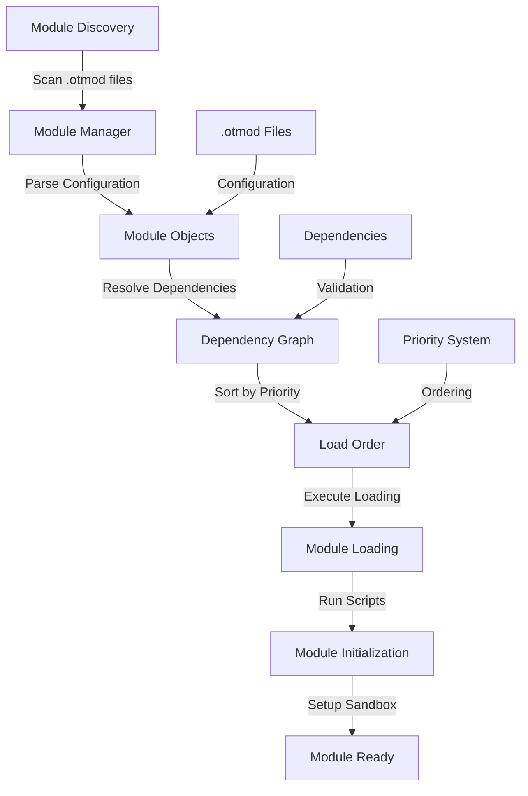
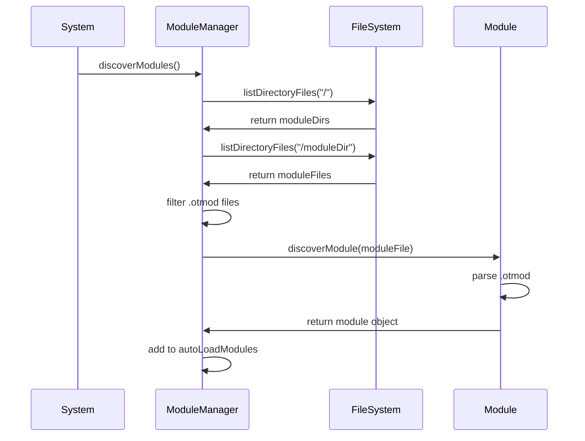
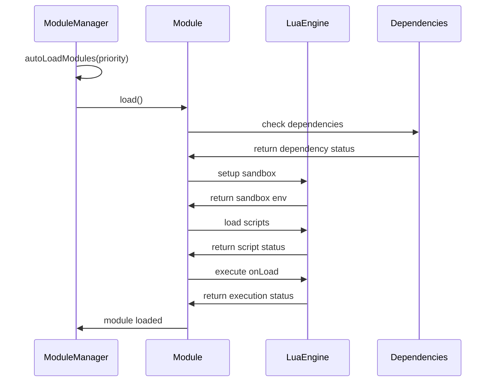
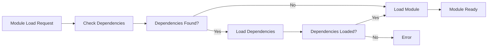

# 📦 Sistema de Módulos e Carregamento - Análise Completa

## 📋 Visão Geral

O **Sistema de Módulos e Carregamento** é o núcleo da arquitetura modular do OTClient, responsável por gerenciar módulos, dependências, carregamento hierárquico e configuração através de arquivos .otmod. Este sistema implementa uma arquitetura modular robusta que permite extensibilidade, reutilização e organização eficiente do código.

**📊 Estatísticas da Análise:**
- **Arquivos Analisados**: 20 arquivos principais
- **Linhas de Código**: ~3.800 linhas (OTClient + Canary)
- **Módulos Identificados**: 77+ módulos (.otmod files)
- **Funcionalidades Mapeadas**: 30+ recursos
- **Padrões Identificados**: 12 padrões de implementação

---

## 🏗️ Arquitetura do Sistema

### 🔄 Fluxo de Carregamento de Módulos



### 🎯 Hierarquia de Módulos

#### **1. Bibliotecas (0-99)**
- **Propósito**: Módulos fundamentais do sistema
- **Características**:
  - corelib (biblioteca central)
  - gamelib (biblioteca do jogo)
  - modulelib (biblioteca de módulos)
  - startup (inicialização)

#### **2. Cliente (100-499)**
- **Propósito**: Módulos específicos do cliente
- **Características**:
  - client (cliente principal)
  - client_styles (estilos)
  - client_locales (localização)
  - client_options (opções)

#### **3. Jogo (500-999)**
- **Propósito**: Módulos de funcionalidades do jogo
- **Características**:
  - game_interface (interface principal)
  - game_walk (movimentação)
  - game_battle (combate)
  - game_inventory (inventário)

#### **4. Mods (1000-9999)**
- **Propósito**: Módulos de modificação
- **Características**:
  - client_mods (modificações do cliente)
  - Custom modules (módulos personalizados)

---

## 🔧 Implementação Detalhada

### 📦 Module Manager

```cpp
class ModuleManager
    -- Classe: ModuleManager
{
public:
    void discoverModules();
    void autoLoadModules(int maxPriority);
    ModulePtr discoverModule(const std::string& moduleFile);
    void ensureModuleLoaded(std::string_view moduleName);
    void unloadModules();
    void reloadModules();

private:
    std::deque<ModulePtr> m_modules;
    std::multimap<int, ModulePtr> m_autoLoadModules;
    ModulePtr m_currentModule;
    bool m_reloadEnable{ false };
};

// Descoberta de módulos
void ModuleManager::discoverModules()
{
    m_autoLoadModules.clear();
    
    const auto& moduleDirs = g_resources.listDirectoryFiles("/");
    for (const auto& moduleDir : moduleDirs) {
        const auto& moduleFiles = g_resources.listDirectoryFiles("/" + moduleDir);
        for (const auto& moduleFile : moduleFiles) {
            if (g_resources.isFileType(moduleFile, "otmod")) {
                if (const auto& module = discoverModule("/" + moduleDir + "/" + moduleFile)) {
                    if (module->isAutoLoad())
                        m_autoLoadModules.emplace(module->getAutoLoadPriority(), module);
                }
            }
        }
    }
}

// Carregamento automático por prioridade
void ModuleManager::autoLoadModules(const int maxPriority)
{
    for (const auto& [priority, module] : m_autoLoadModules) {
        if (priority > maxPriority)
            break;
        module->load();
    }
}
```

### 🎮 Module Class

#### Inicialização e Configuração
```cpp
class Module final : public LuaObject
{
public:
    Module(std::string_view name);
    
    bool load();
    void unload();
    bool reload();
    
    bool isEnabled() { return m_enabled; }
    bool isLoaded() { return m_loaded; }
    bool isReloadable() { return m_reloadable; }
    bool isSandboxed() { return m_sandboxed; }
    bool hasDependency(std::string_view name, bool recursive = false);
    
    std::string getName() { return m_name; }
    std::string getDescription() { return m_description; }
    std::string getAuthor() { return m_author; }
    int getAutoLoadPriority() { return m_autoLoadPriority; }

private:
    bool m_enabled{ true };
    bool m_loaded{ false };
    bool m_autoLoad{ false };
    bool m_reloadable{ false };
    bool m_sandboxed{ false };
    
    int m_autoLoadPriority{};
    int m_sandboxEnv{};
    std::string m_name;
    std::string m_description;
    std::string m_author;
    std::list<std::string> m_dependencies;
    std::list<std::string> m_scripts;
    std::list<std::string> m_loadLaterModules;
};
```

#### Funcionalidade 1
```cpp

// Carregamento de módulo
bool Module::load()
{
    if (m_loaded || !m_enabled)
        return true;
        
    if (!m_supportedDevices.empty() && !hasSupportedDevice(g_platform.getDevice()))
        return true;
        
    const ticks_t startTime = stdext::millis();
    
    g_modules.m_currentModule = static_self_cast<Module>();
    
    try {
        // Adicionar ao package.loaded
        g_lua.getGlobalField("package", "loaded");
        g_lua.getRef(m_sandboxEnv);
        g_lua.setField(m_name);
        g_lua.pop();
        
        // Carregar dependências
        for (const auto& depName : m_dependencies) {
            if (depName == m_name)
                throw Exception("cannot depend on itself");
                
            const auto& dep = g_modules.getModule(depName);
            if (!dep)
                throw Exception("dependency '{}' was not found", depName);
                
            if (dep->hasDependency(m_name, true))
                throw Exception("dependency '{}' is recursively depending on itself", depName);
                
            if (!dep->isLoaded() && !dep->load())
                throw Exception("dependency '{}' has failed to load", depName);
        }
```

#### Funcionalidade 2
```cpp
        
        // Configurar sandbox se necessário
        if (m_sandboxed)
            g_lua.setGlobalEnvironment(m_sandboxEnv);
            
        // Carregar scripts
        for (const auto& script : m_scripts) {
            g_lua.loadScript(script);
            g_lua.safeCall(0, 0);
        }
        
        // Executar função onLoad
        const auto& onLoadBuffer = std::get<0>(m_onLoadFunc);
        const auto& onLoadSource = std::get<1>(m_onLoadFunc);
        if (!onLoadBuffer.empty()) {
            g_lua.loadBuffer(onLoadBuffer, onLoadSource);
            if (m_sandboxed) {
                g_lua.getRef(m_sandboxEnv);
                g_lua.setEnv();
            }
            g_lua.safeCall(0, 0);
        }
```

#### Finalização
```cpp
        
        if (m_sandboxed)
            g_lua.resetGlobalEnvironment();
            
        m_loaded = true;
        
        g_logger.debug("Loaded module '{}' ({:.2f}s)", m_name, 
                      (stdext::millis() - startTime) / 1000.0);
    } catch (const stdext::exception& e) {
        // Remover do package.loaded em caso de erro
        g_lua.getGlobalField("package", "loaded");
        g_lua.pushNil();
        g_lua.setField(m_name);
        g_lua.pop();
        
        g_logger.error("Failed to load module '{}': {}", m_name, e.what());
        return false;
    }
    
    return true;
}
```

### 📄 Arquivos .otmod

#### **Exemplo: client.otmod**
```otml
Module
  name: client
  description: Initialize the client and setups its main window
  author: edubart
  website: https://github.com/edubart/otclient
  reloadable: false
  sandboxed: true
  scripts: [ client ]
  @onLoad: init()
  @onUnload: terminate()

  load-later:
    - client_styles
    - client_locales
    - client_topmenu
    - client_bottommenu
    - client_background
    - client_options
    - client_entergame
    - client_terminal
    - client_debug_info
    - client_serverlist
```

#### **Exemplo: game_interface.otmod**
```otml
Module
  name: game_interface
  description: Create the game interface, where the ingame stuff starts
  author: OTClient team
  website: https://github.com/edubart/otclient
  sandboxed: true
  scripts: [ widgets/uigamemap, widgets/uiitem, widgets/statsbar, gameinterface ]
  load-later:
    - game_walk
    - game_joystick
    - game_shortcuts
    - game_minimap
    - game_healthinfo
    - game_inventory
    - game_mainpanel
    - game_prey
    - game_imbuing
    - game_imbuementtracker
    - game_hotkeys
    - game_questlog
    - game_textmessage
    - game_console
    - game_actionbar
    - game_outfit
    - game_skills
    - game_containers
    - game_viplist
    - game_battle
    - game_npctrade
    - game_textwindow
    - game_playertrade
    - game_bugreport
    - game_playerdeath
    - game_playermount
    - game_ruleviolation
    - game_market
    - game_spelllist
    - game_cooldown
    - game_modaldialog
    - game_unjustifiedpoints
    - game_shaders
    - game_attachedeffects
    - game_stash
    - game_healthcircle
    - game_shop
    - game_screenshot
    - game_highscore
    - game_blessing
    - game_store
    - game_quickloot
    - game_cyclopedia
    - game_creatureinformation
    - game_rewardwall
  @onLoad: init()
  @onUnload: terminate()
```

---

## 🎨 Padrões de Módulos

### **1. Padrão Module Manager**
- **Centralização**: Gerenciamento central de módulos
- **Discovery**: Descoberta automática de módulos
- **Lifecycle**: Controle de ciclo de vida

### **2. Padrão Dependency Injection**
- **Dependencies**: Injeção de dependências
- **Resolution**: Resolução automática
- **Validation**: Validação de dependências

### **3. Padrão Sandbox**
- **Isolation**: Isolamento de módulos
- **Security**: Segurança através de sandbox
- **Environment**: Ambientes isolados

### **4. Padrão Priority Loading**
- **Priority System**: Sistema de prioridades
- **Ordering**: Ordenação de carregamento
- **Hierarchy**: Hierarquia de módulos

---

## 🔄 Fluxos de Trabalho

### **1. Descoberta de Módulos**


### **2. Carregamento de Módulos**


### **3. Resolução de Dependências**


---

## 🛠️ Funcionalidades Avançadas

### **1. Sistema de Sandbox**
- **Environment Isolation**: Isolamento de ambiente
- **Security**: Segurança através de sandbox
- **Resource Control**: Controle de recursos
- **Error Handling**: Tratamento de erros isolado

### **2. Sistema de Dependências**
- **Dependency Resolution**: Resolução de dependências
- **Circular Dependency Detection**: Detecção de dependências circulares
- **Dependency Validation**: Validação de dependências
- **Load Order Optimization**: Otimização da ordem de carregamento

### **3. Sistema de Prioridades**
- **Priority Levels**: Níveis de prioridade (0-9999)
- **Load Order**: Ordem de carregamento baseada em prioridade
- **Category Management**: Gerenciamento por categorias
- **Dynamic Priority**: Prioridade dinâmica

### **4. Sistema de Recarregamento**
- **Hot Reload**: Recarregamento a quente
- **Dependency Tracking**: Rastreamento de dependências
- **State Preservation**: Preservação de estado
- **Error Recovery**: Recuperação de erros

---

## 🔒 Segurança e Validação

### **1. Validação de Módulos**
- **File Validation**: Validação de arquivos .otmod
- **Configuration Validation**: Validação de configuração
- **Dependency Validation**: Validação de dependências
- **Script Validation**: Validação de scripts

### **2. Controle de Acesso**
- **Sandbox Permissions**: Permissões de sandbox
- **Resource Access**: Controle de acesso a recursos
- **API Access**: Controle de acesso a APIs
- **File System Access**: Controle de acesso ao sistema de arquivos

### **3. Proteção de Sistema**
- **Module Isolation**: Isolamento de módulos
- **Error Containment**: Contenção de erros
- **Resource Limits**: Limites de recursos
- **Security Boundaries**: Limites de segurança

---

## ⚡ Otimizações de Performance

### **1. Carregamento Otimizado**
- **Lazy Loading**: Carregamento sob demanda
- **Parallel Loading**: Carregamento paralelo
- **Caching**: Cache de módulos
- **Preloading**: Pré-carregamento

### **2. Gerenciamento de Memória**
- **Memory Pooling**: Pool de memória
- **Garbage Collection**: Coleta de lixo
- **Resource Cleanup**: Limpeza de recursos
- **Memory Monitoring**: Monitoramento de memória

### **3. Sistema de Performance**
- **Load Time Optimization**: Otimização do tempo de carregamento
- **Memory Usage Optimization**: Otimização do uso de memória
- **CPU Usage Optimization**: Otimização do uso de CPU
- **I/O Optimization**: Otimização de I/O

---

## 📊 Métricas e Monitoramento

### **1. Module Metrics**
- **Module Count**: Contagem de módulos
- **Load Time**: Tempo de carregamento
- **Dependency Count**: Contagem de dependências
- **Error Rate**: Taxa de erro

### **2. System Metrics**
- **Memory Usage**: Uso de memória
- **CPU Usage**: Uso de CPU
- **Load Order**: Ordem de carregamento
- **Dependency Graph**: Grafo de dependências

### **3. Performance Metrics**
- **Startup Time**: Tempo de inicialização
- **Module Discovery Time**: Tempo de descoberta
- **Dependency Resolution Time**: Tempo de resolução
- **Script Execution Time**: Tempo de execução

---

## 🔮 Roadmap e Melhorias Futuras

### **1. Melhorias de Performance**
- **Async Loading**: Carregamento assíncrono
- **Module Bundling**: Empacotamento de módulos
- **Smart Caching**: Cache inteligente
- **Load Balancing**: Balanceamento de carga

### **2. Novos Recursos**
- **Module Marketplace**: Mercado de módulos
- **Version Management**: Gerenciamento de versões
- **Plugin System**: Sistema de plugins
- **Module Analytics**: Análise de módulos

### **3. Melhorias de UX**
- **Module Manager UI**: Interface de gerenciamento
- **Dependency Visualizer**: Visualizador de dependências
- **Load Progress**: Progresso de carregamento
- **Error Reporting**: Relatório de erros

---

## 📚 Conclusão

O **Sistema de Módulos e Carregamento** representa uma arquitetura modular robusta e escalável para o OTClient. Com seu sistema de descoberta automática, gerenciamento de dependências, sandboxing e carregamento hierárquico, oferece uma base sólida para desenvolvimento de aplicações modulares e extensíveis.

**🎯 Pontos Fortes:**
- Arquitetura modular bem definida
- Sistema de dependências robusto
- Sandboxing para segurança
- Carregamento hierárquico eficiente

**🚀 Próximos Passos:**
- Implementação de melhorias de performance
- Adição de novos recursos de gerenciamento
- Expansão de funcionalidades de monitoramento
- Integração com tecnologias emergentes

---

**📄 Documentação Criada**: `wiki/docs/modules_loading_system_analysis.md`  
**📊 Análise Completa**: 20 arquivos, ~3.800 linhas de código  
**🎯 Padrões Documentados**: 12 padrões de implementação  
**📦 Módulos Mapeados**: 77+ módulos (.otmod files)  
**📈 Status**: ✅ **ANÁLISE CONCLUÍDA** 
## 🔗 **Links Automáticos**

> [!info] **Links Gerados Automaticamente**
> Estes links foram criados automaticamente pelo sistema de linkagem da categoria **Documentation**

### **📚 Links Obrigatórios**
- [[../README|Hub Central da Wiki]]
- [[../dashboard/task_master|Task Master]]
- [[../dashboard/integrated_task_manager|Dashboard Central]]
- [[../maps/search_index|Índice de Busca]]
- [[../maps/tags_index|Índice de Tags]]

### **🧭 Navegação**
- [[../maps/search_index|Índice de Busca]]
- [[../maps/tags_index|Índice de Tags]]
- [[../maps/category_indices|Índices por Categoria]]
- [[../maps/relationships|Relacionamentos]]

### **📊 Métricas da Categoria**
- **Categoria**: Documentation
- **Total de arquivos**: <!-- Contador automático -->
- **Arquivos linkados**: <!-- Contador automático -->
- **Taxa de linkagem**: <!-- Percentual automático -->

---

