# 🔥 OTCLIENT-012: Sistema de Combate

## 📋 **ÍNDICE DETALHADO**

### **🎯 Navegação Rápida**

1. [🎯](#🎯)
2. [⚙️](#⚙️)
3. [📋](#📋)
4. [📋](#📋)
5. [📋](#📋)
6. [📋](#📋)
7. [📋](#📋)
8. [⚡](#⚡)
9. [⚙️](#⚙️)
10. [📋](#📋)
11. [📋](#📋)
12. [📋](#📋)
13. [📋](#📋)
14. [📚](#📚)

### **📚 Seções Principais**

| Seção | Descrição |
|-------|-----------|
| 🎯 | Documentação e referência |
| ⚙️ | Documentação e referência |
| 📋 | Documentação e referência |
| 📋 | Documentação e referência |
| 📋 | Documentação e referência |
| 📋 | Documentação e referência |
| 📋 | Documentação e referência |
| ⚡ | Documentação e referência |
| ⚙️ | Documentação e referência |
| 📋 | Documentação e referência |
| 📋 | Documentação e referência |
| 📋 | Documentação e referência |
| 📋 | Documentação e referência |
| 📚 | Documentação e referência |


---

## 🎯 **Visão Geral** 🎯

O **Sistema de Combate** é um dos componentes mais críticos do OTClient, responsável por gerenciar todas as interações de combate entre criaturas, incluindo cálculos de dano, tipos de combate, armas, e efeitos visuais. Este sistema trabalha em conjunto com o servidor Canary para processar combates em tempo real.


---

## 🏗️ **Arquitetura do Sistema** ⚙️

### **📁 Estrutura de Arquivos** 🏗️

```
📁 src/creatures/combat/
├── combat.hpp          # Definições principais do sistema de combate
├── combat.cpp          # Implementação do sistema de combate
└── condition.hpp       # Sistema de condições de combate

📁 src/items/weapons/
├── weapons.hpp         # Definições de armas
└── weapons.cpp         # Implementação de armas

📁 src/creatures/
├── creatures_definitions.hpp  # Definições de tipos de combate
└── creature.cpp        # Implementação de criaturas
```

### **🔗 Dependências Principais** 📝

- **Game Engine**: Sistema principal de jogo
- **Creature System**: Sistema de criaturas
- **Item System**: Sistema de itens e armas
- **Lua Scripting**: Scripts de combate
- **Network Protocol**: Comunicação com servidor


---

## ⚔️ **Componentes Principais** 📋

### **1. Estrutura CombatDamage** 🏗️

#### Nível Basic
```cpp
struct CombatDamage {
    struct {
        CombatType_t type = COMBAT_NONE;
        int32_t value = 0;
    } primary, secondary;

    CombatOrigin origin = ORIGIN_NONE;
    bool critical = false;
    int affected = 1;
    bool extension = false;
    std::string exString;
    bool fatal = false;
    bool hazardDodge = false;

    int32_t criticalDamage = 0;
    int32_t criticalChance = 0;
    int32_t damageMultiplier = 0;
    int32_t damageReductionMultiplier = 0;
    int32_t healingMultiplier = 0;
    int32_t manaLeech = 0;
    int32_t manaLeechChance = 0;
    int32_t lifeLeech = 0;
    int32_t lifeLeechChance = 0;
    int32_t healingLink = 0;

    std::string instantSpellName;
    std::string runeSpellName;
};
```

#### Nível Intermediate
```cpp
struct CombatDamage {
    struct {
        CombatType_t type = COMBAT_NONE;
        int32_t value = 0;
    } primary, secondary;

    CombatOrigin origin = ORIGIN_NONE;
    bool critical = false;
    int affected = 1;
    bool extension = false;
    std::string exString;
    bool fatal = false;
    bool hazardDodge = false;

    int32_t criticalDamage = 0;
    int32_t criticalChance = 0;
    int32_t damageMultiplier = 0;
    int32_t damageReductionMultiplier = 0;
    int32_t healingMultiplier = 0;
    int32_t manaLeech = 0;
    int32_t manaLeechChance = 0;
    int32_t lifeLeech = 0;
    int32_t lifeLeechChance = 0;
    int32_t healingLink = 0;

    std::string instantSpellName;
    std::string runeSpellName;
};
-- Adicionar tratamento de erros
local success, result = pcall(function()
    -- Código original aqui
end)
if not success then
    print('Erro:', result)
end
```

#### Nível Advanced
```cpp
struct CombatDamage {
    struct {
        CombatType_t type = COMBAT_NONE;
        int32_t value = 0;
    } primary, secondary;

    CombatOrigin origin = ORIGIN_NONE;
    bool critical = false;
    int affected = 1;
    bool extension = false;
    std::string exString;
    bool fatal = false;
    bool hazardDodge = false;

    int32_t criticalDamage = 0;
    int32_t criticalChance = 0;
    int32_t damageMultiplier = 0;
    int32_t damageReductionMultiplier = 0;
    int32_t healingMultiplier = 0;
    int32_t manaLeech = 0;
    int32_t manaLeechChance = 0;
    int32_t lifeLeech = 0;
    int32_t lifeLeechChance = 0;
    int32_t healingLink = 0;

    std::string instantSpellName;
    std::string runeSpellName;
};
-- Adicionar metatable para funcionalidade avançada
local mt = {
    __index = function(t, k)
        return rawget(t, k) or 'Valor não encontrado'
    end
    __call = function(t, ...)
        print('Objeto chamado com:', ...)
    end
}
setmetatable(meuObjeto, mt)
```

**Características:**
- **Dano Primário e Secundário**: Suporte a dois tipos de dano simultâneos
- **Origem do Dano**: Identifica a fonte do dano (melee, ranged, spell)
- **Sistema de Críticos**: Chance e multiplicador de dano crítico
- **Leech**: Roubo de vida e mana
- **Multiplicadores**: Sistema flexível de modificadores

### **2. Tipos de Combate (CombatType_t)** 📝

#### Nível Basic
```cpp
enum CombatType_t : uint8_t {
    COMBAT_PHYSICALDAMAGE = 0,    // Dano físico
    COMBAT_ENERGYDAMAGE = 1,      // Dano de energia
    COMBAT_EARTHDAMAGE = 2,       // Dano de terra/veneno
    COMBAT_FIREDAMAGE = 3,        // Dano de fogo
    COMBAT_UNDEFINEDDAMAGE = 4,   // Dano indefinido
    COMBAT_LIFEDRAIN = 5,         // Dreno de vida
    COMBAT_MANADRAIN = 6,         // Dreno de mana
    COMBAT_HEALING = 7,           // Cura
    COMBAT_DROWNDAMAGE = 8,       // Dano de afogamento
    COMBAT_ICEDAMAGE = 9,         // Dano de gelo
    COMBAT_HOLYDAMAGE = 10,       // Dano sagrado
    COMBAT_DEATHDAMAGE = 11,      // Dano de morte
    COMBAT_AGONYDAMAGE = 12,      // Dano de agonia
    COMBAT_NEUTRALDAMAGE = 13,    // Dano neutro
    COMBAT_COUNT = 14,
    COMBAT_NONE = 255
};
```

#### Nível Intermediate
```cpp
enum CombatType_t : uint8_t {
    COMBAT_PHYSICALDAMAGE = 0,    // Dano físico
    COMBAT_ENERGYDAMAGE = 1,      // Dano de energia
    COMBAT_EARTHDAMAGE = 2,       // Dano de terra/veneno
    COMBAT_FIREDAMAGE = 3,        // Dano de fogo
    COMBAT_UNDEFINEDDAMAGE = 4,   // Dano indefinido
    COMBAT_LIFEDRAIN = 5,         // Dreno de vida
    COMBAT_MANADRAIN = 6,         // Dreno de mana
    COMBAT_HEALING = 7,           // Cura
    COMBAT_DROWNDAMAGE = 8,       // Dano de afogamento
    COMBAT_ICEDAMAGE = 9,         // Dano de gelo
    COMBAT_HOLYDAMAGE = 10,       // Dano sagrado
    COMBAT_DEATHDAMAGE = 11,      // Dano de morte
    COMBAT_AGONYDAMAGE = 12,      // Dano de agonia
    COMBAT_NEUTRALDAMAGE = 13,    // Dano neutro
    COMBAT_COUNT = 14,
    COMBAT_NONE = 255
};
-- Adicionar tratamento de erros
local success, result = pcall(function()
    -- Código original aqui
end)
if not success then
    print('Erro:', result)
end
```

#### Nível Advanced
```cpp
enum CombatType_t : uint8_t {
    COMBAT_PHYSICALDAMAGE = 0,    // Dano físico
    COMBAT_ENERGYDAMAGE = 1,      // Dano de energia
    COMBAT_EARTHDAMAGE = 2,       // Dano de terra/veneno
    COMBAT_FIREDAMAGE = 3,        // Dano de fogo
    COMBAT_UNDEFINEDDAMAGE = 4,   // Dano indefinido
    COMBAT_LIFEDRAIN = 5,         // Dreno de vida
    COMBAT_MANADRAIN = 6,         // Dreno de mana
    COMBAT_HEALING = 7,           // Cura
    COMBAT_DROWNDAMAGE = 8,       // Dano de afogamento
    COMBAT_ICEDAMAGE = 9,         // Dano de gelo
    COMBAT_HOLYDAMAGE = 10,       // Dano sagrado
    COMBAT_DEATHDAMAGE = 11,      // Dano de morte
    COMBAT_AGONYDAMAGE = 12,      // Dano de agonia
    COMBAT_NEUTRALDAMAGE = 13,    // Dano neutro
    COMBAT_COUNT = 14,
    COMBAT_NONE = 255
};
-- Adicionar metatable para funcionalidade avançada
local mt = {
    __index = function(t, k)
        return rawget(t, k) or 'Valor não encontrado'
    end
    __call = function(t, ...)
        print('Objeto chamado com:', ...)
    end
}
setmetatable(meuObjeto, mt)
```

### **3. Sistema de Armas** 📝

#### **Classe Weapon (Base)**

```cpp
class Weapon {
    -- Classe: Weapon
public:
    virtual bool useWeapon(const std::shared_ptr<Player> &player, 
                          const std::shared_ptr<Item> &item, 
                          const std::shared_ptr<Creature> &target) const;
    
    virtual int32_t getWeaponDamage(const std::shared_ptr<Player> &player, 
                                   const std::shared_ptr<Creature> &target, 
                                   const std::shared_ptr<Item> &item, 
                                   bool maxDamage = false) const = 0;
    
    virtual CombatType_t getElementType() const = 0;
    virtual int16_t getElementDamageValue() const = 0;
    
    CombatDamage getCombatDamage(CombatDamage combat, 
                                const std::shared_ptr<Player> &player, 
                                const std::shared_ptr<Item> &item, 
                                int32_t damageModifier) const;
};
```

#### **Tipos de Armas**

1. **WeaponMelee**: Armas corpo a corpo
2. **WeaponDistance**: Armas de longo alcance
3. **WeaponWand**: Varinhas mágicas

### **4. Classe Combat** 📝

```cpp
class Combat {
    -- Classe: Combat
public:
    static void doCombatHealth(const std::shared_ptr<Creature> &caster, 
                              const std::shared_ptr<Creature> &target, 
                              CombatDamage &damage, 
                              const CombatParams &params);
    
    static void doCombatMana(const std::shared_ptr<Creature> &caster, 
                            const std::shared_ptr<Creature> &target, 
                            CombatDamage &damage, 
                            const CombatParams &params);
    
    static void doCombatCondition(const std::shared_ptr<Creature> &caster, 
                                 const std::shared_ptr<Creature> &target, 
                                 const CombatParams &params);
    
    static bool canDoCombat(const std::shared_ptr<Creature> &attacker, 
                           const std::shared_ptr<Creature> &target, 
                           bool aggressive);
    
    static ReturnValue canTargetCreature(const std::shared_ptr<Player> &attacker, 
                                        const std::shared_ptr<Creature> &target);
};
```


---

## ⚙️ **Mecânicas de Combate** 📋

### **1. Cálculo de Dano** 📝

#### **Fórmula de Dano de Arma**

#### Nível Basic
```cpp
CombatDamage Weapon::getCombatDamage(CombatDamage combat, 
                                    const std::shared_ptr<Player> &player, 
                                    const std::shared_ptr<Item> &item, 
                                    int32_t damageModifier) const {
    // Variáveis locais
    const uint32_t level = player->getLevel();
    const int16_t elementalAttack = getElementDamageValue();
    const int32_t weaponAttack = std::max<int32_t>(0, item->getAttack());
    const int32_t playerSkill = player->getWeaponSkill(item);
    const float attackFactor = player->getAttackFactor();

    // Cálculo do ataque total
    const int32_t totalAttack = elementalAttack + weaponAttack;
    const double weaponAttackProportion = static_cast<double>(weaponAttack) / 
                                         static_cast<double>(totalAttack);

    // Cálculo do dano
    const int32_t maxDamage = static_cast<int32_t>(
        Weapons::getMaxWeaponDamage(level, playerSkill, totalAttack, attackFactor, true) * 
        player->getVocation()->meleeDamageMultiplier * 
        damageModifier / 100
    );
    const int32_t minDamage = level / 5;
    const int32_t realDamage = normal_random(minDamage, maxDamage);

    // Distribuição do dano
    combat.primary.value = realDamage * weaponAttackProportion;
    combat.secondary.value = realDamage * (1 - weaponAttackProportion);
    return combat;
}
```

#### Nível Intermediate
```cpp
CombatDamage Weapon::getCombatDamage(CombatDamage combat, 
                                    const std::shared_ptr<Player> &player, 
                                    const std::shared_ptr<Item> &item, 
                                    int32_t damageModifier) const {
    // Variáveis locais
    const uint32_t level = player->getLevel();
    const int16_t elementalAttack = getElementDamageValue();
    const int32_t weaponAttack = std::max<int32_t>(0, item->getAttack());
    const int32_t playerSkill = player->getWeaponSkill(item);
    const float attackFactor = player->getAttackFactor();

    // Cálculo do ataque total
    const int32_t totalAttack = elementalAttack + weaponAttack;
    const double weaponAttackProportion = static_cast<double>(weaponAttack) / 
                                         static_cast<double>(totalAttack);

    // Cálculo do dano
    const int32_t maxDamage = static_cast<int32_t>(
        Weapons::getMaxWeaponDamage(level, playerSkill, totalAttack, attackFactor, true) * 
        player->getVocation()->meleeDamageMultiplier * 
        damageModifier / 100
    );
    const int32_t minDamage = level / 5;
    const int32_t realDamage = normal_random(minDamage, maxDamage);

    // Distribuição do dano
    combat.primary.value = realDamage * weaponAttackProportion;
    combat.secondary.value = realDamage * (1 - weaponAttackProportion);
    return combat;
}
-- Adicionar tratamento de erros
local success, result = pcall(function()
    -- Código original aqui
end)
if not success then
    print('Erro:', result)
end
```

#### Nível Advanced
```cpp
CombatDamage Weapon::getCombatDamage(CombatDamage combat, 
                                    const std::shared_ptr<Player> &player, 
                                    const std::shared_ptr<Item> &item, 
                                    int32_t damageModifier) const {
    // Variáveis locais
    const uint32_t level = player->getLevel();
    const int16_t elementalAttack = getElementDamageValue();
    const int32_t weaponAttack = std::max<int32_t>(0, item->getAttack());
    const int32_t playerSkill = player->getWeaponSkill(item);
    const float attackFactor = player->getAttackFactor();

    // Cálculo do ataque total
    const int32_t totalAttack = elementalAttack + weaponAttack;
    const double weaponAttackProportion = static_cast<double>(weaponAttack) / 
                                         static_cast<double>(totalAttack);

    // Cálculo do dano
    const int32_t maxDamage = static_cast<int32_t>(
        Weapons::getMaxWeaponDamage(level, playerSkill, totalAttack, attackFactor, true) * 
        player->getVocation()->meleeDamageMultiplier * 
        damageModifier / 100
    );
    const int32_t minDamage = level / 5;
    const int32_t realDamage = normal_random(minDamage, maxDamage);

    // Distribuição do dano
    combat.primary.value = realDamage * weaponAttackProportion;
    combat.secondary.value = realDamage * (1 - weaponAttackProportion);
    return combat;
}
-- Adicionar metatable para funcionalidade avançada
local mt = {
    __index = function(t, k)
        return rawget(t, k) or 'Valor não encontrado'
    end
    __call = function(t, ...)
        print('Objeto chamado com:', ...)
    end
}
setmetatable(meuObjeto, mt)
```

#### **Fatores de Dano**

- **Nível do Jogador**: Influencia dano mínimo
- **Habilidade da Arma**: Skill específica da arma
- **Ataque da Arma**: Valor de ataque do item
- **Ataque Elemental**: Dano adicional de elemento
- **Fator de Ataque**: Modo de combate (full attack, balanced, full defense)
- **Multiplicador de Vocação**: Bônus específico da vocação

### **2. Sistema de Bloqueio** 📝

```cpp
BlockType_t Creature::blockHit(const std::shared_ptr<Creature> &attacker, 
                              const CombatType_t &combatType, 
                              int32_t &damage, 
                              bool checkDefense = false, 
                              bool checkArmor = false) {
    BlockType_t blockType = BLOCK_NONE;

    // Aplicar modificações de absorção
    applyAbsorbDamageModifications(attacker, damage, combatType);

    // Verificar imunidade
    if (isImmune(combatType)) {
        damage = 0;
        blockType = BLOCK_IMMUNITY;
    } else if (checkDefense || checkArmor) {
        // Sistema de defesa
        if (checkDefense && hasDefense && canUseDefense) {
            int32_t defense = getDefense();
            damage -= uniform_random(defense / 2, defense);
            if (damage <= 0) {
                damage = 0;
                blockType = BLOCK_DEFENSE;
            }
        }

        // Sistema de armadura
        if (checkArmor) {
            int32_t armor = getArmor();
            if (armor > 3) {
                damage -= uniform_random(armor / 2, armor - (armor % 2 + 1));
            } else if (armor > 0) {
                --damage;
    -- damage; (traduzido)
            }
            if (damage <= 0) {
                damage = 0;
                blockType = BLOCK_ARMOR;
            }
        }
    }

    return blockType;
}
```

### **3. Sistema de Condições** 📝

#### **Mapeamento Condição-Dano**

#### Nível Basic
```cpp
CombatType_t Combat::ConditionToDamageType(ConditionType_t type) {
    switch (type) {
        case CONDITION_FIRE:
            return COMBAT_FIREDAMAGE;
        case CONDITION_ENERGY:
            return COMBAT_ENERGYDAMAGE;
        case CONDITION_BLEEDING:
            return COMBAT_PHYSICALDAMAGE;
        case CONDITION_DROWN:
            return COMBAT_DROWNDAMAGE;
        case CONDITION_POISON:
            return COMBAT_EARTHDAMAGE;
        case CONDITION_FREEZING:
            return COMBAT_ICEDAMAGE;
        case CONDITION_DAZZLED:
            return COMBAT_HOLYDAMAGE;
        case CONDITION_CURSED:
            return COMBAT_DEATHDAMAGE;
        default:
            return COMBAT_NONE;
    }
}
```

#### Nível Intermediate
```cpp
CombatType_t Combat::ConditionToDamageType(ConditionType_t type) {
    switch (type) {
        case CONDITION_FIRE:
            return COMBAT_FIREDAMAGE;
        case CONDITION_ENERGY:
            return COMBAT_ENERGYDAMAGE;
        case CONDITION_BLEEDING:
            return COMBAT_PHYSICALDAMAGE;
        case CONDITION_DROWN:
            return COMBAT_DROWNDAMAGE;
        case CONDITION_POISON:
            return COMBAT_EARTHDAMAGE;
        case CONDITION_FREEZING:
            return COMBAT_ICEDAMAGE;
        case CONDITION_DAZZLED:
            return COMBAT_HOLYDAMAGE;
        case CONDITION_CURSED:
            return COMBAT_DEATHDAMAGE;
        default:
            return COMBAT_NONE;
    }
}
-- Adicionar tratamento de erros
local success, result = pcall(function()
    -- Código original aqui
end)
if not success then
    print('Erro:', result)
end
```

#### Nível Advanced
```cpp
CombatType_t Combat::ConditionToDamageType(ConditionType_t type) {
    switch (type) {
        case CONDITION_FIRE:
            return COMBAT_FIREDAMAGE;
        case CONDITION_ENERGY:
            return COMBAT_ENERGYDAMAGE;
        case CONDITION_BLEEDING:
            return COMBAT_PHYSICALDAMAGE;
        case CONDITION_DROWN:
            return COMBAT_DROWNDAMAGE;
        case CONDITION_POISON:
            return COMBAT_EARTHDAMAGE;
        case CONDITION_FREEZING:
            return COMBAT_ICEDAMAGE;
        case CONDITION_DAZZLED:
            return COMBAT_HOLYDAMAGE;
        case CONDITION_CURSED:
            return COMBAT_DEATHDAMAGE;
        default:
            return COMBAT_NONE;
    }
}
-- Adicionar metatable para funcionalidade avançada
local mt = {
    __index = function(t, k)
        return rawget(t, k) or 'Valor não encontrado'
    end
    __call = function(t, ...)
        print('Objeto chamado com:', ...)
    end
}
setmetatable(meuObjeto, mt)
```


---

## 🎮 **Fluxo de Combate** 📋

### **1. Início do Combate** 📝

```mermaid
graph TD
    A[Player Ataca] --> B[Verificar Permissões]
    B --> C{Combate Permitido?}
    C -->|Não| D[Bloquear Ataque]
    C -->|Sim| E[Calcular Dano]
    E --> F[Aplicar Modificadores]
    F --> G[Verificar Bloqueios]
    G --> H[Aplicar Dano]
    H --> I[Efeitos Visuais]
    I --> J[Atualizar Interface]
```



### **2. Processamento de Dano** 📝

#### Nível Basic
```cpp
    // Verificar se alvo é atacável
    if (!target->isAttackable()) {
    if (damage.origin != ORIGIN_NONE) {
        if (!events.empty()) {
    if (realDamage == 0) {
    if (attackerPlayer && targetPlayer) {
```

#### Nível Intermediate
```cpp
void Game::combatChangeHealth(const std::shared_ptr<Creature> &attacker, 
                             const std::shared_ptr<Creature> &target, 
                             CombatDamage &damage) {
    // Verificar se alvo é atacável
    if (!target->isAttackable()) {
        return;
    }

    // Aplicar eventos de mudança de vida
    if (damage.origin != ORIGIN_NONE) {
        const auto events = target->getCreatureEvents(CREATURE_EVENT_HEALTHCHANGE);
        if (!events.empty()) {
            for (const auto &creatureEvent : events) {
                creatureEvent->executeHealthChange(target, attacker, damage);
            }
            damage.origin = ORIGIN_NONE;
            return combatChangeHealth(attacker, target, damage);
        }
    }

    // Aplicar efeitos da roda do destino
    applyWheelOfDestinyEffectsToDamage(damage, attackerPlayer, target);

    // Calcular dano real
    auto realDamage = damage.primary.value + damage.secondary.value;
    if (realDamage == 0) {
        return;
    }

    // Aplicar dano PvP customizado
    if (attackerPlayer && targetPlayer) {
        applyPvPDamage(damage, attackerPlayer, targetPlayer);
    }

    // Aplicar dano final
    target->drainHealth(attacker, realDamage);
}
```

#### Nível Advanced
```cpp
void Game::combatChangeHealth(const std::shared_ptr<Creature> &attacker, 
                             const std::shared_ptr<Creature> &target, 
                             CombatDamage &damage) {
    // Verificar se alvo é atacável
    if (!target->isAttackable()) {
        return;
    }

    // Aplicar eventos de mudança de vida
    if (damage.origin != ORIGIN_NONE) {
        const auto events = target->getCreatureEvents(CREATURE_EVENT_HEALTHCHANGE);
        if (!events.empty()) {
            for (const auto &creatureEvent : events) {
                creatureEvent->executeHealthChange(target, attacker, damage);
            }
            damage.origin = ORIGIN_NONE;
            return combatChangeHealth(attacker, target, damage);
        }
    }

    // Aplicar efeitos da roda do destino
    applyWheelOfDestinyEffectsToDamage(damage, attackerPlayer, target);

    // Calcular dano real
    auto realDamage = damage.primary.value + damage.secondary.value;
    if (realDamage == 0) {
        return;
    }

    // Aplicar dano PvP customizado
    if (attackerPlayer && targetPlayer) {
        applyPvPDamage(damage, attackerPlayer, targetPlayer);
    }

    // Aplicar dano final
    target->drainHealth(attacker, realDamage);
}
-- Adicionar metatable para funcionalidade avançada
local mt = {
    __index = function(t, k)
        return rawget(t, k) or 'Valor não encontrado'
    end
    __call = function(t, ...)
        print('Objeto chamado com:', ...)
    end
}
setmetatable(meuObjeto, mt)
```


---

## 🎨 **Efeitos Visuais** 📋

### **1. Tipos de Efeitos por Raça** 📝

#### Nível Basic
```cpp
void Game::combatGetTypeInfo(CombatType_t combatType, 
                            const std::shared_ptr<Creature> &target, 
                            TextColor_t &color, 
                            uint16_t &effect) {
    switch (combatType) {
        case COMBAT_PHYSICALDAMAGE: {
            switch (target->getRace()) {
                case RACE_VENOM:
                    color = TEXTCOLOR_LIGHTGREEN;
                    effect = CONST_ME_HITBYPOISON;
                    break;
                case RACE_BLOOD:
                    color = TEXTCOLOR_RED;
                    effect = CONST_ME_DRAWBLOOD;
                    break;
                case RACE_UNDEAD:
                    color = TEXTCOLOR_LIGHTGREY;
                    effect = CONST_ME_HITAREA;
                    break;
                // ... outros casos
            }
            break;
        }
        // ... outros tipos de combate
    }
}
```

#### Nível Intermediate
```cpp
void Game::combatGetTypeInfo(CombatType_t combatType, 
                            const std::shared_ptr<Creature> &target, 
                            TextColor_t &color, 
                            uint16_t &effect) {
    switch (combatType) {
        case COMBAT_PHYSICALDAMAGE: {
            switch (target->getRace()) {
                case RACE_VENOM:
                    color = TEXTCOLOR_LIGHTGREEN;
                    effect = CONST_ME_HITBYPOISON;
                    break;
                case RACE_BLOOD:
                    color = TEXTCOLOR_RED;
                    effect = CONST_ME_DRAWBLOOD;
                    break;
                case RACE_UNDEAD:
                    color = TEXTCOLOR_LIGHTGREY;
                    effect = CONST_ME_HITAREA;
                    break;
                // ... outros casos
            }
            break;
        }
        // ... outros tipos de combate
    }
}
-- Adicionar tratamento de erros
local success, result = pcall(function()
    -- Código original aqui
end)
if not success then
    print('Erro:', result)
end
```

#### Nível Advanced
```cpp
void Game::combatGetTypeInfo(CombatType_t combatType, 
                            const std::shared_ptr<Creature> &target, 
                            TextColor_t &color, 
                            uint16_t &effect) {
    switch (combatType) {
        case COMBAT_PHYSICALDAMAGE: {
            switch (target->getRace()) {
                case RACE_VENOM:
                    color = TEXTCOLOR_LIGHTGREEN;
                    effect = CONST_ME_HITBYPOISON;
                    break;
                case RACE_BLOOD:
                    color = TEXTCOLOR_RED;
                    effect = CONST_ME_DRAWBLOOD;
                    break;
                case RACE_UNDEAD:
                    color = TEXTCOLOR_LIGHTGREY;
                    effect = CONST_ME_HITAREA;
                    break;
                // ... outros casos
            }
            break;
        }
        // ... outros tipos de combate
    }
}
-- Adicionar metatable para funcionalidade avançada
local mt = {
    __index = function(t, k)
        return rawget(t, k) or 'Valor não encontrado'
    end
    __call = function(t, ...)
        print('Objeto chamado com:', ...)
    end
}
setmetatable(meuObjeto, mt)
```

### **2. Efeitos de Som** 📝

#### Nível Basic
```cpp
void Weapon::internalUseWeapon(const std::shared_ptr<Player> &player, 
                              const std::shared_ptr<Item> &item, 
                              const std::shared_ptr<Creature> &target, 
                              int32_t damageModifier) const {
    if (player) {
        if (params.soundCastEffect == SoundEffect_t::SILENCE) {
            g_game().sendDoubleSoundEffect(player->getPosition(), 
                                         player->getHitSoundEffect(), 
                                         player->getAttackSoundEffect(), 
                                         player);
        } else {
            g_game().sendDoubleSoundEffect(player->getPosition(), 
                                         params.soundCastEffect, 
                                         params.soundImpactEffect, 
                                         player);
        }
    }
    // ... resto da implementação
}
```

#### Nível Intermediate
```cpp
void Weapon::internalUseWeapon(const std::shared_ptr<Player> &player, 
                              const std::shared_ptr<Item> &item, 
                              const std::shared_ptr<Creature> &target, 
                              int32_t damageModifier) const {
    if (player) {
        if (params.soundCastEffect == SoundEffect_t::SILENCE) {
            g_game().sendDoubleSoundEffect(player->getPosition(), 
                                         player->getHitSoundEffect(), 
                                         player->getAttackSoundEffect(), 
                                         player);
        } else {
            g_game().sendDoubleSoundEffect(player->getPosition(), 
                                         params.soundCastEffect, 
                                         params.soundImpactEffect, 
                                         player);
        }
    }
    // ... resto da implementação
}
-- Adicionar tratamento de erros
local success, result = pcall(function()
    -- Código original aqui
end)
if not success then
    print('Erro:', result)
end
```

#### Nível Advanced
```cpp
void Weapon::internalUseWeapon(const std::shared_ptr<Player> &player, 
                              const std::shared_ptr<Item> &item, 
                              const std::shared_ptr<Creature> &target, 
                              int32_t damageModifier) const {
    if (player) {
        if (params.soundCastEffect == SoundEffect_t::SILENCE) {
            g_game().sendDoubleSoundEffect(player->getPosition(), 
                                         player->getHitSoundEffect(), 
                                         player->getAttackSoundEffect(), 
                                         player);
        } else {
            g_game().sendDoubleSoundEffect(player->getPosition(), 
                                         params.soundCastEffect, 
                                         params.soundImpactEffect, 
                                         player);
        }
    }
    // ... resto da implementação
}
-- Adicionar metatable para funcionalidade avançada
local mt = {
    __index = function(t, k)
        return rawget(t, k) or 'Valor não encontrado'
    end
    __call = function(t, ...)
        print('Objeto chamado com:', ...)
    end
}
setmetatable(meuObjeto, mt)
```


---

## 🔧 **Integração com Lua** 📋

### **1. Callbacks de Combate** 📝

```cpp
class ValueCallback final : public CallBack {
    -- Classe: ValueCallback
public:
    explicit ValueCallback(formulaType_t initType);
    
    uint32_t getMagicLevelSkill(const std::shared_ptr<Player> &player, 
                                const CombatDamage &damage) const;
    void getMinMaxValues(const std::shared_ptr<Player> &player, 
                        CombatDamage &damage, 
                        bool useCharges) const;
};
```

### **2. Eventos de Combate** 📝

#### Nível Basic
```cpp
// Evento de combate do jogador
g_events().eventPlayerOnCombat(attackerPlayer, target, item, damage);

// Callback de combate
g_callbacks().executeCallback(EventCallback_t::playerOnCombat, 
                            &EventCallback::playerOnCombat, 
                            attackerPlayer, target, item, std::ref(damage));
```

#### Nível Intermediate
```cpp
// Evento de combate do jogador
g_events().eventPlayerOnCombat(attackerPlayer, target, item, damage);

// Callback de combate
g_callbacks().executeCallback(EventCallback_t::playerOnCombat, 
                            &EventCallback::playerOnCombat, 
                            attackerPlayer, target, item, std::ref(damage));
-- Adicionar tratamento de erros
local success, result = pcall(function()
    -- Código original aqui
end)
if not success then
    print('Erro:', result)
end
```

#### Nível Advanced
```cpp
// Evento de combate do jogador
g_events().eventPlayerOnCombat(attackerPlayer, target, item, damage);

// Callback de combate
g_callbacks().executeCallback(EventCallback_t::playerOnCombat, 
                            &EventCallback::playerOnCombat, 
                            attackerPlayer, target, item, std::ref(damage));
-- Adicionar metatable para funcionalidade avançada
local mt = {
    __index = function(t, k)
        return rawget(t, k) or 'Valor não encontrado'
    end
    __call = function(t, ...)
        print('Objeto chamado com:', ...)
    end
}
setmetatable(meuObjeto, mt)
```


---

## 📊 **Otimizações de Performance** ⚡

### **1. Cache de Combate** 📝

- **Cálculos de Dano**: Cache de fórmulas frequentemente usadas
- **Verificações de Permissão**: Cache de resultados de validação
- **Efeitos Visuais**: Cache de configurações de efeitos

### **2. Otimizações de Rede** 📝

- **Batch de Dano**: Agrupamento de múltiplos danos
- **Compressão de Dados**: Redução de tráfego de rede
- **Predição de Movimento**: Antecipação de ataques


---

## 🛡️ **Sistema de Segurança** ⚙️

### **1. Validações de Combate** 📝

#### Nível Basic
```cpp
ReturnValue Combat::canDoCombat(const std::shared_ptr<Creature> &attacker, 
                               const std::shared_ptr<Creature> &target, 
                               bool aggressive) {
    // Verificar se criaturas existem
    if (!attacker || !target) {
        return RETURNVALUE_NOTPOSSIBLE;
    }

    // Verificar se estão no mesmo tile
    if (attacker->getTile() == target->getTile()) {
        return RETURNVALUE_NOTPOSSIBLE;
    }

    // Verificar proteções PvP
    if (attacker->getPlayer() && target->getPlayer()) {
        if (!isProtected(attacker->getPlayer(), target->getPlayer())) {
            return RETURNVALUE_NOTPOSSIBLE;
        }
    }

    return RETURNVALUE_NOERROR;
}
```

#### Nível Intermediate
```cpp
ReturnValue Combat::canDoCombat(const std::shared_ptr<Creature> &attacker, 
                               const std::shared_ptr<Creature> &target, 
                               bool aggressive) {
    // Verificar se criaturas existem
    if (!attacker || !target) {
        return RETURNVALUE_NOTPOSSIBLE;
    }

    // Verificar se estão no mesmo tile
    if (attacker->getTile() == target->getTile()) {
        return RETURNVALUE_NOTPOSSIBLE;
    }

    // Verificar proteções PvP
    if (attacker->getPlayer() && target->getPlayer()) {
        if (!isProtected(attacker->getPlayer(), target->getPlayer())) {
            return RETURNVALUE_NOTPOSSIBLE;
        }
    }

    return RETURNVALUE_NOERROR;
}
-- Adicionar tratamento de erros
local success, result = pcall(function()
    -- Código original aqui
end)
if not success then
    print('Erro:', result)
end
```

#### Nível Advanced
```cpp
ReturnValue Combat::canDoCombat(const std::shared_ptr<Creature> &attacker, 
                               const std::shared_ptr<Creature> &target, 
                               bool aggressive) {
    // Verificar se criaturas existem
    if (!attacker || !target) {
        return RETURNVALUE_NOTPOSSIBLE;
    }

    // Verificar se estão no mesmo tile
    if (attacker->getTile() == target->getTile()) {
        return RETURNVALUE_NOTPOSSIBLE;
    }

    // Verificar proteções PvP
    if (attacker->getPlayer() && target->getPlayer()) {
        if (!isProtected(attacker->getPlayer(), target->getPlayer())) {
            return RETURNVALUE_NOTPOSSIBLE;
        }
    }

    return RETURNVALUE_NOERROR;
}
-- Adicionar metatable para funcionalidade avançada
local mt = {
    __index = function(t, k)
        return rawget(t, k) or 'Valor não encontrado'
    end
    __call = function(t, ...)
        print('Objeto chamado com:', ...)
    end
}
setmetatable(meuObjeto, mt)
```

### **2. Anti-Cheat** 📝

- **Verificação de Velocidade**: Limitação de ataques por segundo
- **Validação de Posição**: Verificação de distância de ataque
- **Detecção de Bots**: Análise de padrões de combate


---

## 🔄 **Sincronização com Servidor** 📋

### **1. Protocolo de Combate** 📝

#### Nível Basic
```cpp
// Envio de ataque para servidor
void Player::sendAttack(const std::shared_ptr<Creature> &target) {
    NetworkMessage msg;
    msg.addByte(0xA1); // Attack packet
    msg.add<uint32_t>(target->getID());
    sendNetworkMessage(msg);
}

// Recebimento de dano do servidor
void Player::parseAttack(const NetworkMessage &msg) {
    uint32_t targetId = msg.get<uint32_t>();
    CombatDamage damage;
    damage.primary.value = msg.get<int32_t>();
    damage.primary.type = static_cast<CombatType_t>(msg.getByte());
    
    // Aplicar dano localmente
    applyDamage(damage);
}
```

#### Nível Intermediate
```cpp
// Envio de ataque para servidor
void Player::sendAttack(const std::shared_ptr<Creature> &target) {
    NetworkMessage msg;
    msg.addByte(0xA1); // Attack packet
    msg.add<uint32_t>(target->getID());
    sendNetworkMessage(msg);
}

// Recebimento de dano do servidor
void Player::parseAttack(const NetworkMessage &msg) {
    uint32_t targetId = msg.get<uint32_t>();
    CombatDamage damage;
    damage.primary.value = msg.get<int32_t>();
    damage.primary.type = static_cast<CombatType_t>(msg.getByte());
    
    // Aplicar dano localmente
    applyDamage(damage);
}
-- Adicionar tratamento de erros
local success, result = pcall(function()
    -- Código original aqui
end)
if not success then
    print('Erro:', result)
end
```

#### Nível Advanced
```cpp
// Envio de ataque para servidor
void Player::sendAttack(const std::shared_ptr<Creature> &target) {
    NetworkMessage msg;
    msg.addByte(0xA1); // Attack packet
    msg.add<uint32_t>(target->getID());
    sendNetworkMessage(msg);
}

// Recebimento de dano do servidor
void Player::parseAttack(const NetworkMessage &msg) {
    uint32_t targetId = msg.get<uint32_t>();
    CombatDamage damage;
    damage.primary.value = msg.get<int32_t>();
    damage.primary.type = static_cast<CombatType_t>(msg.getByte());
    
    // Aplicar dano localmente
    applyDamage(damage);
}
-- Adicionar metatable para funcionalidade avançada
local mt = {
    __index = function(t, k)
        return rawget(t, k) or 'Valor não encontrado'
    end
    __call = function(t, ...)
        print('Objeto chamado com:', ...)
    end
}
setmetatable(meuObjeto, mt)
```

### **2. Predição de Cliente** 📝

- **Interpolação de Movimento**: Suavização de animações
- **Predição de Dano**: Antecipação de resultados
- **Rollback**: Correção de predições incorretas


---

## 📈 **Métricas e Monitoramento** 📋

### **1. Estatísticas de Combate** 📝

- **DPS (Damage Per Second)**: Dano por segundo
- **Taxa de Acerto**: Porcentagem de ataques bem-sucedidos
- **Eficiência de Bloqueio**: Taxa de bloqueios bem-sucedidos
- **Tempo de Resposta**: Latência do sistema de combate

### **2. Logs de Debug** 📝

#### Nível Basic
```cpp
g_logger().trace("[{}] Combat damage: primary={}, secondary={}, type={}", 
                __FUNCTION__, 
                damage.primary.value, 
                damage.secondary.value, 
                static_cast<int>(damage.primary.type));
```

#### Nível Intermediate
```cpp
g_logger().trace("[{}] Combat damage: primary={}, secondary={}, type={}", 
                __FUNCTION__, 
                damage.primary.value, 
                damage.secondary.value, 
                static_cast<int>(damage.primary.type));
-- Adicionar tratamento de erros
local success, result = pcall(function()
    -- Código original aqui
end)
if not success then
    print('Erro:', result)
end
```

#### Nível Advanced
```cpp
g_logger().trace("[{}] Combat damage: primary={}, secondary={}, type={}", 
                __FUNCTION__, 
                damage.primary.value, 
                damage.secondary.value, 
                static_cast<int>(damage.primary.type));
-- Adicionar metatable para funcionalidade avançada
local mt = {
    __index = function(t, k)
        return rawget(t, k) or 'Valor não encontrado'
    end
    __call = function(t, ...)
        print('Objeto chamado com:', ...)
    end
}
setmetatable(meuObjeto, mt)
```


---

## 🎯 **Casos de Uso Específicos** 📋

### **1. Combate PvP** 📝

#### Nível Basic
```cpp
void Game::applyPvPDamage(CombatDamage &damage, 
                         const std::shared_ptr<Player> &attacker, 
                         const std::shared_ptr<Player> &target) {
    // Reduzir dano PvP
    if (target->getSkull() != SKULL_BLACK) {
        if (damage.primary.type != COMBAT_HEALING) {
            damage.primary.value /= 2;
        }
        if (damage.secondary.type != COMBAT_HEALING) {
            damage.secondary.value /= 2;
        }
    }
}
```

#### Nível Intermediate
```cpp
void Game::applyPvPDamage(CombatDamage &damage, 
                         const std::shared_ptr<Player> &attacker, 
                         const std::shared_ptr<Player> &target) {
    // Reduzir dano PvP
    if (target->getSkull() != SKULL_BLACK) {
        if (damage.primary.type != COMBAT_HEALING) {
            damage.primary.value /= 2;
        }
        if (damage.secondary.type != COMBAT_HEALING) {
            damage.secondary.value /= 2;
        }
    }
}
-- Adicionar tratamento de erros
local success, result = pcall(function()
    -- Código original aqui
end)
if not success then
    print('Erro:', result)
end
```

#### Nível Advanced
```cpp
void Game::applyPvPDamage(CombatDamage &damage, 
                         const std::shared_ptr<Player> &attacker, 
                         const std::shared_ptr<Player> &target) {
    // Reduzir dano PvP
    if (target->getSkull() != SKULL_BLACK) {
        if (damage.primary.type != COMBAT_HEALING) {
            damage.primary.value /= 2;
        }
        if (damage.secondary.type != COMBAT_HEALING) {
            damage.secondary.value /= 2;
        }
    }
}
-- Adicionar metatable para funcionalidade avançada
local mt = {
    __index = function(t, k)
        return rawget(t, k) or 'Valor não encontrado'
    end
    __call = function(t, ...)
        print('Objeto chamado com:', ...)
    end
}
setmetatable(meuObjeto, mt)
```

### **2. Combate contra Monstros** 📝

#### Nível Basic
```cpp
// Bônus de presa
if (attackerPlayer && targetMonster) {
    const auto &slot = attackerPlayer->getPreyWithMonster(targetMonster->getRaceId());
    if (slot && slot->isOccupied() && slot->bonus == PreyBonus_Damage && slot->bonusTimeLeft > 0) {
        damage.primary.value += static_cast<int32_t>(
            std::ceil((damage.primary.value * slot->bonusPercentage) / 100)
        );
    }
}
```

#### Nível Intermediate
```cpp
// Bônus de presa
if (attackerPlayer && targetMonster) {
    const auto &slot = attackerPlayer->getPreyWithMonster(targetMonster->getRaceId());
    if (slot && slot->isOccupied() && slot->bonus == PreyBonus_Damage && slot->bonusTimeLeft > 0) {
        damage.primary.value += static_cast<int32_t>(
            std::ceil((damage.primary.value * slot->bonusPercentage) / 100)
        );
    }
}
-- Adicionar tratamento de erros
local success, result = pcall(function()
    -- Código original aqui
end)
if not success then
    print('Erro:', result)
end
```

#### Nível Advanced
```cpp
// Bônus de presa
if (attackerPlayer && targetMonster) {
    const auto &slot = attackerPlayer->getPreyWithMonster(targetMonster->getRaceId());
    if (slot && slot->isOccupied() && slot->bonus == PreyBonus_Damage && slot->bonusTimeLeft > 0) {
        damage.primary.value += static_cast<int32_t>(
            std::ceil((damage.primary.value * slot->bonusPercentage) / 100)
        );
    }
}
-- Adicionar metatable para funcionalidade avançada
local mt = {
    __index = function(t, k)
        return rawget(t, k) or 'Valor não encontrado'
    end
    __call = function(t, ...)
        print('Objeto chamado com:', ...)
    end
}
setmetatable(meuObjeto, mt)
```

### **3. Combate com Imbuements** 📝

#### Nível Basic
```cpp
    if (item && item->hasImbuement()) {
            if (imbuement.type == IMBUEMENT_ELEMENTAL_DAMAGE) {
```

#### Nível Intermediate
```cpp
CombatDamage Combat::applyImbuementElementalDamage(const std::shared_ptr<Player> &attackerPlayer, 
                                                   std::shared_ptr<Item> item, 
                                                   CombatDamage damage) {
    // Aplicar dano elemental de imbuements
    if (item && item->hasImbuement()) {
        const auto &imbuements = item->getImbuements();
        for (const auto &imbuement : imbuements) {
            if (imbuement.type == IMBUEMENT_ELEMENTAL_DAMAGE) {
                damage.secondary.value += imbuement.value;
                damage.secondary.type = imbuement.elementType;
            }
        }
    }
    return damage;
}
```

#### Nível Advanced
```cpp
CombatDamage Combat::applyImbuementElementalDamage(const std::shared_ptr<Player> &attackerPlayer, 
                                                   std::shared_ptr<Item> item, 
                                                   CombatDamage damage) {
    // Aplicar dano elemental de imbuements
    if (item && item->hasImbuement()) {
        const auto &imbuements = item->getImbuements();
        for (const auto &imbuement : imbuements) {
            if (imbuement.type == IMBUEMENT_ELEMENTAL_DAMAGE) {
                damage.secondary.value += imbuement.value;
                damage.secondary.type = imbuement.elementType;
            }
        }
    }
    return damage;
}
-- Adicionar metatable para funcionalidade avançada
local mt = {
    __index = function(t, k)
        return rawget(t, k) or 'Valor não encontrado'
    end
    __call = function(t, ...)
        print('Objeto chamado com:', ...)
    end
}
setmetatable(meuObjeto, mt)
```


---

## 🔮 **Futuras Melhorias** 📋

### **1. Sistema de Combos** 📝

- **Sequências de Ataque**: Combinações de habilidades
- **Multiplicadores de Combo**: Bônus por sequências
- **Timing de Combos**: Janelas de tempo para combos

### **2. Sistema de Críticos Avançado** 📝

- **Críticos Elementais**: Críticos específicos por elemento
- **Críticos Posicionais**: Bônus baseado na posição
- **Críticos de Timing**: Bônus por timing perfeito

### **3. Sistema de Esquiva** 📝

- **Esquiva Ativa**: Movimento para evitar ataques
- **Esquiva Passiva**: Chance baseada em stats
- **Contra-ataques**: Ataques após esquiva bem-sucedida


---

## 📚 **Referências Técnicas** 📚

### **1. Arquivos Principais** 📝

- `canary/src/creatures/combat/combat.hpp`: Definições do sistema
- `canary/src/creatures/combat/combat.cpp`: Implementação principal
- `canary/src/items/weapons/weapons.hpp`: Sistema de armas
- `canary/src/creatures/creatures_definitions.hpp`: Tipos e estruturas

### **2. Documentação Relacionada** 📝

- [OTCLIENT-001: Análise da Arquitetura Core](../OTCLIENT-001-Analise-da-Arquitetura-Core.md)
- [OTCLIENT-004: Sistema de UI](../OTCLIENT-004-Sistema-de-UI.md)
- [OTCLIENT-007: Sistema de Dados](../OTCLIENT-007-Sistema-de-Dados.md)

### **3. APIs e Interfaces** 📝

- **Combat API**: Interface principal do sistema de combate
- **Weapon API**: Interface para armas e equipamentos
- **Damage API**: Interface para cálculos de dano
- **Effect API**: Interface para efeitos visuais

---

**Documentação Criada**: 2025-01-27 15:45:00  
**Responsável**: Habdel Research Agent  
**Status**: ✅ **COMPLETA**  
**Próximo**: 📚 **OTCLIENT-013: Sistema de Inventário** 