# 🏪 OTCLIENT-014: Sistema de NPCs

## 📋 **ÍNDICE DETALHADO**

### **🎯 Navegação Rápida**

1. [🎯](#🎯)
2. [⚙️](#⚙️)
3. [📋](#📋)
4. [⚙️](#⚙️)
5. [📋](#📋)
6. [📋](#📋)
7. [⚙️](#⚙️)
8. [⚙️](#⚙️)
9. [⚙️](#⚙️)
10. [⚡](#⚡)
11. [📋](#📋)
12. [📋](#📋)
13. [📚](#📚)

### **📚 Seções Principais**

| Seção | Descrição |
|-------|-----------|
| 🎯 | Documentação e referência |
| ⚙️ | Documentação e referência |
| 📋 | Documentação e referência |
| ⚙️ | Documentação e referência |
| 📋 | Documentação e referência |
| 📋 | Documentação e referência |
| ⚙️ | Documentação e referência |
| ⚙️ | Documentação e referência |
| ⚙️ | Documentação e referência |
| ⚡ | Documentação e referência |
| 📋 | Documentação e referência |
| 📋 | Documentação e referência |
| 📚 | Documentação e referência |


---

## 🎯 **Visão Geral** 🎯

O **Sistema de NPCs** é um componente essencial do OTClient, responsável por gerenciar todos os personagens não-jogadores (NPCs), incluindo mercadores, vendedores, quest givers e outros personagens interativos. Este sistema trabalha em conjunto com o servidor Canary para fornecer interações dinâmicas e sistemas de comércio.


---

## 🏗️ **Arquitetura do Sistema** ⚙️

### **📁 Estrutura de Arquivos** 🏗️

```
📁 src/creatures/npcs/
├── npc.hpp              # Definições de NPCs
├── npc.cpp              # Implementação de NPCs
├── npcs.hpp             # Gerenciador de tipos de NPCs
└── npcs.cpp             # Implementação do gerenciador

📁 src/lua/functions/creatures/npc/
├── npc_functions.hpp    # Funções Lua para NPCs
└── npc_functions.cpp    # Implementação das funções

📁 src/client/
├── protocolgameparse.cpp  # Parsing de protocolo
└── protocolgamesend.cpp   # Envio de protocolo
```

### **🔗 Dependências Principais** 📝

- **Creature System**: Sistema base de criaturas
- **Lua Scripting**: Scripts de comportamento
- **Shop System**: Sistema de comércio
- **Network Protocol**: Comunicação com servidor
- **Game Engine**: Sistema principal de jogo


---

## 🏪 **Componentes Principais** 📋

### **1. Classe NpcType** 📝

#### Inicialização e Configuração
```cpp
class NpcType final : public SharedObject {
    struct NpcInfo {
        LuaScriptInterface* scriptInterface {};
        
        Outfit_t outfit = {};
        RespawnType respawnType = {};
        LightInfo light = {};
        
        uint8_t speechBubble = SPEECHBUBBLE_NORMAL;
        uint16_t currencyId = ITEM_GOLD_COIN;
        
        uint32_t yellChance = 0;
        uint32_t yellSpeedTicks = 0;
        uint32_t baseSpeed = 55;
        uint32_t walkInterval = 2000;
        
        // Eventos Lua
        int32_t creatureAppearEvent = -1;
        int32_t creatureDisappearEvent = -1;
        int32_t creatureMoveEvent = -1;
        int32_t creatureSayEvent = -1;
        int32_t thinkEvent = -1;
        int32_t playerCloseChannel = -1;
        int32_t playerBuyEvent = -1;
        int32_t playerSellEvent = -1;
        int32_t playerLookEvent = -1;
        
        int32_t health = 100;
        int32_t healthMax = 100;
        int32_t walkRadius = 10;
        
        bool canPushItems = false;
        bool canPushCreatures = false;
        bool pushable = false;
        bool floorChange = false;
        
        uint32_t soundChance = 0;
        uint32_t soundSpeedTicks = 0;
        std::vector<SoundEffect_t> soundVector;
        
        std::vector<voiceBlock_t> voiceVector;
        std::set<std::string> scripts;
        std::vector<ShopBlock> shopItemVector;
        
        NpcsEvent_t eventType = NPCS_EVENT_NONE;
    };
```

#### Finalização
```cpp

public:
    std::string name;
    std::string m_lowerName;
    std::string typeName;
    std::string nameDescription;
    NpcInfo info;
    
    void loadShop(const std::shared_ptr<NpcType> &npcType, ShopBlock shopBlock);
    bool loadCallback(LuaScriptInterface* scriptInterface);
    bool canSpawn(const Position &pos) const;
};
```

### **2. Classe Npc** 📝

```cpp
class Npc final : public Creature {
    -- Classe: Npc
public:
    static std::shared_ptr<Npc> createNpc(const std::string &name);
    static int32_t despawnRange;
    static int32_t despawnRadius;
    
    explicit Npc(const std::shared_ptr<NpcType> &npcType);
    
    // Identificação
    const std::string &getName() const override;
    const std::string &getTypeName() const override;
    const std::string &getNameDescription() const override;
    std::string getDescription(int32_t) override;
    
    // Propriedades
    CreatureType_t getType() const override;
    uint8_t getSpeechBubble() const override;
    uint16_t getCurrency() const;
    
    // Posição e movimento
    const Position &getMasterPos() const;
    void setMasterPos(Position pos);
    bool getNextStep(Direction &nextDirection, uint32_t &flags) override;
    bool getRandomStep(Direction &moveDirection);
    
    // Interação
    bool canInteract(const Position &pos, uint32_t range = 4);
    bool isPushable() override;
    bool isAttackable() const override;
    
    // Sistema de loja
    const std::vector<ShopBlock> &getShopItemVector(uint32_t playerGUID) const;
    bool isShopPlayer(uint32_t playerGUID) const;
    void addShopPlayer(uint32_t playerGUID, const std::vector<ShopBlock> &shopItems);
    void removeShopPlayer(uint32_t playerGUID);
    void closeAllShopWindows();
    
    // Eventos de compra/venda
    void onPlayerBuyItem(const std::shared_ptr<Player> &player, uint16_t itemId, uint8_t subType, uint16_t amount, bool ignore, bool inBackpacks);
    void onPlayerSellItem(const std::shared_ptr<Player> &player, uint16_t itemId, uint8_t subType, uint16_t amount, bool ignore, uint64_t &totalPrice, const std::shared_ptr<Cylinder> &parent = nullptr);
    
private:
    std::shared_ptr<NpcType> npcType;
    std::shared_ptr<SpawnNpc> spawnNpc;
    Position masterPos;
    
    std::vector<uint32_t> playerInteractionsOrder;
    std::map<uint32_t, uint16_t> playerInteractions;
    std::unordered_map<uint32_t, std::vector<ShopBlock>> shopPlayers;
    
    uint32_t yellTicks = 0;
    uint32_t walkTicks = 0;
    uint32_t soundTicks = 0;
    
    phmap::flat_hash_set<std::shared_ptr<Player>> playerSpectators;
};
```

### **3. Classe Shop** 📝

```cpp
class Shop {
    -- Classe: Shop
public:
    Shop() = default;
    
    ShopBlock shopBlock;
};

struct ShopBlock {
    uint16_t itemId {};
    std::string itemName;
    int32_t itemSubType {};
    uint32_t itemBuyPrice {};
    uint32_t itemSellPrice {};
    int32_t itemStorageKey {};
    int32_t itemStorageValue {};
    
    std::vector<ShopBlock> childShop;
    
    ShopBlock() = default;
    
    explicit ShopBlock(uint16_t newItemId, std::string newName = "", int32_t newSubType = 0, uint32_t newBuyPrice = 0, uint32_t newSellPrice = 0, int32_t newStorageKey = 0, int32_t newStorageValue = 0) :
        itemId(newItemId), itemName(std::move(newName)), itemSubType(newSubType), itemBuyPrice(newBuyPrice), itemSellPrice(newSellPrice), itemStorageKey(newStorageKey), itemStorageValue(newStorageValue) { }
};
```

### **4. Gerenciador de NPCs** 📝

```cpp
class Npcs {
    -- Classe: Npcs
public:
    Npcs() = default;
    
    static Npcs &getInstance();
    
    std::shared_ptr<NpcType> getNpcType(const std::string &name, bool create = false);
    
    bool load(bool loadLibs = true, bool loadNpcs = true, bool reloading = false) const;
    bool reload();
    
private:
    std::unique_ptr<LuaScriptInterface> scriptInterface;
    std::map<std::string, std::shared_ptr<NpcType>> npcs;
};

constexpr auto g_npcs = Npcs::getInstance;
```


---

## ⚙️ **Mecânicas do Sistema** ⚙️

### **1. Sistema de Eventos Lua** 📝

#### Nível Basic
```cpp
bool NpcType::loadCallback(LuaScriptInterface* scriptInterface) {
    const int32_t id = scriptInterface->getEvent();
    if (id == -1) {
        g_logger().warn("[NpcType::loadCallback] - Event not found");
        return false;
    }
    
    info.scriptInterface = scriptInterface;
    switch (info.eventType) {
        case NPCS_EVENT_THINK:
            info.thinkEvent = id;
            break;
        case NPCS_EVENT_APPEAR:
            info.creatureAppearEvent = id;
            break;
        case NPCS_EVENT_DISAPPEAR:
            info.creatureDisappearEvent = id;
            break;
        case NPCS_EVENT_MOVE:
            info.creatureMoveEvent = id;
            break;
        case NPCS_EVENT_SAY:
            info.creatureSayEvent = id;
            break;
        case NPCS_EVENT_PLAYER_BUY:
            info.playerBuyEvent = id;
            break;
        case NPCS_EVENT_PLAYER_SELL:
            info.playerSellEvent = id;
            break;
        case NPCS_EVENT_PLAYER_CHECK_ITEM:
            info.playerLookEvent = id;
            break;
        case NPCS_EVENT_PLAYER_CLOSE_CHANNEL:
            info.playerCloseChannel = id;
            break;
        default:
            break;
    }
    
    return true;
}
```

#### Nível Intermediate
```cpp
bool NpcType::loadCallback(LuaScriptInterface* scriptInterface) {
    const int32_t id = scriptInterface->getEvent();
    if (id == -1) {
        g_logger().warn("[NpcType::loadCallback] - Event not found");
        return false;
    }
    
    info.scriptInterface = scriptInterface;
    switch (info.eventType) {
        case NPCS_EVENT_THINK:
            info.thinkEvent = id;
            break;
        case NPCS_EVENT_APPEAR:
            info.creatureAppearEvent = id;
            break;
        case NPCS_EVENT_DISAPPEAR:
            info.creatureDisappearEvent = id;
            break;
        case NPCS_EVENT_MOVE:
            info.creatureMoveEvent = id;
            break;
        case NPCS_EVENT_SAY:
            info.creatureSayEvent = id;
            break;
        case NPCS_EVENT_PLAYER_BUY:
            info.playerBuyEvent = id;
            break;
        case NPCS_EVENT_PLAYER_SELL:
            info.playerSellEvent = id;
            break;
        case NPCS_EVENT_PLAYER_CHECK_ITEM:
            info.playerLookEvent = id;
            break;
        case NPCS_EVENT_PLAYER_CLOSE_CHANNEL:
            info.playerCloseChannel = id;
            break;
        default:
            break;
    }
    
    return true;
}
-- Adicionar tratamento de erros
local success, result = pcall(function()
    -- Código original aqui
end)
if not success then
    print('Erro:', result)
end
```

#### Nível Advanced
```cpp
bool NpcType::loadCallback(LuaScriptInterface* scriptInterface) {
    const int32_t id = scriptInterface->getEvent();
    if (id == -1) {
        g_logger().warn("[NpcType::loadCallback] - Event not found");
        return false;
    }
    
    info.scriptInterface = scriptInterface;
    switch (info.eventType) {
        case NPCS_EVENT_THINK:
            info.thinkEvent = id;
            break;
        case NPCS_EVENT_APPEAR:
            info.creatureAppearEvent = id;
            break;
        case NPCS_EVENT_DISAPPEAR:
            info.creatureDisappearEvent = id;
            break;
        case NPCS_EVENT_MOVE:
            info.creatureMoveEvent = id;
            break;
        case NPCS_EVENT_SAY:
            info.creatureSayEvent = id;
            break;
        case NPCS_EVENT_PLAYER_BUY:
            info.playerBuyEvent = id;
            break;
        case NPCS_EVENT_PLAYER_SELL:
            info.playerSellEvent = id;
            break;
        case NPCS_EVENT_PLAYER_CHECK_ITEM:
            info.playerLookEvent = id;
            break;
        case NPCS_EVENT_PLAYER_CLOSE_CHANNEL:
            info.playerCloseChannel = id;
            break;
        default:
            break;
    }
    
    return true;
}
-- Adicionar metatable para funcionalidade avançada
local mt = {
    __index = function(t, k)
        return rawget(t, k) or 'Valor não encontrado'
    end
    __call = function(t, ...)
        print('Objeto chamado com:', ...)
    end
}
setmetatable(meuObjeto, mt)
```

### **2. Sistema de Loja** 📝

#### Nível Basic
```cpp
void NpcType::loadShop(const std::shared_ptr<NpcType> &npcType, ShopBlock shopBlock) {
    ItemType &iType = Item::items.getItemType(shopBlock.itemId);
    
    // Registrar preços globalmente
    if (shopBlock.itemSellPrice > iType.sellPrice) {
        iType.sellPrice = shopBlock.itemSellPrice;
    }
    if (shopBlock.itemBuyPrice > iType.buyPrice) {
        iType.buyPrice = shopBlock.itemBuyPrice;
    }
    
    // Verificar se item já existe na loja
    if (std::ranges::any_of(npcType->info.shopItemVector, [&shopBlock](const auto &shopIterator) {
        return shopIterator == shopBlock;
    })) {
        return;
    }
    
    // Adicionar item à loja
    npcType->info.shopItemVector.emplace_back(shopBlock);
    
    // Definir bubble de fala como trade
    info.speechBubble = SPEECHBUBBLE_TRADE;
}
```

#### Nível Intermediate
```cpp
void NpcType::loadShop(const std::shared_ptr<NpcType> &npcType, ShopBlock shopBlock) {
    ItemType &iType = Item::items.getItemType(shopBlock.itemId);
    
    // Registrar preços globalmente
    if (shopBlock.itemSellPrice > iType.sellPrice) {
        iType.sellPrice = shopBlock.itemSellPrice;
    }
    if (shopBlock.itemBuyPrice > iType.buyPrice) {
        iType.buyPrice = shopBlock.itemBuyPrice;
    }
    
    // Verificar se item já existe na loja
    if (std::ranges::any_of(npcType->info.shopItemVector, [&shopBlock](const auto &shopIterator) {
        return shopIterator == shopBlock;
    })) {
        return;
    }
    
    // Adicionar item à loja
    npcType->info.shopItemVector.emplace_back(shopBlock);
    
    // Definir bubble de fala como trade
    info.speechBubble = SPEECHBUBBLE_TRADE;
}
-- Adicionar tratamento de erros
local success, result = pcall(function()
    -- Código original aqui
end)
if not success then
    print('Erro:', result)
end
```

#### Nível Advanced
```cpp
void NpcType::loadShop(const std::shared_ptr<NpcType> &npcType, ShopBlock shopBlock) {
    ItemType &iType = Item::items.getItemType(shopBlock.itemId);
    
    // Registrar preços globalmente
    if (shopBlock.itemSellPrice > iType.sellPrice) {
        iType.sellPrice = shopBlock.itemSellPrice;
    }
    if (shopBlock.itemBuyPrice > iType.buyPrice) {
        iType.buyPrice = shopBlock.itemBuyPrice;
    }
    
    // Verificar se item já existe na loja
    if (std::ranges::any_of(npcType->info.shopItemVector, [&shopBlock](const auto &shopIterator) {
        return shopIterator == shopBlock;
    })) {
        return;
    }
    
    // Adicionar item à loja
    npcType->info.shopItemVector.emplace_back(shopBlock);
    
    // Definir bubble de fala como trade
    info.speechBubble = SPEECHBUBBLE_TRADE;
}
-- Adicionar metatable para funcionalidade avançada
local mt = {
    __index = function(t, k)
        return rawget(t, k) or 'Valor não encontrado'
    end
    __call = function(t, ...)
        print('Objeto chamado com:', ...)
    end
}
setmetatable(meuObjeto, mt)
```

### **3. Sistema de Compra** 📝

#### Nível Basic
```cpp
    if (player == nullptr) {
    // Verificar slots disponíveis
    if (!ignore && (player->getFreeBackpackSlots() == 0 && (player->getInventoryItem(CONST_SLOT_BACKPACK) || (!Item::items[itemId].isContainer() || !(Item::items[itemId].slotPosition & SLOTP_BACKPACK))))) {
        player->sendCancelMessage(RETURNVALUE_NOTENOUGHROOM);
        if (Item::items[itemId].id == shopBlock.itemId && shopBlock.itemBuyPrice != 0) {
    // Verificar moeda
    if (getCurrency() == ITEM_GOLD_COIN && player->getBankBalance() < totalCost) {
        player->sendCancelMessage(RETURNVALUE_NOTENOUGHMONEY);
    if (g_game().removeMoney(player, totalCost, 0, true)) {
        // Notificar compra
        player->sendTextMessage(MESSAGE_TRANSACTION, ss.str());
```

#### Nível Intermediate
```cpp
void Npc::onPlayerBuyItem(const std::shared_ptr<Player> &player, uint16_t itemId, uint8_t subType, uint16_t amount, bool ignore, bool inBackpacks) {
    if (player == nullptr) {
        g_logger().error("[Npc::onPlayerBuyItem] - Player is nullptr");
        return;
    }
    
    // Verificar slots disponíveis
    if (!ignore && (player->getFreeBackpackSlots() == 0 && (player->getInventoryItem(CONST_SLOT_BACKPACK) || (!Item::items[itemId].isContainer() || !(Item::items[itemId].slotPosition & SLOTP_BACKPACK))))) {
        player->sendCancelMessage(RETURNVALUE_NOTENOUGHROOM);
        return;
    }
    
    // Calcular preço
    uint32_t buyPrice = 0;
    const auto &shopVector = getShopItemVector(player->getGUID());
    for (const ShopBlock &shopBlock : shopVector) {
        if (Item::items[itemId].id == shopBlock.itemId && shopBlock.itemBuyPrice != 0) {
            buyPrice = shopBlock.itemBuyPrice;
        }
    }
    
    const uint32_t totalCost = buyPrice * amount;
    
    // Verificar moeda
    if (getCurrency() == ITEM_GOLD_COIN && player->getBankBalance() < totalCost) {
        player->sendCancelMessage(RETURNVALUE_NOTENOUGHMONEY);
        return;
    }
    
    // Processar compra
    if (g_game().removeMoney(player, totalCost, 0, true)) {
        g_game().addItem(player, itemId, amount);
        
        // Notificar compra
        std::stringstream ss;
        ss << "Bought " << amount << "x " << Item::items[itemId].name << " for " << totalCost << " gold.";
        player->sendTextMessage(MESSAGE_TRANSACTION, ss.str());
        player->openPlayerContainers();
    }
}
```

#### Nível Advanced
```cpp
void Npc::onPlayerBuyItem(const std::shared_ptr<Player> &player, uint16_t itemId, uint8_t subType, uint16_t amount, bool ignore, bool inBackpacks) {
    if (player == nullptr) {
        g_logger().error("[Npc::onPlayerBuyItem] - Player is nullptr");
        return;
    }
    
    // Verificar slots disponíveis
    if (!ignore && (player->getFreeBackpackSlots() == 0 && (player->getInventoryItem(CONST_SLOT_BACKPACK) || (!Item::items[itemId].isContainer() || !(Item::items[itemId].slotPosition & SLOTP_BACKPACK))))) {
        player->sendCancelMessage(RETURNVALUE_NOTENOUGHROOM);
        return;
    }
    
    // Calcular preço
    uint32_t buyPrice = 0;
    const auto &shopVector = getShopItemVector(player->getGUID());
    for (const ShopBlock &shopBlock : shopVector) {
        if (Item::items[itemId].id == shopBlock.itemId && shopBlock.itemBuyPrice != 0) {
            buyPrice = shopBlock.itemBuyPrice;
        }
    }
    
    const uint32_t totalCost = buyPrice * amount;
    
    // Verificar moeda
    if (getCurrency() == ITEM_GOLD_COIN && player->getBankBalance() < totalCost) {
        player->sendCancelMessage(RETURNVALUE_NOTENOUGHMONEY);
        return;
    }
    
    // Processar compra
    if (g_game().removeMoney(player, totalCost, 0, true)) {
        g_game().addItem(player, itemId, amount);
        
        // Notificar compra
        std::stringstream ss;
        ss << "Bought " << amount << "x " << Item::items[itemId].name << " for " << totalCost << " gold.";
        player->sendTextMessage(MESSAGE_TRANSACTION, ss.str());
        player->openPlayerContainers();
    }
}
-- Adicionar metatable para funcionalidade avançada
local mt = {
    __index = function(t, k)
        return rawget(t, k) or 'Valor não encontrado'
    end
    __call = function(t, ...)
        print('Objeto chamado com:', ...)
    end
}
setmetatable(meuObjeto, mt)
```

### **4. Sistema de Venda** 📝

#### Inicialização e Configuração
```cpp
void Npc::onPlayerSellItem(const std::shared_ptr<Player> &player, uint16_t itemId, uint8_t subType, uint16_t amount, bool ignore, uint64_t &totalPrice, const std::shared_ptr<Cylinder> &parent) {
    if (!player) {
        return;
    }
    
    // Verificar se é gold pouch
    if (itemId == ITEM_GOLD_POUCH) {
        g_dispatcher().scheduleEvent(
            SCHEDULER_MINTICKS, [this, playerId = player->getID(), itemId, ignore] { 
                onPlayerSellAllLoot(playerId, itemId, ignore, 0); 
            }, __FUNCTION__
        );
        return;
    }
    
    // Calcular preço de venda
    uint32_t sellPrice = 0;
    const ItemType &itemType = Item::items[itemId];
    const auto &shopVector = getShopItemVector(player->getGUID());
    for (const ShopBlock &shopBlock : shopVector) {
        if (itemType.id == shopBlock.itemId && shopBlock.itemSellPrice != 0) {
            sellPrice = shopBlock.itemSellPrice;
        }
```

#### Funcionalidade 1
```cpp
    }
    
    if (sellPrice == 0) {
        return;
    }
    
    // Remover itens do jogador
    auto toRemove = amount;
    for (const auto &item : player->getInventoryItemsFromId(itemId, ignore)) {
        if (!item || item->getTier() > 0 || item->hasImbuements()) {
            continue;
        }
        
        if (const auto &container = item->getContainer()) {
            if (container->size() > 0) {
                player->sendTextMessage(MESSAGE_EVENT_ADVANCE, "You must empty the container before selling it.");
                continue;
            }
        }
        
        if (parent && item->getParent() != parent) {
            continue;
        }
```

#### Funcionalidade 2
```cpp
        
        if (!item->hasMarketAttributes()) {
            continue;
        }
        
        auto removeCount = std::min<uint16_t>(toRemove, item->getItemCount());
        
        if (g_game().internalRemoveItem(item, removeCount) != RETURNVALUE_NOERROR) {
            g_logger().error("[Npc::onPlayerSellItem] - Player {} have a problem for sell item {} on shop for npc {}", player->getName(), item->getID(), getName());
            continue;
        }
        
        toRemove -= removeCount;
        if (toRemove == 0) {
            break;
        }
    }
    
    // Calcular preço total
    auto totalRemoved = amount - toRemove;
    if (totalRemoved == 0) {
        return;
    }
```

#### Finalização
```cpp
    
    totalPrice = static_cast<uint64_t>(sellPrice * totalRemoved);
    
    // Adicionar dinheiro ao jogador
    g_game().addMoney(player, totalPrice, 0);
    
    // Notificar venda
    std::stringstream ss;
    ss << "Sold " << totalRemoved << "x " << itemType.name << " for " << totalPrice << " gold.";
    player->sendTextMessage(MESSAGE_TRANSACTION, ss.str());
}
```


---

## 🎮 **Fluxo de Interação** 📋

### **1. Interação com NPC** 📝

```mermaid
graph TD
    A[Player Interage] --> B[Verificar Distância]
    B --> C{No Alcance?}
    C -->|Não| D[Rejeitar Interação]
    C -->|Sim| E[Verificar Tipo de NPC]
    E --> F[Executar Evento Lua]
    F --> G[Processar Resposta]
    G --> H[Atualizar Interface]
```



### **2. Sistema de Loja** 📝

#### Nível Basic
```cpp
bool Npc::canInteract(const Position &pos, uint32_t range) {
    if (range == 0) {
        range = 4;
    }
    
    const Position &myPos = getPosition();
    if (Position::getDistanceX(myPos, pos) > range || Position::getDistanceY(myPos, pos) > range) {
        return false;
    }
    
    return true;
}

void Npc::addShopPlayer(uint32_t playerGUID, const std::vector<ShopBlock> &shopItems) {
    shopPlayers[playerGUID] = shopItems;
    playerInteractionsOrder.push_back(playerGUID);
}

void Npc::removeShopPlayer(uint32_t playerGUID) {
    shopPlayers.erase(playerGUID);
    playerInteractionsOrder.erase(std::remove(playerInteractionsOrder.begin(), playerInteractionsOrder.end(), playerGUID), playerInteractionsOrder.end());
}
```

#### Nível Intermediate
```cpp
bool Npc::canInteract(const Position &pos, uint32_t range) {
    if (range == 0) {
        range = 4;
    }
    
    const Position &myPos = getPosition();
    if (Position::getDistanceX(myPos, pos) > range || Position::getDistanceY(myPos, pos) > range) {
        return false;
    }
    
    return true;
}

void Npc::addShopPlayer(uint32_t playerGUID, const std::vector<ShopBlock> &shopItems) {
    shopPlayers[playerGUID] = shopItems;
    playerInteractionsOrder.push_back(playerGUID);
}

void Npc::removeShopPlayer(uint32_t playerGUID) {
    shopPlayers.erase(playerGUID);
    playerInteractionsOrder.erase(std::remove(playerInteractionsOrder.begin(), playerInteractionsOrder.end(), playerGUID), playerInteractionsOrder.end());
}
-- Adicionar tratamento de erros
local success, result = pcall(function()
    -- Código original aqui
end)
if not success then
    print('Erro:', result)
end
```

#### Nível Advanced
```cpp
bool Npc::canInteract(const Position &pos, uint32_t range) {
    if (range == 0) {
        range = 4;
    }
    
    const Position &myPos = getPosition();
    if (Position::getDistanceX(myPos, pos) > range || Position::getDistanceY(myPos, pos) > range) {
        return false;
    }
    
    return true;
}

void Npc::addShopPlayer(uint32_t playerGUID, const std::vector<ShopBlock> &shopItems) {
    shopPlayers[playerGUID] = shopItems;
    playerInteractionsOrder.push_back(playerGUID);
}

void Npc::removeShopPlayer(uint32_t playerGUID) {
    shopPlayers.erase(playerGUID);
    playerInteractionsOrder.erase(std::remove(playerInteractionsOrder.begin(), playerInteractionsOrder.end(), playerGUID), playerInteractionsOrder.end());
}
-- Adicionar metatable para funcionalidade avançada
local mt = {
    __index = function(t, k)
        return rawget(t, k) or 'Valor não encontrado'
    end
    __call = function(t, ...)
        print('Objeto chamado com:', ...)
    end
}
setmetatable(meuObjeto, mt)
```


---

## 🎨 **Interface do Cliente** 📋

### **1. Protocolo de Loja** 📝

#### Inicialização e Configuração
```cpp
void ProtocolGame::sendShop(const std::shared_ptr<Npc> &npc) {
    NetworkMessage msg;
    msg.addByte(0x7A);
    msg.addString(npc->getName());
    
    if (!oldProtocol) {
        msg.add<uint16_t>(npc->getCurrency());
        msg.addString(std::string()); // Currency name
    }
    
    const auto &shoplist = npc->getShopItemVector(player->getGUID());
    uint16_t itemsToSend = std::min<size_t>(shoplist.size(), std::numeric_limits<uint16_t>::max());
    msg.add<uint16_t>(itemsToSend);
    
    // Mapa de inventário para verificar itens do jogador
    std::map<uint16_t, uint16_t> inventoryMap;
    player->getAllSaleItemIdAndCount(inventoryMap);
    
    uint16_t i = 0;
    for (const ShopBlock &shopBlock : shoplist) {
        if (++i > itemsToSend) {
            break;
        }
```

#### Funcionalidade 1
```cpp
        
        // Verificar se item deve ser escondido
        auto talkactionHidden = player->kv()->get("npc-shop-hidden-sell-item");
        if (talkactionHidden && talkactionHidden->get<bool>()) {
            const auto &foundItem = inventoryMap.find(shopBlock.itemId);
            if (foundItem == inventoryMap.end() && shopBlock.itemSellPrice > 0 && shopBlock.itemBuyPrice == 0) {
                AddHiddenShopItem(msg);
                continue;
            }
        }
        
        AddShopItem(msg, shopBlock);
    }
    
    writeToOutputBuffer(msg);
}

void ProtocolGame::AddShopItem(NetworkMessage &msg, const ShopBlock &shopBlock) {
    msg.add<uint16_t>(shopBlock.itemId);
    msg.addString(shopBlock.itemName);
    msg.add<uint32_t>(shopBlock.itemBuyPrice);
    msg.add<uint32_t>(shopBlock.itemSellPrice);
    msg.add<uint8_t>(shopBlock.itemSubType);
    msg.add<uint16_t>(shopBlock.itemStorageKey);
    msg.add<uint32_t>(shopBlock.itemStorageValue);
}
```

#### Finalização
```cpp

void ProtocolGame::AddHiddenShopItem(NetworkMessage &msg) {
    msg.add<uint16_t>(0x00);
    msg.addString("");
    msg.add<uint32_t>(0);
    msg.add<uint32_t>(0);
    msg.add<uint8_t>(0);
    msg.add<uint16_t>(0);
    msg.add<uint32_t>(0);
}
```

### **2. Parsing de Compras** 📝

#### Nível Basic
```cpp
void ProtocolGame::parsePlayerBuyItem(const InputMessagePtr& msg) {
    uint16_t itemId = msg->getU16();
    uint8_t subType = msg->getU8();
    uint16_t amount = msg->getU16();
    bool ignoreCap = msg->getU8() != 0;
    bool inBackpacks = msg->getU8() != 0;
    
    // Enviar compra para servidor
    sendPlayerBuyItem(itemId, subType, amount, ignoreCap, inBackpacks);
}

void ProtocolGame::sendPlayerBuyItem(uint16_t itemId, uint8_t subType, uint16_t amount, bool ignoreCap, bool inBackpacks) {
    NetworkMessage msg;
    msg.addByte(0x7B);
    msg.add<uint16_t>(itemId);
    msg.add<uint8_t>(subType);
    msg.add<uint16_t>(amount);
    msg.add<uint8_t>(ignoreCap ? 1 : 0);
    msg.add<uint8_t>(inBackpacks ? 1 : 0);
    
    sendNetworkMessage(msg);
}
```

#### Nível Intermediate
```cpp
void ProtocolGame::parsePlayerBuyItem(const InputMessagePtr& msg) {
    uint16_t itemId = msg->getU16();
    uint8_t subType = msg->getU8();
    uint16_t amount = msg->getU16();
    bool ignoreCap = msg->getU8() != 0;
    bool inBackpacks = msg->getU8() != 0;
    
    // Enviar compra para servidor
    sendPlayerBuyItem(itemId, subType, amount, ignoreCap, inBackpacks);
}

void ProtocolGame::sendPlayerBuyItem(uint16_t itemId, uint8_t subType, uint16_t amount, bool ignoreCap, bool inBackpacks) {
    NetworkMessage msg;
    msg.addByte(0x7B);
    msg.add<uint16_t>(itemId);
    msg.add<uint8_t>(subType);
    msg.add<uint16_t>(amount);
    msg.add<uint8_t>(ignoreCap ? 1 : 0);
    msg.add<uint8_t>(inBackpacks ? 1 : 0);
    
    sendNetworkMessage(msg);
}
-- Adicionar tratamento de erros
local success, result = pcall(function()
    -- Código original aqui
end)
if not success then
    print('Erro:', result)
end
```

#### Nível Advanced
```cpp
void ProtocolGame::parsePlayerBuyItem(const InputMessagePtr& msg) {
    uint16_t itemId = msg->getU16();
    uint8_t subType = msg->getU8();
    uint16_t amount = msg->getU16();
    bool ignoreCap = msg->getU8() != 0;
    bool inBackpacks = msg->getU8() != 0;
    
    // Enviar compra para servidor
    sendPlayerBuyItem(itemId, subType, amount, ignoreCap, inBackpacks);
}

void ProtocolGame::sendPlayerBuyItem(uint16_t itemId, uint8_t subType, uint16_t amount, bool ignoreCap, bool inBackpacks) {
    NetworkMessage msg;
    msg.addByte(0x7B);
    msg.add<uint16_t>(itemId);
    msg.add<uint8_t>(subType);
    msg.add<uint16_t>(amount);
    msg.add<uint8_t>(ignoreCap ? 1 : 0);
    msg.add<uint8_t>(inBackpacks ? 1 : 0);
    
    sendNetworkMessage(msg);
}
-- Adicionar metatable para funcionalidade avançada
local mt = {
    __index = function(t, k)
        return rawget(t, k) or 'Valor não encontrado'
    end
    __call = function(t, ...)
        print('Objeto chamado com:', ...)
    end
}
setmetatable(meuObjeto, mt)
```


---

## 🔧 **Sistema de Eventos** ⚙️

### **1. Eventos de NPC** 📝

#### Nível Basic
```cpp
enum NpcsEvent_t : uint8_t {
    NPCS_EVENT_NONE = 0,
    NPCS_EVENT_THINK = 1,
    NPCS_EVENT_APPEAR = 2,
    NPCS_EVENT_DISAPPEAR = 3,
    NPCS_EVENT_MOVE = 4,
    NPCS_EVENT_SAY = 5,
    NPCS_EVENT_PLAYER_BUY = 6,
    NPCS_EVENT_PLAYER_SELL = 7,
    NPCS_EVENT_PLAYER_CHECK_ITEM = 8,
    NPCS_EVENT_PLAYER_CLOSE_CHANNEL = 9
};
```

#### Nível Intermediate
```cpp
enum NpcsEvent_t : uint8_t {
    NPCS_EVENT_NONE = 0,
    NPCS_EVENT_THINK = 1,
    NPCS_EVENT_APPEAR = 2,
    NPCS_EVENT_DISAPPEAR = 3,
    NPCS_EVENT_MOVE = 4,
    NPCS_EVENT_SAY = 5,
    NPCS_EVENT_PLAYER_BUY = 6,
    NPCS_EVENT_PLAYER_SELL = 7,
    NPCS_EVENT_PLAYER_CHECK_ITEM = 8,
    NPCS_EVENT_PLAYER_CLOSE_CHANNEL = 9
};
-- Adicionar tratamento de erros
local success, result = pcall(function()
    -- Código original aqui
end)
if not success then
    print('Erro:', result)
end
```

#### Nível Advanced
```cpp
enum NpcsEvent_t : uint8_t {
    NPCS_EVENT_NONE = 0,
    NPCS_EVENT_THINK = 1,
    NPCS_EVENT_APPEAR = 2,
    NPCS_EVENT_DISAPPEAR = 3,
    NPCS_EVENT_MOVE = 4,
    NPCS_EVENT_SAY = 5,
    NPCS_EVENT_PLAYER_BUY = 6,
    NPCS_EVENT_PLAYER_SELL = 7,
    NPCS_EVENT_PLAYER_CHECK_ITEM = 8,
    NPCS_EVENT_PLAYER_CLOSE_CHANNEL = 9
};
-- Adicionar metatable para funcionalidade avançada
local mt = {
    __index = function(t, k)
        return rawget(t, k) or 'Valor não encontrado'
    end
    __call = function(t, ...)
        print('Objeto chamado com:', ...)
    end
}
setmetatable(meuObjeto, mt)
```

### **2. Sistema de Pensamento** 📝

#### Inicialização e Configuração
```cpp
void Npc::onThinkYell(uint32_t interval) {
    if (npcType->info.yellChance == 0) {
        return;
    }
    
    if (yellTicks > 0) {
        yellTicks -= interval;
        return;
    }
    
    if (uniform_random(1, 100) <= npcType->info.yellChance) {
        // Executar evento de yell
        if (npcType->info.creatureSayEvent != -1) {
            g_lua().executeFunction(npcType->info.creatureSayEvent, getNpc());
        }
        
        yellTicks = npcType->info.yellSpeedTicks;
    }
}

void Npc::onThinkWalk(uint32_t interval) {
    if (npcType->info.walkInterval == 0) {
        return;
    }
```

#### Funcionalidade 1
```cpp
    
    if (walkTicks > 0) {
        walkTicks -= interval;
        return;
    }
    
    if (uniform_random(1, 100) <= 25) {
        getRandomStep(direction);
    }
    
    walkTicks = npcType->info.walkInterval;
}

void Npc::onThinkSound(uint32_t interval) {
    if (npcType->info.soundChance == 0) {
        return;
    }
    
    if (soundTicks > 0) {
        soundTicks -= interval;
        return;
    }
```

#### Finalização
```cpp
    
    if (uniform_random(1, 100) <= npcType->info.soundChance) {
        if (!npcType->info.soundVector.empty()) {
            auto sound = npcType->info.soundVector[uniform_random(0, npcType->info.soundVector.size() - 1)];
            g_game().sendSingleSoundEffect(getPosition(), sound, this);
        }
        
        soundTicks = npcType->info.soundSpeedTicks;
    }
}
```


---

## 📊 **Sistema de Gerenciamento** ⚙️

### **1. Carregamento de NPCs** 📝

```cpp
bool Npcs::load(bool loadLibs, bool loadNpcs, bool reloading) const {
    if (loadLibs) {
        scriptInterface->loadFile("data/npc/lib/npc.lua", "data/npc/lib/");
    }
    
    if (loadNpcs) {
        std::vector<std::string> files;
        std::string dir = "data/npc/";
        if (std::filesystem::exists(dir)) {
            for (const auto &entry : std::filesystem::recursive_directory_iterator(dir)) {
                if (entry.is_regular_file() && entry.path().extension() == ".xml") {
                    files.push_back(entry.path().string());
                }
            }
        }
        
        for (const auto &file : files) {
            loadNpc(file, reloading);
        }
    }
    
    return true;
}

bool Npcs::loadNpc(const std::string &file, bool reloading) {
    if (reloading) {
        npcs.clear();
    }
    
    pugi::xml_document doc;
    pugi::xml_parse_result result = doc.load_file(file.c_str());
    if (!result) {
        g_logger().error("[Npcs::loadNpc] - Failed to load file: {}", file);
        return false;
    }
    
    for (auto npcNode : doc.child("npcs").children()) {
    -- Loop de repetição
        std::string name = npcNode.attribute("name").as_string();
        if (name.empty()) {
            continue;
        }
        
        auto npcType = std::make_shared<NpcType>(name);
        if (npcType->loadFromXML(npcNode)) {
            npcs[name] = npcType;
        }
    }
    
    return true;
}
```

### **2. Sistema de Spawn** 📝

#### Nível Basic
```cpp
bool NpcType::canSpawn(const Position &pos) const {
    if (!info.floorChange) {
        return true;
    }
    
    const std::shared_ptr<Tile> &tile = g_game().map.getTile(pos);
    if (!tile) {
        return false;
    }
    
    return tile->hasFlag(TILESTATE_FLOORCHANGE);
}

std::shared_ptr<Npc> Npc::createNpc(const std::string &name) {
    auto npcType = g_npcs().getNpcType(name);
    if (!npcType) {
        g_logger().error("[Npc::createNpc] - NpcType not found: {}", name);
        return nullptr;
    }
    
    auto npc = std::make_shared<Npc>(npcType);
    npc->setID();
    npc->setMasterPos(npc->getPosition());
    
    return npc;
}
```

#### Nível Intermediate
```cpp
bool NpcType::canSpawn(const Position &pos) const {
    if (!info.floorChange) {
        return true;
    }
    
    const std::shared_ptr<Tile> &tile = g_game().map.getTile(pos);
    if (!tile) {
        return false;
    }
    
    return tile->hasFlag(TILESTATE_FLOORCHANGE);
}

std::shared_ptr<Npc> Npc::createNpc(const std::string &name) {
    auto npcType = g_npcs().getNpcType(name);
    if (!npcType) {
        g_logger().error("[Npc::createNpc] - NpcType not found: {}", name);
        return nullptr;
    }
    
    auto npc = std::make_shared<Npc>(npcType);
    npc->setID();
    npc->setMasterPos(npc->getPosition());
    
    return npc;
}
-- Adicionar tratamento de erros
local success, result = pcall(function()
    -- Código original aqui
end)
if not success then
    print('Erro:', result)
end
```

#### Nível Advanced
```cpp
bool NpcType::canSpawn(const Position &pos) const {
    if (!info.floorChange) {
        return true;
    }
    
    const std::shared_ptr<Tile> &tile = g_game().map.getTile(pos);
    if (!tile) {
        return false;
    }
    
    return tile->hasFlag(TILESTATE_FLOORCHANGE);
}

std::shared_ptr<Npc> Npc::createNpc(const std::string &name) {
    auto npcType = g_npcs().getNpcType(name);
    if (!npcType) {
        g_logger().error("[Npc::createNpc] - NpcType not found: {}", name);
        return nullptr;
    }
    
    auto npc = std::make_shared<Npc>(npcType);
    npc->setID();
    npc->setMasterPos(npc->getPosition());
    
    return npc;
}
-- Adicionar metatable para funcionalidade avançada
local mt = {
    __index = function(t, k)
        return rawget(t, k) or 'Valor não encontrado'
    end
    __call = function(t, ...)
        print('Objeto chamado com:', ...)
    end
}
setmetatable(meuObjeto, mt)
```


---

## 🛡️ **Sistema de Segurança** ⚙️

### **1. Validações de Interação** 📝

#### Nível Basic
```cpp
bool Npc::isAttackable() const {
    return false; // NPCs não são atacáveis
}

bool Npc::isPushable() {
    return npcType->info.pushable;
}

bool Npc::canPushItems() const {
    return npcType->info.canPushItems;
}

bool Npc::canPushCreatures() const {
    return npcType->info.canPushCreatures;
}
```

#### Nível Intermediate
```cpp
bool Npc::isAttackable() const {
    return false; // NPCs não são atacáveis
}

bool Npc::isPushable() {
    return npcType->info.pushable;
}

bool Npc::canPushItems() const {
    return npcType->info.canPushItems;
}

bool Npc::canPushCreatures() const {
    return npcType->info.canPushCreatures;
}
-- Adicionar tratamento de erros
local success, result = pcall(function()
    -- Código original aqui
end)
if not success then
    print('Erro:', result)
end
```

#### Nível Advanced
```cpp
bool Npc::isAttackable() const {
    return false; // NPCs não são atacáveis
}

bool Npc::isPushable() {
    return npcType->info.pushable;
}

bool Npc::canPushItems() const {
    return npcType->info.canPushItems;
}

bool Npc::canPushCreatures() const {
    return npcType->info.canPushCreatures;
}
-- Adicionar metatable para funcionalidade avançada
local mt = {
    __index = function(t, k)
        return rawget(t, k) or 'Valor não encontrado'
    end
    __call = function(t, ...)
        print('Objeto chamado com:', ...)
    end
}
setmetatable(meuObjeto, mt)
```

### **2. Verificações de Comércio** 📝

#### Nível Basic
```cpp
bool Npc::isShopPlayer(uint32_t playerGUID) const {
    return shopPlayers.find(playerGUID) != shopPlayers.end();
}

const std::vector<ShopBlock> &Npc::getShopItemVector(uint32_t playerGUID) const {
    if (playerGUID != 0) {
        auto it = shopPlayers.find(playerGUID);
        if (it != shopPlayers.end() && !it->second.empty()) {
            return it->second;
        }
    }
    
    return npcType->info.shopItemVector;
}
```

#### Nível Intermediate
```cpp
bool Npc::isShopPlayer(uint32_t playerGUID) const {
    return shopPlayers.find(playerGUID) != shopPlayers.end();
}

const std::vector<ShopBlock> &Npc::getShopItemVector(uint32_t playerGUID) const {
    if (playerGUID != 0) {
        auto it = shopPlayers.find(playerGUID);
        if (it != shopPlayers.end() && !it->second.empty()) {
            return it->second;
        }
    }
    
    return npcType->info.shopItemVector;
}
-- Adicionar tratamento de erros
local success, result = pcall(function()
    -- Código original aqui
end)
if not success then
    print('Erro:', result)
end
```

#### Nível Advanced
```cpp
bool Npc::isShopPlayer(uint32_t playerGUID) const {
    return shopPlayers.find(playerGUID) != shopPlayers.end();
}

const std::vector<ShopBlock> &Npc::getShopItemVector(uint32_t playerGUID) const {
    if (playerGUID != 0) {
        auto it = shopPlayers.find(playerGUID);
        if (it != shopPlayers.end() && !it->second.empty()) {
            return it->second;
        }
    }
    
    return npcType->info.shopItemVector;
}
-- Adicionar metatable para funcionalidade avançada
local mt = {
    __index = function(t, k)
        return rawget(t, k) or 'Valor não encontrado'
    end
    __call = function(t, ...)
        print('Objeto chamado com:', ...)
    end
}
setmetatable(meuObjeto, mt)
```


---

## 📈 **Otimizações de Performance** ⚡

### **1. Cache de NPCs** 📝

```cpp
class NpcCache {
    -- Classe: NpcCache
private:
    std::map<std::string, std::shared_ptr<NpcType>> m_npcTypes;
    std::mutex m_mutex;
    
public:
    std::shared_ptr<NpcType> getNpcType(const std::string &name) {
        std::lock_guard<std::mutex> lock(m_mutex);
        auto it = m_npcTypes.find(name);
        return it != m_npcTypes.end() ? it->second : nullptr;
    }
    
    void addNpcType(const std::string &name, std::shared_ptr<NpcType> npcType) {
        std::lock_guard<std::mutex> lock(m_mutex);
        m_npcTypes[name] = npcType;
    }
    
    void clear() {
        std::lock_guard<std::mutex> lock(m_mutex);
        m_npcTypes.clear();
    }
};
```

### **2. Lazy Loading de Scripts** 📝

```cpp
class LazyNpcScript {
    -- Classe: LazyNpcScript
private:
    std::string m_scriptPath;
    bool m_loaded = false;
    LuaScriptInterface* m_scriptInterface = nullptr;
    
public:
    LuaScriptInterface* getScriptInterface() {
        if (!m_loaded) {
            m_scriptInterface = loadScript(m_scriptPath);
            m_loaded = true;
        }
        return m_scriptInterface;
    }
    
    void unload() {
        m_scriptInterface = nullptr;
        m_loaded = false;
    }
};
```


---

## 🎯 **Casos de Uso Específicos** 📋

### **1. Sistema de Mercadores** 📝

```cpp
class Merchant : public Npc {
    -- Classe: Merchant
public:
    Merchant(const std::shared_ptr<NpcType> &npcType) : Npc(npcType) {}
    
    void setupShop() {
        // Configurar itens da loja
        std::vector<ShopBlock> shopItems;
        
        // Adicionar itens básicos
        shopItems.emplace_back(ShopBlock(ITEM_GOLD_COIN, "Gold Coin", 0, 1, 1));
        shopItems.emplace_back(ShopBlock(ITEM_CRYSTAL_COIN, "Crystal Coin", 0, 10000, 10000));
        
        // Configurar loja para todos os jogadores
        addShopPlayer(0, shopItems);
    }
    
    void onPlayerBuy(const std::shared_ptr<Player> &player, uint16_t itemId, uint16_t amount) {
        // Lógica específica de compra
        onPlayerBuyItem(player, itemId, 0, amount, false, false);
    }
};
```

### **2. Sistema de Quest Givers** 📝

```cpp
class QuestGiver : public Npc {
    -- Classe: QuestGiver
public:
    QuestGiver(const std::shared_ptr<NpcType> &npcType) : Npc(npcType) {}
    
    void onPlayerInteract(const std::shared_ptr<Player> &player) {
        // Verificar se jogador tem quests disponíveis
        if (hasAvailableQuests(player)) {
            showQuestDialog(player);
        } else {
            say("Hello! I have no quests for you at the moment.");
        }
    }
    
private:
    bool hasAvailableQuests(const std::shared_ptr<Player> &player) {
        // Verificar quests disponíveis
        return true; // Implementação específica
    }
    
    void showQuestDialog(const std::shared_ptr<Player> &player) {
        // Mostrar diálogo de quest
        say("I have some quests for you! Would you like to see them?");
    }
};
```

### **3. Sistema de Trainers** 📝

```cpp
class Trainer : public Npc {
    -- Classe: Trainer
public:
    Trainer(const std::shared_ptr<NpcType> &npcType) : Npc(npcType) {}
    
    void onPlayerTrain(const std::shared_ptr<Player> &player, skills_t skill) {
        uint32_t cost = calculateTrainingCost(player, skill);
        
        if (player->getBankBalance() >= cost) {
            g_game().removeMoney(player, cost, 0, true);
            player->addSkillTries(skill, 1);
            
            std::stringstream ss;
            ss << "You trained " << getSkillName(skill) << " for " << cost << " gold.";
            player->sendTextMessage(MESSAGE_EVENT_ADVANCE, ss.str());
        } else {
            player->sendCancelMessage(RETURNVALUE_NOTENOUGHMONEY);
        }
    }
    
private:
    uint32_t calculateTrainingCost(const std::shared_ptr<Player> &player, skills_t skill) {
        // Calcular custo baseado no nível da skill
        uint32_t skillLevel = player->getSkillLevel(skill);
        return skillLevel * 10; // 10 gold por nível
    }
    
    std::string getSkillName(skills_t skill) {
        switch (skill) {
            case SKILL_SWORD: return "sword fighting";
            case SKILL_AXE: return "axe fighting";
            case SKILL_CLUB: return "club fighting";
            case SKILL_DISTANCE: return "distance fighting";
            case SKILL_SHIELD: return "shielding";
            case SKILL_FISHING: return "fishing";
            default: return "unknown skill";
        }
    }
};
```


---

## 🔮 **Futuras Melhorias** 📋

### **1. Sistema de Diálogos Avançados** 📝

- **Árvores de Diálogo**: Sistema de diálogos ramificados
- **Condições Dinâmicas**: Diálogos baseados em estado do jogador
- **Multi-língua**: Suporte a múltiplos idiomas

### **2. Sistema de Reputação** 📝

- **Reputação por NPC**: Sistema de reputação individual
- **Consequências**: Ações baseadas na reputação
- **Progressão**: Sistema de progressão de reputação

### **3. Sistema de Crafting** 📝

- **Receitas Dinâmicas**: Receitas que mudam com o tempo
- **Materiais Especiais**: Materiais únicos de NPCs
- **Qualidade de Item**: Sistema de qualidade de crafting


---

## 📚 **Referências Técnicas** 📚

### **1. Arquivos Principais** 📝

- `canary/src/creatures/npcs/npc.hpp`: Definições de NPCs
- `canary/src/creatures/npcs/npc.cpp`: Implementação de NPCs
- `canary/src/creatures/npcs/npcs.hpp`: Gerenciador de tipos
- `canary/src/lua/functions/creatures/npc/npc_functions.hpp`: Funções Lua

### **2. Documentação Relacionada** 📝

- [OTCLIENT-013: Sistema de Inventário](../OTCLIENT-013-Sistema-de-Inventario.md)
- [OTCLIENT-015: Sistema de Quests](../OTCLIENT-015-Sistema-de-Quests.md)
- [OTCLIENT-019: Sistema de Chat](../OTCLIENT-019-Sistema-de-Chat.md)

### **3. APIs e Interfaces** 📝

- **NPC API**: Interface principal de NPCs
- **Shop API**: Interface do sistema de loja
- **Trade API**: Interface do sistema de comércio
- **Event API**: Interface do sistema de eventos

---

**Documentação Criada**: 2025-01-27 16:15:00  
**Responsável**: Habdel Research Agent  
**Status**: ✅ **COMPLETA**  
**Próximo**: 📚 **OTCLIENT-015: Sistema de Quests** 
## 🔗 **Links Automáticos**

> [!info] **Links Gerados Automaticamente**
> Estes links foram criados automaticamente pelo sistema de linkagem da categoria **Documentation**

### **📚 Links Obrigatórios**
- [[../README|Hub Central da Wiki]]
- [[../dashboard/task_master|Task Master]]
- [[../dashboard/integrated_task_manager|Dashboard Central]]
- [[../maps/search_index|Índice de Busca]]
- [[../maps/tags_index|Índice de Tags]]

### **🧭 Navegação**
- [[../maps/search_index|Índice de Busca]]
- [[../maps/tags_index|Índice de Tags]]
- [[../maps/category_indices|Índices por Categoria]]
- [[../maps/relationships|Relacionamentos]]

### **📊 Métricas da Categoria**
- **Categoria**: Documentation
- **Total de arquivos**: <!-- Contador automático -->
- **Arquivos linkados**: <!-- Contador automático -->
- **Taxa de linkagem**: <!-- Percentual automático -->

---

