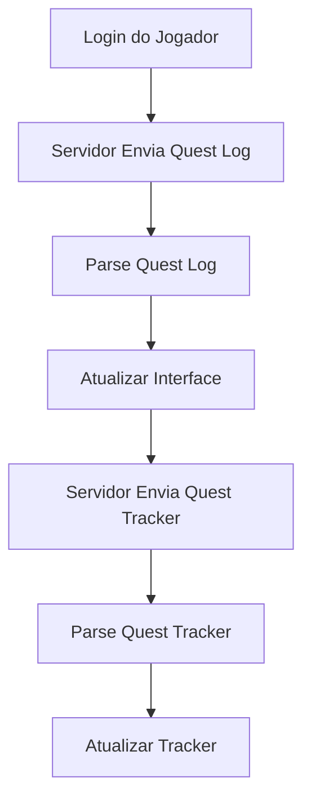
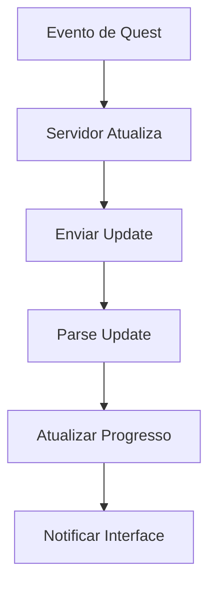

# 📜 OTCLIENT-015: Sistema de Quests

## 🎯 **Visão Geral**

O **Sistema de Quests** é um componente fundamental do OTClient, responsável por gerenciar todas as missões, objetivos e progressos de quests dos jogadores. Este sistema trabalha em conjunto com o servidor Canary para fornecer um sistema completo de quests com tracking, progressão e recompensas.

## 🏗️ **Arquitetura do Sistema**

### **📁 Estrutura de Arquivos**

```
📁 src/client/
├── protocolgameparse.cpp    # Parsing de protocolo de quests
├── protocolgamesend.cpp     # Envio de protocolo de quests
└── game.cpp                 # Processamento de quests

📁 src/protobuf/
└── staticdata.proto         # Definições de quests

📁 modules/game_questlog/
├── questlog.otui           # Interface do quest log
├── questlog.lua            # Lógica do quest log
└── questlog.otmod          # Configuração do módulo
```

### **🔗 Dependências Principais**

- **Protocol System**: Comunicação com servidor
- **Lua Scripting**: Scripts de quests
- **UI System**: Interface do quest log
- **Game Engine**: Sistema principal de jogo
- **Storage System**: Persistência de progresso

## 📜 **Componentes Principais**

### **1. Protocolo de Quests**

#### Inicialização e Configuração
```cpp
// Parsing do Quest Log
void ProtocolGame::parseQuestLog(const InputMessagePtr& msg) {
    const uint16_t questsCount = msg->getU16();
    std::vector<std::tuple<uint16_t, std::string, bool>> questList;

    for (auto i = 0; i < questsCount; ++i) {
        const uint16_t id = msg->getU16();
        const auto& questName = msg->getString();
        const bool questCompleted = static_cast<bool>(msg->getU8());
        questList.emplace_back(id, questName, questCompleted);
    }

    g_game.processQuestLog(questList);
}

// Parsing do Quest Line (Missões)
void ProtocolGame::parseQuestLine(const InputMessagePtr& msg) {
    const uint16_t questId = msg->getU16();
    const uint16_t missionsCount = msg->getU16();
    std::vector<std::tuple<std::string, std::string, uint16_t>> questMissions;

    for (auto i = 0; i < missionsCount; ++i) {
        const auto& missionName = msg->getString();
        const auto& missionDesc = msg->getString();
        const uint16_t missionId = msg->getU16();
        questMissions.emplace_back(missionName, missionDesc, missionId);
    }
```

#### Funcionalidade 1
```cpp

    g_game.processQuestLine(questId, questMissions);
}

// Parsing do Quest Tracker
void ProtocolGame::parseQuestTracker(const InputMessagePtr& msg) {
    const uint8_t messageType = msg->getU8();
    switch (messageType) {
        case 1: { // Lista completa de quests
            const uint8_t remainingQuests = msg->getU8();
            const uint8_t missionCount = msg->getU8();
            std::vector<std::tuple<uint16_t, uint16_t, std::string, std::string, std::string>> missions;
            
            for (uint8_t i = 0; i < missionCount; ++i) {
                uint8_t questId = 0;
                if (g_game.getClientVersion() >= 1410) {
                    questId = msg->getU16();
                }
                const uint16_t missionId = msg->getU16();
                const std::string& questName = msg->getString();
                const std::string& missionName = msg->getString();
                const std::string& missionDesc = msg->getString();
                missions.emplace_back(questId, missionId, questName, missionName, missionDesc);
            }
```

#### Finalização
```cpp
            return g_lua.callGlobalField("g_game", "onQuestTracker", remainingQuests, missions);
        }
        case 0: { // Atualização de quest
            uint8_t questId = 0;
            if (g_game.getClientVersion() >= 1410) {
                questId = msg->getU16();
            }
            const uint16_t missionId = msg->getU16();
            std::string questName = "";
            if (g_game.getClientVersion() >= 1410) {
                questName = msg->getString();
            }
            const std::string& missionName = msg->getString();
            const std::string& missionDesc = msg->getString();
            return g_lua.callGlobalField("g_game", "onUpdateQuestTracker", questId, missionId, questName, missionName, missionDesc);
        }
    }
}
```

### **2. Processamento de Quests**

#### Nível Basic
```cpp
// Processamento do Quest Log
void Game::processQuestLog(const std::vector<std::tuple<uint16_t, std::string, bool>>& questList) {
    g_lua.callGlobalField("g_game", "onQuestLog", questList);
}

// Processamento do Quest Line
void Game::processQuestLine(const uint16_t questId, const std::vector<std::tuple<std::string, std::string, uint16_t>>& questMissions) {
    g_lua.callGlobalField("g_game", "onQuestLine", questId, questMissions);
}

// Processamento do Quest Tracker
void Game::processQuestTracker(const uint8_t remainingQuests, const std::vector<std::tuple<uint16_t, uint16_t, std::string, std::string, std::string>>& missions) {
    g_lua.callGlobalField("g_game", "onQuestTracker", remainingQuests, missions);
}

// Processamento de atualização do Quest Tracker
void Game::processUpdateQuestTracker(const uint16_t questId, const uint16_t missionId, const std::string& questName, const std::string& missionName, const std::string& missionDesc) {
    g_lua.callGlobalField("g_game", "onUpdateQuestTracker", questId, missionId, questName, missionName, missionDesc);
}
```

#### Nível Intermediate
```cpp
// Processamento do Quest Log
void Game::processQuestLog(const std::vector<std::tuple<uint16_t, std::string, bool>>& questList) {
    g_lua.callGlobalField("g_game", "onQuestLog", questList);
}

// Processamento do Quest Line
void Game::processQuestLine(const uint16_t questId, const std::vector<std::tuple<std::string, std::string, uint16_t>>& questMissions) {
    g_lua.callGlobalField("g_game", "onQuestLine", questId, questMissions);
}

// Processamento do Quest Tracker
void Game::processQuestTracker(const uint8_t remainingQuests, const std::vector<std::tuple<uint16_t, uint16_t, std::string, std::string, std::string>>& missions) {
    g_lua.callGlobalField("g_game", "onQuestTracker", remainingQuests, missions);
}

// Processamento de atualização do Quest Tracker
void Game::processUpdateQuestTracker(const uint16_t questId, const uint16_t missionId, const std::string& questName, const std::string& missionName, const std::string& missionDesc) {
    g_lua.callGlobalField("g_game", "onUpdateQuestTracker", questId, missionId, questName, missionName, missionDesc);
}
-- Adicionar tratamento de erros
local success, result = pcall(function()
    -- Código original aqui
end)
if not success then
    print('Erro:', result)
end
```

#### Nível Advanced
```cpp
// Processamento do Quest Log
void Game::processQuestLog(const std::vector<std::tuple<uint16_t, std::string, bool>>& questList) {
    g_lua.callGlobalField("g_game", "onQuestLog", questList);
}

// Processamento do Quest Line
void Game::processQuestLine(const uint16_t questId, const std::vector<std::tuple<std::string, std::string, uint16_t>>& questMissions) {
    g_lua.callGlobalField("g_game", "onQuestLine", questId, questMissions);
}

// Processamento do Quest Tracker
void Game::processQuestTracker(const uint8_t remainingQuests, const std::vector<std::tuple<uint16_t, uint16_t, std::string, std::string, std::string>>& missions) {
    g_lua.callGlobalField("g_game", "onQuestTracker", remainingQuests, missions);
}

// Processamento de atualização do Quest Tracker
void Game::processUpdateQuestTracker(const uint16_t questId, const uint16_t missionId, const std::string& questName, const std::string& missionName, const std::string& missionDesc) {
    g_lua.callGlobalField("g_game", "onUpdateQuestTracker", questId, missionId, questName, missionName, missionDesc);
}
-- Adicionar metatable para funcionalidade avançada
local mt = {
    __index = function(t, k)
        return rawget(t, k) or 'Valor não encontrado'
    end
    __call = function(t, ...)
        print('Objeto chamado com:', ...)
    end
}
setmetatable(meuObjeto, mt)
```

### **3. Estruturas de Dados**

#### Nível Basic
```cpp
// Estrutura de Quest (Protobuf)
message Quest {
    optional uint32 id = 1;
    optional string name = 2;
}

// Estrutura de Quest Log
struct QuestLogEntry {
    uint16_t id;
    std::string name;
    bool completed;
    
    QuestLogEntry(uint16_t questId, const std::string& questName, bool isCompleted)
        : id(questId), name(questName), completed(isCompleted) {}
};

// Estrutura de Quest Mission
struct QuestMission {
    std::string name;
    std::string description;
    uint16_t id;
    bool completed;
    
    QuestMission(const std::string& missionName, const std::string& missionDesc, uint16_t missionId)
        : name(missionName), description(missionDesc), id(missionId), completed(false) {}
};

// Estrutura de Quest Tracker
struct QuestTrackerEntry {
    uint16_t questId;
    uint16_t missionId;
    std::string questName;
    std::string missionName;
    std::string missionDesc;
    
    QuestTrackerEntry(uint16_t qId, uint16_t mId, const std::string& qName, const std::string& mName, const std::string& mDesc)
        : questId(qId), missionId(mId), questName(qName), missionName(mName), missionDesc(mDesc) {}
};
```

#### Nível Intermediate
```cpp
// Estrutura de Quest (Protobuf)
message Quest {
    optional uint32 id = 1;
    optional string name = 2;
}

// Estrutura de Quest Log
struct QuestLogEntry {
    uint16_t id;
    std::string name;
    bool completed;
    
    QuestLogEntry(uint16_t questId, const std::string& questName, bool isCompleted)
        : id(questId), name(questName), completed(isCompleted) {}
};

// Estrutura de Quest Mission
struct QuestMission {
    std::string name;
    std::string description;
    uint16_t id;
    bool completed;
    
    QuestMission(const std::string& missionName, const std::string& missionDesc, uint16_t missionId)
        : name(missionName), description(missionDesc), id(missionId), completed(false) {}
};

// Estrutura de Quest Tracker
struct QuestTrackerEntry {
    uint16_t questId;
    uint16_t missionId;
    std::string questName;
    std::string missionName;
    std::string missionDesc;
    
    QuestTrackerEntry(uint16_t qId, uint16_t mId, const std::string& qName, const std::string& mName, const std::string& mDesc)
        : questId(qId), missionId(mId), questName(qName), missionName(mName), missionDesc(mDesc) {}
};
-- Adicionar tratamento de erros
local success, result = pcall(function()
    -- Código original aqui
end)
if not success then
    print('Erro:', result)
end
```

#### Nível Advanced
```cpp
// Estrutura de Quest (Protobuf)
message Quest {
    optional uint32 id = 1;
    optional string name = 2;
}

// Estrutura de Quest Log
struct QuestLogEntry {
    uint16_t id;
    std::string name;
    bool completed;
    
    QuestLogEntry(uint16_t questId, const std::string& questName, bool isCompleted)
        : id(questId), name(questName), completed(isCompleted) {}
};

// Estrutura de Quest Mission
struct QuestMission {
    std::string name;
    std::string description;
    uint16_t id;
    bool completed;
    
    QuestMission(const std::string& missionName, const std::string& missionDesc, uint16_t missionId)
        : name(missionName), description(missionDesc), id(missionId), completed(false) {}
};

// Estrutura de Quest Tracker
struct QuestTrackerEntry {
    uint16_t questId;
    uint16_t missionId;
    std::string questName;
    std::string missionName;
    std::string missionDesc;
    
    QuestTrackerEntry(uint16_t qId, uint16_t mId, const std::string& qName, const std::string& mName, const std::string& mDesc)
        : questId(qId), missionId(mId), questName(qName), missionName(mName), missionDesc(mDesc) {}
};
-- Adicionar metatable para funcionalidade avançada
local mt = {
    __index = function(t, k)
        return rawget(t, k) or 'Valor não encontrado'
    end
    __call = function(t, ...)
        print('Objeto chamado com:', ...)
    end
}
setmetatable(meuObjeto, mt)
```

## ⚙️ **Mecânicas do Sistema**

### **1. Sistema de Quest Log**

```cpp
class QuestLog {
    -- Classe: QuestLog
private:
    std::vector<QuestLogEntry> quests;
    std::map<uint16_t, std::vector<QuestMission>> questMissions;
    
public:
    void addQuest(uint16_t id, const std::string& name, bool completed) {
        quests.emplace_back(id, name, completed);
    }
    
    void addMission(uint16_t questId, const std::string& name, const std::string& desc, uint16_t missionId) {
        questMissions[questId].emplace_back(name, desc, missionId);
    }
    
    void updateQuestStatus(uint16_t questId, bool completed) {
        for (auto& quest : quests) {
            if (quest.id == questId) {
                quest.completed = completed;
                break;
            }
        }
    }
    
    const std::vector<QuestLogEntry>& getQuests() const {
        return quests;
    }
    
    const std::vector<QuestMission>& getMissions(uint16_t questId) const {
        auto it = questMissions.find(questId);
        return it != questMissions.end() ? it->second : std::vector<QuestMission>();
    }
};
```

### **2. Sistema de Quest Tracker**

```cpp
class QuestTracker {
    -- Classe: QuestTracker
private:
    std::vector<QuestTrackerEntry> activeQuests;
    uint8_t remainingQuests;
    
public:
    void setRemainingQuests(uint8_t count) {
        remainingQuests = count;
    }
    
    void addQuest(const QuestTrackerEntry& entry) {
        activeQuests.push_back(entry);
    }
    
    void updateQuest(uint16_t questId, uint16_t missionId, const std::string& questName, const std::string& missionName, const std::string& missionDesc) {
        for (auto& quest : activeQuests) {
            if (quest.questId == questId && quest.missionId == missionId) {
                quest.questName = questName;
                quest.missionName = missionName;
                quest.missionDesc = missionDesc;
                break;
            }
        }
    }
    
    void clear() {
        activeQuests.clear();
    }
    
    const std::vector<QuestTrackerEntry>& getActiveQuests() const {
        return activeQuests;
    }
    
    uint8_t getRemainingQuests() const {
        return remainingQuests;
    }
};
```

### **3. Sistema de Progresso**

```cpp
class QuestProgress {
    -- Classe: QuestProgress
private:
    std::map<uint16_t, std::map<uint16_t, bool>> questProgress;
    std::map<uint16_t, uint32_t> questObjectives;
    
public:
    void setQuestCompleted(uint16_t questId, bool completed) {
        questProgress[questId][0] = completed; // 0 = quest principal
    }
    
    void setMissionCompleted(uint16_t questId, uint16_t missionId, bool completed) {
        questProgress[questId][missionId] = completed;
    }
    
    bool isQuestCompleted(uint16_t questId) const {
        auto it = questProgress.find(questId);
        if (it != questProgress.end()) {
            auto missionIt = it->second.find(0);
            return missionIt != it->second.end() && missionIt->second;
        }
        return false;
    }
    
    bool isMissionCompleted(uint16_t questId, uint16_t missionId) const {
        auto it = questProgress.find(questId);
        if (it != questProgress.end()) {
            auto missionIt = it->second.find(missionId);
            return missionIt != it->second.end() && missionIt->second;
        }
        return false;
    }
    
    void setObjective(uint16_t questId, uint32_t objective) {
        questObjectives[questId] = objective;
    }
    
    uint32_t getObjective(uint16_t questId) const {
        auto it = questObjectives.find(questId);
        return it != questObjectives.end() ? it->second : 0;
    }
};
```

## 🎮 **Fluxo de Quests**

### **1. Carregamento de Quests**



### **2. Atualização de Progresso**



### **3. Sistema de Objetivos**

#### Inicialização e Configuração
```cpp
class QuestObjective {
public:
    enum Type {
        KILL_MONSTER,
        COLLECT_ITEM,
        TALK_TO_NPC,
        REACH_LOCATION,
        USE_ITEM,
        CRAFT_ITEM
    };
    
    struct Objective {
        Type type;
        uint32_t targetId;
        uint32_t amount;
        uint32_t current;
        std::string description;
        
        Objective(Type t, uint32_t id, uint32_t amt, const std::string& desc)
            : type(t), targetId(id), amount(amt), current(0), description(desc) {}
        
        bool isCompleted() const {
            return current >= amount;
        }
```

#### Funcionalidade 1
```cpp
        
        float getProgress() const {
            return amount > 0 ? static_cast<float>(current) / amount : 0.0f;
        }
    };
    
private:
    std::map<uint16_t, std::vector<Objective>> questObjectives;
    
public:
    void addObjective(uint16_t questId, const Objective& objective) {
        questObjectives[questId].push_back(objective);
    }
    
    void updateProgress(uint16_t questId, uint32_t objectiveIndex, uint32_t progress) {
        auto it = questObjectives.find(questId);
        if (it != questObjectives.end() && objectiveIndex < it->second.size()) {
            it->second[objectiveIndex].current = progress;
        }
    }
    
    const std::vector<Objective>& getObjectives(uint16_t questId) const {
        auto it = questObjectives.find(questId);
        return it != questObjectives.end() ? it->second : std::vector<Objective>();
    }
```

#### Finalização
```cpp
    
    bool isQuestCompleted(uint16_t questId) const {
        auto it = questObjectives.find(questId);
        if (it != questObjectives.end()) {
            for (const auto& objective : it->second) {
                if (!objective.isCompleted()) {
                    return false;
                }
            }
            return true;
        }
        return false;
    }
};
```

## 🎨 **Interface do Cliente**

### **1. Quest Log UI**

```lua
-- questlog.lua
    --  questlog.lua (traduzido)
function init()
    -- Função: init
    connect(g_game, { onQuestLog = updateQuestLog,
                      onQuestLine = updateQuestLine })
end

function updateQuestLog(questList)
    -- Função: updateQuestLog
    local questLogWindow = g_ui.displayUI('questlog')
    local questListWidget = questLogWindow:getChildById('questList')
    questListWidget:clearChildren()
    
    for _, quest in ipairs(questList) do
    -- Loop de repetição
        local questId, questName, completed = unpack(quest)
        local questItem = g_ui.createWidget('QuestItem', questListWidget)
        questItem:setText(questName)
        questItem:setOn(completed)
        
        questItem.onClick = function()
            g_game.requestQuestLine(questId)
        end
    end
end

function updateQuestLine(questId, questMissions)
    -- Função: updateQuestLine
    local questLogWindow = g_ui.displayUI('questlog')
    local missionListWidget = questLogWindow:getChildById('missionList')
    missionListWidget:clearChildren()
    
    for _, mission in ipairs(questMissions) do
    -- Loop de repetição
        local missionName, missionDesc, missionId = unpack(mission)
        local missionItem = g_ui.createWidget('MissionItem', missionListWidget)
        missionItem:setText(missionName)
        missionItem:setDescription(missionDesc)
    end
end
```

### **2. Quest Tracker UI**

```lua
-- questtracker.lua
    --  questtracker.lua (traduzido)
function init()
    -- Função: init
    connect(g_game, { onQuestTracker = updateQuestTracker,
                      onUpdateQuestTracker = updateQuestTracker })
end

function updateQuestTracker(remainingQuests, missions)
    -- Função: updateQuestTracker
    local trackerWindow = g_ui.displayUI('questtracker')
    local missionListWidget = trackerWindow:getChildById('missionList')
    missionListWidget:clearChildren()
    
    for _, mission in ipairs(missions) do
    -- Loop de repetição
        local questId, missionId, questName, missionName, missionDesc = unpack(mission)
        local missionItem = g_ui.createWidget('TrackerMissionItem', missionListWidget)
        missionItem:setText(missionName)
        missionItem:setDescription(missionDesc)
        missionItem:setQuestName(questName)
    end
end

function updateQuestTracker(questId, missionId, questName, missionName, missionDesc)
    -- Função: updateQuestTracker
    local trackerWindow = g_ui.displayUI('questtracker')
    local missionListWidget = trackerWindow:getChildById('missionList')
    
    -- Atualizar missão específica
    for _, child in ipairs(missionListWidget:getChildren()) do
    -- Loop de repetição
        if child.questId == questId and child.missionId == missionId then
    -- Verificação condicional
            child:setText(missionName)
            child:setDescription(missionDesc)
            child:setQuestName(questName)
            break
        end
    end
end
```

### **3. Protocolo de Comunicação**

#### Nível Basic
```cpp
// Envio de requisição de quest line
void ProtocolGame::sendRequestQuestLine(uint16_t questId) {
    NetworkMessage msg;
    msg.addByte(0x8F);
    msg.add<uint16_t>(questId);
    sendNetworkMessage(msg);
}

// Envio de requisição de quest log
void ProtocolGame::sendRequestQuestLog() {
    NetworkMessage msg;
    msg.addByte(0x8E);
    sendNetworkMessage(msg);
}

// Envio de requisição de quest tracker
void ProtocolGame::sendRequestQuestTracker() {
    NetworkMessage msg;
    msg.addByte(0x90);
    sendNetworkMessage(msg);
}
```

#### Nível Intermediate
```cpp
// Envio de requisição de quest line
void ProtocolGame::sendRequestQuestLine(uint16_t questId) {
    NetworkMessage msg;
    msg.addByte(0x8F);
    msg.add<uint16_t>(questId);
    sendNetworkMessage(msg);
}

// Envio de requisição de quest log
void ProtocolGame::sendRequestQuestLog() {
    NetworkMessage msg;
    msg.addByte(0x8E);
    sendNetworkMessage(msg);
}

// Envio de requisição de quest tracker
void ProtocolGame::sendRequestQuestTracker() {
    NetworkMessage msg;
    msg.addByte(0x90);
    sendNetworkMessage(msg);
}
-- Adicionar tratamento de erros
local success, result = pcall(function()
    -- Código original aqui
end)
if not success then
    print('Erro:', result)
end
```

#### Nível Advanced
```cpp
// Envio de requisição de quest line
void ProtocolGame::sendRequestQuestLine(uint16_t questId) {
    NetworkMessage msg;
    msg.addByte(0x8F);
    msg.add<uint16_t>(questId);
    sendNetworkMessage(msg);
}

// Envio de requisição de quest log
void ProtocolGame::sendRequestQuestLog() {
    NetworkMessage msg;
    msg.addByte(0x8E);
    sendNetworkMessage(msg);
}

// Envio de requisição de quest tracker
void ProtocolGame::sendRequestQuestTracker() {
    NetworkMessage msg;
    msg.addByte(0x90);
    sendNetworkMessage(msg);
}
-- Adicionar metatable para funcionalidade avançada
local mt = {
    __index = function(t, k)
        return rawget(t, k) or 'Valor não encontrado'
    end
    __call = function(t, ...)
        print('Objeto chamado com:', ...)
    end
}
setmetatable(meuObjeto, mt)
```

## 🔧 **Sistema de Eventos**

### **1. Eventos de Quest**

```cpp
enum QuestEventType {
    QUEST_EVENT_START,
    QUEST_EVENT_PROGRESS,
    QUEST_EVENT_COMPLETE,
    QUEST_EVENT_FAIL,
    QUEST_EVENT_ABANDON
};

class QuestEventHandler {
    -- Classe: QuestEventHandler
public:
    virtual void onQuestStart(uint16_t questId) = 0;
    virtual void onQuestProgress(uint16_t questId, uint16_t missionId, uint32_t progress) = 0;
    virtual void onQuestComplete(uint16_t questId) = 0;
    virtual void onQuestFail(uint16_t questId) = 0;
    virtual void onQuestAbandon(uint16_t questId) = 0;
};
```

### **2. Sistema de Notificações**

```cpp
class QuestNotification {
    -- Classe: QuestNotification
public:
    void showQuestStarted(uint16_t questId, const std::string& questName) {
        std::string message = "Quest started: " + questName;
        g_lua.callGlobalField("g_ui", "displayStatusMessage", message);
    }
    
    void showQuestCompleted(uint16_t questId, const std::string& questName) {
        std::string message = "Quest completed: " + questName;
        g_lua.callGlobalField("g_ui", "displayStatusMessage", message);
    }
    
    void showObjectiveProgress(uint16_t questId, const std::string& objective, uint32_t current, uint32_t total) {
        std::string message = objective + ": " + std::to_string(current) + "/" + std::to_string(total);
        g_lua.callGlobalField("g_ui", "displayStatusMessage", message);
    }
};
```

## 📊 **Sistema de Gerenciamento**

### **1. Cache de Quests**

```cpp
class QuestCache {
    -- Classe: QuestCache
private:
    std::map<uint16_t, QuestLogEntry> questCache;
    std::map<uint16_t, std::vector<QuestMission>> missionCache;
    std::mutex cacheMutex;
    
public:
    void cacheQuest(const QuestLogEntry& quest) {
        std::lock_guard<std::mutex> lock(cacheMutex);
        questCache[quest.id] = quest;
    }
    
    void cacheMissions(uint16_t questId, const std::vector<QuestMission>& missions) {
        std::lock_guard<std::mutex> lock(cacheMutex);
        missionCache[questId] = missions;
    }
    
    QuestLogEntry* getQuest(uint16_t questId) {
        std::lock_guard<std::mutex> lock(cacheMutex);
        auto it = questCache.find(questId);
        return it != questCache.end() ? &it->second : nullptr;
    }
    
    std::vector<QuestMission>* getMissions(uint16_t questId) {
        std::lock_guard<std::mutex> lock(cacheMutex);
        auto it = missionCache.find(questId);
        return it != missionCache.end() ? &it->second : nullptr;
    }
    
    void clear() {
        std::lock_guard<std::mutex> lock(cacheMutex);
        questCache.clear();
        missionCache.clear();
    }
};
```

### **2. Sistema de Persistência**

```cpp
class QuestPersistence {
    -- Classe: QuestPersistence
private:
    std::string saveFile;
    
public:
    QuestPersistence(const std::string& filename) : saveFile(filename) {}
    
    void saveQuestProgress(const QuestProgress& progress) {
        // Salvar progresso em arquivo local
        std::ofstream file(saveFile);
        if (file.is_open()) {
            // Implementar serialização
            file.close();
        }
    }
    
    void loadQuestProgress(QuestProgress& progress) {
        // Carregar progresso do arquivo local
        std::ifstream file(saveFile);
        if (file.is_open()) {
            // Implementar deserialização
            file.close();
        }
    }
};
```

## 🛡️ **Sistema de Segurança**

### **1. Validações de Quest**

```cpp
class QuestValidator {
    -- Classe: QuestValidator
public:
    bool isValidQuestId(uint16_t questId) const {
        return questId > 0 && questId <= MAX_QUEST_ID;
    }
    
    bool isValidMissionId(uint16_t missionId) const {
        return missionId > 0 && missionId <= MAX_MISSION_ID;
    }
    
    bool canStartQuest(uint16_t questId, const std::shared_ptr<Player>& player) const {
        // Verificar requisitos de nível, itens, etc.
        return true; // Implementação específica
    }
    
    bool canCompleteQuest(uint16_t questId, const std::shared_ptr<Player>& player) const {
        // Verificar se todos os objetivos foram completados
        return true; // Implementação específica
    }
};
```

### **2. Verificações de Integridade**

```cpp
class QuestIntegrityChecker {
    -- Classe: QuestIntegrityChecker
public:
    bool validateQuestData(const std::vector<QuestLogEntry>& quests) {
        for (const auto& quest : quests) {
            if (!isValidQuestId(quest.id) || quest.name.empty()) {
                return false;
            }
        }
        return true;
    }
    
    bool validateMissionData(const std::vector<QuestMission>& missions) {
        for (const auto& mission : missions) {
            if (!isValidMissionId(mission.id) || mission.name.empty()) {
                return false;
            }
        }
        return true;
    }
    
private:
    bool isValidQuestId(uint16_t questId) const {
        return questId > 0 && questId <= MAX_QUEST_ID;
    }
    
    bool isValidMissionId(uint16_t missionId) const {
        return missionId > 0 && missionId <= MAX_MISSION_ID;
    }
};
```

## 📈 **Otimizações de Performance**

### **1. Lazy Loading de Quests**

```cpp
class LazyQuestLoader {
    -- Classe: LazyQuestLoader
private:
    std::map<uint16_t, bool> loadedQuests;
    std::map<uint16_t, bool> loadedMissions;
    
public:
    bool isQuestLoaded(uint16_t questId) const {
        return loadedQuests.find(questId) != loadedQuests.end();
    }
    
    bool isMissionLoaded(uint16_t questId) const {
        return loadedMissions.find(questId) != loadedMissions.end();
    }
    
    void markQuestLoaded(uint16_t questId) {
        loadedQuests[questId] = true;
    }
    
    void markMissionLoaded(uint16_t questId) {
        loadedMissions[questId] = true;
    }
    
    void unloadQuest(uint16_t questId) {
        loadedQuests.erase(questId);
        loadedMissions.erase(questId);
    }
};
```

### **2. Cache de Interface**

```cpp
class QuestUICache {
    -- Classe: QuestUICache
private:
    std::map<uint16_t, std::shared_ptr<UIWidget>> questWidgets;
    std::map<uint16_t, std::map<uint16_t, std::shared_ptr<UIWidget>>> missionWidgets;
    
public:
    void cacheQuestWidget(uint16_t questId, std::shared_ptr<UIWidget> widget) {
        questWidgets[questId] = widget;
    }
    
    void cacheMissionWidget(uint16_t questId, uint16_t missionId, std::shared_ptr<UIWidget> widget) {
        missionWidgets[questId][missionId] = widget;
    }
    
    std::shared_ptr<UIWidget> getQuestWidget(uint16_t questId) {
        auto it = questWidgets.find(questId);
        return it != questWidgets.end() ? it->second : nullptr;
    }
    
    std::shared_ptr<UIWidget> getMissionWidget(uint16_t questId, uint16_t missionId) {
        auto questIt = missionWidgets.find(questId);
        if (questIt != missionWidgets.end()) {
            auto missionIt = questIt->second.find(missionId);
            return missionIt != questIt->second.end() ? missionIt->second : nullptr;
        }
        return nullptr;
    }
    
    void clear() {
        questWidgets.clear();
        missionWidgets.clear();
    }
};
```

## 🎯 **Casos de Uso Específicos**

### **1. Sistema de Quests Diárias**

```cpp
class DailyQuestSystem {
    -- Classe: DailyQuestSystem
private:
    std::map<uint16_t, time_t> lastCompletion;
    std::vector<uint16_t> dailyQuestIds;
    
public:
    void addDailyQuest(uint16_t questId) {
        dailyQuestIds.push_back(questId);
    }
    
    bool canStartDailyQuest(uint16_t questId) const {
        auto it = lastCompletion.find(questId);
        if (it == lastCompletion.end()) {
            return true;
        }
        
        time_t now = time(nullptr);
        time_t last = it->second;
        
        // Verificar se passou 24 horas
        return (now - last) >= 86400; // 24 horas em segundos
    }
    
    void markDailyQuestCompleted(uint16_t questId) {
        lastCompletion[questId] = time(nullptr);
    }
    
    void resetDailyQuests() {
        lastCompletion.clear();
    }
};
```

### **2. Sistema de Quests em Cadeia**

```cpp
class ChainQuestSystem {
    -- Classe: ChainQuestSystem
private:
    std::map<uint16_t, std::vector<uint16_t>> questChains;
    
public:
    void addQuestChain(uint16_t questId, const std::vector<uint16_t>& chain) {
        questChains[questId] = chain;
    }
    
    bool canStartChainQuest(uint16_t questId, const std::shared_ptr<Player>& player) const {
        auto it = questChains.find(questId);
        if (it == questChains.end()) {
            return true;
        }
        
        // Verificar se quests anteriores foram completadas
        for (uint16_t prevQuestId : it->second) {
            if (!player->isQuestCompleted(prevQuestId)) {
                return false;
            }
        }
        
        return true;
    }
    
    std::vector<uint16_t> getNextQuests(uint16_t questId) const {
        auto it = questChains.find(questId);
        return it != questChains.end() ? it->second : std::vector<uint16_t>();
    }
};
```

### **3. Sistema de Quests com Tempo**

```cpp
class TimedQuestSystem {
    -- Classe: TimedQuestSystem
private:
    std::map<uint16_t, time_t> questTimeouts;
    std::map<uint16_t, uint32_t> questDurations;
    
public:
    void setQuestTimeout(uint16_t questId, uint32_t durationSeconds) {
        questDurations[questId] = durationSeconds;
        questTimeouts[questId] = time(nullptr) + durationSeconds;
    }
    
    bool isQuestExpired(uint16_t questId) const {
        auto it = questTimeouts.find(questId);
        if (it == questTimeouts.end()) {
            return false;
        }
        
        return time(nullptr) > it->second;
    }
    
    uint32_t getRemainingTime(uint16_t questId) const {
        auto it = questTimeouts.find(questId);
        if (it == questTimeouts.end()) {
            return 0;
        }
        
        time_t remaining = it->second - time(nullptr);
        return remaining > 0 ? static_cast<uint32_t>(remaining) : 0;
    }
    
    void extendQuestTime(uint16_t questId, uint32_t additionalSeconds) {
        auto it = questTimeouts.find(questId);
        if (it != questTimeouts.end()) {
            it->second += additionalSeconds;
        }
    }
};
```

## 🔮 **Futuras Melhorias**

### **1. Sistema de Quests Dinâmicas**

- **Quests Geradas por IA**: Quests criadas dinamicamente
- **Quests Baseadas em Eventos**: Quests que aparecem durante eventos especiais
- **Quests Personalizadas**: Quests baseadas no comportamento do jogador

### **2. Sistema de Recompensas Avançadas**

- **Recompensas Dinâmicas**: Recompensas que mudam baseadas em fatores externos
- **Sistema de Pontos**: Sistema de pontos de quest que podem ser trocados
- **Recompensas Especiais**: Recompensas únicas para quests especiais

### **3. Sistema de Cooperação**

- **Quests em Grupo**: Quests que requerem múltiplos jogadores
- **Quests de Guild**: Quests específicas para guilds
- **Sistema de Ajuda**: Sistema para ajudar outros jogadores em quests

## 📚 **Referências Técnicas**

### **1. Arquivos Principais**

- `otclient/src/client/protocolgameparse.cpp`: Parsing de protocolo
- `otclient/src/client/game.cpp`: Processamento de quests
- `otclient/src/protobuf/staticdata.proto`: Definições de quests
- `otclient/modules/game_questlog/`: Interface do quest log

### **2. Documentação Relacionada**

- [OTCLIENT-014: Sistema de NPCs](../OTCLIENT-014-Sistema-de-NPCs.md)
- [OTCLIENT-016: Sistema de Grupos](../OTCLIENT-016-Sistema-de-Grupos.md)
- [OTCLIENT-019: Sistema de Chat](../OTCLIENT-019-Sistema-de-Chat.md)

### **3. APIs e Interfaces**

- **Quest API**: Interface principal de quests
- **Mission API**: Interface do sistema de missões
- **Tracker API**: Interface do sistema de tracking
- **Progress API**: Interface do sistema de progresso

---

**Documentação Criada**: 2025-01-27 16:30:00  
**Responsável**: Habdel Research Agent  
**Status**: ✅ **COMPLETA**  
**Próximo**: 📚 **OTCLIENT-016: Sistema de Grupos** 