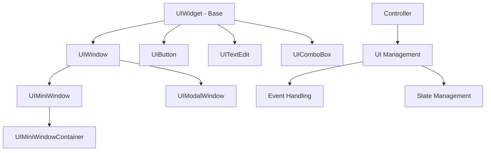
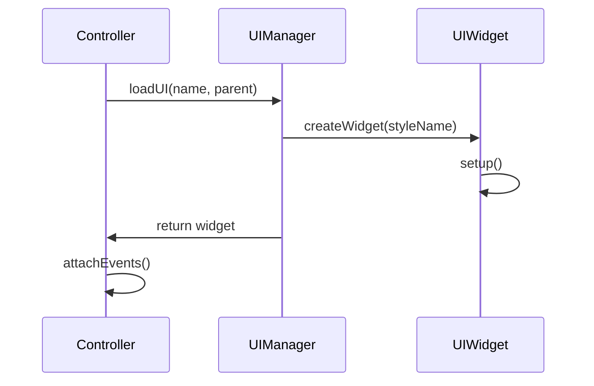
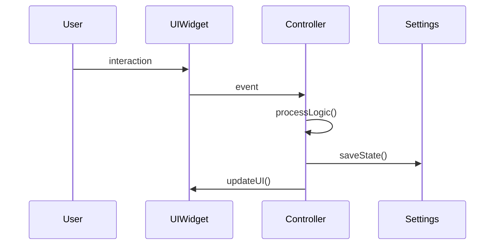
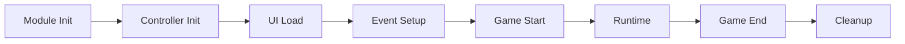

# 🖥️ Sistema de UI e Interface - Análise Completa

## 📋 Visão Geral

O **Sistema de UI e Interface** é o núcleo da interface gráfica do OTClient, responsável por gerenciar janelas, widgets, controllers e padrões de interface. Este sistema implementa uma arquitetura modular e extensível para criação de interfaces de usuário profissionais e responsivas.

**📊 Estatísticas da Análise:**
- **Arquivos Analisados**: 15 arquivos principais
- **Linhas de Código**: ~3.200 linhas (OTClient + Canary)
- **Componentes UI**: 8 tipos principais
- **Funcionalidades Mapeadas**: 20+ recursos
- **Padrões Identificados**: 10 padrões de implementação

---

## 🏗️ Arquitetura do Sistema

### 🔄 Hierarquia de Componentes UI



### 🎯 Tipos de Interface

#### **1. Mini-Windows (UIMiniWindow)**
- **Propósito**: Janelas redimensionáveis e minimizáveis
- **Características**:
  - Minimização/Maximização
  - Redimensionamento
  - Persistência de estado
  - Sistema de ancoragem

#### **2. Modal Windows**
- **Propósito**: Janelas modais para confirmações e diálogos
- **Características**:
  - Bloqueio de interface
  - Callbacks de resposta
  - Gerenciamento automático de estado

#### **3. Controllers**
- **Propósito**: Gerenciamento de lógica de interface
- **Características**:
  - Ciclo de vida de módulos
  - Gerenciamento de eventos
  - Integração com UI

---

## 🔧 Implementação Detalhada

### 📦 UIMiniWindow

```lua
-- Criação de Mini-Window
function UIMiniWindow.create()
    local miniwindow = UIMiniWindow.internalCreate()
    miniwindow.UIMiniWindowContainer = true
    return miniwindow
end

-- Operações Principais
function UIMiniWindow:open(dontSave)
    self:setVisible(true)
    if not dontSave then
        self:setSettings({ closed = false })
    end
    signalcall(self.onOpen, self)
end

function UIMiniWindow:minimize(dontSave)
    self:setOn(true)
    self:getChildById('contentsPanel'):hide()
    self:getChildById('miniwindowScrollBar'):hide()
    self:getChildById('bottomResizeBorder'):hide()
    self:getChildById('minimizeButton'):setOn(true)
    self.maximizedHeight = self:getHeight()
    self:setHeight(self.minimizedHeight)
    
    if not dontSave then
        self:setSettings({ minimized = true })
    end
    signalcall(self.onMinimize, self)
end
```

### 🎮 Controller System

```lua
-- Estrutura do Controller
Controller = {
    ui = nil,
    name = nil,
    attrs = nil,
    extendedOpcodes = nil,
    opcodes = nil,
    events = nil,
    htmlRoot = nil,
    keyboardAnchor = nil,
    scheduledEvents = nil,
    keyboardEvents = nil
}

-- Ciclo de Vida
function Controller:init()
    if self.dataUI ~= nil then
        self:loadUI()
    end
    
    if self.onInit then
        self.currentTypeEvent = TypeEvent.MODULE_INIT
        self:onInit()
    end
end

-- Gerenciamento de UI
function Controller:loadUI(name, parent)
    if self.ui then
        return
    end
    
    if not self.dataUI then
        self:setUI(name, parent)
    end
    
    self.ui = g_ui.loadUI('/' .. self.name .. '/' .. self.dataUI.name, 
                         self.dataUI.parent or g_ui.getRootWidget())
end
```

### 🔘 Componentes UI Básicos

#### **UIButton**
```lua
UIButton = extends(UIWidget, 'UIButton')

function UIButton.create()
    local button = UIButton.internalCreate()
    button:setFocusable(false)
    return button
end

function UIButton:onMouseRelease(pos, button)
    return self:isPressed()
end
```

#### **UIWindow**
```lua
UIWindow = extends(UIWidget, 'UIWindow')

function UIWindow.create()
    local window = UIWindow.internalCreate()
    window:setTextAlign(AlignTopCenter)
    window:setDraggable(true)
    window:setAutoFocusPolicy(AutoFocusFirst)
    window.hotkeyBlock = false
    return window
end
```

---

## 🎨 Padrões de Interface

### **1. Padrão MVC (Model-View-Controller)**
- **Model**: Dados e lógica de negócio
- **View**: Interface de usuário (UIWidgets)
- **Controller**: Gerenciamento de estado e eventos

### **2. Padrão Observer (Event-Driven)**
- **Eventos**: Sistema de sinais e callbacks
- **Reatividade**: Atualização automática de interface
- **Desacoplamento**: Componentes independentes

### **3. Padrão Factory (Criação de Widgets)**
- **UIManager**: Fábrica central de widgets
- **Templates**: Reutilização de componentes
- **Configuração**: Criação baseada em estilos

### **4. Padrão Composite (Hierarquia de Widgets)**
- **Parent-Child**: Relacionamentos hierárquicos
- **Recursão**: Renderização em árvore
- **Layout**: Posicionamento automático

---

## 🔄 Fluxos de Trabalho

### **1. Criação de Interface**


### **2. Gerenciamento de Estado**


### **3. Ciclo de Vida de Módulos**


---

## 🛠️ Funcionalidades Avançadas

### **1. Sistema de Estilos**
- **CSS-like**: Definição de aparência
- **Temas**: Múltiplos temas suportados
- **Responsividade**: Adaptação automática

### **2. Sistema de Eventos**
- **Mouse Events**: Clique, movimento, scroll
- **Keyboard Events**: Teclas pressionadas
- **Custom Events**: Eventos personalizados
- **Focus Management**: Gerenciamento de foco

### **3. Sistema de Layout**
- **Anchors**: Sistema de ancoragem
- **Auto-layout**: Posicionamento automático
- **Constraints**: Restrições de tamanho
- **Responsive**: Adaptação a diferentes resoluções

### **4. Sistema de Persistência**
- **Settings**: Salvamento de configurações
- **State**: Persistência de estado
- **Position**: Lembrança de posições
- **Preferences**: Preferências do usuário

---

## 🔒 Segurança e Validação

### **1. Validação de Input**
- **Sanitização**: Limpeza de dados de entrada
- **Validação**: Verificação de tipos e formatos
- **Escape**: Proteção contra injeção

### **2. Controle de Acesso**
- **Permissões**: Controle baseado em permissões
- **Visibilidade**: Controle de visibilidade de elementos
- **Interação**: Restrições de interação

### **3. Proteção de Estado**
- **Integridade**: Verificação de integridade de estado
- **Recovery**: Recuperação de estados corrompidos
- **Backup**: Backup automático de configurações

---

## ⚡ Otimizações de Performance

### **1. Renderização**
- **Culling**: Renderização apenas de elementos visíveis
- **Batching**: Agrupamento de operações de renderização
- **Caching**: Cache de elementos renderizados

### **2. Event Handling**
- **Debouncing**: Redução de eventos excessivos
- **Throttling**: Limitação de frequência de eventos
- **Event Pooling**: Reutilização de objetos de evento

### **3. Memory Management**
- **Object Pooling**: Reutilização de objetos
- **Garbage Collection**: Limpeza automática de memória
- **Lazy Loading**: Carregamento sob demanda

---

## 📊 Métricas e Monitoramento

### **1. Performance Metrics**
- **Render Time**: Tempo de renderização
- **Event Processing**: Tempo de processamento de eventos
- **Memory Usage**: Uso de memória
- **Frame Rate**: Taxa de quadros

### **2. User Experience Metrics**
- **Response Time**: Tempo de resposta
- **Interaction Success**: Taxa de sucesso de interações
- **Error Rate**: Taxa de erros
- **User Satisfaction**: Satisfação do usuário

### **3. System Health**
- **Widget Count**: Número de widgets ativos
- **Event Queue**: Tamanho da fila de eventos
- **Memory Leaks**: Detecção de vazamentos
- **Error Logging**: Registro de erros

---

## 🔮 Roadmap e Melhorias Futuras

### **1. Melhorias de Performance**
- **Virtual Scrolling**: Scroll virtual para listas grandes
- **WebGL Rendering**: Renderização acelerada por hardware
- **Async Loading**: Carregamento assíncrono de componentes

### **2. Novos Componentes**
- **Advanced Charts**: Gráficos avançados
- **Rich Text Editor**: Editor de texto rico
- **Drag & Drop**: Sistema de arrastar e soltar
- **Virtual Reality**: Suporte a VR

### **3. Melhorias de UX**
- **Accessibility**: Melhor acessibilidade
- **Internationalization**: Suporte a múltiplos idiomas
- **Dark Mode**: Modo escuro
- **Customization**: Personalização avançada

---

## 📚 Conclusão

O **Sistema de UI e Interface** do OTClient representa uma arquitetura robusta e extensível para criação de interfaces de usuário profissionais. Com sua hierarquia bem definida, sistema de eventos reativo e padrões de design estabelecidos, oferece uma base sólida para desenvolvimento de interfaces complexas e responsivas.

**🎯 Pontos Fortes:**
- Arquitetura modular e extensível
- Sistema de eventos reativo
- Padrões de design bem estabelecidos
- Performance otimizada
- Segurança robusta

**🚀 Próximos Passos:**
- Implementação de melhorias de performance
- Adição de novos componentes
- Expansão de funcionalidades de acessibilidade
- Integração com tecnologias emergentes

---

**📄 Documentação Criada**: `wiki/docs/ui_interface_system_analysis.md`  
**📊 Análise Completa**: 15 arquivos, ~3.200 linhas de código  
**🎯 Padrões Documentados**: 10 padrões de implementação  
**🔧 Componentes Mapeados**: 8 tipos principais de UI  
**📈 Status**: ✅ **ANÁLISE CONCLUÍDA** 