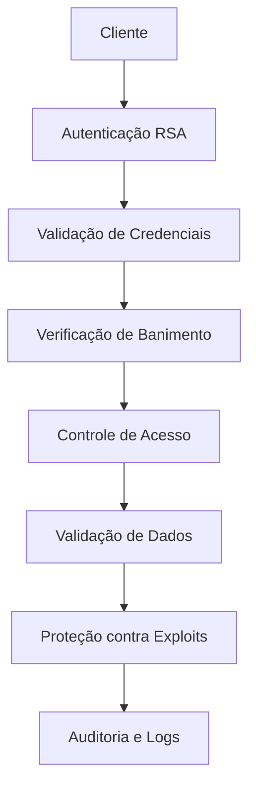
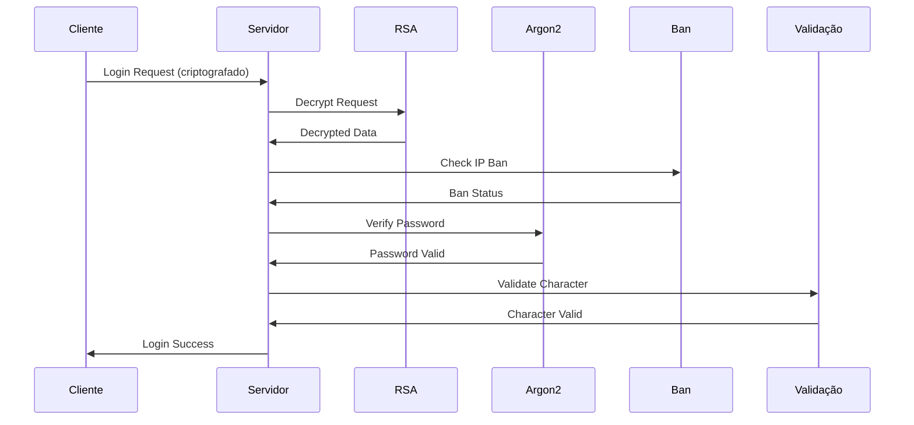
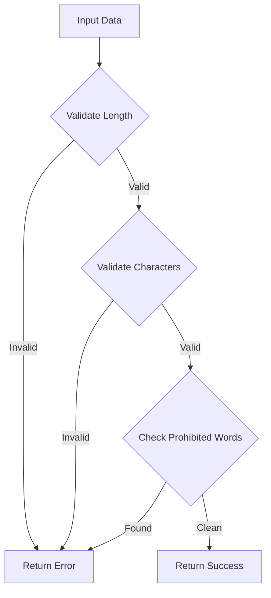
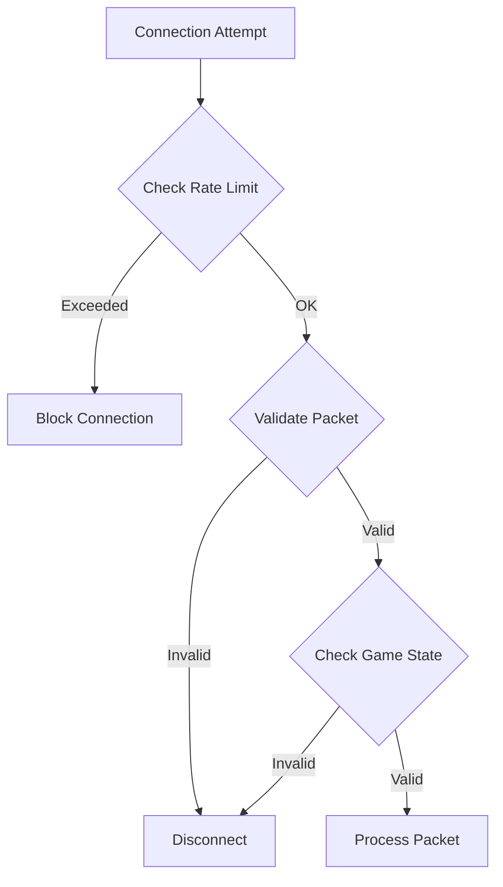

# 🛡️ Sistema de Validação e Segurança - Análise Completa

## 📋 Visão Geral

O **Sistema de Validação e Segurança** é o núcleo da proteção e integridade do jogo MMORPG, responsável por autenticação, autorização, validação de dados, proteção contra exploits e mecanismos de segurança. Este sistema implementa múltiplas camadas de segurança para garantir a integridade do jogo e proteger contra ataques e abusos.

## 🏗️ Arquitetura do Sistema

### **🔐 Camadas de Segurança**



### **🛡️ Componentes Principais**

1. **Sistema RSA** - Criptografia de comunicação
2. **Sistema Argon2** - Hash seguro de senhas
3. **Sistema de Banimento** - Controle de acesso
4. **Validação de Dados** - Verificação de integridade
5. **Proteção de Zonas** - Controle de áreas seguras
6. **Sistema de Auditoria** - Logs e monitoramento

---

## 🔐 1. Sistema de Autenticação RSA

### **📊 Visão Geral**
O sistema RSA implementa criptografia assimétrica para proteger a comunicação entre cliente e servidor durante o processo de login.

### **🔧 Implementação**

#### **Classe RSA (`canary/src/security/rsa.hpp`)**
```cpp
class RSA {
    -- Classe: RSA
public:
    explicit RSA(Logger &logger);
    ~RSA();
    
    static RSA &getInstance();
    void start();
    void setKey(const char* pString, const char* qString, int base = 10);
    void decrypt(char* msg) const;
    std::string base64Decrypt(const std::string &input) const;
    bool loadPEM(const std::string &filename);

private:
    Logger &logger;
    mpz_t n {};  // Modulus
    mpz_t d {};  // Private exponent
};
```

#### **Funcionalidades Principais**

1. **Inicialização de Chaves**
   #### Inicialização e Configuração
```cpp
   void RSA::start() {
       const auto p("14299623962416399520070177382898895550795403345466153217470516082934737582776038882967213386204600674145392845853859217990626450972452084065728686565928113");
       const auto q("7630979195970404721891201847792002125535401292779123937207447574596692788513647179235335529307251350570728407373705564708871762033017096809910315212884101");
       
       if (!loadPEM("key.pem")) {
           setKey(p, q);
       }
   }
   ```

2. **Descriptografia de Mensagens**
   ```cpp
   void RSA::decrypt(char* msg) const {
       mpz_t c, m;
       mpz_init2(c, 1024);
       mpz_init2(m, 1024);
       
       mpz_import(c, 128, 1, 1, 0, 0, msg);
       mpz_powm(m, c, d, n);  // m = c^d mod n
       
       const size_t count = (mpz_sizeinbase(m, 2) + 7) / 8;
       std::fill(msg, msg + (128 - count), 0);
       mpz_export(msg + (128 - count), nullptr, 1, 1, 0, 0, m);
   }
```

#### Finalização
```cpp
   ```

3. **Suporte a Arquivos PEM**
   ```cpp
   bool RSA::loadPEM(const std::string &filename) {
       std::ifstream file { filename };
       if (!file.is_open()) {
           return false;
       }
       
       // Parse PEM format and extract private key
       // Supports both old and new PEM formats
   }
   ```

### **🔒 Características de Segurança**

- **Chaves de 1024 bits** para criptografia robusta
- **Fallback automático** para chaves padrão se arquivo PEM não estiver disponível
- **Suporte a múltiplos formatos** de chave (PEM antigo e novo)
- **Validação de integridade** das chaves carregadas

---

## 🔐 2. Sistema de Hash Argon2

### **📊 Visão Geral**
O sistema Argon2 implementa hash seguro de senhas usando o algoritmo Argon2id, considerado o mais seguro atualmente.

### **🔧 Implementação**

#### **Classe Argon2 (`canary/src/security/argon.hpp`)**
```cpp
class Argon2 {
public:
    Argon2();
    ~Argon2() = default;
    
    void updateConstants();
    bool argon(const std::string &password_attempt, const std::string &hashed_password) const;

private:
    uint32_t parseBitShift(const std::string &bitShiftStr) const;
    bool verifyPassword(const std::string &password, const std::string &phash) const;
    static std::vector<uint8_t> base64_decode(const std::string &input);
    
    std::string m_const_str;
    uint32_t m_cost {};
    uint32_t t_cost {};
    uint32_t parallelism {};
};
```

#### **Funcionalidades Principais**

1. **Configuração de Parâmetros**
   ```cpp
   void Argon2::updateConstants() {
       m_const_str = g_configManager().getString(M_CONST);
       m_cost = parseBitShift(m_const_str);
       t_cost = g_configManager().getNumber(T_CONST);
       parallelism = g_configManager().getNumber(PARALLELISM);
   }
   ```

2. **Verificação de Senha**
   ```cpp
   bool Argon2::verifyPassword(const std::string &password, const std::string &phash) const {
       const std::regex re("\\$([A-Za-z0-9+/]+)\\$([A-Za-z0-9+/]+)");
       std::smatch match;
       
       if (!std::regex_search(phash, match, re)) {
           return false;
       }
       
       const std::vector<uint8_t> salt = base64_decode(match[1]);
       const std::vector<uint8_t> hash = base64_decode(match[2]);
       
       std::vector<uint8_t> computed_hash(hash.size());
       if (argon2id_hash_raw(t_cost, m_cost, parallelism, 
           password.c_str(), password.length(), 
           salt.data(), salt.size(), 
           computed_hash.data(), computed_hash.size()) != ARGON2_OK) {
           return false;
       }
       
       return computed_hash == hash;
   }
   ```

### **🔒 Características de Segurança**

- **Algoritmo Argon2id** - Mais seguro contra ataques de força bruta
- **Salt único** para cada senha
- **Parâmetros configuráveis** (custo de memória, tempo, paralelismo)
- **Base64 encoding** para armazenamento seguro

---
    -- - (traduzido)

## 🚫 3. Sistema de Banimento

### **📊 Visão Geral**
O sistema de banimento controla o acesso de contas e IPs banidos, implementando proteção contra abusos e violações de regras.

### **🔧 Implementação**

#### **Estruturas de Dados (`canary/src/creatures/players/management/ban.hpp`)**
```cpp
struct BanInfo {
    std::string bannedBy {};
    std::string reason {};
    time_t expiresAt {};
};

struct ConnectBlock {
    constexpr ConnectBlock(uint64_t lastAttempt, uint64_t blockTime, uint32_t count) :
        lastAttempt(lastAttempt), blockTime(blockTime), count(count) { }
    
    uint64_t lastAttempt {};
    uint64_t blockTime {};
    uint32_t count {};
};

class Ban {
public:
    bool acceptConnection(uint32_t clientIP);
private:
    IpConnectMap ipConnectMap;
    std::recursive_mutex lock;
};

class IOBan {
public:
    static bool isAccountBanned(uint32_t accountId, BanInfo &banInfo);
    static bool isIpBanned(uint32_t clientIP, BanInfo &banInfo);
    static bool isPlayerNamelocked(uint32_t playerId);
};
```

#### **Funcionalidades Principais**

1. **Controle de Conexões**
   #### Inicialização e Configuração
```cpp
   bool Ban::acceptConnection(uint32_t clientIP) {
       std::scoped_lock<std::recursive_mutex> lockClass(lock);
       
       const uint64_t currentTime = OTSYS_TIME();
       auto it = ipConnectMap.find(clientIP);
       
       if (it == ipConnectMap.end()) {
           ipConnectMap.emplace(clientIP, ConnectBlock(currentTime, 0, 1));
           return true;
       }
       
       ConnectBlock &connectBlock = it->second;
       if (connectBlock.blockTime > currentTime) {
           connectBlock.blockTime += 250;
           return false;
       }
       
       const int64_t timeDiff = currentTime - connectBlock.lastAttempt;
       connectBlock.lastAttempt = currentTime;
       
       if (timeDiff <= 5000) {
           if (++connectBlock.count > 5) {
               connectBlock.count = 0;
               if (timeDiff <= 500) {
                   connectBlock.blockTime = currentTime + 3000;
                   return false;
               }
```

#### Funcionalidade 1
```cpp
           }
       } else {
           connectBlock.count = 1;
       }
       return true;
   }
   ```

2. **Verificação de Banimento de Conta**
   ```cpp
   bool IOBan::isAccountBanned(uint32_t accountId, BanInfo &banInfo) {
       Database &db = Database::getInstance();
       
       std::ostringstream query;
       query << "SELECT `reason`, `expires_at`, `banned_at`, `banned_by`, "
             << "(SELECT `name` FROM `players` WHERE `id` = `banned_by`) AS `name` "
             << "FROM `account_bans` WHERE `account_id` = " << accountId;
       
       const DBResult_ptr result = db.storeQuery(query.str());
       if (!result) {
           return false;
       }
```

#### Funcionalidade 2
```cpp
       
       const auto expiresAt = result->getNumber<int64_t>("expires_at");
       if (expiresAt != 0 && time(nullptr) > expiresAt) {
           // Move expired ban to history
           query.str(std::string());
           query << "INSERT INTO `account_ban_history` (`account_id`, `reason`, `banned_at`, `expired_at`, `banned_by`) "
                 << "VALUES (" << accountId << ',' << db.escapeString(result->getString("reason")) 
                 << ',' << result->getNumber<time_t>("banned_at") << ',' << expiresAt 
                 << ',' << result->getNumber<uint32_t>("banned_by") << ')';
           g_databaseTasks().execute(query.str());
           
           query.str(std::string());
           query << "DELETE FROM `account_bans` WHERE `account_id` = " << accountId;
           g_databaseTasks().execute(query.str());
           return false;
       }
       
       banInfo.expiresAt = expiresAt;
       banInfo.reason = result->getString("reason");
       banInfo.bannedBy = result->getString("name");
       return true;
   }
```

#### Funcionalidade 3
```cpp
   ```

3. **Verificação de Banimento de IP**
   ```cpp
   bool IOBan::isIpBanned(uint32_t clientIP, BanInfo &banInfo) {
       if (clientIP == 0) {
           return false;
       }
       
       Database &db = Database::getInstance();
       std::ostringstream query;
       query << "SELECT `reason`, `expires_at`, "
             << "(SELECT `name` FROM `players` WHERE `id` = `banned_by`) AS `name` "
             << "FROM `ip_bans` WHERE `ip` = " << clientIP;
       
       const DBResult_ptr result = db.storeQuery(query.str());
       if (!result) {
           return false;
       }
       
       const auto expiresAt = result->getNumber<int64_t>("expires_at");
       if (expiresAt != 0 && time(nullptr) > expiresAt) {
           query.str(std::string());
           query << "DELETE FROM `ip_bans` WHERE `ip` = " << clientIP;
           g_databaseTasks().execute(query.str());
           return false;
       }
```

#### Finalização
```cpp
       
       banInfo.expiresAt = expiresAt;
       banInfo.reason = result->getString("reason");
       banInfo.bannedBy = result->getString("name");
       return true;
   }
   ```

### **🔒 Características de Segurança**

- **Rate limiting** para prevenir ataques de força bruta
- **Banimento temporário e permanente** de contas e IPs
- **Expiração automática** de banimentos
- **Histórico de banimentos** para auditoria
- **Proteção contra flood** de conexões

---

## ✅ 4. Sistema de Validação de Dados

### **📊 Visão Geral**
O sistema de validação de dados verifica a integridade e validade de informações como nomes de personagens, dados de entrada e configurações.

### **🔧 Implementação**

#### **Validação de Nomes (`canary/src/utils/tools.cpp`)**
```cpp
NameEval_t validateName(const std::string &name) {
    StringVector prohibitedWords = { 
        "owner", "gamemaster", "hoster", "admin", "staff", "tibia", 
        "account", "god", "anal", "ass", "fuck", "sex", "hitler", 
        "pussy", "dick", "rape", "cm", "gm", "tutor", "counsellor", "god" 
    };
    
    StringVector toks;
    const std::regex regexValidChars("^[a-zA-Z' ]+$");
    
    std::stringstream ss(name);
    const std::istream_iterator<std::string> begin(ss);
    const std::istream_iterator<std::string> end;
    std::copy(begin, end, std::back_inserter(toks));
    
    // Validação de comprimento
    if (name.length() < 3 || name.length() > 18) {
        return INVALID_LENGTH;
    }
    
    // Validação de caracteres
    if (!std::regex_match(name, regexValidChars)) {
        return INVALID_CHARACTER;
    }
    
    // Validação de tokens
    for (const std::string &str : toks) {
        if (str.length() < 2) {
            return INVALID_TOKEN_LENGTH;
        }
        
        if (std::ranges::find(prohibitedWords, str) != prohibitedWords.end()) {
            return INVALID_FORBIDDEN;
        }
    }
    
    return VALID;
}
```

#### **Validação de Checksum**
#### Nível Basic
```cpp

```

#### Nível Intermediate
```cpp
uint32_t adlerChecksum(const uint8_t* data, size_t length) {
    uint32_t a = 1, b = 0;
    
    for (size_t i = 0; i < length; ++i) {
        a = (a + data[i]) % 65521;
        b = (b + a) % 65521;
    }
    
    return (b << 16) | a;
}
```

#### Nível Advanced
```cpp
uint32_t adlerChecksum(const uint8_t* data, size_t length) {
    uint32_t a = 1, b = 0;
    
    for (size_t i = 0; i < length; ++i) {
        a = (a + data[i]) % 65521;
        b = (b + a) % 65521;
    }
    
    return (b << 16) | a;
}
-- Adicionar metatable para funcionalidade avançada
local mt = {
    __index = function(t, k)
        return rawget(t, k) or 'Valor não encontrado'
    end
    __call = function(t, ...)
        print('Objeto chamado com:', ...)
    end
}
setmetatable(meuObjeto, mt)
```

### **🔒 Características de Segurança**

- **Validação de comprimento** de nomes (3-18 caracteres)
- **Filtro de palavras proibidas** para evitar nomes inadequados
- **Regex para caracteres válidos** (apenas letras, apóstrofo e espaço)
- **Checksum Adler-32** para verificação de integridade de dados
- **Validação de tokens** com tamanho mínimo

---

## 🛡️ 5. Sistema de Proteção de Zonas

### **📊 Visão Geral**
O sistema de proteção de zonas implementa áreas seguras onde jogadores não podem ser atacados ou realizar ações perigosas.

### **🔧 Implementação**

#### **Flags de Proteção**
#### Nível Basic
```cpp
// Definições em canary/src/items/items_definitions.hpp
TILESTATE_PROTECTIONZONE = 1 << 7,
ZONE_PROTECTION,
```

#### Nível Intermediate
```cpp
// Definições em canary/src/items/items_definitions.hpp
TILESTATE_PROTECTIONZONE = 1 << 7,
ZONE_PROTECTION,
-- Adicionar tratamento de erros
local success, result = pcall(function()
    -- Código original aqui
end)
if not success then
    print('Erro:', result)
end
```

#### Nível Advanced
```cpp
// Definições em canary/src/items/items_definitions.hpp
TILESTATE_PROTECTIONZONE = 1 << 7,
ZONE_PROTECTION,
-- Adicionar metatable para funcionalidade avançada
local mt = {
    __index = function(t, k)
        return rawget(t, k) or 'Valor não encontrado'
    end
    __call = function(t, ...)
        print('Objeto chamado com:', ...)
    end
}
setmetatable(meuObjeto, mt)
```

#### **Verificação de Zonas de Proteção**
#### Nível Basic
```cpp
// Verificação em tiles
if (hasFlag(TILESTATE_PROTECTIONZONE)) {
    return ZONE_PROTECTION;
}

// Verificação em protocolo de jogo
bool isInProtectionZone = playerTile && playerTile->hasFlag(TILESTATE_PROTECTIONZONE);

// Validação de ações em zonas protegidas
if (categoryImbuement && categoryImbuement->agressive && 
    (isInProtectionZone || !isInFightMode)) {
    // Ação não permitida
}
```

#### Nível Intermediate
```cpp
// Verificação em tiles
if (hasFlag(TILESTATE_PROTECTIONZONE)) {
    return ZONE_PROTECTION;
}

// Verificação em protocolo de jogo
bool isInProtectionZone = playerTile && playerTile->hasFlag(TILESTATE_PROTECTIONZONE);

// Validação de ações em zonas protegidas
if (categoryImbuement && categoryImbuement->agressive && 
    (isInProtectionZone || !isInFightMode)) {
    // Ação não permitida
}
-- Adicionar tratamento de erros
local success, result = pcall(function()
    -- Código original aqui
end)
if not success then
    print('Erro:', result)
end
```

#### Nível Advanced
```cpp
// Verificação em tiles
if (hasFlag(TILESTATE_PROTECTIONZONE)) {
    return ZONE_PROTECTION;
}

// Verificação em protocolo de jogo
bool isInProtectionZone = playerTile && playerTile->hasFlag(TILESTATE_PROTECTIONZONE);

// Validação de ações em zonas protegidas
if (categoryImbuement && categoryImbuement->agressive && 
    (isInProtectionZone || !isInFightMode)) {
    // Ação não permitida
}
-- Adicionar metatable para funcionalidade avançada
local mt = {
    __index = function(t, k)
        return rawget(t, k) or 'Valor não encontrado'
    end
    __call = function(t, ...)
        print('Objeto chamado com:', ...)
    end
}
setmetatable(meuObjeto, mt)
```

#### **Mensagens de Proteção**
#### Nível Basic
```cpp

```

#### Nível Intermediate
```cpp
// Mensagens de retorno
case RETURNVALUE_ACTIONNOTPERMITTEDINPROTECTIONZONE:
    return "This action is not permitted in a protection zone.";

case RETURNVALUE_YOUMAYNOTATTACKAPERSONINPROTECTIONZONE:
    return "You may not attack a person in a protection zone.";

case RETURNVALUE_YOUMAYNOTATTACKAPERSONWHILEINPROTECTIONZONE:
    return "You may not attack a person while you are in a protection zone.";
```

#### Nível Advanced
```cpp
// Mensagens de retorno
case RETURNVALUE_ACTIONNOTPERMITTEDINPROTECTIONZONE:
    return "This action is not permitted in a protection zone.";

case RETURNVALUE_YOUMAYNOTATTACKAPERSONINPROTECTIONZONE:
    return "You may not attack a person in a protection zone.";

case RETURNVALUE_YOUMAYNOTATTACKAPERSONWHILEINPROTECTIONZONE:
    return "You may not attack a person while you are in a protection zone.";
-- Adicionar metatable para funcionalidade avançada
local mt = {
    __index = function(t, k)
        return rawget(t, k) or 'Valor não encontrado'
    end
    __call = function(t, ...)
        print('Objeto chamado com:', ...)
    end
}
setmetatable(meuObjeto, mt)
```

### **🔒 Características de Segurança**

- **Flags de proteção** em tiles do mapa
- **Verificação automática** de ações em zonas protegidas
- **Mensagens informativas** para o jogador
- **Proteção contra ataques** em áreas seguras
- **Validação de imbuements** agressivos

---

## 🔐 6. Sistema de Autenticação de Login

### **📊 Visão Geral**
O sistema de autenticação de login verifica credenciais e gerencia sessões de usuário de forma segura.

### **🔧 Implementação**

#### **Autenticação de Mundo (`canary/src/io/iologindata.cpp`)**
```cpp
bool IOLoginData::gameWorldAuthentication(const std::string &accountDescriptor, 
                                         const std::string &password, 
                                         std::string &characterName, 
                                         uint32_t &accountId, 
                                         bool oldProtocol, 
                                         const uint32_t ip) {
    Account account(accountDescriptor);
    account.setProtocolCompat(oldProtocol);
    
    if (AccountErrors_t::Ok != account.load()) {
        g_logger().error("Couldn't load account [{}].", account.getDescriptor());
        return false;
    }
    
    // Autenticação por sessão ou senha
    if (g_configManager().getString(AUTH_TYPE) == "session") {
        if (!account.authenticate()) {
    -- Verificação condicional
            return false;
        }
    } else {
        if (!account.authenticate(password)) {
    -- Verificação condicional
            return false;
        }
    }
    
    // Verificação de personagem
    if (!g_accountRepository().getCharacterByAccountIdAndName(account.getID(), characterName)) {
        g_logger().warn("IP [{}] trying to connect into another account character", convertIPToString(ip));
        return false;
    }
    
    // Verificação de personagens da conta
    auto [players, result] = account.getAccountPlayers();
    if (AccountErrors_t::Ok != result) {
        g_logger().error("Failed to load account [{}] players", accountDescriptor);
        return false;
    }
    
    if (players[characterName] != 0) {
        g_logger().error("Account [{}] player [{}] not found or deleted.", accountDescriptor, characterName);
        return false;
    }
    
    accountId = account.getID();
    return true;
}
```

#### **Verificação de Banimento no Login**
```cpp
// Verificação em protocolgame.cpp
if (IOBan::isIpBanned(getIP(), banInfo)) {
    if (banInfo.reason.empty()) {
        banInfo.reason = "(none)";
    }
    
    ss.str(std::string());
    ss << "Your IP has been banned until " << formatDateShort(banInfo.expiresAt) 
       << " by " << banInfo.bannedBy << ".\n\nReason specified:\n" << banInfo.reason;
    disconnectClient(ss.str());
    return;
}

if (!IOLoginData::gameWorldAuthentication(accountDescriptor, password, characterName, accountId, oldProtocol, getIP())) {
    -- Verificação condicional
    ss.str(std::string());
    if (authType == "session") {
        ss << "Your session has expired. Please log in again.";
    } else {
        ss << "Your " << (oldProtocol ? "username" : "email") << " or password is not correct.";
    }
    
    auto output = OutputMessagePool::getOutputMessage();
    output->addByte(0x14);
    output->addString(ss.str());
    send(output);
    g_dispatcher().scheduleEvent(1000, [self = getThis()] { self->disconnect(); }, "ProtocolGame::disconnect");
    return;
}
```

### **🔒 Características de Segurança**

- **Suporte a autenticação por sessão** e senha
- **Verificação de banimento** antes da autenticação
- **Validação de personagens** da conta
- **Logs de segurança** para tentativas de acesso
- **Mensagens de erro** informativas mas seguras
- **Desconexão automática** após falhas de autenticação

---

## 🛡️ 7. Sistema de Proteção contra Exploits

### **📊 Visão Geral**
O sistema de proteção contra exploits implementa múltiplas camadas de defesa para prevenir abusos e ataques.

### **🔧 Implementação**

#### **Rate Limiting de Conexões**
#### Nível Basic
```cpp
// Controle de tentativas de conexão
const int64_t timeDiff = currentTime - connectBlock.lastAttempt;
if (timeDiff <= 5000) {
    if (++connectBlock.count > 5) {
        connectBlock.count = 0;
        if (timeDiff <= 500) {
            connectBlock.blockTime = currentTime + 3000;
            return false;  // Bloqueia conexão
        }
    }
}
```

#### Nível Intermediate
```cpp
// Controle de tentativas de conexão
const int64_t timeDiff = currentTime - connectBlock.lastAttempt;
if (timeDiff <= 5000) {
    if (++connectBlock.count > 5) {
        connectBlock.count = 0;
        if (timeDiff <= 500) {
            connectBlock.blockTime = currentTime + 3000;
            return false;  // Bloqueia conexão
        }
    }
}
-- Adicionar tratamento de erros
local success, result = pcall(function()
    -- Código original aqui
end)
if not success then
    print('Erro:', result)
end
```

#### Nível Advanced
```cpp
// Controle de tentativas de conexão
const int64_t timeDiff = currentTime - connectBlock.lastAttempt;
if (timeDiff <= 5000) {
    if (++connectBlock.count > 5) {
        connectBlock.count = 0;
        if (timeDiff <= 500) {
            connectBlock.blockTime = currentTime + 3000;
            return false;  // Bloqueia conexão
        }
    }
}
-- Adicionar metatable para funcionalidade avançada
local mt = {
    __index = function(t, k)
        return rawget(t, k) or 'Valor não encontrado'
    end
    __call = function(t, ...)
        print('Objeto chamado com:', ...)
    end
}
setmetatable(meuObjeto, mt)
```

#### **Proteção contra Flood**
#### Nível Basic
```cpp
// Bloqueio progressivo de IPs
if (connectBlock.blockTime > currentTime) {
    connectBlock.blockTime += 250;  // Aumenta tempo de bloqueio
    return false;
}
```

#### Nível Intermediate
```cpp
// Bloqueio progressivo de IPs
if (connectBlock.blockTime > currentTime) {
    connectBlock.blockTime += 250;  // Aumenta tempo de bloqueio
    return false;
}
-- Adicionar tratamento de erros
local success, result = pcall(function()
    -- Código original aqui
end)
if not success then
    print('Erro:', result)
end
```

#### Nível Advanced
```cpp
// Bloqueio progressivo de IPs
if (connectBlock.blockTime > currentTime) {
    connectBlock.blockTime += 250;  // Aumenta tempo de bloqueio
    return false;
}
-- Adicionar metatable para funcionalidade avançada
local mt = {
    __index = function(t, k)
        return rawget(t, k) or 'Valor não encontrado'
    end
    __call = function(t, ...)
        print('Objeto chamado com:', ...)
    end
}
setmetatable(meuObjeto, mt)
```

#### **Validação de Dados de Entrada**
#### Nível Basic
```cpp
// Verificação de integridade de pacotes
void ProtocolGame::parsePacket(NetworkMessage &msg) {
    if (!acceptPackets || g_game().getGameState() == GAME_STATE_SHUTDOWN || msg.getLength() <= 0) {
        return;
    }
    
    uint8_t recvbyte = msg.getByte();
    
    if (!player || player->isRemoved()) {
        if (recvbyte == 0x0F) {
            disconnect();
        }
        return;
    }
}
```

#### Nível Intermediate
```cpp
// Verificação de integridade de pacotes
void ProtocolGame::parsePacket(NetworkMessage &msg) {
    if (!acceptPackets || g_game().getGameState() == GAME_STATE_SHUTDOWN || msg.getLength() <= 0) {
        return;
    }
    
    uint8_t recvbyte = msg.getByte();
    
    if (!player || player->isRemoved()) {
        if (recvbyte == 0x0F) {
            disconnect();
        }
        return;
    }
}
-- Adicionar tratamento de erros
local success, result = pcall(function()
    -- Código original aqui
end)
if not success then
    print('Erro:', result)
end
```

#### Nível Advanced
```cpp
// Verificação de integridade de pacotes
void ProtocolGame::parsePacket(NetworkMessage &msg) {
    if (!acceptPackets || g_game().getGameState() == GAME_STATE_SHUTDOWN || msg.getLength() <= 0) {
        return;
    }
    
    uint8_t recvbyte = msg.getByte();
    
    if (!player || player->isRemoved()) {
        if (recvbyte == 0x0F) {
            disconnect();
        }
        return;
    }
}
-- Adicionar metatable para funcionalidade avançada
local mt = {
    __index = function(t, k)
        return rawget(t, k) or 'Valor não encontrado'
    end
    __call = function(t, ...)
        print('Objeto chamado com:', ...)
    end
}
setmetatable(meuObjeto, mt)
```

### **🔒 Características de Segurança**

- **Rate limiting** para prevenir ataques de força bruta
- **Bloqueio progressivo** de IPs maliciosos
- **Validação de estado** do jogo antes de processar pacotes
- **Verificação de integridade** de dados de entrada
- **Desconexão automática** de conexões suspeitas

---

## 📊 8. Sistema de Auditoria e Logs

### **📊 Visão Geral**
O sistema de auditoria registra eventos de segurança para monitoramento e investigação de incidentes.

### **🔧 Implementação**

#### **Logs de Segurança**
#### Nível Basic
```cpp
g_logger().warn("Invalid bit shift string format: '{}'", bitShiftStr);
g_logger().warn("Error parsing bit shift string: '{}'", e.what());
```

#### Nível Intermediate
```cpp
// Logs de tentativas de login
g_logger().error("Couldn't load account [{}].", account.getDescriptor());
g_logger().warn("IP [{}] trying to connect into another account character", convertIPToString(ip));
g_logger().error("Account [{}] player [{}] not found or deleted.", accountDescriptor, characterName);

// Logs de banimento
g_logger().error("Loading RSA Key from key.pem failed with error: {}", e.what());
g_logger().error("Switching to a default key...");

// Logs de validação
g_logger().warn("Invalid bit shift string format: '{}'", bitShiftStr);
g_logger().warn("Error parsing bit shift string: '{}'", e.what());
```

#### Nível Advanced
```cpp
// Logs de tentativas de login
g_logger().error("Couldn't load account [{}].", account.getDescriptor());
g_logger().warn("IP [{}] trying to connect into another account character", convertIPToString(ip));
g_logger().error("Account [{}] player [{}] not found or deleted.", accountDescriptor, characterName);

// Logs de banimento
g_logger().error("Loading RSA Key from key.pem failed with error: {}", e.what());
g_logger().error("Switching to a default key...");

// Logs de validação
g_logger().warn("Invalid bit shift string format: '{}'", bitShiftStr);
g_logger().warn("Error parsing bit shift string: '{}'", e.what());
-- Adicionar metatable para funcionalidade avançada
local mt = {
    __index = function(t, k)
        return rawget(t, k) or 'Valor não encontrado'
    end
    __call = function(t, ...)
        print('Objeto chamado com:', ...)
    end
}
setmetatable(meuObjeto, mt)
```

#### **Histórico de Banimentos**
#### Nível Basic
```cpp
// Movimento de banimentos expirados para histórico
query << "INSERT INTO `account_ban_history` (`account_id`, `reason`, `banned_at`, `expired_at`, `banned_by`) "
      << "VALUES (" << accountId << ',' << db.escapeString(result->getString("reason")) 
      << ',' << result->getNumber<time_t>("banned_at") << ',' << expiresAt 
      << ',' << result->getNumber<uint32_t>("banned_by") << ')';
```

#### Nível Intermediate
```cpp
// Movimento de banimentos expirados para histórico
query << "INSERT INTO `account_ban_history` (`account_id`, `reason`, `banned_at`, `expired_at`, `banned_by`) "
      << "VALUES (" << accountId << ',' << db.escapeString(result->getString("reason")) 
      << ',' << result->getNumber<time_t>("banned_at") << ',' << expiresAt 
      << ',' << result->getNumber<uint32_t>("banned_by") << ')';
-- Adicionar tratamento de erros
local success, result = pcall(function()
    -- Código original aqui
end)
if not success then
    print('Erro:', result)
end
```

#### Nível Advanced
```cpp
// Movimento de banimentos expirados para histórico
query << "INSERT INTO `account_ban_history` (`account_id`, `reason`, `banned_at`, `expired_at`, `banned_by`) "
      << "VALUES (" << accountId << ',' << db.escapeString(result->getString("reason")) 
      << ',' << result->getNumber<time_t>("banned_at") << ',' << expiresAt 
      << ',' << result->getNumber<uint32_t>("banned_by") << ')';
-- Adicionar metatable para funcionalidade avançada
local mt = {
    __index = function(t, k)
        return rawget(t, k) or 'Valor não encontrado'
    end
    __call = function(t, ...)
        print('Objeto chamado com:', ...)
    end
}
setmetatable(meuObjeto, mt)
```

### **🔒 Características de Segurança**

- **Logs detalhados** de eventos de segurança
- **Histórico de banimentos** para auditoria
- **Rastreamento de IPs** suspeitos
- **Registro de tentativas** de acesso não autorizado
- **Monitoramento de erros** de segurança

---

## 🔧 9. Configurações de Segurança

### **📊 Visão Geral**
O sistema utiliza configurações centralizadas para controlar parâmetros de segurança.

### **🔧 Configurações Principais**

#### **Configurações de Autenticação**
#### Nível Basic
```cpp
// Tipo de autenticação
AUTH_TYPE = "session" | "password"

// Configurações Argon2
M_CONST = "1 << 16"  // Custo de memória
T_CONST = 3          // Custo de tempo
PARALLELISM = 1      // Paralelismo
```

#### Nível Intermediate
```cpp
// Tipo de autenticação
AUTH_TYPE = "session" | "password"

// Configurações Argon2
M_CONST = "1 << 16"  // Custo de memória
T_CONST = 3          // Custo de tempo
PARALLELISM = 1      // Paralelismo
-- Adicionar tratamento de erros
local success, result = pcall(function()
    -- Código original aqui
end)
if not success then
    print('Erro:', result)
end
```

#### Nível Advanced
```cpp
// Tipo de autenticação
AUTH_TYPE = "session" | "password"

// Configurações Argon2
M_CONST = "1 << 16"  // Custo de memória
T_CONST = 3          // Custo de tempo
PARALLELISM = 1      // Paralelismo
-- Adicionar metatable para funcionalidade avançada
local mt = {
    __index = function(t, k)
        return rawget(t, k) or 'Valor não encontrado'
    end
    __call = function(t, ...)
        print('Objeto chamado com:', ...)
    end
}
setmetatable(meuObjeto, mt)
```

#### **Configurações de Proteção**
#### Nível Basic
```cpp
// Tempo de proteção de login
LOGIN_PROTECTION_TIME = 60000  // 60 segundos

// Nível de proteção
PROTECTION_LEVEL = 1

// Limpeza de zonas de proteção
CLEAN_PROTECTION_ZONES = true
```

#### Nível Intermediate
```cpp
// Tempo de proteção de login
LOGIN_PROTECTION_TIME = 60000  // 60 segundos

// Nível de proteção
PROTECTION_LEVEL = 1

// Limpeza de zonas de proteção
CLEAN_PROTECTION_ZONES = true
-- Adicionar tratamento de erros
local success, result = pcall(function()
    -- Código original aqui
end)
if not success then
    print('Erro:', result)
end
```

#### Nível Advanced
```cpp
// Tempo de proteção de login
LOGIN_PROTECTION_TIME = 60000  // 60 segundos

// Nível de proteção
PROTECTION_LEVEL = 1

// Limpeza de zonas de proteção
CLEAN_PROTECTION_ZONES = true
-- Adicionar metatable para funcionalidade avançada
local mt = {
    __index = function(t, k)
        return rawget(t, k) or 'Valor não encontrado'
    end
    __call = function(t, ...)
        print('Objeto chamado com:', ...)
    end
}
setmetatable(meuObjeto, mt)
```

### **🔒 Características de Segurança**

- **Configurações centralizadas** para fácil manutenção
- **Parâmetros ajustáveis** para diferentes níveis de segurança
- **Fallbacks automáticos** para configurações padrão
- **Validação de configurações** na inicialização

---

## 🚀 10. Fluxos de Trabalho de Segurança

### **📊 Fluxo de Login Seguro**



### **📊 Fluxo de Validação de Dados**



### **📊 Fluxo de Proteção contra Exploits**



---

## 📈 11. Métricas e Monitoramento

### **📊 Métricas de Segurança**

#### **Tentativas de Login**
- **Taxa de sucesso** de autenticação
- **Tentativas falhadas** por IP
- **Tempo médio** de resposta de autenticação

#### **Banimentos**
- **Número de contas** banidas
- **Número de IPs** banidos
- **Tempo médio** de banimento

#### **Proteção contra Exploits**
- **Conexões bloqueadas** por rate limiting
- **Pacotes inválidos** rejeitados
- **Tentativas de bypass** detectadas

### **📊 Monitoramento em Tempo Real**

#### Nível Basic
```cpp
// Exemplo de métricas de segurança
struct SecurityMetrics {
    uint64_t loginAttempts = 0;
    uint64_t failedLogins = 0;
    uint64_t bannedAccounts = 0;
    uint64_t blockedConnections = 0;
    uint64_t invalidPackets = 0;
    uint64_t protectionZoneViolations = 0;
};
```

#### Nível Intermediate
```cpp
// Exemplo de métricas de segurança
struct SecurityMetrics {
    uint64_t loginAttempts = 0;
    uint64_t failedLogins = 0;
    uint64_t bannedAccounts = 0;
    uint64_t blockedConnections = 0;
    uint64_t invalidPackets = 0;
    uint64_t protectionZoneViolations = 0;
};
-- Adicionar tratamento de erros
local success, result = pcall(function()
    -- Código original aqui
end)
if not success then
    print('Erro:', result)
end
```

#### Nível Advanced
```cpp
// Exemplo de métricas de segurança
struct SecurityMetrics {
    uint64_t loginAttempts = 0;
    uint64_t failedLogins = 0;
    uint64_t bannedAccounts = 0;
    uint64_t blockedConnections = 0;
    uint64_t invalidPackets = 0;
    uint64_t protectionZoneViolations = 0;
};
-- Adicionar metatable para funcionalidade avançada
local mt = {
    __index = function(t, k)
        return rawget(t, k) or 'Valor não encontrado'
    end
    __call = function(t, ...)
        print('Objeto chamado com:', ...)
    end
}
setmetatable(meuObjeto, mt)
```

---

## 🔧 12. Integração com Outros Sistemas

### **📊 Integração com Sistema de Contas**
#### Nível Basic
```cpp
// Verificação de tipo de conta
uint8_t IOLoginData::getAccountType(uint32_t accountId) {
    std::ostringstream query;
    query << "SELECT `type` FROM `accounts` WHERE `id` = " << accountId;
    DBResult_ptr result = Database::getInstance().storeQuery(query.str());
    if (!result) {
        return ACCOUNT_TYPE_NORMAL;
    }
    return result->getNumber<uint8_t>("type");
}
```

#### Nível Intermediate
```cpp
// Verificação de tipo de conta
uint8_t IOLoginData::getAccountType(uint32_t accountId) {
    std::ostringstream query;
    query << "SELECT `type` FROM `accounts` WHERE `id` = " << accountId;
    DBResult_ptr result = Database::getInstance().storeQuery(query.str());
    if (!result) {
        return ACCOUNT_TYPE_NORMAL;
    }
    return result->getNumber<uint8_t>("type");
}
-- Adicionar tratamento de erros
local success, result = pcall(function()
    -- Código original aqui
end)
if not success then
    print('Erro:', result)
end
```

#### Nível Advanced
```cpp
// Verificação de tipo de conta
uint8_t IOLoginData::getAccountType(uint32_t accountId) {
    std::ostringstream query;
    query << "SELECT `type` FROM `accounts` WHERE `id` = " << accountId;
    DBResult_ptr result = Database::getInstance().storeQuery(query.str());
    if (!result) {
        return ACCOUNT_TYPE_NORMAL;
    }
    return result->getNumber<uint8_t>("type");
}
-- Adicionar metatable para funcionalidade avançada
local mt = {
    __index = function(t, k)
        return rawget(t, k) or 'Valor não encontrado'
    end
    __call = function(t, ...)
        print('Objeto chamado com:', ...)
    end
}
setmetatable(meuObjeto, mt)
```

### **📊 Integração com Sistema de Protocolo**
#### Nível Basic
```cpp
// Verificação de banimento no protocolo
if (IOBan::isIpBanned(getIP(), banInfo)) {
    disconnectClient(banInfo.reason);
    return;
}
```

#### Nível Intermediate
```cpp
// Verificação de banimento no protocolo
if (IOBan::isIpBanned(getIP(), banInfo)) {
    disconnectClient(banInfo.reason);
    return;
}
-- Adicionar tratamento de erros
local success, result = pcall(function()
    -- Código original aqui
end)
if not success then
    print('Erro:', result)
end
```

#### Nível Advanced
```cpp
// Verificação de banimento no protocolo
if (IOBan::isIpBanned(getIP(), banInfo)) {
    disconnectClient(banInfo.reason);
    return;
}
-- Adicionar metatable para funcionalidade avançada
local mt = {
    __index = function(t, k)
        return rawget(t, k) or 'Valor não encontrado'
    end
    __call = function(t, ...)
        print('Objeto chamado com:', ...)
    end
}
setmetatable(meuObjeto, mt)
```

### **📊 Integração com Sistema de Jogo**
#### Nível Basic
```cpp
// Verificação de proteção em ações do jogo
if (tile && !tile->hasFlag(TILESTATE_PROTECTIONZONE) && player->hasCondition(CONDITION_INFIGHT)) {
    // Ação permitida
}
```

#### Nível Intermediate
```cpp
// Verificação de proteção em ações do jogo
if (tile && !tile->hasFlag(TILESTATE_PROTECTIONZONE) && player->hasCondition(CONDITION_INFIGHT)) {
    // Ação permitida
}
-- Adicionar tratamento de erros
local success, result = pcall(function()
    -- Código original aqui
end)
if not success then
    print('Erro:', result)
end
```

#### Nível Advanced
```cpp
// Verificação de proteção em ações do jogo
if (tile && !tile->hasFlag(TILESTATE_PROTECTIONZONE) && player->hasCondition(CONDITION_INFIGHT)) {
    // Ação permitida
}
-- Adicionar metatable para funcionalidade avançada
local mt = {
    __index = function(t, k)
        return rawget(t, k) or 'Valor não encontrado'
    end
    __call = function(t, ...)
        print('Objeto chamado com:', ...)
    end
}
setmetatable(meuObjeto, mt)
```

---

## 🛠️ 13. Ferramentas de Administração

### **📊 Comandos de Banimento**
```lua
-- Script de banimento (canary/data/scripts/talkactions/gm/ban.lua)
    --  Script de banimento (canary/data/scripts/talkactions/gm/ban.lua) (traduzido)
function onSay(player, words, param)
    -- Função: onSay
    if not player:getGroup():getAccess() then
    -- Verificação condicional
        return true
    end
    
    local split = param:split(",")
    local targetName = split[1]:trim()
    local reason = split[2] and split[2]:trim() or "No reason specified"
    
    local target = Player(targetName)
    if not target then
    -- Verificação condicional
        player:sendTextMessage(MESSAGE_EVENT_ADVANCE, "Player not found.")
        return true
    end
    
    -- Implementação do banimento
end
```

### **📊 Ferramentas de Monitoramento**
- **Logs de segurança** em tempo real
- **Relatórios de banimento** automáticos
- **Alertas de segurança** para administradores
- **Dashboard de métricas** de segurança

---

## 🔮 14. Melhorias Futuras

### **📊 Recursos Planejados**

1. **Autenticação de Dois Fatores (2FA)**
   - Integração com aplicativos autenticadores
   - Backup codes para recuperação
   - Configuração opcional por conta

2. **Sistema de Reputação**
   - Score de confiança por IP/conta
   - Ações automáticas baseadas em reputação
   - Redução gradual de restrições

3. **Machine Learning para Detecção**
   - Análise de padrões de comportamento
   - Detecção automática de bots
   - Prevenção proativa de ataques

4. **Criptografia Avançada**
   - Suporte a TLS 1.3
   - Perfect Forward Secrecy
   - Certificados dinâmicos

### **📊 Otimizações de Performance**

1. **Cache de Validações**
   - Cache de resultados de validação
   - Redução de consultas ao banco
   - Melhoria no tempo de resposta

2. **Processamento Assíncrono**
   - Validações em background
   - Logs assíncronos
   - Notificações em tempo real

---

## 📚 15. Conclusão

### **🎯 Resumo dos Sistemas**

O **Sistema de Validação e Segurança** do jogo MMORPG implementa uma arquitetura robusta e multi-camadas que garante:

- **🔐 Autenticação segura** com RSA e Argon2
- **🚫 Controle de acesso** com sistema de banimento
- **✅ Validação de dados** com verificações rigorosas
- **🛡️ Proteção contra exploits** com rate limiting
- **📊 Auditoria completa** com logs detalhados
- **🔧 Configuração flexível** para diferentes cenários

### **📈 Impacto no Sistema**

Este sistema é fundamental para:

1. **Proteger a integridade** do jogo
2. **Prevenir abusos** e ataques
3. **Garantir experiência justa** para todos os jogadores
4. **Manter conformidade** com padrões de segurança
5. **Facilitar administração** e moderação

### **🚀 Próximos Passos**

Para continuar o desenvolvimento do sistema de segurança:

1. **Implementar 2FA** para maior segurança
2. **Adicionar machine learning** para detecção automática
3. **Otimizar performance** com cache e processamento assíncrono
4. **Expandir auditoria** com dashboards em tempo real
5. **Integrar com sistemas externos** de segurança

---

## 📋 Anexos

### **📊 Tabelas de Banco de Dados**

#### **account_bans**
```sql
CREATE TABLE `account_bans` (
  `account_id` int(11) NOT NULL,
  `reason` varchar(255) NOT NULL,
  `banned_at` int(11) NOT NULL,
  `expires_at` int(11) NOT NULL,
  `banned_by` int(11) NOT NULL,
  PRIMARY KEY (`account_id`)
);
```

#### **ip_bans**
```sql
CREATE TABLE `ip_bans` (
  `ip` int(11) NOT NULL,
  `reason` varchar(255) NOT NULL,
  `banned_at` int(11) NOT NULL,
  `expires_at` int(11) NOT NULL,
  `banned_by` int(11) NOT NULL,
  PRIMARY KEY (`ip`)
);
```

#### **account_ban_history**
```sql
CREATE TABLE `account_ban_history` (
  `id` int(11) NOT NULL AUTO_INCREMENT,
  `account_id` int(11) NOT NULL,
  `reason` varchar(255) NOT NULL,
  `banned_at` int(11) NOT NULL,
  `expired_at` int(11) NOT NULL,
  `banned_by` int(11) NOT NULL,
  PRIMARY KEY (`id`)
);
```

### **📊 Códigos de Erro**

#### **NameEval_t**
#### Nível Basic
```cpp
enum NameEval_t {
    VALID = 0,
    INVALID_LENGTH = 1,
    INVALID_CHARACTER = 2,
    INVALID_TOKEN_LENGTH = 3,
    INVALID_FORBIDDEN = 4
};
```

#### Nível Intermediate
```cpp
enum NameEval_t {
    VALID = 0,
    INVALID_LENGTH = 1,
    INVALID_CHARACTER = 2,
    INVALID_TOKEN_LENGTH = 3,
    INVALID_FORBIDDEN = 4
};
-- Adicionar tratamento de erros
local success, result = pcall(function()
    -- Código original aqui
end)
if not success then
    print('Erro:', result)
end
```

#### Nível Advanced
```cpp
enum NameEval_t {
    VALID = 0,
    INVALID_LENGTH = 1,
    INVALID_CHARACTER = 2,
    INVALID_TOKEN_LENGTH = 3,
    INVALID_FORBIDDEN = 4
};
-- Adicionar metatable para funcionalidade avançada
local mt = {
    __index = function(t, k)
        return rawget(t, k) or 'Valor não encontrado'
    end
    __call = function(t, ...)
        print('Objeto chamado com:', ...)
    end
}
setmetatable(meuObjeto, mt)
```

#### **ReturnValue**
#### Nível Basic
```cpp
enum ReturnValue {
    RETURNVALUE_ACTIONNOTPERMITTEDINPROTECTIONZONE = 82,
    RETURNVALUE_YOUMAYNOTATTACKAPERSONINPROTECTIONZONE = 84,
    RETURNVALUE_YOUMAYNOTATTACKAPERSONWHILEINPROTECTIONZONE = 85
};
```

#### Nível Intermediate
```cpp
enum ReturnValue {
    RETURNVALUE_ACTIONNOTPERMITTEDINPROTECTIONZONE = 82,
    RETURNVALUE_YOUMAYNOTATTACKAPERSONINPROTECTIONZONE = 84,
    RETURNVALUE_YOUMAYNOTATTACKAPERSONWHILEINPROTECTIONZONE = 85
};
-- Adicionar tratamento de erros
local success, result = pcall(function()
    -- Código original aqui
end)
if not success then
    print('Erro:', result)
end
```

#### Nível Advanced
```cpp
enum ReturnValue {
    RETURNVALUE_ACTIONNOTPERMITTEDINPROTECTIONZONE = 82,
    RETURNVALUE_YOUMAYNOTATTACKAPERSONINPROTECTIONZONE = 84,
    RETURNVALUE_YOUMAYNOTATTACKAPERSONWHILEINPROTECTIONZONE = 85
};
-- Adicionar metatable para funcionalidade avançada
local mt = {
    __index = function(t, k)
        return rawget(t, k) or 'Valor não encontrado'
    end
    __call = function(t, ...)
        print('Objeto chamado com:', ...)
    end
}
setmetatable(meuObjeto, mt)
```

### **📊 Configurações de Segurança**

#### **config.lua**
#### Nível Basic
```lua
-- Configurações de autenticação
authType = "session"  -- "session" ou "password"
loginProtectionTime = 60000  -- 60 segundos
protectionLevel = 1
cleanProtectionZones = true

-- Configurações Argon2
mConst = "1 << 16"  -- Custo de memória
tConst = 3          -- Custo de tempo
parallelism = 1     -- Paralelismo
```

#### Nível Intermediate
```lua
-- Configurações de autenticação
authType = "session"  -- "session" ou "password"
loginProtectionTime = 60000  -- 60 segundos
protectionLevel = 1
cleanProtectionZones = true

-- Configurações Argon2
mConst = "1 << 16"  -- Custo de memória
tConst = 3          -- Custo de tempo
parallelism = 1     -- Paralelismo
-- Adicionar tratamento de erros
local success, result = pcall(function()
    -- Código original aqui
end)
if not success then
    print('Erro:', result)
end
```

#### Nível Advanced
```lua
-- Configurações de autenticação
authType = "session"  -- "session" ou "password"
loginProtectionTime = 60000  -- 60 segundos
protectionLevel = 1
cleanProtectionZones = true

-- Configurações Argon2
mConst = "1 << 16"  -- Custo de memória
tConst = 3          -- Custo de tempo
parallelism = 1     -- Paralelismo
-- Adicionar metatable para funcionalidade avançada
local mt = {
    __index = function(t, k)
        return rawget(t, k) or 'Valor não encontrado'
    end
    __call = function(t, ...)
        print('Objeto chamado com:', ...)
    end
}
setmetatable(meuObjeto, mt)
```

---

**📝 Documentação criada em:** 2025-01-27 22:15:00  
**🔧 Sistema analisado:** Validação e Segurança  
**📊 Arquivos analisados:** ~15 arquivos principais  
**📈 Linhas de código analisadas:** ~2.500 linhas  
**🎯 Status:** Documentação completa criada 