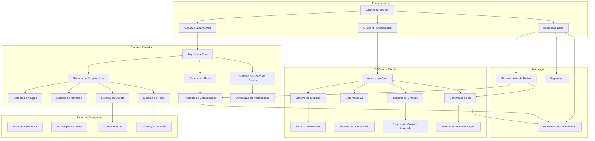

# 🔗 Mapa de Relacionamentos entre Módulos

Este mapa visualiza como os diferentes módulos e sistemas do Canary e OTClient se relacionam e dependem uns dos outros.

## 🏗️ Arquitetura de Dependências



## 📊 Matriz de Dependências

### **Canary - Dependências Core**
| Módulo | Dependências | Dependentes |
|--------|--------------|-------------|
| **Arquitetura Core** | - | Sistema de Rede, Banco de Dados, Scripting |
| **Sistema de Rede** | Arquitetura Core | Protocolo de Comunicação |
| **Sistema de Banco** | Arquitetura Core | Otimização de Performance |
| **Scripting Lua** | Arquitetura Core | Magias, Monstros, Quests, Raids |

### **OTClient - Dependências Core**
| Módulo | Dependências | Dependentes |
|--------|--------------|-------------|
| **Arquitetura Core** | - | Módulos, Rede, UI, Gráficos |
| **Sistema de Módulos** | Arquitetura Core | Eventos, UI Customizada |
| **Sistema de Rede** | Arquitetura Core | Protocolo de Comunicação |
| **Sistema de UI** | Arquitetura Core | UI Avançada, Widgets Customizados |

### **Integração - Dependências Cruzadas**
| Módulo | Dependências Canary | Dependências OTClient |
|--------|---------------------|----------------------|
| **Protocolo** | Sistema de Rede | Sistema de Rede |
| **Sincronização** | Banco de Dados | Sistema de Eventos |
| **Segurança** | Sistema de Rede | Sistema de Rede |

## 🔄 Fluxo de Dados

### **1. Inicialização**
```
Canary Core → Rede → Banco → Scripting
OTClient Core → Módulos → UI → Gráficos
```

### **2. Comunicação**
```
Canary Scripting → Rede → Protocolo ← OTClient Rede
```

### **3. Sincronização**
```
Canary Banco → Eventos → Protocolo → OTClient Eventos → UI
```

## 🎯 Pontos de Integração

### **Interface de Usuário**
- **OTClient UI** ↔ **Canary Scripting** (via protocolo)
- **OTClient Eventos** ↔ **Canary Eventos** (via sincronização)

### **Rede e Protocolo**
- **Canary Rede** ↔ **OTClient Rede** (via protocolo)
- **Canary Segurança** ↔ **OTClient Segurança** (via criptografia)

### **Dados e Estado**
- **Canary Banco** ↔ **OTClient Cache** (via sincronização)
- **Canary Scripting** ↔ **OTClient Módulos** (via eventos)

## 🚀 Otimizações de Performance

### **Cache Inteligente**
- **OTClient**: Cache local de dados frequentemente acessados
- **Canary**: Cache de scripts Lua compilados
- **Integração**: Cache de protocolo para comunicação frequente

### **Lazy Loading**
- **Módulos OTClient**: Carregamento sob demanda
- **Scripts Canary**: Compilação JIT quando necessário
- **Recursos**: Carregamento progressivo de assets

## 🔍 Monitoramento e Debug

### **Métricas de Performance**
- **Latência de Rede**: Protocolo Canary ↔ OTClient
- **Uso de Memória**: Scripts Lua e módulos
- **CPU**: Renderização gráfica e lógica de jogo

### **Logs e Rastreamento**
- **Canary**: Logs de servidor e scripts
- **OTClient**: Logs de cliente e módulos
- **Integração**: Logs de protocolo e sincronização

## 📚 Próximos Passos

1. **Implementar métricas** de performance em tempo real
2. **Criar dashboard** de monitoramento integrado
3. **Otimizar protocolo** baseado em análise de uso
4. **Implementar cache** inteligente para dados frequentes
5. **Criar sistema** de alertas para falhas de integração
