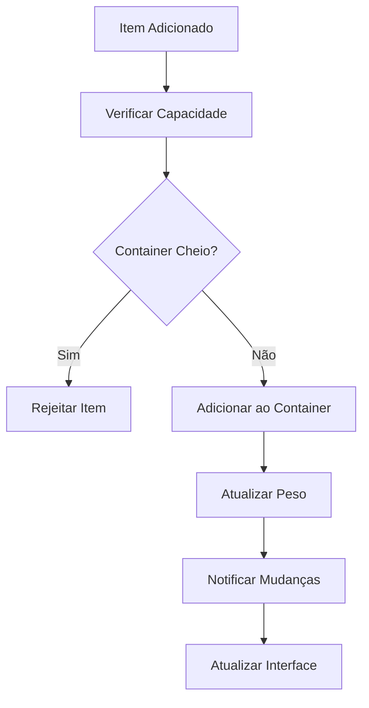

# 🎒 OTCLIENT-013: Sistema de Inventário

## 🎯 **Visão Geral**

O **Sistema de Inventário** é um componente fundamental do OTClient, responsável por gerenciar todos os itens que um jogador carrega, incluindo equipamentos, containers, mochilas e itens de uso. Este sistema trabalha em conjunto com o servidor Canary para sincronizar o estado do inventário em tempo real.

## 🏗️ **Arquitetura do Sistema**

### **📁 Estrutura de Arquivos**

```
📁 src/items/containers/
├── container.hpp          # Definições de containers
├── container.cpp          # Implementação de containers
└── inbox/
    ├── inbox.hpp          # Sistema de inbox
    └── inbox.cpp          # Implementação do inbox

📁 src/creatures/players/
├── player.hpp             # Definições do jogador
└── player.cpp             # Implementação do jogador

📁 src/client/
├── container.h            # Interface do cliente
└── container.cpp          # Implementação do cliente
```

### **🔗 Dependências Principais**

- **Item System**: Sistema de itens base
- **Player System**: Sistema de jogadores
- **Network Protocol**: Comunicação com servidor
- **UI System**: Interface de usuário
- **Game Engine**: Sistema principal de jogo

## 🎒 **Componentes Principais**

### **1. Sistema de Slots (Slots_t)**

#### Nível Basic
```cpp
enum Slots_t : uint8_t {
    CONST_SLOT_WHEREEVER = 0,      // Slot genérico
    CONST_SLOT_HEAD = 1,           // Cabeça
    CONST_SLOT_NECKLACE = 2,       // Pescoço
    CONST_SLOT_BACKPACK = 3,       // Mochila
    CONST_SLOT_ARMOR = 4,          // Armadura
    CONST_SLOT_RIGHT = 5,          // Mão direita
    CONST_SLOT_LEFT = 6,           // Mão esquerda
    CONST_SLOT_LEGS = 7,           // Pernas
    CONST_SLOT_FEET = 8,           // Pés
    CONST_SLOT_RING = 9,           // Anel
    CONST_SLOT_AMMO = 10,          // Munição
    CONST_SLOT_STORE_INBOX = 11,   // Inbox da loja

    CONST_SLOT_FIRST = CONST_SLOT_HEAD,
    CONST_SLOT_LAST = CONST_SLOT_STORE_INBOX,
};
```

#### Nível Intermediate
```cpp
enum Slots_t : uint8_t {
    CONST_SLOT_WHEREEVER = 0,      // Slot genérico
    CONST_SLOT_HEAD = 1,           // Cabeça
    CONST_SLOT_NECKLACE = 2,       // Pescoço
    CONST_SLOT_BACKPACK = 3,       // Mochila
    CONST_SLOT_ARMOR = 4,          // Armadura
    CONST_SLOT_RIGHT = 5,          // Mão direita
    CONST_SLOT_LEFT = 6,           // Mão esquerda
    CONST_SLOT_LEGS = 7,           // Pernas
    CONST_SLOT_FEET = 8,           // Pés
    CONST_SLOT_RING = 9,           // Anel
    CONST_SLOT_AMMO = 10,          // Munição
    CONST_SLOT_STORE_INBOX = 11,   // Inbox da loja

    CONST_SLOT_FIRST = CONST_SLOT_HEAD,
    CONST_SLOT_LAST = CONST_SLOT_STORE_INBOX,
};
-- Adicionar tratamento de erros
local success, result = pcall(function()
    -- Código original aqui
end)
if not success then
    print('Erro:', result)
end
```

#### Nível Advanced
```cpp
enum Slots_t : uint8_t {
    CONST_SLOT_WHEREEVER = 0,      // Slot genérico
    CONST_SLOT_HEAD = 1,           // Cabeça
    CONST_SLOT_NECKLACE = 2,       // Pescoço
    CONST_SLOT_BACKPACK = 3,       // Mochila
    CONST_SLOT_ARMOR = 4,          // Armadura
    CONST_SLOT_RIGHT = 5,          // Mão direita
    CONST_SLOT_LEFT = 6,           // Mão esquerda
    CONST_SLOT_LEGS = 7,           // Pernas
    CONST_SLOT_FEET = 8,           // Pés
    CONST_SLOT_RING = 9,           // Anel
    CONST_SLOT_AMMO = 10,          // Munição
    CONST_SLOT_STORE_INBOX = 11,   // Inbox da loja

    CONST_SLOT_FIRST = CONST_SLOT_HEAD,
    CONST_SLOT_LAST = CONST_SLOT_STORE_INBOX,
};
-- Adicionar metatable para funcionalidade avançada
local mt = {
    __index = function(t, k)
        return rawget(t, k) or 'Valor não encontrado'
    end
    __call = function(t, ...)
        print('Objeto chamado com:', ...)
    end
}
setmetatable(meuObjeto, mt)
```

### **2. Estrutura de Inventário do Jogador**

```cpp
class Player {
    -- Classe: Player
private:
    // Array de itens do inventário
    std::shared_ptr<Item> inventory[CONST_SLOT_LAST + 1] = {};
    
    // Capacidade e peso
    uint32_t inventoryWeight = 0;
    uint32_t capacity = 40000;
    uint32_t bonusCapacity = 0;
    
    // Containers especiais
    std::shared_ptr<Inbox> inbox;
    std::shared_ptr<Item> imbuingItem = nullptr;
    std::shared_ptr<Item> tradeItem = nullptr;
    std::shared_ptr<Item> writeItem = nullptr;
};
```

### **3. Classe Container**

```cpp
class Container : public Item {
    -- Classe: Container
public:
    // Construtores
    Container(uint16_t type);
    Container(uint16_t initType, uint16_t initSize, bool initUnlocked = true, bool initPagination = false);
    
    // Métodos principais
    void addItem(const std::shared_ptr<Item> &item);
    std::shared_ptr<Item> getItemByIndex(size_t index) const;
    std::shared_ptr<Item> getFilteredItemByIndex(size_t index) const;
    
    // Propriedades
    uint32_t getMaxCapacity() const;
    uint16_t getFreeSlots() const;
    uint32_t getWeight() const;
    uint32_t getItemHoldingCount();
    uint32_t getContainerHoldingCount();
    
    // Verificações
    bool isHoldingItem(const std::shared_ptr<Item> &item);
    bool isHoldingItemWithId(uint16_t id);
    bool isUnlocked() const;
    bool hasPagination() const;
    bool isInbox() const;
    bool isDepotChest() const;
    bool isStoreInbox() const;
    
    // Iteradores
    ContainerIterator iterator();
    const ItemDeque &getItemList() const;
    ItemDeque::const_reverse_iterator getReversedItems() const;
    ItemDeque::const_reverse_iterator getReversedEnd() const;
    
    // Sistema de stash
    StashContainerList getStowableItems();
    bool countsToLootAnalyzerBalance() const;
    
private:
    ItemDeque itemlist;
    uint32_t maxSize;
    uint32_t m_maxItems;
    bool unlocked;
    bool pagination;
    uint32_t maxInboxItems;
};
```

### **4. Classe Inbox**

```cpp
class Inbox : public Container {
    -- Classe: Inbox
public:
    Inbox(uint16_t type);
    
    // Validações específicas do inbox
    ReturnValue queryAdd(int32_t, const std::shared_ptr<Thing> &thing, uint32_t, uint32_t flags, const std::shared_ptr<Creature> &) override;
    
    // Notificações
    void postAddNotification(const std::shared_ptr<Thing> &thing, const std::shared_ptr<Cylinder> &oldParent, int32_t index, CylinderLink_t) override;
    void postRemoveNotification(const std::shared_ptr<Thing> &thing, const std::shared_ptr<Cylinder> &newParent, int32_t index, CylinderLink_t) override;
    
private:
    uint32_t maxInboxItems;
};
```

## ⚙️ **Mecânicas do Sistema**

### **1. Gerenciamento de Capacidade**

#### Nível Basic
```cpp
uint32_t Player::getCapacity() const {
    return capacity + bonusCapacity;
}

uint32_t Player::getFreeCapacity() const {
    return getCapacity() - inventoryWeight;
}

uint32_t Player::getBaseCapacity() const {
    return capacity;
}

uint32_t Player::getBonusCapacity() const {
    return bonusCapacity;
}
```

#### Nível Intermediate
```cpp
uint32_t Player::getCapacity() const {
    return capacity + bonusCapacity;
}

uint32_t Player::getFreeCapacity() const {
    return getCapacity() - inventoryWeight;
}

uint32_t Player::getBaseCapacity() const {
    return capacity;
}

uint32_t Player::getBonusCapacity() const {
    return bonusCapacity;
}
-- Adicionar tratamento de erros
local success, result = pcall(function()
    -- Código original aqui
end)
if not success then
    print('Erro:', result)
end
```

#### Nível Advanced
```cpp
uint32_t Player::getCapacity() const {
    return capacity + bonusCapacity;
}

uint32_t Player::getFreeCapacity() const {
    return getCapacity() - inventoryWeight;
}

uint32_t Player::getBaseCapacity() const {
    return capacity;
}

uint32_t Player::getBonusCapacity() const {
    return bonusCapacity;
}
-- Adicionar metatable para funcionalidade avançada
local mt = {
    __index = function(t, k)
        return rawget(t, k) or 'Valor não encontrado'
    end
    __call = function(t, ...)
        print('Objeto chamado com:', ...)
    end
}
setmetatable(meuObjeto, mt)
```

### **2. Sistema de Peso**

#### Nível Basic
```cpp
        if (item) {
```

#### Nível Intermediate
```cpp
uint32_t Container::getWeight() const {
    uint32_t weight = 0;
    for (const auto &item : itemlist) {
        weight += item->getWeight();
    }
    return weight;
}

void Player::updateInventoryWeight() {
    inventoryWeight = 0;
    for (int i = CONST_SLOT_FIRST; i <= CONST_SLOT_LAST; ++i) {
        const auto &item = inventory[i];
        if (item) {
            inventoryWeight += item->getWeight();
        }
    }
}
```

#### Nível Advanced
```cpp
uint32_t Container::getWeight() const {
    uint32_t weight = 0;
    for (const auto &item : itemlist) {
        weight += item->getWeight();
    }
    return weight;
}

void Player::updateInventoryWeight() {
    inventoryWeight = 0;
    for (int i = CONST_SLOT_FIRST; i <= CONST_SLOT_LAST; ++i) {
        const auto &item = inventory[i];
        if (item) {
            inventoryWeight += item->getWeight();
        }
    }
}
-- Adicionar metatable para funcionalidade avançada
local mt = {
    __index = function(t, k)
        return rawget(t, k) or 'Valor não encontrado'
    end
    __call = function(t, ...)
        print('Objeto chamado com:', ...)
    end
}
setmetatable(meuObjeto, mt)
```

### **3. Operações de Container**

#### Nível Basic
```cpp
void Container::addItem(const std::shared_ptr<Item> &item) {
    itemlist.push_back(item);
    item->setParent(static_self_cast<Container>());
    
    // Notificar mudanças
    postAddNotification(item, nullptr, itemlist.size() - 1, LINK_TOPPARENT);
}

std::shared_ptr<Item> Container::getItemByIndex(size_t index) const {
    if (index >= itemlist.size()) {
        return nullptr;
    }
    return itemlist[index];
}

uint16_t Container::getFreeSlots() const {
    return static_cast<uint16_t>(maxSize - itemlist.size());
}
```

#### Nível Intermediate
```cpp
void Container::addItem(const std::shared_ptr<Item> &item) {
    itemlist.push_back(item);
    item->setParent(static_self_cast<Container>());
    
    // Notificar mudanças
    postAddNotification(item, nullptr, itemlist.size() - 1, LINK_TOPPARENT);
}

std::shared_ptr<Item> Container::getItemByIndex(size_t index) const {
    if (index >= itemlist.size()) {
        return nullptr;
    }
    return itemlist[index];
}

uint16_t Container::getFreeSlots() const {
    return static_cast<uint16_t>(maxSize - itemlist.size());
}
-- Adicionar tratamento de erros
local success, result = pcall(function()
    -- Código original aqui
end)
if not success then
    print('Erro:', result)
end
```

#### Nível Advanced
```cpp
void Container::addItem(const std::shared_ptr<Item> &item) {
    itemlist.push_back(item);
    item->setParent(static_self_cast<Container>());
    
    // Notificar mudanças
    postAddNotification(item, nullptr, itemlist.size() - 1, LINK_TOPPARENT);
}

std::shared_ptr<Item> Container::getItemByIndex(size_t index) const {
    if (index >= itemlist.size()) {
        return nullptr;
    }
    return itemlist[index];
}

uint16_t Container::getFreeSlots() const {
    return static_cast<uint16_t>(maxSize - itemlist.size());
}
-- Adicionar metatable para funcionalidade avançada
local mt = {
    __index = function(t, k)
        return rawget(t, k) or 'Valor não encontrado'
    end
    __call = function(t, ...)
        print('Objeto chamado com:', ...)
    end
}
setmetatable(meuObjeto, mt)
```

### **4. Sistema de Paginação**

#### Nível Basic
```cpp
bool Container::hasPagination() const {
    return pagination;
}

uint32_t Container::getMaxCapacity() const {
    if (hasPagination()) {
        return m_maxItems;
    }
    return maxSize;
}
```

#### Nível Intermediate
```cpp
bool Container::hasPagination() const {
    return pagination;
}

uint32_t Container::getMaxCapacity() const {
    if (hasPagination()) {
        return m_maxItems;
    }
    return maxSize;
}
-- Adicionar tratamento de erros
local success, result = pcall(function()
    -- Código original aqui
end)
if not success then
    print('Erro:', result)
end
```

#### Nível Advanced
```cpp
bool Container::hasPagination() const {
    return pagination;
}

uint32_t Container::getMaxCapacity() const {
    if (hasPagination()) {
        return m_maxItems;
    }
    return maxSize;
}
-- Adicionar metatable para funcionalidade avançada
local mt = {
    __index = function(t, k)
        return rawget(t, k) or 'Valor não encontrado'
    end
    __call = function(t, ...)
        print('Objeto chamado com:', ...)
    end
}
setmetatable(meuObjeto, mt)
```

## 🎮 **Fluxo de Operações**

### **1. Adição de Itens**



### **2. Remoção de Itens**

#### Nível Basic
```cpp
void Container::removeItem(const std::shared_ptr<Item> &item) {
    auto it = std::find(itemlist.begin(), itemlist.end(), item);
    if (it != itemlist.end()) {
        size_t index = std::distance(itemlist.begin(), it);
        itemlist.erase(it);
        
        // Notificar mudanças
        postRemoveNotification(item, nullptr, index, LINK_TOPPARENT);
        
        // Atualizar posições
        updateItemsPositions();
    }
}
```

#### Nível Intermediate
```cpp
void Container::removeItem(const std::shared_ptr<Item> &item) {
    auto it = std::find(itemlist.begin(), itemlist.end(), item);
    if (it != itemlist.end()) {
        size_t index = std::distance(itemlist.begin(), it);
        itemlist.erase(it);
        
        // Notificar mudanças
        postRemoveNotification(item, nullptr, index, LINK_TOPPARENT);
        
        // Atualizar posições
        updateItemsPositions();
    }
}
-- Adicionar tratamento de erros
local success, result = pcall(function()
    -- Código original aqui
end)
if not success then
    print('Erro:', result)
end
```

#### Nível Advanced
```cpp
void Container::removeItem(const std::shared_ptr<Item> &item) {
    auto it = std::find(itemlist.begin(), itemlist.end(), item);
    if (it != itemlist.end()) {
        size_t index = std::distance(itemlist.begin(), it);
        itemlist.erase(it);
        
        // Notificar mudanças
        postRemoveNotification(item, nullptr, index, LINK_TOPPARENT);
        
        // Atualizar posições
        updateItemsPositions();
    }
}
-- Adicionar metatable para funcionalidade avançada
local mt = {
    __index = function(t, k)
        return rawget(t, k) or 'Valor não encontrado'
    end
    __call = function(t, ...)
        print('Objeto chamado com:', ...)
    end
}
setmetatable(meuObjeto, mt)
```

### **3. Busca de Itens**

#### Nível Basic
```cpp
        if (item->getID() == itemId) {
            if (subType == -1 || item->getSubType() == subType) {
                if (tier == 0 || item->getTier() == tier) {
        if (const auto &container = item->getContainer()) {
            if (found) {
```

#### Nível Intermediate
```cpp
std::shared_ptr<Item> Container::findItemById(uint32_t itemId, int subType, uint8_t tier) const {
    for (const auto &item : itemlist) {
        if (item->getID() == itemId) {
            if (subType == -1 || item->getSubType() == subType) {
                if (tier == 0 || item->getTier() == tier) {
                    return item;
                }
            }
        }
        
        // Buscar em sub-containers
        if (const auto &container = item->getContainer()) {
            auto found = container->findItemById(itemId, subType, tier);
            if (found) {
                return found;
            }
        }
    }
    return nullptr;
}
```

#### Nível Advanced
```cpp
std::shared_ptr<Item> Container::findItemById(uint32_t itemId, int subType, uint8_t tier) const {
    for (const auto &item : itemlist) {
        if (item->getID() == itemId) {
            if (subType == -1 || item->getSubType() == subType) {
                if (tier == 0 || item->getTier() == tier) {
                    return item;
                }
            }
        }
        
        // Buscar em sub-containers
        if (const auto &container = item->getContainer()) {
            auto found = container->findItemById(itemId, subType, tier);
            if (found) {
                return found;
            }
        }
    }
    return nullptr;
}
-- Adicionar metatable para funcionalidade avançada
local mt = {
    __index = function(t, k)
        return rawget(t, k) or 'Valor não encontrado'
    end
    __call = function(t, ...)
        print('Objeto chamado com:', ...)
    end
}
setmetatable(meuObjeto, mt)
```

## 🎨 **Interface do Cliente**

### **1. Classe Container do Cliente**

#### Inicialização e Configuração
```cpp
class Container final : public LuaObject {
public:
    // Getters básicos
    ItemPtr getItem(int slot);
    std::deque<ItemPtr> getItems() { return m_items; }
    int getItemsCount() { return m_items.size(); }
    int getId() { return m_id; }
    int getCapacity() { return m_capacity; }
    ItemPtr getContainerItem() { return m_containerItem; }
    std::string getName() { return m_name; }
    
    // Estados
    bool hasParent() { return m_hasParent; }
    bool isClosed() { return m_closed; }
    bool isUnlocked() { return m_unlocked; }
    bool hasPages() { return m_hasPages; }
    
    // Paginação
    int getSize() { return m_size; }
    int getFirstIndex() { return m_firstIndex; }
    
    // Busca
    ItemPtr findItemById(uint32_t itemId, int subType, uint8_t tier) const;
    
    // Posição
    Position getSlotPosition(const int slot) { 
        return { 0xffff, m_id | 0x40, static_cast<uint8_t>(slot) }; 
    }
```

#### Finalização
```cpp

protected:
    // Eventos
    void onOpen(const ContainerPtr& previousContainer);
    void onClose();
    void onAddItem(const ItemPtr& item, int slot);
    void onAddItems(const std::vector<ItemPtr>& items);
    void onUpdateItem(int slot, const ItemPtr& item);
    void onRemoveItem(int slot, const ItemPtr& lastItem);

private:
    void updateItemsPositions();
    
    uint8_t m_id;
    uint8_t m_capacity;
    ItemPtr m_containerItem;
    std::string m_name;
    bool m_hasParent;
    bool m_closed{ false };
    bool m_unlocked;
    bool m_hasPages;
    uint16_t m_size;
    uint16_t m_firstIndex;
    std::deque<ItemPtr> m_items;
};
```

### **2. Eventos de Container**

#### Nível Basic
```cpp
void Container::onOpen(const ContainerPtr& previousContainer) {
    // Notificar abertura do container
    g_lua.callGlobalField("g_ui", "onContainerOpen", this, previousContainer);
}

void Container::onClose() {
    m_closed = true;
    // Notificar fechamento do container
    g_lua.callGlobalField("g_ui", "onContainerClose", this);
}

void Container::onAddItem(const ItemPtr& item, int slot) {
    // Atualizar lista de itens
    if (slot >= 0 && slot < static_cast<int>(m_items.size())) {
        m_items[slot] = item;
    } else {
        m_items.push_back(item);
    }
    
    // Notificar adição
    g_lua.callGlobalField("g_ui", "onContainerItemAdd", this, item, slot);
}

void Container::onRemoveItem(int slot, const ItemPtr& lastItem) {
    // Remover item da lista
    if (slot >= 0 && slot < static_cast<int>(m_items.size())) {
        m_items.erase(m_items.begin() + slot);
    }
    
    // Notificar remoção
    g_lua.callGlobalField("g_ui", "onContainerItemRemove", this, lastItem, slot);
}
```

#### Nível Intermediate
```cpp
void Container::onOpen(const ContainerPtr& previousContainer) {
    // Notificar abertura do container
    g_lua.callGlobalField("g_ui", "onContainerOpen", this, previousContainer);
}

void Container::onClose() {
    m_closed = true;
    // Notificar fechamento do container
    g_lua.callGlobalField("g_ui", "onContainerClose", this);
}

void Container::onAddItem(const ItemPtr& item, int slot) {
    // Atualizar lista de itens
    if (slot >= 0 && slot < static_cast<int>(m_items.size())) {
        m_items[slot] = item;
    } else {
        m_items.push_back(item);
    }
    
    // Notificar adição
    g_lua.callGlobalField("g_ui", "onContainerItemAdd", this, item, slot);
}

void Container::onRemoveItem(int slot, const ItemPtr& lastItem) {
    // Remover item da lista
    if (slot >= 0 && slot < static_cast<int>(m_items.size())) {
        m_items.erase(m_items.begin() + slot);
    }
    
    // Notificar remoção
    g_lua.callGlobalField("g_ui", "onContainerItemRemove", this, lastItem, slot);
}
-- Adicionar tratamento de erros
local success, result = pcall(function()
    -- Código original aqui
end)
if not success then
    print('Erro:', result)
end
```

#### Nível Advanced
```cpp
void Container::onOpen(const ContainerPtr& previousContainer) {
    // Notificar abertura do container
    g_lua.callGlobalField("g_ui", "onContainerOpen", this, previousContainer);
}

void Container::onClose() {
    m_closed = true;
    // Notificar fechamento do container
    g_lua.callGlobalField("g_ui", "onContainerClose", this);
}

void Container::onAddItem(const ItemPtr& item, int slot) {
    // Atualizar lista de itens
    if (slot >= 0 && slot < static_cast<int>(m_items.size())) {
        m_items[slot] = item;
    } else {
        m_items.push_back(item);
    }
    
    // Notificar adição
    g_lua.callGlobalField("g_ui", "onContainerItemAdd", this, item, slot);
}

void Container::onRemoveItem(int slot, const ItemPtr& lastItem) {
    // Remover item da lista
    if (slot >= 0 && slot < static_cast<int>(m_items.size())) {
        m_items.erase(m_items.begin() + slot);
    }
    
    // Notificar remoção
    g_lua.callGlobalField("g_ui", "onContainerItemRemove", this, lastItem, slot);
}
-- Adicionar metatable para funcionalidade avançada
local mt = {
    __index = function(t, k)
        return rawget(t, k) or 'Valor não encontrado'
    end
    __call = function(t, ...)
        print('Objeto chamado com:', ...)
    end
}
setmetatable(meuObjeto, mt)
```

## 🔧 **Sistema de Stash**

### **1. Gerenciamento de Stash**

#### Nível Basic
```cpp
void Player::addItemOnStash(uint16_t itemId, uint32_t amount) {
    auto &stashItems = getStashItems();
    auto it = stashItems.find(itemId);
    if (it != stashItems.end()) {
        it->second += amount;
    } else {
        stashItems[itemId] = amount;
    }
}

uint32_t Player::getStashItemCount(uint16_t itemId) const {
    const auto &stashItems = getStashItems();
    auto it = stashItems.find(itemId);
    return it != stashItems.end() ? it->second : 0;
}

bool Player::withdrawItem(uint16_t itemId, uint32_t amount) {
    auto &stashItems = getStashItems();
    auto it = stashItems.find(itemId);
    if (it != stashItems.end() && it->second >= amount) {
        it->second -= amount;
        if (it->second == 0) {
            stashItems.erase(it);
        }
        return true;
    }
    return false;
}
```

#### Nível Intermediate
```cpp
void Player::addItemOnStash(uint16_t itemId, uint32_t amount) {
    auto &stashItems = getStashItems();
    auto it = stashItems.find(itemId);
    if (it != stashItems.end()) {
        it->second += amount;
    } else {
        stashItems[itemId] = amount;
    }
}

uint32_t Player::getStashItemCount(uint16_t itemId) const {
    const auto &stashItems = getStashItems();
    auto it = stashItems.find(itemId);
    return it != stashItems.end() ? it->second : 0;
}

bool Player::withdrawItem(uint16_t itemId, uint32_t amount) {
    auto &stashItems = getStashItems();
    auto it = stashItems.find(itemId);
    if (it != stashItems.end() && it->second >= amount) {
        it->second -= amount;
        if (it->second == 0) {
            stashItems.erase(it);
        }
        return true;
    }
    return false;
}
-- Adicionar tratamento de erros
local success, result = pcall(function()
    -- Código original aqui
end)
if not success then
    print('Erro:', result)
end
```

#### Nível Advanced
```cpp
void Player::addItemOnStash(uint16_t itemId, uint32_t amount) {
    auto &stashItems = getStashItems();
    auto it = stashItems.find(itemId);
    if (it != stashItems.end()) {
        it->second += amount;
    } else {
        stashItems[itemId] = amount;
    }
}

uint32_t Player::getStashItemCount(uint16_t itemId) const {
    const auto &stashItems = getStashItems();
    auto it = stashItems.find(itemId);
    return it != stashItems.end() ? it->second : 0;
}

bool Player::withdrawItem(uint16_t itemId, uint32_t amount) {
    auto &stashItems = getStashItems();
    auto it = stashItems.find(itemId);
    if (it != stashItems.end() && it->second >= amount) {
        it->second -= amount;
        if (it->second == 0) {
            stashItems.erase(it);
        }
        return true;
    }
    return false;
}
-- Adicionar metatable para funcionalidade avançada
local mt = {
    __index = function(t, k)
        return rawget(t, k) or 'Valor não encontrado'
    end
    __call = function(t, ...)
        print('Objeto chamado com:', ...)
    end
}
setmetatable(meuObjeto, mt)
```

### **2. Containers Gerenciados**

#### Nível Basic
```cpp
    if (managedContainer && managedContainer != container) {
```

#### Nível Intermediate
```cpp
std::shared_ptr<Container> Player::refreshManagedContainer(ObjectCategory_t category, const std::shared_ptr<Container> &container, bool isLootContainer, bool loading = false) {
    // Atualizar container gerenciado
    auto managedContainer = getManagedContainer(category, isLootContainer);
    if (managedContainer && managedContainer != container) {
        // Sincronizar conteúdo
        managedContainer->clear();
        for (ContainerIterator it = container->iterator(); it.hasNext(); it.advance()) {
            managedContainer->addItem(*it);
        }
    }
    return managedContainer;
}
```

#### Nível Advanced
```cpp
std::shared_ptr<Container> Player::refreshManagedContainer(ObjectCategory_t category, const std::shared_ptr<Container> &container, bool isLootContainer, bool loading = false) {
    // Atualizar container gerenciado
    auto managedContainer = getManagedContainer(category, isLootContainer);
    if (managedContainer && managedContainer != container) {
        // Sincronizar conteúdo
        managedContainer->clear();
        for (ContainerIterator it = container->iterator(); it.hasNext(); it.advance()) {
            managedContainer->addItem(*it);
        }
    }
    return managedContainer;
}
-- Adicionar metatable para funcionalidade avançada
local mt = {
    __index = function(t, k)
        return rawget(t, k) or 'Valor não encontrado'
    end
    __call = function(t, ...)
        print('Objeto chamado com:', ...)
    end
}
setmetatable(meuObjeto, mt)
```

## 📊 **Sistema de Análise de Loot**

### **1. Contagem de Itens**

#### Nível Basic
```cpp
        if (item->getID() != ITEM_GOLD_POUCH) {
            if (!item->hasMarketAttributes()) {
            if (const auto &container = item->getContainer()) {
                if (!container->empty()) {
```

#### Nível Intermediate
```cpp
std::map<uint32_t, uint32_t> &Player::getAllItemTypeCount(std::map<uint32_t, uint32_t> &countMap) const {
    for (const auto &item : getAllInventoryItems()) {
        countMap[static_cast<uint32_t>(item->getID())] += Item::countByType(item, -1);
    }
    return countMap;
}

std::map<uint16_t, uint16_t> &Player::getAllSaleItemIdAndCount(std::map<uint16_t, uint16_t> &countMap) const {
    for (const auto &item : getAllInventoryItems(false, true)) {
        if (item->getID() != ITEM_GOLD_POUCH) {
            if (!item->hasMarketAttributes()) {
                continue;
            }
            
            if (const auto &container = item->getContainer()) {
                if (!container->empty()) {
                    continue;
                }
            }
        }
        
        countMap[item->getID()] += item->getItemCount();
    }
    return countMap;
}
```

#### Nível Advanced
```cpp
std::map<uint32_t, uint32_t> &Player::getAllItemTypeCount(std::map<uint32_t, uint32_t> &countMap) const {
    for (const auto &item : getAllInventoryItems()) {
        countMap[static_cast<uint32_t>(item->getID())] += Item::countByType(item, -1);
    }
    return countMap;
}

std::map<uint16_t, uint16_t> &Player::getAllSaleItemIdAndCount(std::map<uint16_t, uint16_t> &countMap) const {
    for (const auto &item : getAllInventoryItems(false, true)) {
        if (item->getID() != ITEM_GOLD_POUCH) {
            if (!item->hasMarketAttributes()) {
                continue;
            }
            
            if (const auto &container = item->getContainer()) {
                if (!container->empty()) {
                    continue;
                }
            }
        }
        
        countMap[item->getID()] += item->getItemCount();
    }
    return countMap;
}
-- Adicionar metatable para funcionalidade avançada
local mt = {
    __index = function(t, k)
        return rawget(t, k) or 'Valor não encontrado'
    end
    __call = function(t, ...)
        print('Objeto chamado com:', ...)
    end
}
setmetatable(meuObjeto, mt)
```

### **2. Itens Equipados**

#### Nível Basic
```cpp
        if (!item) {
```

#### Nível Intermediate
```cpp
std::vector<std::shared_ptr<Item>> Player::getEquippedItems() const {
    static const std::vector valid_slots {
        CONST_SLOT_HEAD,
        CONST_SLOT_NECKLACE,
        CONST_SLOT_BACKPACK,
        CONST_SLOT_ARMOR,
        CONST_SLOT_RIGHT,
        CONST_SLOT_LEFT,
        CONST_SLOT_LEGS,
        CONST_SLOT_FEET,
        CONST_SLOT_RING,
    };

    std::vector<std::shared_ptr<Item>> valid_items;
    for (const auto &slot : valid_slots) {
        const auto &item = inventory[slot];
        if (!item) {
            continue;
        }
        valid_items.emplace_back(item);
    }
    return valid_items;
}
```

#### Nível Advanced
```cpp
std::vector<std::shared_ptr<Item>> Player::getEquippedItems() const {
    static const std::vector valid_slots {
        CONST_SLOT_HEAD,
        CONST_SLOT_NECKLACE,
        CONST_SLOT_BACKPACK,
        CONST_SLOT_ARMOR,
        CONST_SLOT_RIGHT,
        CONST_SLOT_LEFT,
        CONST_SLOT_LEGS,
        CONST_SLOT_FEET,
        CONST_SLOT_RING,
    };

    std::vector<std::shared_ptr<Item>> valid_items;
    for (const auto &slot : valid_slots) {
        const auto &item = inventory[slot];
        if (!item) {
            continue;
        }
        valid_items.emplace_back(item);
    }
    return valid_items;
}
-- Adicionar metatable para funcionalidade avançada
local mt = {
    __index = function(t, k)
        return rawget(t, k) or 'Valor não encontrado'
    end
    __call = function(t, ...)
        print('Objeto chamado com:', ...)
    end
}
setmetatable(meuObjeto, mt)
```

## 🔄 **Sincronização com Servidor**

### **1. Protocolo de Container**

#### Nível Basic
```cpp
    if (container) {
    if (container) {
```

#### Nível Intermediate
```cpp
// Abertura de container
void ProtocolGame::parseOpenContainer(const InputMessagePtr& msg) {
    uint8_t containerId = msg->getU8();
    uint16_t itemId = msg->getU16();
    std::string name = msg->getString();
    uint8_t capacity = msg->getU8();
    bool hasParent = msg->getU8() != 0;
    bool isUnlocked = msg->getU8() != 0;
    bool hasPages = msg->getU8() != 0;
    uint16_t containerSize = msg->getU16();
    uint16_t firstIndex = msg->getU16();
    
    // Criar container
    auto container = ContainerPtr(new Container(containerId, capacity, name, nullptr, hasParent, isUnlocked, hasPages, containerSize, firstIndex));
    
    // Adicionar itens
    uint8_t itemsCount = msg->getU8();
    for (int i = 0; i < itemsCount; ++i) {
        auto item = parseItem(msg);
        container->onAddItem(item, i);
    }
    
    // Abrir container
    container->onOpen(nullptr);
}

// Adição de item
void ProtocolGame::parseContainerAddItem(const InputMessagePtr& msg) {
    uint8_t containerId = msg->getU8();
    auto item = parseItem(msg);
    
    auto container = getContainer(containerId);
    if (container) {
        container->onAddItem(item, -1);
    }
}

// Remoção de item
void ProtocolGame::parseContainerRemoveItem(const InputMessagePtr& msg) {
    uint8_t containerId = msg->getU8();
    uint8_t slot = msg->getU8();
    auto lastItem = parseItem(msg);
    
    auto container = getContainer(containerId);
    if (container) {
        container->onRemoveItem(slot, lastItem);
    }
}
```

#### Nível Advanced
```cpp
// Abertura de container
void ProtocolGame::parseOpenContainer(const InputMessagePtr& msg) {
    uint8_t containerId = msg->getU8();
    uint16_t itemId = msg->getU16();
    std::string name = msg->getString();
    uint8_t capacity = msg->getU8();
    bool hasParent = msg->getU8() != 0;
    bool isUnlocked = msg->getU8() != 0;
    bool hasPages = msg->getU8() != 0;
    uint16_t containerSize = msg->getU16();
    uint16_t firstIndex = msg->getU16();
    
    // Criar container
    auto container = ContainerPtr(new Container(containerId, capacity, name, nullptr, hasParent, isUnlocked, hasPages, containerSize, firstIndex));
    
    // Adicionar itens
    uint8_t itemsCount = msg->getU8();
    for (int i = 0; i < itemsCount; ++i) {
        auto item = parseItem(msg);
        container->onAddItem(item, i);
    }
    
    // Abrir container
    container->onOpen(nullptr);
}

// Adição de item
void ProtocolGame::parseContainerAddItem(const InputMessagePtr& msg) {
    uint8_t containerId = msg->getU8();
    auto item = parseItem(msg);
    
    auto container = getContainer(containerId);
    if (container) {
        container->onAddItem(item, -1);
    }
}

// Remoção de item
void ProtocolGame::parseContainerRemoveItem(const InputMessagePtr& msg) {
    uint8_t containerId = msg->getU8();
    uint8_t slot = msg->getU8();
    auto lastItem = parseItem(msg);
    
    auto container = getContainer(containerId);
    if (container) {
        container->onRemoveItem(slot, lastItem);
    }
}
-- Adicionar metatable para funcionalidade avançada
local mt = {
    __index = function(t, k)
        return rawget(t, k) or 'Valor não encontrado'
    end
    __call = function(t, ...)
        print('Objeto chamado com:', ...)
    end
}
setmetatable(meuObjeto, mt)
```

### **2. Atualizações de Inventário**

#### Nível Basic
```cpp
// Atualização de slot
void ProtocolGame::parseInventoryItem(const InputMessagePtr& msg) {
    uint8_t slot = msg->getU8();
    auto item = parseItem(msg);
    
    // Atualizar slot do inventário
    m_localPlayer->setInventoryItem(slot, item);
}

// Atualização de peso
void ProtocolGame::parsePlayerStats(const InputMessagePtr& msg) {
    uint32_t health = msg->getU32();
    uint32_t maxHealth = msg->getU32();
    uint32_t freeCapacity = msg->getU32();
    uint32_t experience = msg->getU32();
    uint16_t level = msg->getU16();
    uint8_t levelPercent = msg->getU8();
    uint32_t mana = msg->getU32();
    uint32_t maxMana = msg->getU32();
    uint8_t magicLevel = msg->getU8();
    uint8_t magicLevelPercent = msg->getU8();
    uint8_t soul = msg->getU8();
    uint16_t stamina = msg->getU16();
    
    // Atualizar stats do jogador
    m_localPlayer->setHealth(health, maxHealth);
    m_localPlayer->setFreeCapacity(freeCapacity);
    m_localPlayer->setExperience(experience);
    m_localPlayer->setLevel(level, levelPercent);
    m_localPlayer->setMana(mana, maxMana);
    m_localPlayer->setMagicLevel(magicLevel, magicLevelPercent);
    m_localPlayer->setSoul(soul);
    m_localPlayer->setStamina(stamina);
}
```

#### Nível Intermediate
```cpp
// Atualização de slot
void ProtocolGame::parseInventoryItem(const InputMessagePtr& msg) {
    uint8_t slot = msg->getU8();
    auto item = parseItem(msg);
    
    // Atualizar slot do inventário
    m_localPlayer->setInventoryItem(slot, item);
}

// Atualização de peso
void ProtocolGame::parsePlayerStats(const InputMessagePtr& msg) {
    uint32_t health = msg->getU32();
    uint32_t maxHealth = msg->getU32();
    uint32_t freeCapacity = msg->getU32();
    uint32_t experience = msg->getU32();
    uint16_t level = msg->getU16();
    uint8_t levelPercent = msg->getU8();
    uint32_t mana = msg->getU32();
    uint32_t maxMana = msg->getU32();
    uint8_t magicLevel = msg->getU8();
    uint8_t magicLevelPercent = msg->getU8();
    uint8_t soul = msg->getU8();
    uint16_t stamina = msg->getU16();
    
    // Atualizar stats do jogador
    m_localPlayer->setHealth(health, maxHealth);
    m_localPlayer->setFreeCapacity(freeCapacity);
    m_localPlayer->setExperience(experience);
    m_localPlayer->setLevel(level, levelPercent);
    m_localPlayer->setMana(mana, maxMana);
    m_localPlayer->setMagicLevel(magicLevel, magicLevelPercent);
    m_localPlayer->setSoul(soul);
    m_localPlayer->setStamina(stamina);
}
-- Adicionar tratamento de erros
local success, result = pcall(function()
    -- Código original aqui
end)
if not success then
    print('Erro:', result)
end
```

#### Nível Advanced
```cpp
// Atualização de slot
void ProtocolGame::parseInventoryItem(const InputMessagePtr& msg) {
    uint8_t slot = msg->getU8();
    auto item = parseItem(msg);
    
    // Atualizar slot do inventário
    m_localPlayer->setInventoryItem(slot, item);
}

// Atualização de peso
void ProtocolGame::parsePlayerStats(const InputMessagePtr& msg) {
    uint32_t health = msg->getU32();
    uint32_t maxHealth = msg->getU32();
    uint32_t freeCapacity = msg->getU32();
    uint32_t experience = msg->getU32();
    uint16_t level = msg->getU16();
    uint8_t levelPercent = msg->getU8();
    uint32_t mana = msg->getU32();
    uint32_t maxMana = msg->getU32();
    uint8_t magicLevel = msg->getU8();
    uint8_t magicLevelPercent = msg->getU8();
    uint8_t soul = msg->getU8();
    uint16_t stamina = msg->getU16();
    
    // Atualizar stats do jogador
    m_localPlayer->setHealth(health, maxHealth);
    m_localPlayer->setFreeCapacity(freeCapacity);
    m_localPlayer->setExperience(experience);
    m_localPlayer->setLevel(level, levelPercent);
    m_localPlayer->setMana(mana, maxMana);
    m_localPlayer->setMagicLevel(magicLevel, magicLevelPercent);
    m_localPlayer->setSoul(soul);
    m_localPlayer->setStamina(stamina);
}
-- Adicionar metatable para funcionalidade avançada
local mt = {
    __index = function(t, k)
        return rawget(t, k) or 'Valor não encontrado'
    end
    __call = function(t, ...)
        print('Objeto chamado com:', ...)
    end
}
setmetatable(meuObjeto, mt)
```

## 🛡️ **Sistema de Segurança**

### **1. Validações de Container**

#### Nível Basic
```cpp
ReturnValue Container::queryAdd(int32_t index, const std::shared_ptr<Thing> &thing, uint32_t count, uint32_t flags, const std::shared_ptr<Creature> &actor) {
    if (!thing) {
        return RETURNVALUE_NOTPOSSIBLE;
    }
    
    const auto &item = thing->getItem();
    if (!item) {
        return RETURNVALUE_NOTPOSSIBLE;
    }
    
    // Verificar se item pode ser adicionado
    if (!item->isPickupable()) {
        return RETURNVALUE_CANNOTPICKUP;
    }
    
    // Verificar capacidade
    if (itemlist.size() >= maxSize) {
        return RETURNVALUE_CONTAINERNOTENOUGHROOM;
    }
    
    // Verificar peso
    if (getWeight() + item->getWeight() > getMaxWeight()) {
        return RETURNVALUE_NOTENOUGHCAPACITY;
    }
    
    return RETURNVALUE_NOERROR;
}
```

#### Nível Intermediate
```cpp
ReturnValue Container::queryAdd(int32_t index, const std::shared_ptr<Thing> &thing, uint32_t count, uint32_t flags, const std::shared_ptr<Creature> &actor) {
    if (!thing) {
        return RETURNVALUE_NOTPOSSIBLE;
    }
    
    const auto &item = thing->getItem();
    if (!item) {
        return RETURNVALUE_NOTPOSSIBLE;
    }
    
    // Verificar se item pode ser adicionado
    if (!item->isPickupable()) {
        return RETURNVALUE_CANNOTPICKUP;
    }
    
    // Verificar capacidade
    if (itemlist.size() >= maxSize) {
        return RETURNVALUE_CONTAINERNOTENOUGHROOM;
    }
    
    // Verificar peso
    if (getWeight() + item->getWeight() > getMaxWeight()) {
        return RETURNVALUE_NOTENOUGHCAPACITY;
    }
    
    return RETURNVALUE_NOERROR;
}
-- Adicionar tratamento de erros
local success, result = pcall(function()
    -- Código original aqui
end)
if not success then
    print('Erro:', result)
end
```

#### Nível Advanced
```cpp
ReturnValue Container::queryAdd(int32_t index, const std::shared_ptr<Thing> &thing, uint32_t count, uint32_t flags, const std::shared_ptr<Creature> &actor) {
    if (!thing) {
        return RETURNVALUE_NOTPOSSIBLE;
    }
    
    const auto &item = thing->getItem();
    if (!item) {
        return RETURNVALUE_NOTPOSSIBLE;
    }
    
    // Verificar se item pode ser adicionado
    if (!item->isPickupable()) {
        return RETURNVALUE_CANNOTPICKUP;
    }
    
    // Verificar capacidade
    if (itemlist.size() >= maxSize) {
        return RETURNVALUE_CONTAINERNOTENOUGHROOM;
    }
    
    // Verificar peso
    if (getWeight() + item->getWeight() > getMaxWeight()) {
        return RETURNVALUE_NOTENOUGHCAPACITY;
    }
    
    return RETURNVALUE_NOERROR;
}
-- Adicionar metatable para funcionalidade avançada
local mt = {
    __index = function(t, k)
        return rawget(t, k) or 'Valor não encontrado'
    end
    __call = function(t, ...)
        print('Objeto chamado com:', ...)
    end
}
setmetatable(meuObjeto, mt)
```

### **2. Verificações de Segurança**

#### Nível Basic
```cpp
        if (containerItem == item) {
        if (const auto &container = containerItem->getContainer()) {
            if (container->isHoldingItem(item)) {
        if (item->getID() == id) {
        if (const auto &container = item->getContainer()) {
            if (container->isHoldingItemWithId(id)) {
```

#### Nível Intermediate
```cpp
bool Container::isHoldingItem(const std::shared_ptr<Item> &item) {
    for (const auto &containerItem : itemlist) {
        if (containerItem == item) {
            return true;
        }
        
        if (const auto &container = containerItem->getContainer()) {
            if (container->isHoldingItem(item)) {
                return true;
            }
        }
    }
    return false;
}

bool Container::isHoldingItemWithId(uint16_t id) {
    for (const auto &item : itemlist) {
        if (item->getID() == id) {
            return true;
        }
        
        if (const auto &container = item->getContainer()) {
            if (container->isHoldingItemWithId(id)) {
                return true;
            }
        }
    }
    return false;
}
```

#### Nível Advanced
```cpp
bool Container::isHoldingItem(const std::shared_ptr<Item> &item) {
    for (const auto &containerItem : itemlist) {
        if (containerItem == item) {
            return true;
        }
        
        if (const auto &container = containerItem->getContainer()) {
            if (container->isHoldingItem(item)) {
                return true;
            }
        }
    }
    return false;
}

bool Container::isHoldingItemWithId(uint16_t id) {
    for (const auto &item : itemlist) {
        if (item->getID() == id) {
            return true;
        }
        
        if (const auto &container = item->getContainer()) {
            if (container->isHoldingItemWithId(id)) {
                return true;
            }
        }
    }
    return false;
}
-- Adicionar metatable para funcionalidade avançada
local mt = {
    __index = function(t, k)
        return rawget(t, k) or 'Valor não encontrado'
    end
    __call = function(t, ...)
        print('Objeto chamado com:', ...)
    end
}
setmetatable(meuObjeto, mt)
```

## 📈 **Otimizações de Performance**

### **1. Cache de Containers**

```cpp
class ContainerCache {
    -- Classe: ContainerCache
private:
    std::map<uint8_t, ContainerPtr> m_containers;
    std::mutex m_mutex;
    
public:
    ContainerPtr getContainer(uint8_t id) {
        std::lock_guard<std::mutex> lock(m_mutex);
        auto it = m_containers.find(id);
        return it != m_containers.end() ? it->second : nullptr;
    }
    
    void addContainer(uint8_t id, ContainerPtr container) {
        std::lock_guard<std::mutex> lock(m_mutex);
        m_containers[id] = container;
    }
    
    void removeContainer(uint8_t id) {
        std::lock_guard<std::mutex> lock(m_mutex);
        m_containers.erase(id);
    }
    
    void clear() {
        std::lock_guard<std::mutex> lock(m_mutex);
        m_containers.clear();
    }
};
```

### **2. Lazy Loading**

```cpp
class LazyContainer {
    -- Classe: LazyContainer
private:
    uint8_t m_id;
    bool m_loaded = false;
    ContainerPtr m_container = nullptr;
    
public:
    ContainerPtr getContainer() {
        if (!m_loaded) {
            m_container = loadContainer(m_id);
            m_loaded = true;
        }
        return m_container;
    }
    
    void unload() {
        m_container = nullptr;
        m_loaded = false;
    }
};
```

## 🎯 **Casos de Uso Específicos**

### **1. Sistema de Depot**

#### Nível Basic
```cpp
    if (it != depotChests.end()) {
    if (autoCreate) {
            if (std::shared_ptr<Tile> tile = g_game().map.getTile(checkPos)) {
                if (tile->hasFlag(TILESTATE_DEPOT)) {
```

#### Nível Intermediate
```cpp
std::shared_ptr<DepotChest> Player::getDepotChest(uint32_t depotId, bool autoCreate) {
    auto it = depotChests.find(depotId);
    if (it != depotChests.end()) {
        return it->second;
    }
    
    if (autoCreate) {
        auto depotChest = std::make_shared<DepotChest>(depotId);
        depotChests[depotId] = depotChest;
        return depotChest;
    }
    
    return nullptr;
}

bool Player::isNearDepotBox() {
    const Position &pos = getPosition();
    for (int x = -1; x <= 1; ++x) {
        for (int y = -1; y <= 1; ++y) {
            Position checkPos = pos + Position(x, y, 0);
            if (std::shared_ptr<Tile> tile = g_game().map.getTile(checkPos)) {
                if (tile->hasFlag(TILESTATE_DEPOT)) {
                    return true;
                }
            }
        }
    }
    return false;
}
```

#### Nível Advanced
```cpp
std::shared_ptr<DepotChest> Player::getDepotChest(uint32_t depotId, bool autoCreate) {
    auto it = depotChests.find(depotId);
    if (it != depotChests.end()) {
        return it->second;
    }
    
    if (autoCreate) {
        auto depotChest = std::make_shared<DepotChest>(depotId);
        depotChests[depotId] = depotChest;
        return depotChest;
    }
    
    return nullptr;
}

bool Player::isNearDepotBox() {
    const Position &pos = getPosition();
    for (int x = -1; x <= 1; ++x) {
        for (int y = -1; y <= 1; ++y) {
            Position checkPos = pos + Position(x, y, 0);
            if (std::shared_ptr<Tile> tile = g_game().map.getTile(checkPos)) {
                if (tile->hasFlag(TILESTATE_DEPOT)) {
                    return true;
                }
            }
        }
    }
    return false;
}
-- Adicionar metatable para funcionalidade avançada
local mt = {
    __index = function(t, k)
        return rawget(t, k) or 'Valor não encontrado'
    end
    __call = function(t, ...)
        print('Objeto chamado com:', ...)
    end
}
setmetatable(meuObjeto, mt)
```

### **2. Sistema de Reward Chest**

#### Nível Basic
```cpp
    if (!rewardChest) {
        if (item->getAttribute<uint32_t>(ItemAttribute_t::STOREITEM) == 1) {
```

#### Nível Intermediate
```cpp
std::shared_ptr<RewardChest> Player::getRewardChest() {
    if (!rewardChest) {
        rewardChest = std::make_shared<RewardChest>();
    }
    return rewardChest;
}

std::vector<std::shared_ptr<Item>> Player::getRewardsFromContainer(const std::shared_ptr<Container> &container) const {
    std::vector<std::shared_ptr<Item>> rewards;
    for (ContainerIterator it = container->iterator(); it.hasNext(); it.advance()) {
        const auto &item = *it;
        if (item->getAttribute<uint32_t>(ItemAttribute_t::STOREITEM) == 1) {
            rewards.emplace_back(item);
        }
    }
    return rewards;
}
```

#### Nível Advanced
```cpp
std::shared_ptr<RewardChest> Player::getRewardChest() {
    if (!rewardChest) {
        rewardChest = std::make_shared<RewardChest>();
    }
    return rewardChest;
}

std::vector<std::shared_ptr<Item>> Player::getRewardsFromContainer(const std::shared_ptr<Container> &container) const {
    std::vector<std::shared_ptr<Item>> rewards;
    for (ContainerIterator it = container->iterator(); it.hasNext(); it.advance()) {
        const auto &item = *it;
        if (item->getAttribute<uint32_t>(ItemAttribute_t::STOREITEM) == 1) {
            rewards.emplace_back(item);
        }
    }
    return rewards;
}
-- Adicionar metatable para funcionalidade avançada
local mt = {
    __index = function(t, k)
        return rawget(t, k) or 'Valor não encontrado'
    end
    __call = function(t, ...)
        print('Objeto chamado com:', ...)
    end
}
setmetatable(meuObjeto, mt)
```

### **3. Sistema de Trade**

#### Nível Basic
```cpp
void Player::setTradeItem(const std::shared_ptr<Item> &item) {
    tradeItem = item;
}

std::shared_ptr<Item> Player::getTradeItem() const {
    return tradeItem;
}

void Player::clearTradeItem() {
    tradeItem = nullptr;
}
```

#### Nível Intermediate
```cpp
void Player::setTradeItem(const std::shared_ptr<Item> &item) {
    tradeItem = item;
}

std::shared_ptr<Item> Player::getTradeItem() const {
    return tradeItem;
}

void Player::clearTradeItem() {
    tradeItem = nullptr;
}
-- Adicionar tratamento de erros
local success, result = pcall(function()
    -- Código original aqui
end)
if not success then
    print('Erro:', result)
end
```

#### Nível Advanced
```cpp
void Player::setTradeItem(const std::shared_ptr<Item> &item) {
    tradeItem = item;
}

std::shared_ptr<Item> Player::getTradeItem() const {
    return tradeItem;
}

void Player::clearTradeItem() {
    tradeItem = nullptr;
}
-- Adicionar metatable para funcionalidade avançada
local mt = {
    __index = function(t, k)
        return rawget(t, k) or 'Valor não encontrado'
    end
    __call = function(t, ...)
        print('Objeto chamado com:', ...)
    end
}
setmetatable(meuObjeto, mt)
```

## 🔮 **Futuras Melhorias**

### **1. Sistema de Auto-Organização**

- **Categorização Automática**: Organizar itens por tipo
- **Stacking Inteligente**: Empilhar itens automaticamente
- **Filtros Avançados**: Sistema de filtros por propriedades

### **2. Sistema de Quick Loot**

- **Loot Automático**: Coletar itens automaticamente
- **Filtros de Loot**: Definir itens para coletar
- **Priorização**: Sistema de prioridade para itens

### **3. Sistema de Crafting**

- **Receitas Integradas**: Sistema de receitas no inventário
- **Crafting Automático**: Craft automático de itens
- **Materiais Tracking**: Rastreamento de materiais

## 📚 **Referências Técnicas**

### **1. Arquivos Principais**

- `canary/src/items/containers/container.hpp`: Definições de containers
- `canary/src/items/containers/container.cpp`: Implementação de containers
- `canary/src/creatures/players/player.hpp`: Sistema de jogador
- `otclient/src/client/container.h`: Interface do cliente

### **2. Documentação Relacionada**

- [OTCLIENT-007: Sistema de Dados](../OTCLIENT-007-Sistema-de-Dados.md)
- [OTCLIENT-012: Sistema de Combate](../OTCLIENT-012-Sistema-de-Combate.md)
- [OTCLIENT-014: Sistema de NPCs](../OTCLIENT-014-Sistema-de-NPCs.md)

### **3. APIs e Interfaces**

- **Container API**: Interface principal de containers
- **Inventory API**: Interface do sistema de inventário
- **Stash API**: Interface do sistema de stash
- **Trade API**: Interface do sistema de trade

---

**Documentação Criada**: 2025-01-27 16:00:00  
**Responsável**: Habdel Research Agent  
**Status**: ✅ **COMPLETA**  
**Próximo**: 📚 **OTCLIENT-014: Sistema de NPCs** 