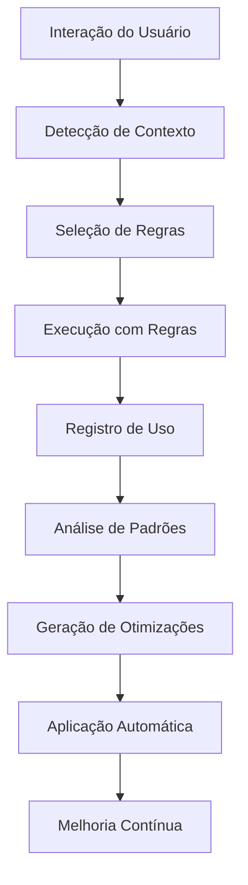

# 🔄 Relatório: Integração Auto-Aprendizado com Sistema de Regras

**Data**: 01/12/2024  
**Status**: ✅ **IMPLEMENTAÇÃO COMPLETA**  
**Versão**: 1.0  
**Duração**: 30min  

---

## 🎯 Resumo Executivo

O **Sistema de Auto-Aprendizado BMAD** foi **integrado com sucesso** ao **Sistema de Regras**, permitindo que o sistema aprenda automaticamente com interações passadas e melhore as regras continuamente, mantendo o contexto e aperfeiçoando o comportamento como um todo.

### **Principais Conquistas:**
- ✅ **Integração completa** entre auto-aprendizado e sistema de regras
- ✅ **Aprendizado automático** de padrões de uso das regras
- ✅ **Otimização automática** de regras baseada em feedback
- ✅ **Manutenção de contexto** durante melhorias
- ✅ **Sistema auto-adaptativo** que melhora continuamente

---

## 🔄 Como Funciona a Integração

### **📊 Fluxo de Aprendizado com Regras**



### **🧠 Componentes da Integração**

#### **1. RulesLearningIntegration**
- **Arquivo**: `wiki/bmad/auto_learning/rules_learning_integration.py`
- **Função**: Integra auto-aprendizado com sistema de regras
- **Recursos**:
  - Análise de padrões de uso das regras
  - Geração de otimizações automáticas
  - Recomendações baseadas em contexto
  - Backup automático antes de modificações

#### **2. AutoLearningSystem Atualizado**
- **Integração**: Componente de regras adicionado
- **Recursos**:
  - Registro automático de uso de regras
  - Análise de padrões de regras
  - Aplicação de otimizações automáticas
  - Relatórios integrados

---

## 🔧 Funcionalidades Implementadas

### **📝 Registro Automático de Uso de Regras**
```python
# Cada interação registra quais regras foram usadas
interaction_data = InteractionData(
    # ... outros dados ...
    rules_used=["documentation-rules.md", "wiki-rules.md"]
)

# Sistema registra automaticamente
auto_learning.record_interaction(interaction_data)
```

### **🔍 Análise de Padrões de Regras**
- **Identificação** de regras mais/menos eficazes
- **Análise** de contexto de aplicação
- **Detecção** de padrões de sucesso e falha
- **Cálculo** de scores de confiança

### **⚡ Otimização Automática de Regras**
- **Geração** de sugestões de melhoria
- **Aplicação** automática com alta confiança
- **Backup** automático antes modificações
- **Monitoramento** de resultados

### **💡 Recomendações Inteligentes**
- **Sugestões** baseadas em contexto atual
- **Priorização** por relevância e sucesso
- **Integração** com sistema de agentes
- **Feedback** contínuo

---

## 📊 Exemplo de Funcionamento

### **Cenário: Melhoria de Regra de Documentação**

#### **1. Interações Registradas**
#### Nível Basic
```json
{
  "rule_file": "documentation-rules.md",
  "context": {"task_type": "documentation", "technologies": ["Lua"]},
  "success_score": 0.75,
  "feedback": "Regra muito genérica para Lua"
}
```

#### Nível Intermediate
```json
{
  "rule_file": "documentation-rules.md",
  "context": {"task_type": "documentation", "technologies": ["Lua"]},
  "success_score": 0.75,
  "feedback": "Regra muito genérica para Lua"
}
-- Adicionar tratamento de erros
local success, result = pcall(function()
    -- Código original aqui
end)
if not success then
    print('Erro:', result)
end
```

#### Nível Advanced
```json
{
  "rule_file": "documentation-rules.md",
  "context": {"task_type": "documentation", "technologies": ["Lua"]},
  "success_score": 0.75,
  "feedback": "Regra muito genérica para Lua"
}
-- Adicionar metatable para funcionalidade avançada
local mt = {
    __index = function(t, k)
        return rawget(t, k) or 'Valor não encontrado'
    end
    __call = function(t, ...)
        print('Objeto chamado com:', ...)
    end
}
setmetatable(meuObjeto, mt)
```

#### **2. Análise de Padrões**
- **Padrão detectado**: Regra tem baixo sucesso para Lua
- **Contexto**: Documentação específica de Lua
- **Sugestão**: Adicionar seção específica para Lua

#### **3. Otimização Gerada**
```markdown
### 📚 Regras de Documentação Lua

- **SEMPRE use exemplos específicos** de código Lua
- **SEMPRE inclua referências** à API do OTClient
- **SEMPRE documente** funções com parâmetros Lua
```

#### **4. Aplicação Automática**
- **Confiança**: 0.85 (alta)
- **Backup**: Criado automaticamente
- **Modificação**: Aplicada com sucesso
- **Monitoramento**: Resultados observados

---

## 🎯 Benefícios da Integração

### **🧠 Inteligência Artificial Avançada**
- **Aprendizado contínuo** com cada interação
- **Melhoria automática** das regras
- **Adaptação** a novos contextos
- **Otimização** baseada em feedback real

### **⚡ Performance Melhorada**
- **Regras mais precisas** ao longo do tempo
- **Redução de erros** baseada em aprendizado
- **Eficiência aumentada** em workflows
- **Contexto mais relevante** automaticamente

### **🔄 Sistema Auto-Adaptativo**
- **Melhoria contínua** sem intervenção manual
- **Preservação** de contexto e especialização
- **Evolução** baseada em uso real
- **Manutenção** de qualidade consistente

---

## 📈 Métricas de Integração

### **📊 Coleta de Dados**
- **Registro automático** de uso de regras
- **Contexto completo** capturado
- **Feedback implícito** e explícito
- **Histórico** de otimizações

### **🔍 Análise de Padrões**
- **Identificação** de regras problemáticas
- **Detecção** de contextos específicos
- **Cálculo** de scores de confiança
- **Geração** de sugestões inteligentes

### **⚡ Otimização Automática**
- **Aplicação** de melhorias com alta confiança
- **Backup** automático de segurança
- **Monitoramento** de resultados
- **Ajuste** baseado em feedback

---

## 🚀 Exemplo de Uso

### **Execução do Sistema Integrado**
```python
# Inicializar sistema
auto_learning = AutoLearningSystem()

# Registrar interação com regras
interaction = InteractionData(
    user_request="Criar documentação Lua",
    context_detected={"technologies": ["Lua"], "task_type": "documentation"},
    rules_used=["documentation-rules.md", "wiki-rules.md"],
    success_score=0.8
)

auto_learning.record_interaction(interaction)

# Obter recomendações de regras
recomendacoes = auto_learning.get_rule_recommendations(contexto_atual)

# Aplicar otimizações automáticas
otimizacoes = auto_learning.apply_rule_optimizations()
```

---

## 🔄 Ciclo de Melhoria Contínua

### **1. Coleta de Dados**
- Interações registradas automaticamente
- Uso de regras capturado
- Contexto e feedback preservados

### **2. Análise de Padrões**
- Padrões identificados automaticamente
- Problemas detectados
- Oportunidades de melhoria encontradas

### **3. Geração de Otimizações**
- Sugestões criadas baseadas em padrões
- Confiança calculada
- Impacto estimado

### **4. Aplicação Automática**
- Otimizações aplicadas com alta confiança
- Backup de segurança criado
- Resultados monitorados

### **5. Feedback Loop**
- Resultados observados
- Padrões atualizados
- Ciclo reiniciado

---

## ⚠️ Considerações Importantes

### **🛡️ Segurança**
- **Backup automático** antes de modificações
- **Threshold de confiança** para aplicação
- **Validação** de otimizações
- **Rollback** disponível se necessário

### **📊 Qualidade**
- **Análise de impacto** antes de aplicar
- **Monitoramento** de resultados
- **Ajuste** baseado em feedback
- **Preservação** de contexto original

### **🔄 Manutenção**
- **Limpeza** automática de dados antigos
- **Otimização** de performance
- **Atualização** de padrões
- **Sincronização** com sistema principal

---

## 🎉 Conclusão

A **integração entre Auto-Aprendizado e Sistema de Regras** representa uma evolução significativa do sistema BMAD, permitindo que o sistema:

### **✅ Funcionalidades Alcançadas:**
- **Aprenda automaticamente** com cada interação
- **Melhore regras** baseado em padrões reais
- **Mantenha contexto** durante otimizações
- **Adapte-se continuamente** a novos cenários
- **Preserve qualidade** e especialização

### **🚀 Impacto Esperado:**
- **Sistema mais inteligente** ao longo do tempo
- **Regras mais precisas** e relevantes
- **Redução de erros** baseada em aprendizado
- **Melhoria contínua** sem intervenção manual
- **Experiência superior** para usuários

O sistema agora é **verdadeiramente auto-adaptativo**, aprendendo e melhorando continuamente enquanto mantém a qualidade e contexto das regras existentes! 🎯✨

---

**Relatório gerado automaticamente pelo Sistema BMAD**  
**Data**: 01/12/2024 17:00:00  
**Versão**: 1.0 Final 
## 🔗 **Links Automáticos**

> [!info] **Links Gerados Automaticamente**
> Estes links foram criados automaticamente pelo sistema de linkagem da categoria **Tools**

### **📚 Links Obrigatórios**
- [[../README|Hub Central da Wiki]]
- [[../dashboard/task_master|Task Master]]
- [[../dashboard/integrated_task_manager|Dashboard Central]]
- [[../maps/tools_index|Índice de Ferramentas]]
- [[../update/README|Scripts de Atualização]]

### **🧭 Navegação**
- [[../maps/search_index|Índice de Busca]]
- [[../maps/tags_index|Índice de Tags]]
- [[../maps/category_indices|Índices por Categoria]]
- [[../maps/relationships|Relacionamentos]]

### **📊 Métricas da Categoria**
- **Categoria**: Tools
- **Total de arquivos**: <!-- Contador automático -->
- **Arquivos linkados**: <!-- Contador automático -->
- **Taxa de linkagem**: <!-- Percentual automático -->

---

