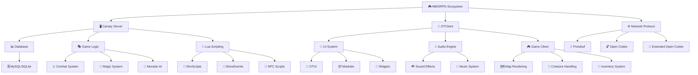
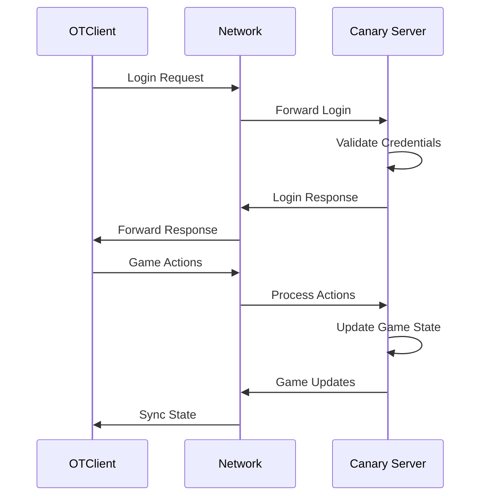

# 🎮 **WIKIPEDIA CANARY + OTCLIENT - CODEX MMORPG**

> [!info] **ESTUDO DE CASO COMPLETO**
> Esta Wikipedia é um **estudo de caso completo** de desenvolvimento de MMORPG baseado no ecossistema Open Tibia (OTServ/Tibia), oferecendo conhecimento prático e teórico para desenvolvedores de todos os níveis.

---

## 🎯 **O QUE É ESTE PROJETO?**

### **📚 Wikipedia Educacional Completa**
Esta Wikipedia é uma **enciclopédia completa** do desenvolvimento de MMORPG baseada no ecossistema **Canary (servidor) + OTClient (cliente)**, transformando 60+ stories de pesquisa em conhecimento educacional estruturado.

### **🎮 Estudo de Caso: OTServ/Tibia**
- **Canary**: Servidor MMORPG moderno e otimizado
- **OTClient**: Cliente gráfico multiplataforma
- **Protocolo**: Comunicação cliente-servidor via Protobuf
- **Ecosistema**: Sistema completo de desenvolvimento de jogos

### **🚀 Objetivo Educacional**
Transformar conhecimento técnico em **aprendizado prático** para desenvolvedores que querem:
- Entender arquitetura de MMORPG
- Aprender desenvolvimento de jogos multiplayer
- Dominar protocolos de rede para jogos
- Criar sistemas de scripting e modding

---

## 🗺️ **MAPA CONCEITUAL**



---

## 🎯 **POR ONDE COMEÇAR?**

### **👶 NÍVEL INICIANTE**
> [!tip] **Primeiros Passos**
> - **[[fundamentals_course|Curso de Fundamentos]]** - Conceitos básicos de MMORPG
> - **[[otclient_course|Curso OTClient]]** - Introdução ao cliente
> - **[[canary_course|Curso Canary]]** - Introdução ao servidor
> - **[[integration_course|Curso de Integração]]** - Como tudo funciona junto

### **🔄 NÍVEL INTERMEDIÁRIO**
> [!info] **Desenvolvimento Prático**
> - **[[modules/|Sistema de Módulos]]** - Como criar módulos OTClient
> - **[[topics/scripting|Scripting Lua]]** - Programação Lua para jogos
> - **[[topics/networking|Redes e Protocolo]]** - Comunicação cliente-servidor
> - **[[topics/database|Banco de Dados]]** - Persistência de dados

### **🚀 NÍVEL AVANÇADO**
> [!warning] **Sistemas Complexos**
> - **[[topics/optimization|Otimização]]** - Performance e escalabilidade
> - **[[topics/security|Segurança]]** - Proteção contra hacks
> - **[[topics/monitoring|Monitoramento]]** - Logs e métricas
> - **[[topics/customization|Customização]]** - Modificações avançadas

### **🎓 NÍVEL ESPECIALISTA**
> [!success] **Especialização**
> - **[[projects/|Projetos Avançados]]** - Implementações complexas
> - **[[exercises/|Exercícios Práticos]]** - Desafios hands-on
> - **[[examples/|Exemplos de Código]]** - Código real e funcional
> - **[[concepts/|Conceitos Avançados]]** - Teoria profunda

---

## 🔗 **ESTRUTURA HIERÁRQUICA**

### **📚 CURSOS EDUCATIVOS**
- **[[fundamentals_course|Fundamentos]]** → **[[otclient_course|OTClient]]** → **[[canary_course|Canary]]** → **[[integration_course|Integração]]**

### **🎯 TÓPICOS ESPECÍFICOS**
- **[[topics/scripting|Scripting]]** → **[[topics/networking|Redes]]** → **[[topics/database|Banco]]** → **[[topics/optimization|Otimização]]**

### **🔧 MÓDULOS PRÁTICOS**
- **[[modules/basic|Básico]]** → **[[modules/intermediate|Intermediário]]** → **[[modules/advanced|Avançado]]** → **[[modules/expert|Especialista]]**

### **🎮 PROJETOS HANDS-ON**
- **[[projects/beginner|Iniciante]]** → **[[projects/intermediate|Intermediário]]** → **[[projects/advanced|Avançado]]** → **[[projects/expert|Especialista]]**

---

## 🌐 **COMO O PROTOCOLO FUNCIONA**

### **📡 Comunicação Cliente-Servidor**


### **🔓 Protocolos Utilizados**
- **Protobuf**: Serialização eficiente de dados
- **Open Codes**: Protocolo básico do Open Tibia
- **Extended Open Codes**: Extensões avançadas do protocolo

### **⚡ Fluxo de Dados**
1. **Cliente envia**: Ações do jogador (movimento, ataque, etc.)
2. **Servidor processa**: Validação e execução da lógica
3. **Servidor responde**: Atualizações do estado do jogo
4. **Cliente sincroniza**: Renderização das mudanças

---

## 📚 **GLOSSÁRIO TÉCNICO**

### **🎮 Termos do Jogo**
- **OTServ**: Open Tibia Server - servidor de jogo
- **OTClient**: Open Tibia Client - cliente de jogo
- **Canary**: Servidor moderno baseado em OTServ
- **Tibia**: Jogo original que inspirou o ecossistema

### **🔧 Termos Técnicos**
- **Protobuf**: Protocol Buffers - serialização de dados
- **OTUI**: Open Tibia User Interface - sistema de interface
- **RevScripts**: Sistema de scripts moderno do Canary
- **MoveEvents**: Eventos de movimento no jogo
- **Lua**: Linguagem de scripting usada no sistema

### **📊 Termos de Arquitetura**
- **Cliente-Servidor**: Arquitetura de comunicação
- **Módulos**: Componentes modulares do OTClient
- **Scripts**: Código Lua para lógica de jogo
- **Database**: Persistência de dados do servidor

---

## 🔍 **SEPARAÇÃO: HABDEL vs WIKI**

### **🔬 HABDEL (Pesquisa)**
- **Localização**: `habdel/` - Metodologia de pesquisa
- **Conteúdo**: 60+ stories detalhadas de análise técnica
- **Propósito**: Pesquisa profunda e descoberta
- **Formato**: Análises técnicas e descobertas

### **📚 WIKI (Educação)**
- **Localização**: `wiki/` - Conteúdo educacional
- **Conteúdo**: Conhecimento estruturado para aprendizado
- **Propósito**: Educação e aprendizado prático
- **Formato**: Cursos, exemplos e projetos hands-on

### **🔄 Transformação**
- **Habdel → Wiki**: Stories viram páginas educacionais
- **Pesquisa → Educação**: Descobertas viram conhecimento
- **Técnico → Prático**: Análises viram exemplos funcionais

---

## 🏷️ **SISTEMA DE TAGS E CATEGORIAS**

### **🎯 Tags Principais**
- `#canary` - Conteúdo relacionado ao servidor Canary
- `#otclient` - Conteúdo relacionado ao cliente OTClient
- `#lua` - Programação Lua e scripting
- `#cpp` - Programação C++ (código-fonte)
- `#database` - Banco de dados e persistência
- `#networking` - Redes e protocolos
- `#ui` - Interface do usuário
- `#audio` - Sistema de áudio
- `#graphics` - Renderização gráfica

### **📊 Categorias**
- **Cursos**: `#course`, `#fundamentals`, `#advanced`
- **Projetos**: `#project`, `#hands-on`, `#practical`
- **Exemplos**: `#example`, `#code`, `#tutorial`
- **Conceitos**: `#concept`, `#theory`, `#architecture`

---

## 🧭 **NAVEGAÇÃO HIERÁRQUICA**

### **📋 Breadcrumbs**
```
Home → Cursos → OTClient → Módulos → Sistema de UI
Home → Tópicos → Scripting → Lua → RevScripts
Home → Projetos → Avançado → Customização → Widgets
```

### **🔗 Links Cruzados**
- **Páginas Relacionadas**: Automático baseado em tags
- **Próximo/Anterior**: Navegação sequencial
- **Índices Temáticos**: Agrupamento por assunto
- **Busca Inteligente**: Filtros por nível e categoria

---

## 📈 **PROGRESSO E TRACKING**

### **✅ Conteúdo Disponível**
- **Cursos**: 4 cursos principais criados
- **Tópicos**: Estrutura base estabelecida
- **Módulos**: Sistema de módulos implementado
- **Projetos**: Framework de projetos criado

### **🔄 Em Desenvolvimento**
- **Task 24.1**: Fundação da Wikipedia (em andamento)
- **Task 24.2**: Correção e validação de conteúdo
- **Task 24.3**: Wikipedia Canary - Stories 001-005

### **📊 Estatísticas**
- **Stories Habdel**: 60+ disponíveis para transformação
- **Páginas Wiki**: Estrutura base criada
- **Progresso Geral**: 0% da Epic 24 concluída

---

## 🚀 **PRÓXIMOS PASSOS**

### **🎯 Sequência de Aprendizado Recomendada**
1. **[[fundamentals_course|Curso de Fundamentos]]** - Base teórica
2. **[[otclient_course|Curso OTClient]]** - Cliente prático
3. **[[canary_course|Curso Canary]]** - Servidor prático
4. **[[integration_course|Curso de Integração]]** - Sistema completo

### **🔧 Para Desenvolvedores**
- **Iniciantes**: Comece pelos cursos fundamentais
- **Intermediários**: Foque em projetos práticos
- **Avançados**: Explore tópicos especializados
- **Especialistas**: Contribua com novos exemplos

---

## 📞 **SUPORTE E CONTRIBUIÇÃO**

### **❓ Dúvidas**
- Use os **índices temáticos** para encontrar conteúdo
- Consulte o **glossário** para termos técnicos
- Siga a **navegação hierárquica** para progressão lógica

### **🤝 Contribuição**
- **Reporte erros**: Inconsistências ou problemas
- **Sugira melhorias**: Novos tópicos ou exemplos
- **Compartilhe conhecimento**: Experiências práticas

---

> [!success] **WIKIPEDIA EM CONSTRUÇÃO**
> Esta Wikipedia está sendo desenvolvida como parte da **Epic 24: Codex MMORPG Completo**. 
> O conteúdo é baseado em 60+ stories de pesquisa do Habdel, transformadas em conhecimento educacional estruturado.

---

*Última atualização: 2025-08-05* 